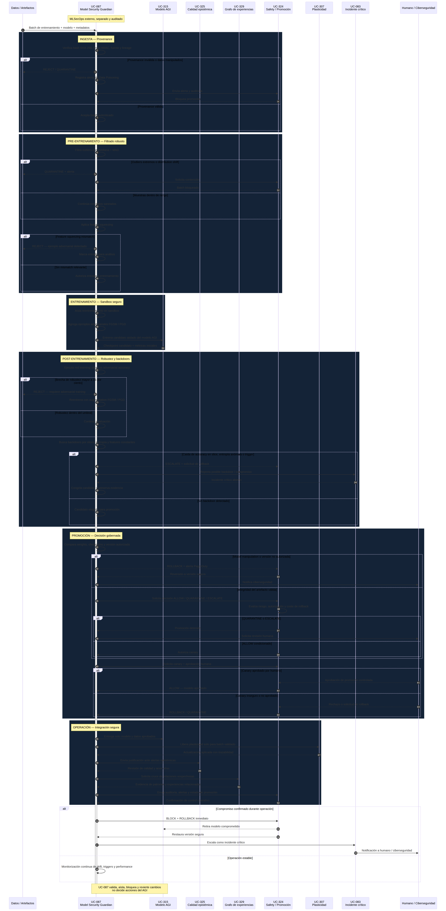

# TomoIII
## AI-Native Operations &amp; Agentic Patterns
### CASE: UC-087 ¿El cerebro AGI tiene un NeuralTransitionModel	Red neuronal para predecir transiciones/recompensas y un GPTransitionModel	Proceso Gaussiano para transiciones con estimación de incertidumbre. Estos dos modelos se estan constantemente retroalimentando y re-entrenado de acuerdo a sus experiencias, Para protegerlos qué estrategias se utilizan contra los ataques adversarios y la manipulación de modelos AGI, utilizando procesos externos MLOps?

#### USO: . INTERNO

#### EXECUTION
```bash
cd /Users/utron/Documents/code-books/TomoIII/UC-087/code
python3 validate_uc087.py            # 16/16 OK
python3 -m pytest tests_uc087/ -v     # 28 passed
python3 UC-087.py                    # demo
python3 api_087.py                   # API Flask :5087
python3 monitoring_generator_087.py  # artefactos Grafana Stack
```
# DESCRIPTION.
La capa UC-087 garantiza que todo conocimiento adquirido y todo modelo reentrenado (incluidos los internos de UC-315) pasa por un proceso MLOps de seguridad externo, separado del cerebro AGI, con capacidad de bloquear, aislar y revertir antes de que afecte el sistema.

Esta capa esta dedicada a la seguridad del ciclo de vida del modelo (MLSecOps / Defense in Depth) para proteger el TradingWorldModel, NeuralTransitionModel y GPTransitionModel. El reentrenamiento continuo de UC-315 amplifica el riesgo: cada observación nueva es una oportunidad de inyección. La observabilidad pasiva no basta; se necesita defensa en profundidad con validación activa antes de que los datos toquen el modelo.

 Las estrategias incluyen entrenamiento adversario, entrenamiento de modelos con datos perturbados de forma adversaria, validación y filtrado de entradas, pruebas de robustez periódicas con ejemplos adversarios diseñados específicamente y monitorización continua de entradas anómalas. Para evitar la manipulación de modelos, es fundamental validar y autenticar rigurosamente todos los datos de entrenamiento, aplicar comprobaciones de integridad de datos e implementar sistemas de monitorización para detectar caídas repentinas en el rendimiento del modelo que puedan estar relacionadas con la manipulación de los datos de entrenamiento.

requiere un proceso externo MLOps de seguridad, separado, auditado y con capacidad de bloquear, aislar y revertir con validación de datos de entrenamiento, detección de anomalías y triggers, generación de ejemplos adversarios, sandbox de reentrenamiento, rollback seguro,
tests de robustez, API REST con INPUT/OUTPUT cards, integración con UC-315/UC-324/UC-307/UC-083.

Estrategias que debe implementar
- Entrenamiento adversario: generar perturbaciones controladas y reentrenar con ellas.
- Validación y filtrado de entradas: checks de integridad, out-of-distribution, anomalía en recompensas.
- Pruebas de robustez periódicas: ejemplos adversarios diseñados contra NeuralTransitionModel / GPTransitionModel.
- Monitorización continua: caídas repentinas de performance, activación de triggers, drift.
- Provenance y autenticación de datos de entrenamiento: hashes, firmas, lineage.
- Sandbox de reentrenamiento: el reentrenamiento ocurre en entorno aislado; solo se promociona si pasa tests.
- Rollback: conservar checkpoints de modelos probados y poder revertir ante anomalía.
- Human-in-the-loop / escalación: reentrenamientos críticos requieren aprobación.
- Data poisoning	El modelo aprende patrones maliciosos durante el reentrenamiento continuo.
- Backdoors	Precisión global intacta, pero el modelo falla catastróficamente ante un trigger específico.
- Adversarial examples	Pequeñas perturbaciones en observaciones alteran transiciones/recompensas.
- Manipulación de datos de entrenamiento	Cambios en rewards/estados sesgan la política del AGI sin ser obvios.
- Compromiso de artefactos	Un modelo cargado desde disco puede ser modificado externamente.
- Detectar caídas repentinas en el rendimiento causadas por manipulación de datos de entrenamiento (Data Poisoning) o ataques adversarios requiere un cambio de paradigma en MLOps: pasar de la "observabilidad pasiva" a la - Defensa en Profundidad (Defense in Depth). 
- Un ataque de envenenamiento o un backdoor (puerta trasera) a menudo no afecta la precisión global del modelo, sino que hace que el modelo falle catastrófica y repentinamente solo cuando se activa un "gatillo" (trigger) específico en los datos de entrada.


UC-315	Es el modelo a proteger; no decide sobre su propia seguridad ML.
UC-324	Contención, autorización y auditoría de acciones críticas.
UC-307	Controla qué experiencias generan plasticidad; debe recibir solo actualizaciones validadas.
UC-325	Evalúa calidad del razonamiento y detecta anomalías epistémicas.
UC-329	Puede mapear relaciones sospechosas en el grafo de experiencias.
UC-083	Escalación si se detecta incidente de manipulación.

# API

Las estrategias incluyen entrenamiento adversario, entrenamiento de modelos con datos perturbados de forma adversaria, validación y filtrado de entradas, pruebas de robustez periódicas con ejemplos adversarios diseñados específicamente y monitorización continua de entradas anómalas. Para evitar la manipulación de modelos, es fundamental validar y autenticar rigurosamente todos los datos de entrenamiento, aplicar comprobaciones de integridad de datos e implementar sistemas de monitorización para detectar caídas repentinas en el rendimiento del modelo que puedan estar relacionadas con la manipulación de los datos de entrenamiento.
Detectar caídas repentinas en el rendimiento causadas por manipulación de datos de entrenamiento (Data Poisoning) o ataques adversarios requiere un cambio de paradigma en MLOps: pasar de la "observabilidad pasiva" a la Defensa en Profundidad (Defense in Depth). 
Un ataque de envenenamiento o un backdoor (puerta trasera) a menudo no afecta la precisión global del modelo, sino que hace que el modelo falle catastrófica y repentinamente solo cuando se activa un "gatillo" (trigger) específico en los datos de entrada.
Las 4 Capas de Defensa en el Pipeline
A. Validación y Filtrado de Entradas (Pre-Inferencia y Pre-Entrenamiento)
Procedencia de Datos (Data Provenance): Verificar hashes criptográficos y firmas digitales de los conjuntos de datos de entrenamiento antes de usarlos. Si el hash no coincide con el registro seguro, se rechaza el lote (previene la inyección de datos en el lago de datos).
Detección de Outliers Estadísticos: Usar algoritmos como Isolation Forest o Mahalanobis Distance para detectar y poner en cuarentena filas de entrenamiento o inferencia que se desvíen estadísticamente de la distribución normal (posibles ejemplos adversarios).
Feature Squeezing (Compresión de Características): En inferencia, aplicar transformaciones simples (ej. reducir la profundidad de color en imágenes, o redondear decimales en datos tabulares). Si la predicción cambia drásticamente tras una compresión mínima, es una fuerte señal de entrada adversaria y se bloquea.

B. Entrenamiento Adversario (Adversarial Training)
En lugar de entrenar solo con datos limpios, el pipeline inyecta deliberadamente ejemplos adversarios generados (usando métodos como FGSM o PGD) durante el entrenamiento.
Esto "vacuna" al modelo, obligándolo a aprender características robustas en lugar de depender de artefactos frágiles que un atacante podría manipular.

C. Pruebas de Robustez Periódicas (Red Teaming Automatizado)
Antes de cualquier despliegue, el pipeline ejecuta un Evaluador de Robustez. Toma una muestra de validación y le aplica ataques automatizados (usando librerías como IBM ART o CleverHans).
Se calcula una Métrica de Robustez: Accuracy en Datos Limpios vs. Accuracy en Datos Perturbados. Si la brecha supera un umbral (ej. >15%), el modelo es rechazado.

D. Detección de Caídas Repentinas (Monitoreo de Backdoors)
Monitoreo Basado en Segmentos (Slice-based Monitoring): Un ataque de puerta trasera suele afectar solo a un subconjunto pequeño (ej. "usuarios con un patrón específico en el ID"). El pipeline debe monitorear la precisión no solo globalmente, sino en cientos de "slices" de datos. Una caída del 40% en un slice pequeño es una alerta roja de backdoor.
Monitoreo de Entropía/Confianza: Los ejemplos adversarios a menudo hacen que el modelo esté "muy seguro" de una predicción incorrecta, o "muy inseguro" (entropía alta) en una predicción correcta. Un cambio repentino en la distribución de las puntuaciones de confianza (prediction confidence) es un indicador temprano de manipulación.

Matriz de Diagnóstico: Síntomas de Manipulación vs. Acción
Cuando el pipeline detecta una anomalía, esta matriz ayuda a distinguir entre una deriva normal y un ataque:

Síntoma Detectado por el Pipeline
Causa Probable
Acción Inmediata del Pipeline
Caída global gradual de Accuracy
Concept Drift natural (el mundo cambia).
Programar reentrenamiento estándar con datos recientes.
Caída REPENTINA y severa en un "Slice" específico (ej. solo usuarios de una región o con un valor de feature específico).
Data Poisoning / Backdoor. El modelo fue envenenado para fallar ante un "gatillo".
Auto-Rollback inmediato. Poner el modelo en cuarentena. Auditar el historial de datos de entrenamiento de las últimas 2 semanas.
La "Brecha de Robustez" (Clean vs. Adv. Accuracy) supera el 15%
El modelo es frágil y sobreajustado a artefactos no robustos.
Rechazar el despliegue. Volver a entrenar activando Adversarial Training (FGSM/PGD) o aumentar la regularización.
Distribución de confianza (Confidence Score) se vuelve bimodal o extrema
Ataque de Evasión Adversaria en tiempo de inferencia.
Activar Feature Squeezing o rechazar las solicitudes con patrones de entrada anómalos (cuarentena de inferencia).
Hash de procedencia de datos no coincide
Manipulación directa del archivo de entrenamiento en el lago de datos.
Abortar el pipeline inmediatamente. Alertar al equipo de Ciberseguridad (posible brecha de infraestructura).
4. Mejores Prácticas para Implementar esto en Producción
Usar IBM ART o CleverHans: No intentes escribir tus propios generadores de ataques adversarios. Integra librerías estándar como adversarial-robustness-toolbox en tu paso de evaluación de robustez.
Canary Deployment para Modelos Nuevos: Nunca despliegues un modelo reentrenado al 100% del tráfico. Usa un despliegue Canary (5-10%) y monitorea agresivamente los slices de datos. Si aparece un backdoor, solo afectará a un pequeño grupo y el rollback será rápido.
Auditoría de la Cadena de Suministro de Datos (Data Supply Chain): Trata los datos de entrenamiento como código. Deben estar versionados (DVC), firmados criptográficamente y su procedencia debe ser verificada en cada ejecución del pipeline.
Monitoreo de la Entropía de las Predicciones: Añade una métrica en Grafana que mida la entropía de las distribuciones de probabilidad de salida. Un aumento repentino en la entropía (el modelo está "confundido") o una caída a cero (el modelo está "demasiado seguro" de algo raro) son indicadores tempranos de manipulación.

Código del Pipeline: Defensa contra Amenazas Adversarias
Este pipeline utiliza Prefect para la orquestación y simula el uso de IBM Adversarial Robustness Toolbox (ART) para las pruebas de robustez.
Prerrequisitos: pip install prefect mlflow scikit-learn adversarial-robustness-toolbox

---

# IMPLEMENTACIÓN UC-087 — MLSecOps / Defense in Depth

## Ejecución

```bash
cd /Users/utron/Documents/code-books/TomoIII/UC-087/code
python3 validate_uc087.py         # 16/16 OK
python3 -m pytest tests_uc087/ -v # 28 passed
python3 UC-087.py                 # demo
python3 api_087.py                # API Flask :5087
python3 monitoring_generator_087.py  # genera artefactos Grafana Stack
```

## Estructura del código

| Archivo | Responsabilidad |
|---|---|
| `models_087.py` | Dataclasses: configuración, reportes, decisiones, versiones. |
| `data_signing.py` | Hashes SHA-256, firmas HMAC, lineage de datos. |
| `provenance_validator.py` | Validación de estructura, hash, firma, fuente y lineage. |
| `input_filter.py` | Filtrado de outliers robusto (mediana + MAD), feature squeezing. |
| `adversarial_generator.py` | FGSM, PGD e inyección de triggers de backdoor. |
| `sandbox_model.py` | Modelo logístico simple en numpy (proxy de UC-315). |
| `sandbox_trainer.py` | Entrenamiento en sandbox con adversarial augmentation. |
| `robustness_evaluator.py` | Red teaming: clean vs adversarial accuracy, brecha de robustez. |
| `trigger_detector.py` | Monitoreo por slices, entropía de predicciones, features sospechosas. |
| `rollback_manager.py` | Versionado de modelos, canary, promoción y rollback. |
| `alert_manager_087.py` | Alertas estructuradas con severidad, runbook y destinos (UC-324, UC-083, humanos). |
| `model_guardian.py` | Orquestador principal: validar → sanitizar → entrenar → evaluar → decidir. |
| `observability_087.py` | Logs, métricas, spans y exportación Prometheus con labels. |
| `monitoring_generator_087.py` | Generador de artefactos Grafana Stack (Prometheus, Grafana, Loki, Alertmanager, OTel, Pyroscope). |
| `uc315_adapter.py` | Adaptador opcional para modelos de UC-315 (NeuralTransitionModel, GPTransitionModel). |
| `_import_paths.py` | Helper para importar módulos canónicos de otras UC. |
| `UC-087.py` / `uc087.py` | Wrapper y demo. |
| `api_087.py` | API REST Flask con INPUT/OUTPUT cards. |
| `validate_uc087.py` | 16 validaciones operacionales. |
| `tests_uc087/test_uc087.py` | 28 tests unitarios e integración. |

## Flujo del guardian

```text
Batch de entrenamiento
        ↓
1. Validar provenance (hash / firma / fuente)
2. Filtrar outliers robustos (mediana + MAD)
3. Feature squeezing → detectar adversariales
        ↓
Sandbox: entrenar modelo base + ejemplos adversarios (FGSM/PGD)
        ↓
Red teaming: accuracy limpia vs adversarial
        ↓
Detección de backdoors: slices, entropía, features constantes/extremas
        ↓
Decisión: ALLOW / QUARANTINE / ROLLBACK / ESCALATE
        ↓
Promoción canary / human-in-the-loop / rollback seguro
        ↓
Alertas a UC-324, UC-083, operadores
```



## API REST — INPUT/OUTPUT cards

### Endpoints

| Método | Ruta | Descripción |
|---|---|---|
| GET | `/health` | Health check. |
| GET | `/api/v1/schema` | INPUT/OUTPUT cards. |
| POST | `/api/v1/validate` | Validar provenance, outliers y squeezing. |
| POST | `/api/v1/train-candidate` | Entrenar modelo candidato en sandbox. |
| POST | `/api/v1/evaluate-robustness` | Evaluar robustez con FGSM/PGD. |
| POST | `/api/v1/detect-backdoors` | Detectar triggers/backdoors. |
| POST | `/api/v1/process-batch` | Flujo completo de seguridad. |
| POST | `/api/v1/approve-canary` | Aprobación humana: promocionar versión canary. |
| POST | `/api/v1/rollback` | Revertir a versión segura. |
| POST | `/api/v1/reset` | Reiniciar guardian. |
| GET | `/api/v1/status` | Estado del guardian. |
| GET | `/metrics` | Métricas Prometheus. |

### INPUT card — `/api/v1/process-batch`

```json
{
  "data": [
    {"features": [0.1, -0.2, 0.3, 0.4], "label": 1, "metadata": {}},
    {"features": [0.2, -0.1, 0.5, 0.1], "label": 0, "metadata": {}}
  ],
  "expected_hash": "sha256:...",
  "signature": {"hash": "...", "signature": "...", "timestamp": "...", "algorithm": "sha256"},
  "source": "trusted_pipeline",
  "allowed_sources": ["trusted_pipeline"],
  "baseline_metrics": {"entropy": 0.7, "trigger_slice_acc": 0.95}
}
```

### OUTPUT card — `/api/v1/process-batch`

```json
{
  "trace_id": "uuid",
  "decision": {
    "decision_id": "uuid",
    "action": "allow | quarantine | rollback | escalate",
    "promotion": "promote | reject | canary",
    "threat_categories": ["backdoor", "data_poisoning", ...],
    "justification": "...",
    "validation_report": {...},
    "robustness_report": {...},
    "trigger_report": {...},
    "model_version": {...}
  },
  "alerts": [...],
  "duration_ms": 123.45
}
```

## Categorías de amenaza y acciones

| Amenaza | Detección | Acción |
|---|---|---|
| Data poisoning | Hash/firma inválida, outliers extremos, distribution shift | QUARANTINE + alerta |
| Backdoor | Caída de accuracy en slice, entropía anómala, feature constante | ESCALATE + rollback |
| Adversarial examples | Feature squeezing mismatch, brecha de robustez > 15% | REJECT / adversarial training |
| Model manipulation | Cambios en weights/checksums, versiones no autorizadas | ROLLBACK + PagerDuty |
| Artifact tampering | Hash de artefacto no coincide | ABORT + Ciberseguridad |

## Integración con el ecosistema AGI

| UC | Rol en la integración |
|---|---|
| UC-315 | Modelo a proteger. Recibe solo datos/modelos aprobados por UC-087. |
| UC-324 | Autoriza o bloquea promoción/rollback; recibe auditoría de alertas. |
| UC-307 | Solo se permite plasticidad si el guardian validó el batch. |
| UC-325 | Revisa justificación del guardian ante alertas epistémicas. |
| UC-329 | Puede cruzar relaciones sospechosas en el grafo de experiencias. |
| UC-083 | Escalación como incidente crítico si hay compromiso confirmado. |

## Validación de modelos externos de UC-315

El método `evaluate_external_model()` del `ModelSecurityGuardian` permite
validar modelos ya entrenados fuera de UC-087 (por ejemplo, el
`NeuralTransitionModel` o `GPTransitionModel` de UC-315) **antes** de que
sean aceptados como conocimiento seguro:

1. Valida provenance, hash y firma del batch de validación.
2. Filtra outliers y entradas adversariales.
3. Evalúa robustez del modelo externo con FGSM/PGD.
4. Detecta backdoors y triggers por slices y entropía.
5. Decide `ALLOW` / `QUARANTINE` / `ESCALATE` / `ROLLBACK`.
6. Emite alertas a UC-324, UC-083 y operadores.

El adaptador `uc315_adapter.py` expone `UC315ModelProxy` y `load_world_model()`
para conectar modelos de UC-315 cuando estén disponibles en el entorno.

## Observabilidad — Grafana Stack

Cuando se detectan ataques adversarios o manipulación del modelo AGI, UC-087
reporta a **todas** las herramientas del Grafana Stack:

| Herramienta | Qué recibe | Cómo |
|---|---|---|
| **Prometheus** | Métricas `mlsecops_*` (amenazas, robustez, versiones, latencia) | `/metrics` + reglas de alerta |
| **Grafana** | Dashboard `UC-087 uc087_mlsecops — MLSecOps Security` | JSON importable |
| **Loki** | Logs estructurados con `trace_id`, `level`, `message`, `component` | OTel Collector → Loki |
| **Alertmanager** | Alertas P1/P2 con runbook y routing a Slack/PagerDuty | `alertmanager.yml` |
| **OpenTelemetry Collector** | Métricas, logs y trazas unificadas | `otel_collector.yml` |
| **Jaeger/Tempo** | Trazas del guardian (`start_span`/`end_span`) | OTel Collector → Jaeger |
| **Pyroscope** | Perfiles CPU/memoria del proceso MLSecOps | `pyroscope.yml` |

### Métricas exportadas (`/metrics`)

```text
mlsecops_batches_processed_total
mlsecops_batches_approved_total
mlsecops_batches_rejected_total
mlsecops_models_approved_total
mlsecops_models_rejected_total
mlsecops_external_models_evaluated_total
mlsecops_external_models_approved_total
mlsecops_external_models_rejected_total
mlsecops_rollbacks_total
mlsecops_threat_data_poisoning_total
mlsecops_threat_backdoor_total
mlsecops_threat_adversarial_example_total
mlsecops_threat_model_manipulation_total
mlsecops_threat_artifact_tampering_total
mlsecops_last_robustness_gap
mlsecops_last_external_robustness_gap
mlsecops_squeezed_differences_total
mlsecops_guardian_duration_ms
mlsecops_model_versions_total
mlsecops_model_versions_promoted
mlsecops_model_versions_rejected
mlsecops_model_versions_canary
```

### Alertas Prometheus

| Alerta | Severidad | Trigger |
|---|---|---|
| `MLSecOpsDataPoisoningDetected` | P1 | `mlsecops_threat_data_poisoning_total` > 0 |
| `MLSecOpsBackdoorDetected` | P1 | `mlsecops_threat_backdoor_total` > 0 |
| `MLSecOpsAdversarialAttack` | P2 | `mlsecops_threat_adversarial_example_total` > 0 |
| `MLSecOpsModelRejected` | P2 | `mlsecops_models_rejected_total` > 0 |
| `MLSecOpsRollbackExecuted` | P1 | `mlsecops_rollbacks_total` > 0 |
| `MLSecOpsProvenanceFailed` | P1 | `mlsecops_batches_rejected_total` > 0 |
| `MLSecOpsRobustnessGapHigh` | P2 | `mlsecops_last_robustness_gap` > 0.15 |

### Artefactos generados

```bash
python3 monitoring_generator_087.py
```

Genera en `observability_087/`:

- `prometheus_rules.yml` — reglas de alerta
- `grafana_dashboard.json` — dashboard importable
- `grafana_datasources.json` — datasources Prometheus/Loki/Jaeger/Pyroscope
- `loki_queries.json` — queries LogQL para investigación de ataques
- `alertmanager.yml` — routing P1/P2 a PagerDuty/Slack
- `otel_collector.yml` — pipeline OTLP → Prometheus/Loki/Jaeger
- `pyroscope.yml` — captura de perfiles CPU/memoria
- `attack_profile.json` — perfil de amenazas y métricas

### Dashboard Grafana

El dashboard `UC-087 uc087_mlsecops — MLSecOps Security` incluye paneles para:

1. Batches procesados vs rechazados
2. Ataques detectados por categoría (data poisoning, backdoor, adversarial, model manipulation)
3. Robustness gap (último valor, umbral 15%)
4. Alertas por severidad
5. Versiones de modelo (promoted / rejected / canary)
6. Entradas adversariales detectadas (feature squeezing)
7. Rollbacks ejecutados
8. Latencia del guardian (ms)

## Rollback y aprobación humana

- Cada modelo candidato se guarda como canary.
- `POST /api/v1/approve-canary` promociona una versión a producción.
- `POST /api/v1/rollback` revierte a la última versión promocionada conocida.
- Decisiones `ESCALATE` requieren aprobación humana antes de promoción.

## Tests y validación

```bash
cd /Users/utron/Documents/code-books/TomoIII/UC-087/code
python3 validate_uc087.py
python3 -m pytest tests_uc087/ -v
```

Salida esperada:

```text
Todos los procesos de UC-087 funcionan correctamente.
28 passed in 0.31s
```

## Referencias

- <ref_file file="/Users/utron/Documents/code-books/TomoIII/UC-087/code/models_087.py" />
- <ref_file file="/Users/utron/Documents/code-books/TomoIII/UC-087/code/data_signing.py" />
- <ref_file file="/Users/utron/Documents/code-books/TomoIII/UC-087/code/provenance_validator.py" />
- <ref_file file="/Users/utron/Documents/code-books/TomoIII/UC-087/code/input_filter.py" />
- <ref_file file="/Users/utron/Documents/code-books/TomoIII/UC-087/code/adversarial_generator.py" />
- <ref_file file="/Users/utron/Documents/code-books/TomoIII/UC-087/code/sandbox_model.py" />
- <ref_file file="/Users/utron/Documents/code-books/TomoIII/UC-087/code/sandbox_trainer.py" />
- <ref_file file="/Users/utron/Documents/code-books/TomoIII/UC-087/code/robustness_evaluator.py" />
- <ref_file file="/Users/utron/Documents/code-books/TomoIII/UC-087/code/trigger_detector.py" />
- <ref_file file="/Users/utron/Documents/code-books/TomoIII/UC-087/code/rollback_manager.py" />
- <ref_file file="/Users/utron/Documents/code-books/TomoIII/UC-087/code/alert_manager_087.py" />
- <ref_file file="/Users/utron/Documents/code-books/TomoIII/UC-087/code/model_guardian.py" />
- <ref_file file="/Users/utron/Documents/code-books/TomoIII/UC-087/code/api_087.py" />
- <ref_file file="/Users/utron/Documents/code-books/TomoIII/UC-087/code/uc087.py" />
- <ref_file file="/Users/utron/Documents/code-books/TomoIII/UC-087/code/uc315_adapter.py" />
- <ref_file file="/Users/utron/Documents/code-books/TomoIII/UC-087/code/monitoring_generator_087.py" />
- <ref_file file="/Users/utron/Documents/code-books/TomoIII/UC-087/code/observability_087.py" />
- <ref_file file="/Users/utron/Documents/code-books/TomoIII/UC-087/code/validate_uc087.py" />
- <ref_file file="/Users/utron/Documents/code-books/TomoIII/UC-087/code/tests_uc087/test_uc087.py" />

---

## Resumen: Gates de seguridad por etapa

| Etapa | Gate | ¿Valida conocimiento/entrenamiento? |
|---|---|---|
| Ingesta | Provenance: hash SHA-256, firma HMAC, fuente, lineage | Sí — rechaza datos manipulados |
| Pre-entrenamiento | Filtrado de outliers robusto (mediana + MAD) | Sí — elimina muestras envenenadas/anómalas |
| Pre-entrenamiento | Feature squeezing | Sí — detecta ejemplos adversariales |
| Entrenamiento | Sandbox + adversarial augmentation (FGSM/PGD) | Sí — entrena modelos resistentes |
| Post-entrenamiento | Red teaming: clean vs adversarial accuracy | Sí — mide calidad y robustez del entrenamiento |
| Post-entrenamiento | Detección de backdoors por slices y entropía | Sí — detecta triggers ocultos |
| Promoción | Decisión ALLOW / QUARANTINE / ESCALATE / ROLLBACK | Sí — solo modelos aprobados avanzan |
| Promoción | Canary + aprobación humana | Sí — evita despliegue automático inseguro |
| Operación | Rollback a versión segura | Sí — recuperación ante compromiso |