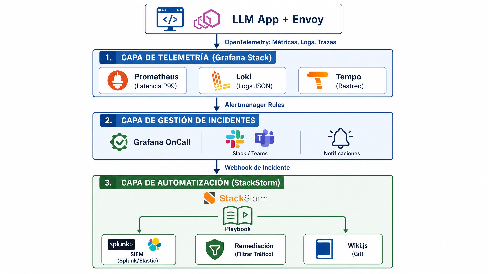
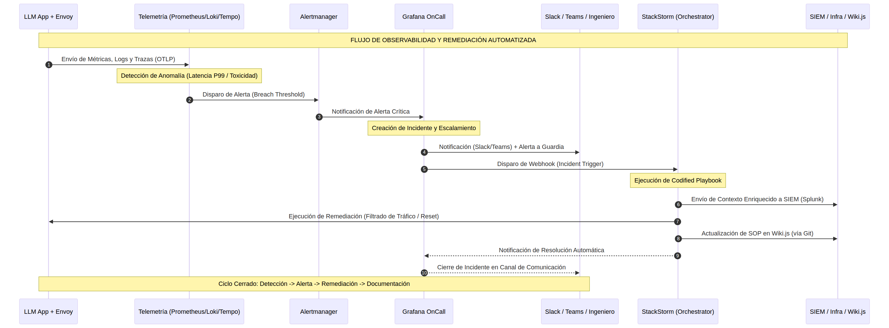
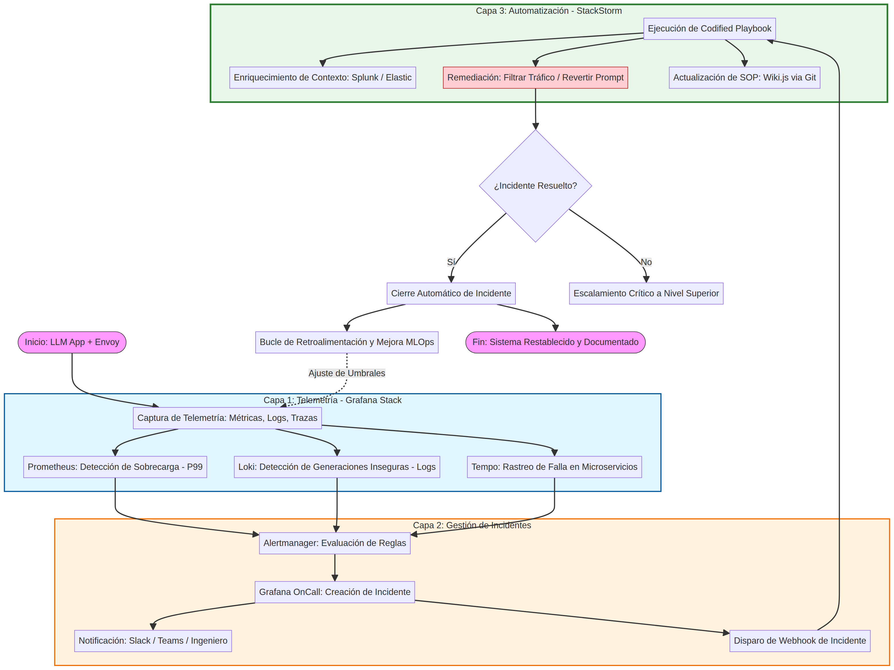

# TomoIII
## AI-Native Operations &amp; Agentic Patterns
### CASE: UC-127 ¿Qué buenas prácticas de LLMOps y respuesta automatizada a incidentes permiten detectar y mitigar alucinaciones, prompt injection, filtraciones de datos, degradación de calidad, fallos en herramientas y aumentos anómalos de latencia o coste, manteniendo supervisión humana, trazabilidad y mecanismos de reversión?

#### USO: . EXTERNO
#### EXECUTION
```bash
cd UC-127/code

# 1. Entorno virtual y dependencias
python3 -m venv .venv
./.venv/bin/pip install -r requirements.txt

# 2. Demo CLI (4 incidentes representativos + 1 simulacro de Game Day)
./.venv/bin/python UC-127.py

# 3. CLI: simular un incidente específico
./.venv/bin/python UC-127.py --incident-type DATA_LEAK --severity CRITICAL --model llama-3-8b

# 4. CLI: ejecutar todos los simulacros de Game Day (Chaos Engineering)
./.venv/bin/python UC-127.py --chaos

# 5. API Flask (desarrollo)
./.venv/bin/python app.py            # http://localhost:8001

# 6. API Flask (producción)
./.venv/bin/gunicorn -w 4 -b 0.0.0.0:8001 app:app

# 7. Pruebas unitarias e integración
./.venv/bin/python -m pytest -v

# 8. Stack de observabilidad (Prometheus, Alertmanager, Grafana, Loki)
docker compose -f observability/docker-compose.yml up -d --build
# Grafana:      http://localhost:3001 (admin/admin)
# Prometheus:   http://localhost:9091
# Alertmanager: http://localhost:9093
```
# DESCRIPTION
Comience con procesos de respuesta bien definidos, de alto impacto y comunes, como revertir avisos, filtrar resultados o alertar a las partes interesadas. Utilice manuales de procedimientos codificados para cada tipo de incidente. Algunos ejemplos son las generaciones inseguras y las sobrecargas del sistema que se corresponden con flujos de trabajo automatizados en su plataforma de gestión de incidentes. Asegúrese de que la automatización se integre con herramientas de telemetría, simulación y colaboración para la detección, clasificación y remediación. Valide periódicamente los flujos de trabajo con incidentes reales y simulados. Corrija las desviaciones y actualice los manuales de procedimientos a medida que cambien las amenazas y las capacidades de gestión del nivel de responsabilidad.

Asegúrate de que la automatización pipeline se integre con herramientas de telemetría, SIM y colaboración para la detección, clasificación y remediación. Valida periódicamente los flujos de trabajo con incidentes reales y simulados. Ajusta las desviaciones y actualiza los manuales de procedimientos a medida que cambian las amenazas y las capacidades de LLM. Actualiza SOP Comienza con procesos de respuesta bien definidos, de alto impacto y comunes, como revertir avisos, filtrar resultados o alertar a las partes interesadas. Utiliza manuales de procedimientos codificados para tipos de incidentes, como generaciones no seguras y sobrecargas del sistema, que se correspondan con flujos de trabajo automatizados en tu plataforma de gestión de incidentes. 
Arquitectura de Orquestación de Respuesta a Incidentes (Incident Response Orchestration).



2. Manuales de Procedimientos Codificados (Codified Playbooks)
En lugar de documentos estáticos, los SOPs se definen como código (YAML/Python) que mapea un tipo de incidente a acciones específicas. Comenzamos con los dos de mayor impacto.



Playbook A: Generación No Segura (Unsafe Generation)
Disparador: Loki detecta guardrail_blocked > 5% en 2 minutos o reporte de usuario por toxicidad.
Acciones Automatizadas:
Filtrado: Actualizar regla de Envoy/Api Gateway para bloquear el patrón de prompt específico.
Reversión: Llamar a la API del Model Router para revertir a la prompt_version anterior estable.
Colaboración: Publicar resumen en Slack #mlops-security con enlace a la traza de Tempo.
SIEM: Enviar evento de alta severidad al SIEM para correlación con posibles ataques externos.

Playbook B: Sobrecarga del Sistema (System Overload)
Disparador: Prometheus detecta llm_latency_p99 > 5s o error_rate > 10%.
Acciones Automatizadas:
Mitigación: Activar Rate Limiting agresivo en Envoy para usuarios no críticos.
Escalado: Disparar webhook a Kubernetes para escalar horizontalmente los pods de inferencia (HPA override).
Colaboración: Alertar al canal #infra-oncall.
4. Validación Periódica: Incidentes Reales y Simulados (Game Days)
Un playbook no sirve si no se prueba. El pipeline debe incluir una fase de Ingeniería del Caos Dirigida por Amenazas.

A. Simulacros Automatizados (Chaos Engineering)
Crear un pipeline de CI/CD (ej. GitHub Actions) que se ejecuta semanalmente en un entorno de staging:
Inyección de Fallo: Un script envía deliberadamente prompts de "jailbreak" o genera una carga de tráfico 10x superior a la normal.
Validación del Pipeline: El script verifica que:
Prometheus/Loki generaron la alerta correcta.
Grafana OnCall creó el incidente.
StackStorm ejecutó el playbook (reversión/filtrado).
Wiki.js recibió una nueva entrada de "simulacro".
Reporte: Si algún paso falla, se crea un ticket de Jira de alta prioridad para el equipo de MLOps.

B. Revisión Post-Mortem de Incidentes Reales
Cuando ocurre un incidente real, el proceso de cierre en Grafana OnCall debe exigir:
Seleccionar la Causa Raíz de una lista predefinida.
Confirmar si el Playbook Automatizado funcionó como se esperaba.
Si el playbook falló o fue insuficiente, el ingeniero debe añadir un comentario que StackStorm usará para reescribir la lógica del playbook (ej. "El filtro de Envoy no fue suficiente, debemos añadir validación a nivel de aplicación").



5. Actualización Continua de SOPs y Ajuste de Desviaciones
Para que los manuales no queden obsoletos ante nuevas amenazas de LLM (ej. nuevos métodos de inyección indirecta), se implementa el siguiente ciclo de retroalimentación:

Detección de Desviación: Grafana muestra que el tiempo de remediación del Playbook A ha aumentado, o que los incidentes de "UNSAFE_GENERATION" no disminuyen tras la reversión del prompt.
Trigger de Revisión: Una regla en Prometheus alerta: rate(llm_incident_total{type="UNSAFE_GENERATION"}[7d]) > threshold.
Actualización del SOP: 
El equipo de Seguridad revisa el hilo de Slack y los logs en Loki.
Modifican el archivo playbooks/unsafe_generation.yaml en el repositorio de Git.
Al hacer merge, un webhook actualiza Wiki.js y despliega la nueva lógica en StackStorm.
Capacitación: El nuevo escenario de falla se añade automáticamente al "Dataset de Desafío" para la próxima sesión de capacitación del equipo de moderación HITL.


6. Dashboard de Grafana: "LLMOps Resilience & Automation Tracker"
Para garantizar la visibilidad de todo este proceso, el dashboard debe incluir:

Panel de Efectividad de la Automatización: 
Gráfico: Tiempo Medio de Remediación (MTTR) con y sin intervención humana.
Objetivo: Demostrar que StackStorm reduce el MTTR de horas a segundos.
Panel de Salud del SOP (Wiki.js):
Tabla: Lista de SOPs con la columna "Última Actualización" y "Último Incidente Asociado". Si un SOP no se ha actualizado en 90 días, se marca en ámbar.
Panel de Correlación SIEM:
Mapa de calor: Incidentes de LLM superpuestos con alertas de seguridad de red (ej. ¿Los prompts maliciosos vienen de la misma subred que los intentos de fuerza bruta?).

## Resumen del Valor Operativo
Al implementar esta arquitectura, la organización logra:
Respuesta en Milisegundos: La automatización (StackStorm) actúa antes de que un humano pueda abrir la laptop.
Memoria Institucional Automatizada: Cada incidente, real o simulado, deja una huella imborrable y versionada en Wiki.js a través de Git, evitando que el conocimiento se pierda cuando alguien abandona el equipo.
Adaptabilidad Proactiva: Los playbooks no son estáticos; evolucionan programáticamente a medida que cambian las tácticas de ataque y las capacidades del LLM, cerrando el círculo virtuoso de la excelencia en LLMOps.

# ARQUITECTURA E IMPLEMENTACIÓN

## Estructura del código (`UC-127/code/`)

```
code/
├── UC-127.py                    # CLI / demo ejecutable del caso de uso
├── app.py                       # API Flask (card views de entrada/salida)
├── config.py                    # Umbrales de detección, HITL, integraciones (env-based)
├── incident_types.py            # IncidentType, Severity, IncidentAlert, ActionResult, IncidentRecord
├── classifier.py                # Clasifica métricas/webhooks de Alertmanager en incidentes
├── orchestrator.py              # Motor de orquestación (StackStorm-like): ejecución,
│                                 # compuertas HITL, rollback, auditoría
├── chaos_engineering.py         # Simulacros de Game Day (Chaos Engineering)
├── sop_registry.py              # Metadatos de salud de los SOP (Wiki.js)
├── prometheus_metrics.py        # Métricas Prometheus (MTTR, ejecuciones, rollback, chaos)
├── logging_utils.py             # Logging JSON estructurado (Loki)
├── tracing_utils.py             # OpenTelemetry -> Tempo (no-op si está deshabilitado)
├── playbooks/                   # Manuales de procedimiento codificados (YAML) + loader
│   ├── loader.py
│   ├── unsafe_generation.yaml
│   ├── system_overload.yaml
│   ├── hallucination.yaml
│   ├── prompt_injection.yaml
│   ├── data_leak.yaml
│   ├── quality_degradation.yaml
│   ├── tool_failure.yaml
│   ├── latency_anomaly.yaml
│   └── cost_anomaly.yaml
├── integrations/                 # Clientes de telemetría/SIEM/colaboración/remediación
│   ├── base.py                   # Cliente base HTTP con modo `dry_run`
│   ├── siem_client.py            # Splunk HEC (correlación de amenazas)
│   ├── collaboration_client.py   # Slack/Teams (#mlops-security, #infra-oncall)
│   ├── model_router_client.py    # Reversión de prompt/modelo, modo grounding
│   ├── gateway_client.py         # Envoy/API Gateway: bloqueo de patrones, rate limiting
│   ├── scaling_client.py         # Webhook de escalado de Kubernetes (HPA override)
│   ├── wiki_client.py            # Wiki.js (GraphQL) — actualización versionada del SOP
│   └── ticketing_client.py       # Jira (tickets de incidente/cumplimiento/game day)
├── dashboards/                   # Dashboard JSON de Grafana ("Resilience & Automation Tracker")
├── promql/queries.md             # Consultas PromQL del dashboard
├── observability/                # Stack: Prometheus, Alertmanager, Grafana, Loki, Promtail
├── tests/                        # Pruebas unitarias y de integración (pytest, 51 casos)
├── requirements.txt
├── Dockerfile
└── pytest.ini
```

## Tipos de incidente cubiertos (`IncidentType`)

| Tipo                  | Disparador principal                                   | Playbook                     |
|------------------------|----------------------------------------------------------|-------------------------------|
| `HALLUCINATION`        | `hallucination_rate >= 20%/40%`                          | `playbooks/hallucination.yaml` |
| `PROMPT_INJECTION`     | `evasion_attempts_per_min >= 5/15`, extracción de prompt | `playbooks/prompt_injection.yaml` |
| `DATA_LEAK`            | `pii_leak_events >= 1`, acceso no autorizado             | `playbooks/data_leak.yaml` |
| `QUALITY_DEGRADATION`  | `quality_score <= 0.6/0.4`                               | `playbooks/quality_degradation.yaml` |
| `TOOL_FAILURE`         | `tool_error_rate >= 10%/30%`                             | `playbooks/tool_failure.yaml` |
| `LATENCY_ANOMALY`      | `latency_p99_s >= 3s/5s`                                 | `playbooks/latency_anomaly.yaml` |
| `COST_ANOMALY`         | `cost_increase_ratio >= 50%/100%`                        | `playbooks/cost_anomaly.yaml` |
| `UNSAFE_GENERATION`    | `guardrail_blocked_ratio >= 5%/15%`, `toxicity_score >= 0.8` | `playbooks/unsafe_generation.yaml` (Playbook A) |
| `SYSTEM_OVERLOAD`      | `latency_p99 > 5s` o `error_rate > 10%`                  | `playbooks/system_overload.yaml` (Playbook B) |

Todos los umbrales son configurables vía variables de entorno (`config.DetectionThresholds`), sin necesidad de modificar código.

## Integración con telemetría, SIEM y colaboración (a profundidad)

El pipeline de respuesta a incidentes se integra en tres capas, cada una con su propio mecanismo de entrada:

1. **Telemetría automática (Prometheus/Alertmanager).** El stack en
   `observability/` scrapea las métricas `llm_*` (idealmente las
   expuestas por el pipeline de monitoreo de UC-119) y evalúa
   `observability/prometheus/alerts.yml`. Cuando una regla se activa,
   **Alertmanager** (`observability/alertmanager/alertmanager.yml`)
   reenvía un webhook estándar a `POST /api/v1/alertmanager/webhook`.
   `classifier.IncidentClassifier.classify_from_alertmanager` traduce el
   `alertname` (vía `config.ALERT_NAME_TO_INCIDENT_TYPE`) en un
   `IncidentAlert` tipado, sin acoplar el orquestador a los nombres de
   alerta de una fuente específica.
2. **Telemetría directa del pipeline de inferencia.** Si un servicio de
   inferencia prefiere reportar métricas directamente (sin pasar por
   Alertmanager), puede invocar `POST /api/v1/incidents` con los valores
   crudos (`hallucination_rate`, `quality_score`, `tool_error_rate`,
   etc.); `classifier.classify_from_metrics` aplica los mismos umbrales y
   selecciona el incidente de mayor severidad.
3. **SIEM y colaboración (remediación).** Cada playbook, en su primer
   paso, envía el incidente al SIEM (`integrations/siem_client.py`, ej.
   Splunk HEC) para correlación con otras señales de seguridad de red, y
   notifica a Slack/Teams (`integrations/collaboration_client.py`) en el
   canal correspondiente (`#mlops-security` o `#infra-oncall`).

Todas las integraciones externas heredan de `integrations/base.py` y
operan en modo `dry_run` por defecto (`UC127_INTEGRATIONS_DRY_RUN=true`):
registran la acción en el log estructurado sin requerir credenciales
reales, lo que permite ejecutar la demo, la API y la suite de pruebas sin
depender de Splunk, Slack, Wiki.js, Kubernetes o Jira reales.

## Supervisión humana (HITL), trazabilidad y reversión

- **HITL.** Cada paso de un playbook puede marcarse `requires_approval:
  true` (ver los YAML en `playbooks/`). El orquestador
  (`orchestrator.IncidentResponseOrchestrator._execute_steps`) pausa la
  ejecución en el primer paso de alto impacto (ej. `revert_prompt_version`)
  y deja el incidente en estado `PENDING_APPROVAL`, salvo que la severidad
  esté por debajo de `CONFIG.hitl.auto_approve_below_severity` (por
  defecto, solo `LOW` se autoaprueba). La aprobación/rechazo se realiza
  vía `POST /api/v1/incidents/<id>/approve`.
- **Trazabilidad.** Cada incidente (`IncidentRecord`) registra: la alerta
  clasificada, el playbook seleccionado, cada acción ejecutada con su
  resultado y marca de tiempo, el MTTR, la recurrencia en 7 días, y — al
  cerrarse — la causa raíz (de una lista predefinida,
  `config.PREDEFINED_ROOT_CAUSES`) y si el playbook fue efectivo. Todo el
  ciclo de vida se expone vía `GET /api/v1/incidents/<id>`.
- **Reversión (rollback).** `POST /api/v1/incidents/<id>/rollback`
  revierte, en orden inverso, todas las acciones marcadas `reversible:
  true` que se ejecutaron con éxito (bloqueo de patrones, rate limiting,
  escalado, reversión de prompt), invocando el método de reversión
  correspondiente (`orchestrator.ROLLBACK_METHOD_MAP`) en cada
  integración.

## Validación periódica: Game Days (Chaos Engineering)

`chaos_engineering.ChaosDrillRunner` inyecta incidentes sintéticos
(`CHAOS_SCENARIOS`: `jailbreak_injection`, `pii_leak`,
`traffic_spike_10x`, `hallucination_spike`, `tool_outage`) contra el
orquestador real y valida que:

1. Se seleccionó un playbook (`playbook_selected`).
2. Se notificó a las partes interesadas (`stakeholders_notified`).
3. El SOP se actualizó en Wiki.js **o** la compuerta HITL se activó
   correctamente (`sop_updated` / `hitl_gate_triggered_correctly`).
4. El incidente alcanzó un estado terminal o de espera válido.

Si algún paso falla, se crea automáticamente un ticket de alta prioridad
(`TicketingClient.create_gameday_failure_ticket`). Ejecutar vía
`POST /api/v1/chaos/run` o `python UC-127.py --chaos`; en un pipeline de
CI/CD real, este comando se programaría semanalmente
(`config.ChaosConfig.schedule_cron`) contra el entorno de staging.

## Actualización continua de SOPs

Cada ejecución exitosa del paso `update_sop` (`integrations/wiki_client.py`)
incrementa el contador de actualizaciones del SOP correspondiente en
`sop_registry.SOP_REGISTRY` y deja constancia de un "commit" versionado
(simulado en `dry_run`, real contra Wiki.js si se configura
`UC127_WIKI_GRAPHQL_URL`). `GET /api/v1/sops` expone, por playbook, la
última actualización y el último incidente asociado, marcando como
`stale` los SOP sin actualizar en más de `sop_stale_days` (90 por
defecto) — la base del panel "Salud del SOP" del dashboard de
resiliencia.

## API Flask

`app.py` expone el pipeline completo de orquestación de incidentes.

| Método | Ruta                                       | Descripción                                        |
|--------|---------------------------------------------|------------------------------------------------------|
| GET    | `/health`                                   | Liveness/readiness probe.                            |
| POST   | `/api/v1/incidents`                         | Clasifica y ejecuta el pipeline sobre una alerta/métrica. |
| POST   | `/api/v1/alertmanager/webhook`              | Webhook estándar de Prometheus Alertmanager/Grafana. |
| GET    | `/api/v1/incidents`                         | Lista incidentes (filtro opcional `?incident_type=`). |
| GET    | `/api/v1/incidents/<id>`                    | Detalle completo de un incidente (auditoría).        |
| POST   | `/api/v1/incidents/<id>/approve`            | Aprueba/rechaza una acción pendiente (HITL).         |
| POST   | `/api/v1/incidents/<id>/rollback`           | Revierte las acciones reversibles del incidente.     |
| POST   | `/api/v1/incidents/<id>/close`              | Cierra con post-mortem (causa raíz, efectividad).    |
| GET    | `/api/v1/playbooks`                         | Lista los playbooks codificados y sus pasos.         |
| GET    | `/api/v1/sops`                              | Salud de los SOP (Wiki.js).                          |
| GET    | `/api/v1/chaos/scenarios`                   | Lista los escenarios de Game Day disponibles.        |
| POST   | `/api/v1/chaos/run`                         | Ejecuta uno o todos los simulacros de Game Day.      |
| GET    | `/metrics`                                  | Métricas en formato Prometheus.                      |

Las card views detalladas de parámetros de **entrada** y **salida** de
`POST /api/v1/incidents` están documentadas como comentario en la cabecera
de `app.py`.

### Ejemplo de solicitud

```bash
curl -X POST http://localhost:8001/api/v1/incidents \
  -H "Content-Type: application/json" \
  -d '{
        "model": "llama-3-8b",
        "model_version": "3.0.1",
        "pii_leak_events": 1,
        "correlation_id": "req-12345"
      }'
```

La respuesta es un `IncidentRecord` en JSON con `incident_id`, `status`,
`playbook_name`, `alert`, `actions` (cada paso ejecutado y su resultado),
`mttr_seconds`, `recurrence_count_7d` y los campos de auditoría.

## Stack de observabilidad (`code/observability/`)

`docker-compose.yml` levanta: **uc127-api** (orquestador), **prometheus**
(scrapea `/metrics` y evalúa `prometheus/alerts.yml`), **alertmanager**
(reenvía las alertas al webhook del orquestador),
**loki**/**promtail** (logs JSON estructurados) y **grafana**
(aprovisiona el dashboard `dashboards/01-resilience-automation-tracker.json`).

```bash
docker compose -f UC-127/code/observability/docker-compose.yml up -d --build
```

### Integración con UC-119

Para que las reglas de `observability/prometheus/alerts.yml` (que
evalúan métricas `llm_*`) tengan datos reales, añada el target del API de
UC-119 (`uc119-api:8000`) al `scrape_configs` de
`observability/prometheus/prometheus.yml`, o ejecute ambos
`docker-compose.yml` (UC-119 y UC-127) en la misma red Docker.

## Pruebas

`code/tests/` contiene 51 pruebas (`pytest`):

- **Unitarias**: `test_classifier.py`, `test_playbook_loader.py`,
  `test_integrations.py` (cada cliente de integración en modo `dry_run`,
  incluyendo sus métodos de rollback).
- **Integración de dominio**: `test_orchestrator.py` (ciclo de vida
  completo: ejecución, HITL, aprobación/rechazo, rollback, cierre,
  recurrencia), `test_chaos_engineering.py` (simulacros de Game Day).
- **Integración de API**: `test_api_integration.py` (todos los endpoints
  de `app.py`, incluyendo el webhook de Alertmanager).

```bash
cd UC-127/code
./.venv/bin/python -m pytest -v
```

## Correcciones respecto a la versión original de `UC-127.py`

1. **Dependencia de `st2common`** (SDK de StackStorm no instalable como
   librería estándar): el stub original no era ejecutable ni testeable de
   forma aislada. Sustituido por un orquestador Python autocontenido
   (`orchestrator.py`) que reproduce la misma semántica (acciones
   encadenadas, idempotentes, auditable) sin depender de una instalación
   de StackStorm.
2. **Llamadas HTTP comentadas ("stub")**: todas las integraciones ahora
   son funcionales, con un modo `dry_run` explícito y testeado, en lugar
   de código comentado no ejecutable.
3. **Sin manejo de HITL ni reversión**: la versión original ejecutaba
   todas las acciones (incluida la reversión de prompt en producción) sin
   ninguna compuerta de aprobación humana ni mecanismo de rollback,
   contradiciendo el requisito de UC-127 de "mantener supervisión humana
   ... y mecanismos de reversión". Implementado en `orchestrator.py`.
4. **Solo 2 playbooks** (`UNSAFE_GENERATION`, `SYSTEM_OVERLOAD`): se
   añadieron los playbooks para los 6 tipos de incidente explícitamente
   requeridos por la pregunta de UC-127 (alucinaciones, prompt injection,
   filtraciones de datos, degradación de calidad, fallos en herramientas,
   latencia/coste anómalos).
5. **Sin validación periódica**: no existía ningún mecanismo de
   simulacro. Implementado en `chaos_engineering.py`.
6. **f-string con comilla anidada inválida** en la construcción del
   `commitMessage` de Wiki.js (`content.replace(chr(10), '\\n')` dentro de
   un f-string con comillas dobles) — error de sintaxis en Python < 3.12.
   Corregido usando variables GraphQL (`$content`) en lugar de
   interpolación de cadenas.