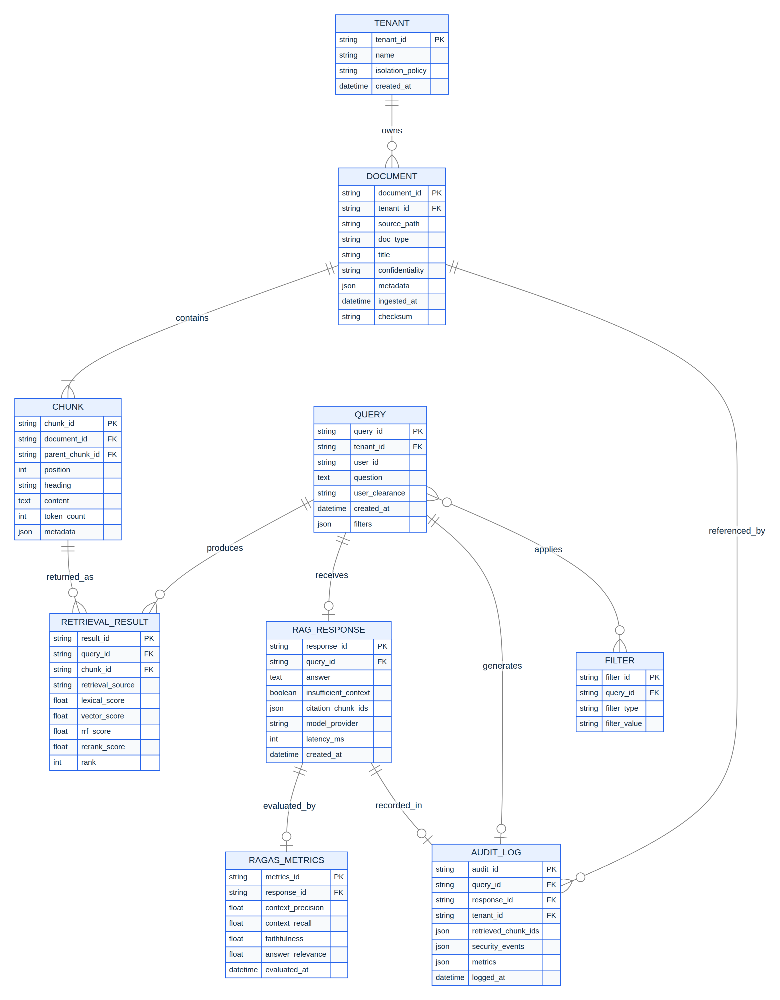
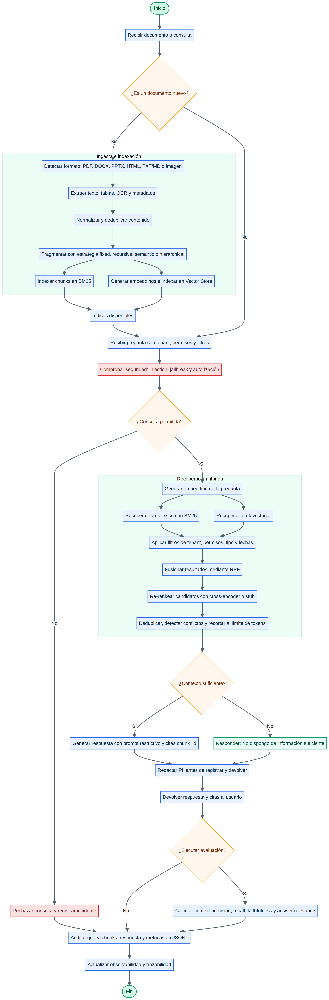
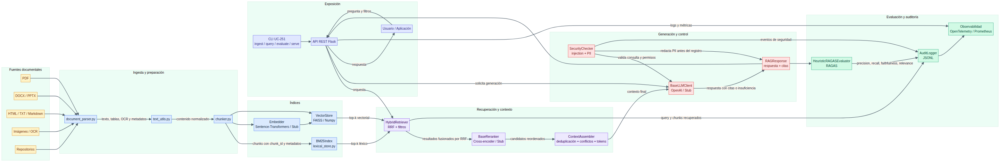
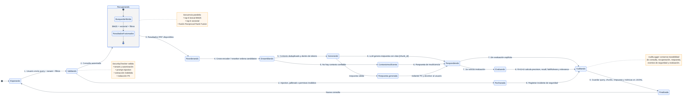

# TomoIII — UC-251: Arquitectura RAG robusta, escalable y auditable

## AI-Native Operations & Agentic Patterns
### Caso: ¿Cómo diseñar e implementar una arquitectura RAG robusta, escalable y auditable para procesar documentos empresariales largos, heterogéneos y potencialmente multimodales?

**Uso:** Externo / Referencia arquitectónica e implementación ejecutable.

## Descripción

UC-251 implementa un pipeline RAG (Retrieval-Augmented Generation) completo, modular y listo para producción, centrado en documentos empresariales largos y heterogéneos. El sistema cubre:

- **Ingesta y preprocesamiento multimodal** (PDF, DOCX, PPTX, HTML, imágenes vía OCR, TXT/Markdown).
- **Fragmentación semántica y jerárquica** con preservación de metadatos, tablas, encabezados y referencias cruzadas.
- **Indexación híbrida**: búsqueda léxica (BM25) + búsqueda densa (vectorial).
- **Fusión de resultados** con Reciprocal Rank Fusion (RRF).
- **Re-ranking** mediante cross-encoders reales o stubs deterministas.
- **Generación con citas**, control de insuficiencia y reducción de alucinaciones.
- **Evaluación con métricas RAGAS**: context precision, context recall, faithfulness y answer relevance.
- **Observabilidad, auditoría, seguridad** (prompt injection, PII redaction) y aislamiento por tenant.

La implementación vive en `/Users/utron/Documents/code-books/TomoIII/UC-251/code/` y puede ejecutarse vía CLI o como API REST Flask.

---

## Arquitectura lógica y flujo de datos

```text
┌─────────────────────────────────────────────────────────────────────────────┐
│                              FUENTES DE DATOS                                │
│  PDF │ DOCX │ PPTX │ HTML │ TXT/MD │ PNG/JPG (OCR) │ repositorios           │
└───────────────────────┬───────────────────────────────────────────────────────┘
                        │
                        ▼
┌─────────────────────────────────────┐
│  document_parser.py                  │  extracción de texto, tablas, OCR,
│  text_utils.py                        │  normalización, deduplicación,
│                                      │  preservación de metadatos
└───────────────┬───────────────────────┘
                ▼
┌─────────────────────────────────────┐
│  chunker.py                          │  chunking fijo, recursivo, semántico,
│  (SemanticChunker + Deduplicated)     │  jerárquico (padre/hijo)
└───────────────┬───────────────────────┘
                │
        ┌───────┴────────┐
        ▼                ▼
┌──────────────┐  ┌──────────────┐
│ BM25 /       │  │ Vector Store │  FAISS (prod) o fuerza bruta numpy (stub)
│ lexical_store│  │ vector_store │  Embeddings: sentence-transformers o stub
└───────┬──────┘  └───────┬───────┘
        │                 │
        └───────┬─────────┘
                ▼
┌─────────────────────────────────────┐
│  retriever.py — HybridRetriever      │  RRF sobre BM25 + vectorial
│  Filtros: tenant, confidencialidad,   │  + metadatos (doc_type, fechas, permisos)
│  doc_type, date range               │
└───────────────┬───────────────────────┘
                ▼
┌─────────────────────────────────────┐
│  reranker.py — Cross-encoder       │  BGE-Reranker/Cohere (prod) o stub léxico
└───────────────┬───────────────────────┘
                ▼
┌─────────────────────────────────────┐
│  context_assembler.py                │  deduplicación, detección de conflictos,
│                                      │  corte por tokens, top-k final
└───────────────┬───────────────────────┘
                ▼
┌─────────────────────────────────────┐
│  generator.py — LLM                  │  OpenAI (prod) o stub determinista
│  Prompt estricto + citas [chunk_id]  │  + respuesta de insuficiencia
└───────────────┬───────────────────────┘
                ▼
┌─────────────────────────────────────┐
│  ragas_evaluator.py                │  context precision, recall, faithfulness,
│                                      │  answer relevance
├─────────────────────────────────────┤
│  audit_logger.py / security.py       │  trazabilidad, PII redaction, prompt-injection
└─────────────────────────────────────┘
```


### Flujo end-to-end

1. **Ingesta**: `document_parser.py` extrae texto plano y metadatos estructurados; `text_utils.py` normaliza y deduplica.
2. **Chunking**: `SemanticChunker` elige estrategia (`fixed`, `recursive`, `semantic`, `hierarchical`), añade `chunk_id`, encabezados, posición y metadatos del documento padre.
3. **Indexación**: los chunks se indexan en `BM25Index` y en `VectorStore` (FAISS o numpy). Ambos índices soportan filtros por metadatos.
4. **Consulta**: `HybridRetriever` genera embeddings de la pregunta, recupera top-k léxico y top-k vectorial, y fusiona con RRF.
5. **Re-ranking**: `BaseReranker` reordena los candidatos RRF usando un cross-encoder (o stub léxico).
6. **Contexto**: `ContextAssembler` deduplica, detecta conflictos y recorta a la ventana de tokens permitida.
7. **Generación**: `BaseLLMClient` inyecta el contexto en un prompt restrictivo y genera respuesta con citas. Si no hay contexto, responde con frase de insuficiencia.
8. **Evaluación**: `HeuristicRAGASEvaluator` (o RAGAS oficial con LLM-as-a-Judge) mide calidad de recuperación y generación.
9. **Auditoría**: `AuditLogger` persiste query, chunks recuperados, respuesta y métricas en JSONL.
10. **Seguridad**: `SecurityChecker` filtra inyección de prompts, intentos de extracción y redacta PII antes de loguear.

---

## Componentes tecnológicos recomendados y alternativas open source

| Capa | Implementación por defecto | Recomendación producción | Alternativas open source |
|---|---|---|---|
| Embeddings | `StubEmbedder` (tests) | `sentence-transformers` + `BAAI/bge-m3`, `intfloat/e5-base-v2` | `FlagEmbedding`, `instructor-xl`, `GTE` |
| Vector store | `BruteForceVectorStore` | `FAISS` / `Milvus` / `Qdrant` / `Weaviate` | `pgvector`, `Chroma`, `Redis Stack` |
| Lexical | BM25 propio | `rank-bm25`, `Elasticsearch`, `Lucene`, `Meilisearch` | `Whoosh`, `Tantivy` |
| Re-ranking | `StubReranker` | `BAAI/bge-reranker-base`, `cross-encoder/ms-marco-MiniLM-L-6-v2`, Cohere Rerank | `flashrank`, `jina-reranker-v2` |
| LLM generativo | `StubLLMClient` | `OpenAI GPT-4o-mini/4o`, Azure OpenAI | `Ollama`/`vLLM` con Llama/Mistral, `HuggingFace TGI` |
| Evaluación | `HeuristicRAGASEvaluator` | `ragas` + GPT-4o / Claude | `ARES`, `TruLens`, evaluación humana |
| OCR | `pytesseract` (opcional) | `Tesseract` + `PaddleOCR` | `EasyOCR`, `doctr` |
| Observabilidad | JSONL local | `OpenTelemetry` → Tempo/Jaeger, `Prometheus` + `Grafana` | `MLflow`, `Langfuse`, `LangSmith` |


### Criterios de selección

- **Embeddings**: dominio multilingüe → `BAAI/bge-m3` o `e5-mistral`; lenguaje técnico español/inglés → `e5-base-v2` fine-tuneado; long context → `GTE-large` o embeddings con 8k+ tokens. Validar con MTEB en el dominio y con retrieval recall @k.
- **Vector DB**: FAISS es ideal para prototipos y búsqueda exacta en CPU/GPU; Milvus/Qdrant aportan filtrado híbrido, particionado por tenant y escalabilidad horizontal; `pgvector` si ya se usa Postgres y se quiere ACID + RAG.
- **Reranker**: cross-encoder mejora la precisión en top-5/top-10 con latencia ~10-50 ms por par; para alto throughput usar `BGE-Reranker-v2-M3` o `flashrank`.
- **LLM**: preferir modelos con ventana amplia, buena adherencia a instrucciones y soporte de citations; GPT-4o-mini ofrece buen ratio calidad/coste para RAG empresarial.

---

## Implementación

### Archivos principales

| Archivo | Responsabilidad |
|---|---|
| `config.py` | Configuración centralizada por variables de entorno |
| `models.py` | Dataclasses: `Document`, `Chunk`, `RetrievalResult`, `RAGResponse`, `RAGASMetrics`, `AuditLog` |
| `text_utils.py` | Normalización, tokenización, deduplicación, estimación de tokens |
| `document_parser.py` | Extractores PDF, DOCX, PPTX, HTML, OCR, TXT |
| `chunker.py` | Estrategias de chunking y deduplicación |
| `embedder.py` | `StubEmbedder` y `SentenceTransformerEmbedder` |
| `vector_store.py` | `BruteForceVectorStore` y `FaissVectorStore` |
| `lexical_store.py` | `BM25Index` |
| `retriever.py` | `HybridRetriever` con RRF y filtros de metadatos |
| `reranker.py` | `StubReranker` y `SentenceTransformerReranker` |
| `context_assembler.py` | Deduplicación, detección de conflictos, ensamblaje final |
| `generator.py` | `StubLLMClient` y `OpenAILLMClient` con prompt estricto |
| `ragas_evaluator.py` | Evaluación heurística RAGAS + punto de extensión LLM-as-a-Judge |
| `security.py` | Detección de jailbreak/injection, redacción PII |
| `audit_logger.py` | Traza JSONL y logs en memoria |
| `rag_pipeline.py` | Orquestador `RAGPipeline` |
| `api.py` | API REST Flask con card views de entrada/salida |
| `UC-251.py` | CLI: `ingest`, `query`, `evaluate`, `serve` |
| `requirements.txt` | Dependencias |
| `tests/` | Pruebas unitarias e integración |

### Variables de entorno clave

| Variable | Defecto | Descripción |
|---|---|---|
| `UC251_EMBEDDER_MODEL` | `stub` | Modelo de embeddings (`stub` o `sentence-transformers`) |
| `UC251_VECTOR_BACKEND` | `auto` | `auto`, `faiss`, `brute` |
| `UC251_CHUNK_STRATEGY` | `semantic` | `fixed`, `recursive`, `semantic`, `hierarchical` |
| `UC251_TOP_K_VECTOR` | `20` | Candidatos vectoriales |
| `UC251_TOP_K_LEXICAL` | `20` | Candidatos BM25 |
| `UC251_RRF_K` | `60` | Constante RRF |
| `UC251_RERANKER_MODEL` | `stub` | `stub` o `cross-encoder/...` |
| `UC251_GENERATOR_PROVIDER` | `stub` | `stub` o `openai` |
| `UC251_OPENAI_API_KEY` | — | Clave para generación/evaluación real |
| `UC251_WORK_DIR` | `./uc251_work` | Directorio de trabajo y auditoría |

---

## Pseudocódigo del pipeline

```python
from rag_pipeline import RAGPipeline

pipeline = RAGPipeline()

# 1. Ingesta de documento
pipeline.ingest_document("/data/contrato.pdf", metadata={
    "tenant_id": "acme",
    "doc_type": "contract",
    "confidentiality": "confidential"
})

# 2. Consulta
response = pipeline.query(
    "¿Cuál es el plazo de notificación?",
    filters={"doc_type": ["contract"]},
    user_clearance="confidential",
    tenant_id="acme"
)
print(response.answer)
for c in response.citations:
    print(c.chunk_id, c.excerpt)

# 3. Evaluación
samples = [EvaluationSample(
    query="¿Plazo de notificación?",
    ground_truth="15 días naturales",
    reference_contexts=["El plazo de notificación es de 15 días naturales."]
)]
metrics = pipeline.evaluate(samples)
print(metrics["average_metrics"])
```

---

## Métricas objetivo y criterios de aceptación

| Métrica | Definición | Objetivo v1 | Criterio "listo para prod" |
|---|---|---|---|
| **Context Precision** | % de chunks recuperados que son relevantes para responder | ≥ 0.60 | ≥ 0.80 |
| **Context Recall** | % de información del ground truth cubierta por los chunks | ≥ 0.60 | ≥ 0.80 |
| **Faithfulness** | % de afirmaciones de la respuesta soportadas por contexto | ≥ 0.70 | ≥ 0.90 |
| **Answer Relevance** | la respuesta aborda la pregunta sin información extra | ≥ 0.70 | ≥ 0.85 |
| **Latency p95 query** | tiempo end-to-end consulta | < 3 s | < 1 s (sin LLM) |
| **Recall @10** | documento correcto en top-10 | ≥ 0.70 | ≥ 0.90 |
| **Cost per 1k queries** | coste embedding + rerank + LLM | baseline | objetivo por tenant |

### Criterios de aceptación

1. El sistema ingesta al menos PDF, DOCX, PPTX, HTML y TXT sin pérdida estructural apreciable.
2. La recuperación híbrida supera a BM25 o vectorial puro en Recall@5 en el benchmark interno.
3. El generador cita siempre los `chunk_id` usados y responde "No dispongo de información..." cuando el contexto es insuficiente.
4. Las métricas RAGAS sobre el conjunto de evaluación superan los umbrales objetivo.
5. No se producen fugas de PII en logs ni respuestas sin redacción.
6. Un tenant no accede a documentos de otro tenant en los tests de aislamiento.

---

## Metodología de experimentación y ajuste de hiperparámetros

1. **Construcción del dataset**: recolectar 100-500 preguntas/respuestas representativas con contextos de referencia y `expected_doc_ids`.
2. **Baseline**: BM25 puro → vectorial puro → híbrido RRF → híbrido + rerank.
3. **Grid search** sobre:
   - Estrategia de chunking (`fixed`, `recursive`, `semantic`, `hierarchical`).
   - `target_chunk_size` (256, 512, 768, 1024 tokens), `chunk_overlap` (0-128).
   - `top_k_vector`, `top_k_lexical` (10-50), `rrf_k` (20-120).
   - Modelo de embeddings y reranker.
4. **Métrica de optimización**: combinar `context_recall` y `context_precision` con F1 ponderado, además de latencia y coste.
5. **Regresión**: guardar versiones de índice + prompts y correr evaluación A/B periódicamente.
6. **Online**: seguimiento de feedback explícito (thumbs up/down) e implícito (tiempo de lectura, follow-up queries).

---

## Matriz de riesgos y principales casos de fallo

| Riesgo | Impacto | Mitigación |
|---|---|---|
| **Mala fragmentación** (cortes semánticos) | Alto | chunking semántico, solapamiento, chunking jerárquico padre-hijo |
| **Recuperación fallida** | Alto | híbrida BM25 + vectorial, reranker, fallback a expansión de query |
| **Re-ranking sesgado** | Medio | cross-encoder entrenado en datos de dominio, evaluación A/B |
| **Alucinaciones / respuestas sin fundamento** | Alto | prompt restrictivo, citas obligatorias, respuesta de insuficiencia |
| **Fuga de PII / confidencialidad** | Crítico | redacción, filtros de confidencialidad, RBAC por tenant |
| **Prompt injection / jailbreak** | Crítico | `SecurityChecker` con patrones + output filtering, rate limiting |
| **Deriva de embeddings** | Medio | monitoreo de calidad de retrieval, reindexación programada |
| **Escalabilidad del índice** | Medio | vector DB distribuido (Milvus/Qdrant), sharding por tenant |
| **Cortes en documentos largos** | Medio | chunking jerárquico, resumen padre, chunk IDs con rango char |
| **Conflictos en contexto** | Medio | detección de contradicciones, ranking por fecha y autoridad |

### Clasificación de errores

- **Error de recuperación**: context precision/recall bajos → revisar chunking, embeddings, filtros.
- **Error de re-ranking**: el chunk correcto aparece en top-10 inicial pero no en top-5 final → ajustar reranker o dataset de fine-tuning.
- **Error de generación**: faithfulness bajo aunque el contexto sea bueno → mejorar prompt, temperature 0, citas forzadas, output parsing.

---

## Observabilidad, seguridad y gobernanza

- **Auditoría**: `AuditLogger` escribe JSONL con `trace_id`, query, chunks recuperados, scores, respuesta, latencia, flags de seguridad y métricas RAGAS.
- **Tenant isolation**: filtro por `tenant_id` en recuperación; índices separables por tenant en producción.
- **Confidencialidad**: niveles `public`, `internal`, `confidential`, `restricted`; el usuario solo ve chunks con nivel ≤ `user_clearance`.
- **PII**: `SecurityChecker.redact_pii` detecta emails, teléfonos, tarjetas, SSN, IPs y API keys.
- **Prompt injection**: patrones de jailbreak, extracción de system prompt, inyección estructurada y ofuscación.
- **Cifrado**: en reposo se delega a la infraestructura de storage (S3 SSE, disco cifrado); en tránsito HTTPS obligatorio en producción.

---

## API REST

La API expone el pipeline completo y un esquema de card views de entrada/salida en `/api/v1/schema`.

### Endpoints

| Método | Endpoint | Descripción |
|---|---|---|
| `GET` | `/health` | Liveness/readiness |
| `GET` | `/api/v1/schema` | Card views de entrada y salida |
| `POST` | `/api/v1/ingest` | Ingesta archivo o texto |
| `POST` | `/api/v1/query` | Consulta RAG |
| `POST` | `/api/v1/evaluate` | Evaluación RAGAS |
| `GET` | `/api/v1/stats` | Estadísticas del índice |
| `GET` | `/api/v1/audit` | Traza de auditoría |

### Card view de entrada — `/api/v1/ingest`

```json
{
  "endpoint": "POST /api/v1/ingest",
  "parameters": [
    {"name": "file", "type": "multipart/file", "required": false, "example": "informe.pdf"},
    {"name": "text", "type": "string", "required": false, "example": "El plazo es de 15 días."},
    {"name": "title", "type": "string", "required": false, "example": "Informe Anual"},
    {"name": "doc_type", "type": "string", "required": false, "enum": ["pdf","docx","pptx","html","txt","md","png","jpg"]},
    {"name": "metadata", "type": "object", "required": false,
     "example": {"tenant_id":"acme","confidentiality":"internal","doc_type":"report"}}
  ]
}
```

### Card view de salida — `/api/v1/ingest`

```json
{
  "doc_id": "sha256...",
  "num_chunks": 12,
  "document": {
    "source": "/path/to/file.pdf",
    "title": "Informe Anual",
    "doc_type": "pdf",
    "content_length": 15320,
    "metadata": {"tenant_id":"acme"}
  }
}
```

### Card view de entrada — `/api/v1/query`

```json
{
  "endpoint": "POST /api/v1/query",
  "parameters": [
    {"name": "question", "type": "string", "required": true},
    {"name": "tenant_id", "type": "string", "required": false},
    {"name": "user_id", "type": "string", "required": false},
    {"name": "user_clearance", "type": "string", "enum": ["public","internal","confidential","restricted"], "required": false},
    {"name": "filters", "type": "object", "required": false,
     "example": {"doc_type":["contract"], "date_from":"2025-01-01"}},
    {"name": "top_k", "type": "integer", "required": false}
  ]
}
```

### Card view de salida — `/api/v1/query`

```json
{
  "trace_id": "uuid",
  "query": "¿Cuál es el plazo?",
  "answer": "Según el contexto proporcionado: - [doc-001-chunk-000000]: El plazo es de 15 días...",
  "citations": [
    {"chunk_id":"doc-001-chunk-000000", "doc_id":"doc-001", "source":"informe.pdf", "excerpt":"...", "score":0.95}
  ],
  "retrieved_chunks": [...],
  "context": "[1] chunk_id=... ...",
  "generation_model": "stub",
  "latency_ms": 120.5,
  "insufficient_info": false,
  "security_flags": []
}
```

### Ejemplo de uso con `curl`

```bash
# Ingestar texto
curl -X POST http://localhost:5251/api/v1/ingest \
  -H "Content-Type: application/json" \
  -d '{"text":"El plazo de notificación es de 15 días naturales.",
       "title":"Contrato","metadata":{"tenant_id":"acme"}}'

# Consultar
curl -X POST http://localhost:5251/api/v1/query \
  -H "Content-Type: application/json" \
  -d '{"question":"¿Cuál es el plazo de notificación?","tenant_id":"acme"}'

# Evaluar
curl -X POST http://localhost:5251/api/v1/evaluate \
  -H "Content-Type: application/json" \
  -d '{"samples":[{"query":"¿Capital de Francia?","ground_truth":"París",
       "reference_contexts":["París es la capital de Francia."]}]}'
```

---

## CLI

```bash
# Ingestar archivo
python UC-251.py ingest --path contrato.pdf --metadata '{"tenant_id":"acme"}'

# Ingestar texto
python UC-251.py ingest --text "El plazo es de 15 días." --title Notas

# Consulta
python UC-251.py query "¿Cuál es el plazo?" --ingest contrato.pdf --tenant-id acme

# Evaluación con dataset JSON
python UC-251.py evaluate dataset.json --output metrics.json

# Servidor API
python UC-251.py serve --port 5251
```

---

## Instalación y validación

```bash
cd /Users/utron/Documents/code-books/TomoIII/UC-251/code
pip install -r requirements.txt

# Tests unitarios e integración (usa componentes stub, sin descargas pesadas)
python -m pytest tests/ -q

# Modo producción (requiere modelos reales)
export UC251_EMBEDDER_MODEL="BAAI/bge-m3"
export UC251_VECTOR_BACKEND="faiss"
export UC251_RERANKER_MODEL="BAAI/bge-reranker-base"
export UC251_GENERATOR_PROVIDER="openai"
export UC251_OPENAI_API_KEY="sk-..."
python UC-251.py serve --port 5251
```

---

## Ventajas y limitaciones de cada decisión técnica

| Decisión | Ventajas | Limitaciones |
|---|---|---|
| **BM25 + vectorial + RRF** | Robusto ante sinónimos y términos exactos; no requiere entrenamiento de pesos | RRF es una heurística; sin ajuste por query puede suboptimizar |
| **Chunking semántico** | Respeta límites conceptuales | Requiere embeddings de buena calidad; más lento que chunking fijo |
| **Cross-encoder reranker** | Alta precisión en top-k | Latencia y coste mayores; batching necesario |
| **Prompt restrictivo + citas** | Reduce alucinaciones y mejora explicabilidad | Depende del LLM; algunos modelos ignoran instrucciones |
| **Stub por defecto** | Funciona offline, tests rápidos, sin API keys | No representa calidad real de producción |
| **JSONL de auditoría** | Simple, observable, portable | En producción requiere rotación, encriptación y SIEM |
| **Filtros por metadatos en memoria** | Flexible, fácil de testear | No escala a millones de docs; delegar a vector DB |

---

## Próximos pasos recomendados

1. Reemplazar stubs por modelos de producción (`BAAI/bge-m3`, `BGE-Reranker`, GPT-4o-mini) y validar métricas en dataset propio.
2. Migrar el vector store a Milvus/Qdrant con particionado por tenant y metadata filtering nativo.
3. Añadir fine-tuning de embeddings/reranker con pares query-document del dominio.
4. Implementar evaluación continua: pipeline CI con `pytest` + evaluación RAGAS en cada PR.
5. Integrar trazas OpenTelemetry y dashboards de calidad/coste por tenant.
