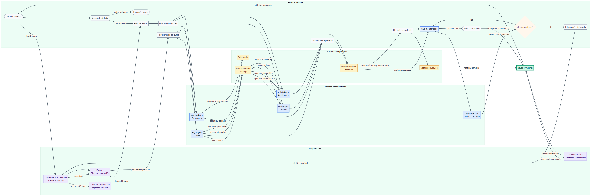
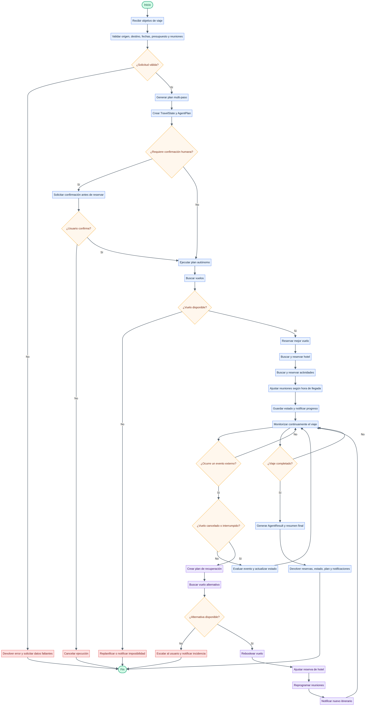
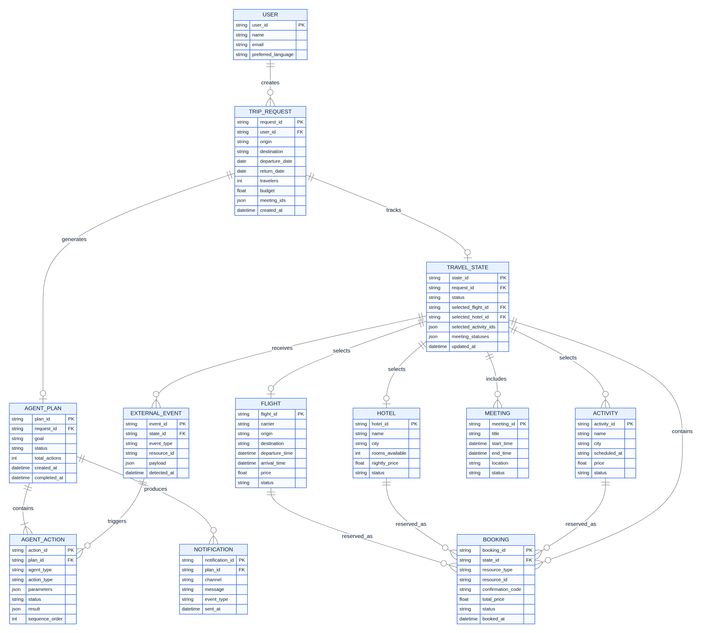
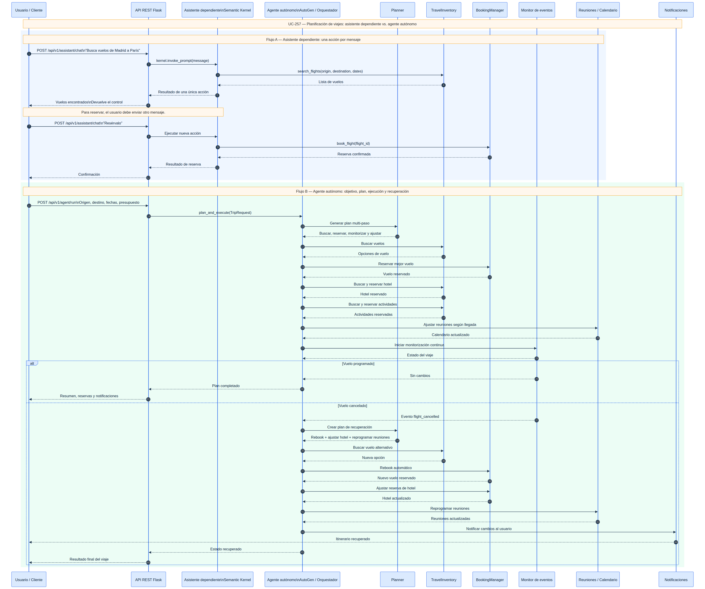

# TomoIII — UC-257: Asistente dependiente vs. Agente autónomo en planificación de viajes
## AI-Native Operations & Agentic Patterns
### Caso: ¿En una plataforma de planificación de viajes, cómo se puede diferenciar un agente autónomo de un asistente inteligente?
**Uso:** Externo / Referencia arquitectónica e implementación ejecutable.
## Descripción
UC-257 implementa una plataforma de planificación de viajes que contrasta dos paradigmas:

- **Asistente dependiente (Semantic Kernel)** — reactivo: espera a que el usuario envíe un mensaje, ejecuta una única acción y devuelve el control. No tiene memoria a largo plazo ni iniciativa propia.
- **Agente autónomo (AutoGen / orquestador interno)** — proactivo: recibe un objetivo de alto nivel ("organiza mi viaje a París"), planifica, reserva, monitoriza y reacciona a eventos externos (cancelación de vuelo) sin intervención humana por paso.

Ambos comparten el **mismo catálogo de herramientas** (vuelos, hoteles, actividades, reuniones), pero la **arquitectura orquestadora** cambia drásticamente el comportamiento.

La implementación vive en `/Users/utron/Documents/code-books/TomoIII/UC-257/code/` y se puede ejecutar vía CLI o API REST Flask.

---

## Diferencia fundamental

| Característica | Asistente dependiente (Semantic Kernel) | Agente autónomo (AutoGen) |
|---|---|---|
| **Desencadenante** | Externo: mensaje del usuario | Interno: objetivo + monitorización continua |
| **Orquestador** | `kernel.invoke_prompt()` | Bucle interno de charla del `AssistantAgent` / `TravelAgentOrchestrator` |
| **Planificación** | Ninguna; actúa turno a turno | Genera plan multi-paso y lo ejecuta |
| **Recuperación ante cancelaciones** | Requiere webhook/evento externo que despierte otro turno | Detecta el cambio y rebooka/ajusta/reprograma solo |
| **Confirmaciones** | Puede pedir confirmación humana por acción | Puede actuar sin preguntar (configurable) |
| **Ejemplo de viaje** | Usuario: "busca vuelo" → asistente busca. Luego usuario: "resérvalo" → asistente reserva. | Usuario: "organiza mi viaje" → agente busca, reserva, monitoriza y corrige solo. |

---

## Arquitectura lógica

```text
┌─────────────────────────────────────────────────────────────────────────────┐
│                              USUARIO / CLIENTE                               │
└───────────────────────────────┬─────────────────────────────────────────────┘
                                │
        ┌───────────────────────┴───────────────────────┐
        ▼                                               ▼
┌────────────────────────────┐              ┌────────────────────────────┐
│ ASISTENTE DEPENDIENTE      │              │ AGENTE AUTÓNOMO            │
│ (Semantic Kernel / fallback│              │ (AutoGen / orchestrador    │
│  determinista)             │              │  interno)                  │
├────────────────────────────┤              ├────────────────────────────┤
│ • Procesa un mensaje       │              │ • Recibe objetivo de viaje │
│ • LLM elige un plugin/tool   │              │ • Genera plan multi-paso   │
│ • Devuelve resultado         │              │ • Ejecuta / monitoriza     │
│ • No actúa hasta nuevo input   │              │ • Reacciona a eventos      │
└───────────┬────────────────┘              └───────────┬────────────────┘
            │                                         │
            └─────────────────┬───────────────────────┘
                              ▼
┌─────────────────────────────────────────────────────────────────────────────┐
│                    AGENTES ESPECIALIZADOS Y SERVICIOS                        │
│  ┌──────────┐ ┌──────────┐ ┌─────────────┐ ┌─────────────┐ ┌──────────┐  │
│  │ Vuelos   │ │ Hoteles  │ │ Actividades │ │ Reuniones   │ │ Monitor  │  │
│  └────┬─────┘ └────┬─────┘ └──────┬──────┘ └──────┬──────┘ └────┬─────┘  │
│       └─────────────┴──────────────┴───────────────┘───────────┘          │
│                         TravelInventory + BookingManager                    │
└─────────────────────────────────────────────────────────────────────────────┘
```

### Flujo del agente autónomo

1. **Recibir objetivo**: origen, destino, fechas, presupuesto, reuniones.
2. **Planificar**: generar acciones de búsqueda y reserva.
3. **Ejecutar**:
   - Buscar vuelos → reservar el mejor.
   - Monitorizar estado del vuelo.
   - Buscar hotel → reservar.
   - Buscar actividades → reservar.
   - Ajustar reuniones según hora de llegada.
4. **Monitorizar**: el agente verifica el estado del vuelo; si está cancelado, ejecuta **recuperación**:
   - Rebook a otro vuelo.
   - Ajustar reserva de hotel.
   - Reprogramar reuniones.
   - Notificar al usuario.

---

## Componentes tecnológicos y alternativas

| Componente | Implementación por defecto | Producción | Alternativas open source |
|---|---|---|---|
| LLM / reasoning | `stub` / fallback determinista | OpenAI GPT-4o / Azure OpenAI | vLLM, Ollama, Mistral, Llama |
| Framework asistente | `semantic_kernel_adapter.py` (fallback incluido) | `semantic-kernel` | LangChain, LlamaIndex |
| Framework autónomo | `autogen_adapter.py` (fallback incluido) | `pyautogen` / `autogen-agentchat` | CrewAI, AutoGPT, LangGraph |
| Catálogo de vuelos | Simulación en memoria | Amadeus, Sabre, Duffel | APIs públicas de aerolíneas |
| Hoteles | Simulación en memoria | Booking, Amadeus | APItude, OpenHotelAlert |
| Actividades | Simulación en memoria | GetYourGuide, Viator | APIs locales |
| Calendario/reuniones | Simulación en memoria | Google Calendar, Outlook | CalDAV, MS Graph |
| Persistencia | En memoria | Postgres, Redis, DynamoDB | SQLite, MongoDB |
| API | Flask | FastAPI, gRPC | Django REST, Fastify |

---

## Estructura del código

| Archivo | Responsabilidad |
|---|---|
| `config.py` | Configuración por variables de entorno (LLM, frameworks, agente) |
| `models.py` | Dataclasses: `TripRequest`, `Flight`, `Hotel`, `Activity`, `Booking`, `AgentAction`, `AgentPlan`, `AgentResult`, `TravelState` |
| `travel_services.py` | Inventario y servicios simulados de vuelos, hoteles, actividades, reuniones y reservas |
| `planner.py` | Generador de planes de viaje y plan de recuperación ante cancelaciones |
| `agent_orchestrator.py` | `TravelAgentOrchestrator`: modo autónomo y modo asistente dependiente |
| `semantic_kernel_adapter.py` | Adaptador a Semantic Kernel con fallback determinista |
| `autogen_adapter.py` | Adaptador a AutoGen con fallback al orquestador interno |
| `api.py` | API REST Flask con card views de entrada/salida |
| `UC-257.py` | CLI: `assistant`, `agent`, `simulate`, `serve` |
| `requirements.txt` | Dependencias |
| `tests/` | Pruebas unitarias e integración |

---

## Variables de entorno

| Variable | Defecto | Descripción |
|---|---|---|
| `UC257_LLM_PROVIDER` | `stub` | `stub`, `openai`, `azure` |
| `UC257_LLM_MODEL` | `gpt-4o-mini` | Modelo LLM |
| `UC257_OPENAI_API_KEY` | — | Clave de API |
| `UC257_USE_SEMANTIC_KERNEL` | `False` | Usar Semantic Kernel real |
| `UC257_USE_AUTOGEN` | `False` | Usar AutoGen real |
| `UC257_AGENT_MAX_ITERATIONS` | `20` | Límite de iteraciones autónomas |
| `UC257_REBOOKING_ENABLED` | `True` | Permitir rebooking automático |
| `UC257_REQUIRE_HUMAN_CONFIRMATION` | `False` | Pedir confirmación humana antes de reservar |
| `UC257_PORT` | `5257` | Puerto de la API Flask |

---

## API REST

Endpoints:

| Método | Endpoint | Descripción |
|---|---|---|
| `GET` | `/health` | Liveness/readiness |
| `GET` | `/api/v1/schema` | Card views de entrada/salida |
| `POST` | `/api/v1/assistant/chat` | Asistente dependiente (un turno) |
| `POST` | `/api/v1/agent/plan` | Genera plan de viaje |
| `POST` | `/api/v1/agent/run` | Ejecuta agente autónomo |
| `POST` | `/api/v1/agent/simulate` | Simula cancelación de vuelo y recuperación |
| `GET` | `/api/v1/agent/status/<request_id>` | Estado de un viaje |
| `GET` | `/api/v1/inventory/flights` | Buscar vuelos |
| `GET` | `/api/v1/inventory/hotels` | Buscar hoteles |
| `GET` | `/api/v1/inventory/activities` | Buscar actividades |
| `GET` | `/api/v1/bookings` | Listar reservas |

### Card view de entrada — `/api/v1/assistant/chat`

```json
{
  "endpoint": "POST /api/v1/assistant/chat",
  "description": "Asistente reactivo dependiente: un mensaje del usuario produce una única acción.",
  "parameters": [
    {"name": "user_id", "type": "string", "required": true, "example": "user-42"},
    {"name": "message", "type": "string", "required": true, "example": "Busca vuelos de Madrid a París para mañana"},
    {"name": "trip_request", "type": "object", "required": false,
     "example": {"origin": "Madrid", "destination": "París", "departure_date": "2026-07-15"}}
  ]
}
```

### Card view de salida — `/api/v1/assistant/chat`

```json
{
  "mode": "assistant",
  "user_message": "Busca vuelos de Madrid a París",
  "intent": {"agent": "flight_search_agent", "action": "search_flights", "parameters": {}},
  "action": {"agent": "flight_search_agent", "action": "search_flights", "result": "Encontrados 3 vuelos", "success": true},
  "state": { "request": {...}, "selected_flight": null, "bookings": {} }
}
```

### Card view de entrada — `/api/v1/agent/run`

```json
{
  "endpoint": "POST /api/v1/agent/run",
  "description": "Agente autónomo: planifica, reserva, monitoriza y recupera el viaje sin intervención humana.",
  "parameters": [
    {"name": "origin", "type": "string", "required": true, "example": "Madrid"},
    {"name": "destination", "type": "string", "required": true, "example": "París"},
    {"name": "departure_date", "type": "string", "required": true, "example": "2026-07-15"},
    {"name": "return_date", "type": "string", "required": false, "example": "2026-07-18"},
    {"name": "travelers", "type": "integer", "required": false, "example": 1},
    {"name": "budget", "type": "number", "required": false, "example": 500.0},
    {"name": "meeting_ids", "type": "list[string]", "required": false, "example": ["meet-15"]}
  ]
}
```

### Card view de salida — `/api/v1/agent/run`

```json
{
  "request_id": "uuid",
  "status": "completed",
  "final_state": {
    "request": {...},
    "selected_flight": {"flight_id": "IB1001", "status": "scheduled"},
    "selected_hotel": {"hotel_id": "HTL-PAR-01", "name": "Le Marais Boutique"},
    "selected_activities": [{"activity_id": "ACT-PAR-01", "name": "Tour Louvre"}],
    "meetings": {"meet-15": {...}}
  },
  "plan": {"request_id": "uuid", "goal": "...", "actions": [...], "messages": [...]},
  "summary": "Viaje planificado: Madrid -> París; Vuelo: IB1001; Hotel: Le Marais Boutique; ...",
  "notifications": ["Vuelo reservado: IB1001 ...", "Hotel reservado: ..."]
}
```

### Ejemplos `curl`

```bash
# Asistente reactivo
curl -X POST http://localhost:5257/api/v1/assistant/chat \
  -H "Content-Type: application/json" \
  -d '{"user_id":"u1","message":"Busca vuelos de Madrid a París"}'

# Agente autónomo
curl -X POST http://localhost:5257/api/v1/agent/run \
  -H "Content-Type: application/json" \
  -d '{"origin":"Madrid","destination":"París","departure_date":"2026-07-15","return_date":"2026-07-18","meeting_ids":["meet-15"]}'

# Simular cancelación y recuperación autónoma
curl -X POST http://localhost:5257/api/v1/agent/simulate \
  -H "Content-Type: application/json" \
  -d '{"request_id":"<rid>","event_type":"flight_cancelled","payload":{"flight_id":"IB1001"}}'
```

---

## CLI

```bash
# Asistente dependiente (un turno)
python UC-257.py assistant --message "Busca vuelos de Madrid a París"

# Agente autónomo
python UC-257.py agent \
  --origin Madrid --destination París \
  --departure-date 2026-07-15 --return-date 2026-07-18 \
  --meeting-ids meet-15

# Simular cancelación después de planificar
python UC-257.py simulate \
  --origin Madrid --destination París \
  --departure-date 2026-07-15 --return-date 2026-07-18 \
  --meeting-ids meet-15

# API Flask
python UC-257.py serve --port 5257
```

---

## Pseudocódigo del agente autónomo

```python
from agent_orchestrator import TravelAgentOrchestrator
from models import TripRequest
from travel_services import BookingManager, TravelInventory

inventory = TravelInventory()
bookings = BookingManager(inventory)
orchestrator = TravelAgentOrchestrator(inventory, bookings)

request = TripRequest(
    origin="Madrid", destination="París",
    departure_date="2026-07-15", return_date="2026-07-18",
    meeting_ids=["meet-15"]
)

result = orchestrator.plan_and_execute(request)
print(result.summary)
for n in result.notifications:
    print(n)

# Simular cancelación y recuperación
flight = result.final_state.selected_flight
flight.status = "cancelled"
recovery = orchestrator.planner.handle_disruption(plan, flight)
for action in recovery:
    orchestrator._execute_action(action, state)
```

---

## Ventajas y limitaciones

| Decisión | Ventajas | Limitaciones |
|---|---|---|
| **Asistente dependiente (SK)** | Control total del usuario por paso; fácil de auditar; menor riesgo de acciones no deseadas | Requiere intervención constante; no gestiona proactivamente cancelaciones |
| **Agente autónomo (AutoGen)** | Eficiencia; reacción inmediata a eventos; reduce carga cognitiva | Mayor riesgo si el LLM elige mal; requiere guardrails, confirmaciones y rollback |
| **Orquestador interno + adapters** | Funciona offline sin API key; tests deterministas; fácil migración a frameworks reales | No captura toda la complejidad conversacional de un LLM real |
| **Inventario simulado en memoria** | Rápido para demos y tests | Debe reemplazarse por APIs reales en producción |
| **Máximo de iteraciones** | Evita bucles infinitos | Puede detenerse antes de completar objetivos muy complejos |

---

## Métricas y criterios de aceptación

| Métrica | Objetivo v1 | Criterio prod |
|---|---|---|
| Plan completado sin errores | ≥ 90 % en escenarios de demo | ≥ 98 % en dataset de regresión |
| Recuperación ante cancelación | Detecta y rebooka en < 5 s (simulado) | End-to-end < 60 s con APIs reales |
| Precisión de intención asistente | ≥ 80 % | ≥ 95 % con LLM fine-tuneado |
| Acciones no deseadas | 0 en tests | < 0.1 % en producción (human-in-the-loop) |
| Latencia API p95 | < 1 s | < 500 ms |

---

## Seguridad y gobernanza

- **Confirmaciones**: `UC257_REQUIRE_HUMAN_CONFIRMATION=True` fuerza al agente a pedir aprobación antes de reservas.
- **Límites de iteración**: `UC257_AGENT_MAX_ITERATIONS` evita bucles infinitos.
- **Rollback**: el `BookingManager` mantiene historial de estados para revertir reservas.
- **Auditabilidad**: cada acción se registra con timestamp, agente, parámetros y resultado.
- **Aislamiento por usuario**: estados se indexan por `request_id`; en producción añadir `user_id` + tenant.

---

## Instalación y validación

```bash
cd /Users/utron/Documents/code-books/TomoIII/UC-257/code
pip install -r requirements.txt

# Tests offline (sin API key ni frameworks reales)
python -m pytest tests/ -q

# Ejecutar con Semantic Kernel / AutoGen reales (requiere API key)
export UC257_OPENAI_API_KEY="sk-..."
export UC257_USE_SEMANTIC_KERNEL="true"
export UC257_USE_AUTOGEN="true"
python UC-257.py serve --port 5257
```

---

## Próximos pasos recomendados

1. Conectar APIs reales de vuelos, hoteles, actividades y calendarios.
2. Implementar persistencia de planes, bookings y estados en base de datos.
3. Añadir confirmación humana configurable por tipo de acción y umbral de coste.
4. Integrar evaluación A/B: asistente vs. agente autónomo en tasa de resolución y satisfacción.
5. Reemplazar los stubs por LLM real para planificación flexible en lenguaje natural.
