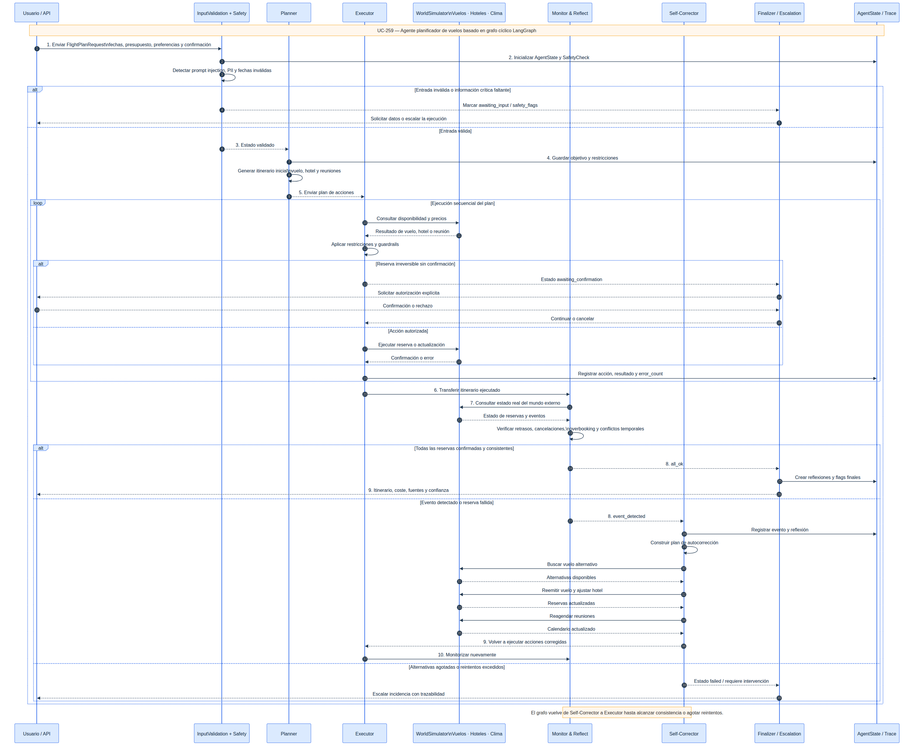
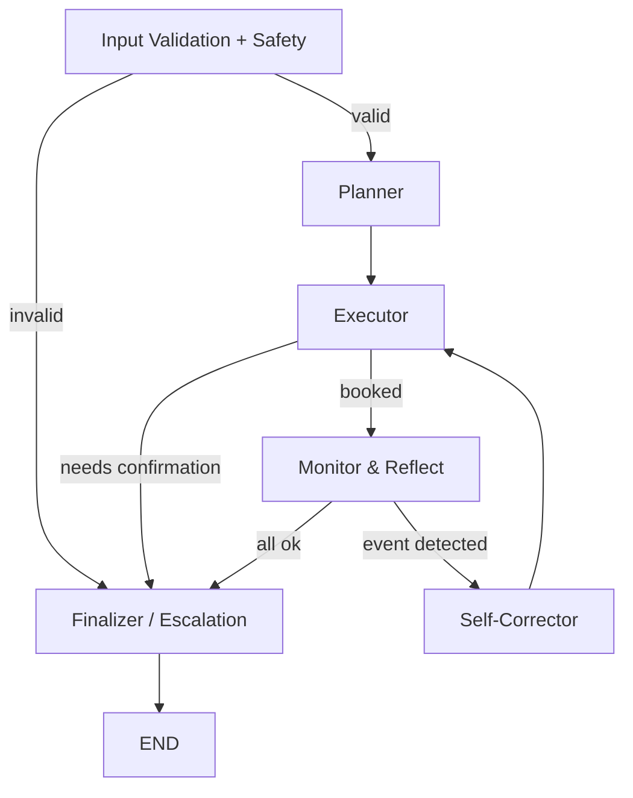
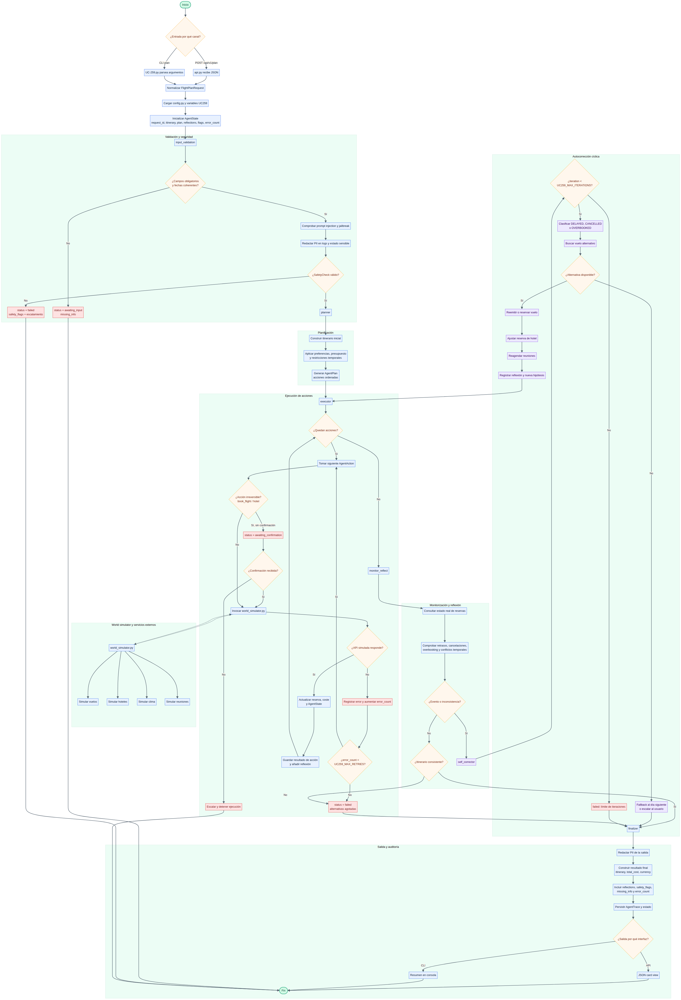

# TomoIII
## AI-Native Operations & Agentic Patterns
### CASE: UC-259 - Agentic Flight Planner

#### USO: . EXTERNO

---

## Descripción

UC-259 implementa un **sistema agentic AI de planificación de viajes autónomo** construido sobre **LangGraph**. A diferencia de un flujo lineal tradicional, el agente opera en un **grafo de estado cíclico** que le permite:

1. **Planificar** un itinerario completo de forma proactiva.
2. **Ejecutar** reservas de vuelos, hoteles y reuniones.
3. **Monitorear y reflexionar** sobre el estado real del mundo externo.
4. **Autocorregirse** ante retrasos, cancelaciones, overbooking y conflictos temporales.
5. **Escalar o pedir confirmación** cuando una acción irreversible requiere autorización o falta información crítica.

El sistema está diseñado para ser **seguro, explicable y robusto**: no ejecuta reservas irreversibles sin confirmación explícita, detecta intentos de *prompt injection*, redacta PII y mantiene una traza completa de reflexiones y decisiones.

---

## Arquitectura



### Nodos del grafo

| Nodo | Responsabilidad |
|---|---|
| `input_validation` | Valida campos obligatorios, fechas coherentes y ejecuta controles de seguridad. |
| `planner` | Genera un itinerario inicial con vuelo(s), hotel y reuniones, aplicando preferencias y presupuesto. |
| `executor` | Ejecuta reservas secuencialmente, consultando el simulador externo y aplicando controles de irreversibilidad. |
| `monitor_reflect` | Consulta el estado real de cada reserva y verifica consistencia temporal. |
| `self_corrector` | Reemite vuelos, reagenda reuniones, actualiza hotel e intenta alternativas. |
| `finalizer` | Produce el resultado final con itinerario, coste, reflexiones, flags y datos faltantes. |

### Flujo cíclico

- Si el monitor detecta un evento (`DELAYED`, `CANCELLED`, `OVERBOOKED`) o una reserva fallida, el grafo salta al corrector y **vuelve a ejecutar** hasta que el itinerario esté consistente o se requiera intervención humana.
- Si no hay eventos y todas las reservas están confirmadas, el grafo finaliza.

---

## Estructura del proyecto

| Archivo / Directorio | Responsabilidad |
|---|---|
| `UC-259.py` | CLI: `plan`, `simulate`, `serve`. |
| `config.py` | Variables de entorno y configuración centralizada. |
| `models.py` | `FlightPlanRequest`, utilidades de fecha y `SafetyCheck`. |
| `state.py` | Esquema `AgentState` del grafo LangGraph. |
| `safety.py` | Guardas contra *prompt injection*, PII y acciones irreversibles. |
| `world_simulator.py` | Simulación determinista de APIs externas: vuelos, hoteles, clima, eventos. |
| `planner.py` | Construcción proactiva del itinerario con selección por preferencias. |
| `nodes.py` | Implementación de cada nodo del grafo. |
| `graph.py` | Compilación del grafo y función `run_agent`. |
| `api.py` | API REST Flask con *card views* de entrada/salida. |
| `tests/` | Tests unitarios e integración con pytest. |
| `requirements.txt` | Dependencias versionadas. |

---

## Dependencias

```bash
cd /Users/utron/Documents/code-books/TomoIII/UC-259/code
python -m pip install -r requirements.txt
```

Contenido de `requirements.txt`:

```text
langgraph==1.0.10
langchain-core==1.2.10
Flask==3.0.3
pytest==8.2.1
```

---

## Variables de entorno

| Variable | Default | Descripción |
|---|---|---|
| `UC259_WORLD_SEED` | `42` | Semilla para el simulador externo. |
| `UC259_SIMULATED_LATENCY_MS` | `50` | Latencia simulada de APIs. |
| `UC259_RANDOM_EVENT_PROB` | `0.0` | Probabilidad de eventos aleatorios. |
| `UC259_MAX_RETRIES` | `3` | Reintentos del autocorrector. |
| `UC259_MAX_ITERATIONS` | `50` | Límite de recursión del grafo. |
| `UC259_REQUIRE_CONFIRMATION_IRREVERSIBLE` | `true` | Requerir confirmación para reservas. |
| `UC259_ENABLE_PROMPT_INJECTION_CHECK` | `true` | Activar detección de *jailbreak*. |
| `UC259_ENABLE_PII_REDACTION` | `true` | Redactar PII en logs. |
| `UC259_PORT` | `5259` | Puerto de la API. |

---

## CLI

### Planificar un viaje

```bash
python UC-259.py plan \
  --origin Madrid \
  --destination Barcelona \
  --departure-date 2026-09-15 \
  --return-date 2026-09-17 \
  --travelers 1 \
  --budget 2000 \
  --currency USD \
  --meeting-time 15:00 \
  --direct-flight \
  --confirm
```

- Sin `--confirm` el agente se detiene en `awaiting_confirmation` antes de ejecutar reservas irreversibles.
- Con `--confirm` autoriza al agente a reservar vuelos y hoteles de forma autónoma.

### Inyectar un evento externo (test)

```bash
python UC-259.py simulate \
  --item-id FL-MADBAR-103 \
  --event-type DELAYED \
  --delay-minutes 180 \
  --reason "Mantenimiento de motor"
```

### Servidor API Flask

```bash
python UC-259.py serve --port 5259
```

---

## API REST

### Endpoints

| Método | Endpoint | Descripción |
|---|---|---|
| `GET` | `/health` | Liveness/readiness. |
| `GET` | `/api/v1/schema` | Card views de entrada y salida. |
| `POST` | `/api/v1/plan` | Ejecuta el agente de planificación. |
| `POST` | `/api/v1/simulate/event` | Inyecta un evento externo. |
| `GET` | `/api/v1/agent/last_trace` | Última traza ejecutada. |

### Card view de entrada — `POST /api/v1/plan`

```json
{
  "endpoint": "POST /api/v1/plan",
  "description": "Ejecuta el agente LangGraph de planificación de viajes.",
  "parameters": [
    {"name": "origin", "type": "string", "required": true, "example": "Madrid"},
    {"name": "destination", "type": "string", "required": true, "example": "Barcelona"},
    {"name": "departure_date", "type": "string (YYYY-MM-DD)", "required": true, "example": "2026-09-15"},
    {"name": "return_date", "type": "string (YYYY-MM-DD)", "required": false, "example": "2026-09-17"},
    {"name": "travelers", "type": "integer", "required": false, "default": 1, "example": 2},
    {"name": "budget", "type": "number", "required": false, "example": 2000},
    {"name": "currency", "type": "string", "required": false, "default": "USD", "example": "EUR"},
    {"name": "preferences", "type": "object", "required": false, "example": {"seat":"window","direct_flight":true,"optimize_for":"cheapest","hotel_stars":4,"meeting_time":"15:00","meeting_buffer_minutes":120}},
    {"name": "constraints", "type": "list[string]", "required": false, "example": ["max_layover_hours=3"]},
    {"name": "confirm_irreversible", "type": "boolean", "required": false, "default": false, "description": "Permite reservas irreversibles"},
    {"name": "recursion_limit", "type": "integer", "required": false, "default": 50}
  ]
}
```

### Card view de salida — `POST /api/v1/plan`

```json
{
  "endpoint": "POST /api/v1/plan",
  "description": "Itinerario final, traza, reflexiones y flags de seguridad.",
  "fields": [
    {"name": "request_id", "type": "string"},
    {"name": "status", "type": "string", "enum": ["done", "awaiting_confirmation", "awaiting_input", "failed"]},
    {"name": "itinerary", "type": "list[object]"},
    {"name": "total_cost", "type": "number"},
    {"name": "currency", "type": "string"},
    {"name": "reflections", "type": "list[string]"},
    {"name": "safety_flags", "type": "list[string]"},
    {"name": "missing_info", "type": "list[string]"},
    {"name": "requires_confirmation", "type": "boolean"},
    {"name": "error_count", "type": "integer"}
  ]
}
```

### Ejemplos `curl`

```bash
# Planificar viaje con confirmación
curl -X POST http://localhost:5259/api/v1/plan \
  -H "Content-Type: application/json" \
  -d '{
    "origin": "Madrid",
    "destination": "Barcelona",
    "departure_date": "2026-09-15",
    "return_date": "2026-09-17",
    "travelers": 1,
    "budget": 2000,
    "confirm_irreversible": true,
    "preferences": {"meeting_time":"15:00","direct_flight":true}
  }'

# Inyectar retraso para observar autocorrección
curl -X POST http://localhost:5259/api/v1/simulate/event \
  -H "Content-Type: application/json" \
  -d '{
    "item_id": "FL-MADBAR-103",
    "event_type": "DELAYED",
    "delay_minutes": 180,
    "reason": "Mantenimiento"
  }'

# Ver schema de entrada/salida
curl http://localhost:5259/api/v1/schema
```

---

## Casos de uso cubiertos

- **Viaje de ida y vuelta**: vuelo de ida, hotel, vuelo de regreso.
- **Viaje solo ida**: vuelo sin hotel obligatorio.
- **Preferencias del usuario**: asiento, vuelo directo, optimización (más barato / más rápido / directo), categoría de hotel, hora de reunión.
- **Restricciones**: *constraints* listados para futura extensión.
- **Eventos externos simulados**: retrasos, cancelaciones, overbooking.
- **Autocorrección**: reemisión de vuelos, reagenda de reuniones, actualización de hotel, fallback al día siguiente.
- **Manejo de errores**: campos faltantes, fechas inválidas, vuelos agotados, APIs caídas, presupuesto insuficiente, alternativas agotadas.
- **Seguridad**: detección de *prompt injection*, redacción de PII, confirmación de acciones irreversibles.

---

## Criterios de evaluación

| Criterio | Objetivo v1 | Objetivo producción |
|---|---|---|
| Itinerario generado sin errores | ≥ 95% | ≥ 99% |
| Autocorrección ante retrasos/cancelaciones | Funciona en casos deterministas | Con APIs reales y reintentos exponenciales |
| 0 ejecuciones irreversibles sin confirmación | 100% | 100% |
| Detección de *prompt injection* / PII | 100% | 100% |
| Cobertura de tests | ≥ 80% | ≥ 90% |
| Latencia API p95 | < 2 s (simulado) | < 500 ms |

---

## Limitaciones y próximos pasos

- Las APIs externas son **simuladas**. En producción deben reemplazarse por proveedores reales (Amadeus, Duffel, Booking, etc.).
- El corrector actual reemite vuelos dentro del mismo destino/origen. Un sistema real debería considerar aeropuertos alternativos y conexiones.
- La persistencia de memoria/trazas es en memoria. Producción requiere base de datos y cola de eventos.
- No se integra un LLM real; las reflexiones son estructuradas. Para lenguaje natural, conectar OpenAI/Anthropic manteniendo los guardrails de seguridad.

---

## Validación

```bash
cd /Users/utron/Documents/code-books/TomoIII/UC-259/code
python -m compileall -q .
python -m pytest tests/ -q
```

Resultado esperado:

```text
23 passed
```

---

## Referencias

- Reutiliza patrones de seguridad, modelos de datos y simulación de herramientas de UC-258 (`/Users/utron/Documents/code-books/TomoIII/UC-258/code/`).
- Inspirado en el concepto de agentic AI cíclica de LangGraph.
