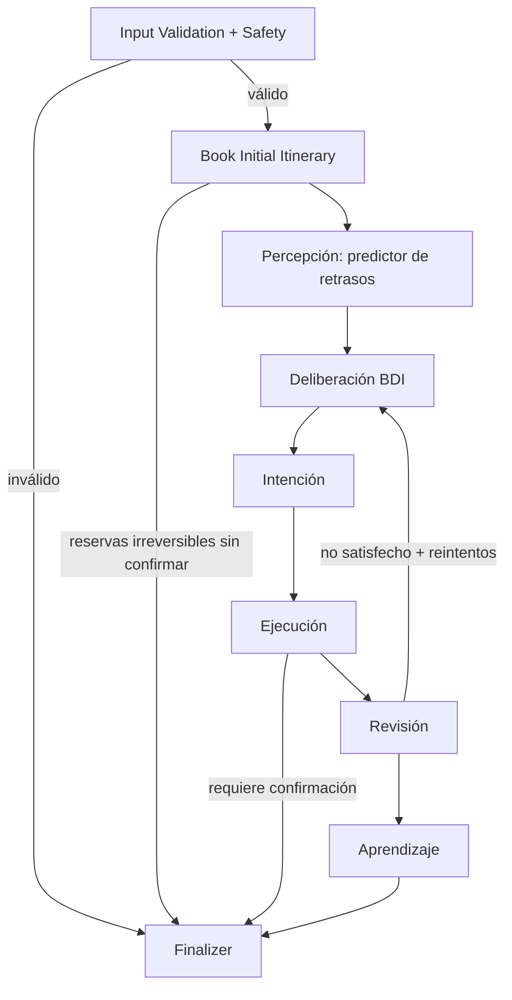

# TomoIII
## AI-Native Operations & Agentic Patterns
### CASE: UC-260 - BDI Flight Agent

#### USO: . EXTERNO

---

## Descripción

UC-260 implementa un **agente BDI (Belief-Desire-Intention)** autónomo para la planificación y reactivación de viajes. El agente no solo planifica un itinerario: **piensa** sobre lo que cree que está pasando, **valora** qué objetivos están en riesgo y **se compromete** con acciones justificadas para recuperar la situación.

Se integra con un **predictor real de retrasos de vuelos** (`https://flight-delays-v10p.onrender.com/predict`) y reutiliza componentes probados de UC-259 (simulador de vuelos/hoteles, planificador y guardias de seguridad).

El agente evoluciona: almacena **experiencias** de cada decisión, de modo que aprende qué aerolíneas/rutas tienen menor confiabilidad y ajusta su nivel de alerta en futuras deliberaciones.

---

## Arquitectura



### Ciclo BDI

| Fase | Responsabilidad |
|---|---|
| **Belief (Creencia)** | El agente observa el mundo: consulta el predictor de retrasos, el estado de reservas y eventos. |
| **Desire (Deseo)** | Define metas: llegar a tiempo, evitar retrasos, mantener presupuesto, viajar cómodo. |
| **Intention (Intención)** | Formula un plan justificado para resolver conflictos entre creencias y deseos. |
| **Ejecución** | Reemite vuelos, reagenda reuniones, reduce costos o escala a humanos. |
| **Revisión** | Verifica si los deseos quedaron satisfechos. Si no, vuelve a deliberar. |
| **Aprendizaje** | Registra experiencias para mejorar decisiones futuras. |

### Evolución del agente

- Cada acción BDI se convierte en una `Experience` con contexto, resultado y utilidad.
- En la deliberación se calcula una **confiabilidad histórica** por aerolínea a partir de las experiencias previas.
- Una aerolínea con experiencias negativas eleva la probabilidad efectiva de retraso, activando antes el autocorrector.

---

## Estructura del proyecto

| Archivo / Directorio | Responsabilidad |
|---|---|
| `UC-260.py` | CLI: `plan`, `predict`, `simulate`, `serve`. |
| `config.py` | Variables de entorno y configuración centralizada. |
| `models.py` | `Belief`, `Desire`, `Intention`, `Experience`, `FlightPlanRequest`. |
| `state.py` | Esquema `BDIState` del grafo LangGraph. |
| `safety.py` | Guardias contra *prompt injection*, PII y acciones irreversibles. |
| `external_api.py` | Cliente robusto del predictor de retrasos con fallback. |
| `world_simulator.py` | Simulación de vuelos, hoteles, clima y eventos (reutilizado/adaptado de UC-259). |
| `planner.py` | Construcción proactiva del itinerario (reutilizado/adaptado de UC-259). |
| `bdi_nodes.py` | Nodos BDI: percepción, deliberación, intención, ejecución, revisión, aprendizaje. |
| `graph.py` | Compilación del grafo y función `run_agent`. |
| `api.py` | API REST Flask con card views de entrada/salida. |
| `tests/` | Tests unitarios e integración con pytest. |
| `requirements.txt` | Dependencias versionadas. |

---

## Dependencias

```bash
cd /Users/utron/Documents/code-books/TomoIII/UC-260/code
python -m pip install -r requirements.txt
```

Contenido de `requirements.txt`:

```text
langgraph==1.0.10
langchain-core==1.2.10
pydantic>=2.7.4
Flask==3.0.3
requests==2.32.2
pytest==8.2.1
```

---

## Variables de entorno

| Variable | Default | Descripción |
|---|---|---|
| `UC260_WORLD_SEED` | `42` | Semilla del simulador externo. |
| `UC260_SIMULATED_LATENCY_MS` | `50` | Latencia simulada de APIs. |
| `UC260_RANDOM_EVENT_PROB` | `0.0` | Probabilidad de eventos aleatorios. |
| `UC260_MAX_RETRIES` | `3` | Reintentos del ciclo BDI. |
| `UC260_MAX_ITERATIONS` | `50` | Límite de recursión del grafo. |
| `UC260_PREDICTOR_URL` | `https://flight-delays-v10p.onrender.com/predict` | URL del predictor. |
| `UC260_PREDICTOR_TIMEOUT` | `10` | Timeout en segundos. |
| `UC260_HIGH_DELAY_THRESHOLD` | `0.5` | Umbral para considerar un retraso grave. |
| `UC260_REQUIRE_CONFIRMATION_IRREVERSIBLE` | `true` | Confirmación antes de reservas. |
| `UC260_ENABLE_PROMPT_INJECTION_CHECK` | `true` | Detección de *jailbreak*. |
| `UC260_ENABLE_PII_REDACTION` | `true` | Redacción de PII. |
| `UC260_ENABLE_LEARNING` | `true` | Aprendizaje por experiencias. |
| `UC260_PORT` | `5260` | Puerto de la API. |

---

## CLI

### Planificar un viaje

```bash
python UC-260.py plan \
  --origin Madrid \
  --destination Barcelona \
  --departure-date 2026-09-15 \
  --return-date 2026-09-17 \
  --travelers 1 \
  --budget 2000 \
  --currency USD \
  --meeting-time 15:00 \
  --direct-flight \
  --confirm
```

- Sin `--confirm` el agente se detiene en `awaiting_confirmation` antes de reservas irreversibles.
- Con `--confirm` el agente puede reservar y reemisiones automáticas.

### Consultar el predictor de retrasos directamente

```bash
python UC-260.py predict \
  --flight "OPERA=AA,TIPOVUELO=I,MES=4,DIA=20,DIANOM=Lunes,SIGLAORI=BOG,SIGLAPOS=SCL,NROVUELO=123,CLASEVUELO=Y,TIPOPLANO=B738"
```

### Inyectar un evento externo

```bash
python UC-260.py simulate \
  --item-id FL-MADBAR-103 \
  --event-type DELAYED \
  --delay-minutes 180 \
  --reason "Mantenimiento de motor"
```

### Servidor API Flask

```bash
python UC-260.py serve --port 5260
```

---

## API REST

### Endpoints

| Método | Endpoint | Descripción |
|---|---|---|
| `GET` | `/health` | Liveness/readiness. |
| `GET` | `/api/v1/schema` | Card views de entrada y salida. |
| `POST` | `/api/v1/agent/plan` | Ejecuta el agente BDI completo. |
| `POST` | `/api/v1/predict` | Consulta directa al predictor de retrasos. |
| `POST` | `/api/v1/simulate/event` | Inyecta un evento en el simulador. |
| `GET` | `/api/v1/agent/last_trace` | Última traza ejecutada. |

### Card view de entrada — `POST /api/v1/agent/plan`

```json
{
  "endpoint": "POST /api/v1/agent/plan",
  "description": "Ejecuta el agente BDI de planificación de viajes. El agente predice retrasos, delibera, forma intenciones, ejecuta, revisa y aprende.",
  "parameters": [
    {"name": "origin", "type": "string", "required": true, "example": "Madrid"},
    {"name": "destination", "type": "string", "required": true, "example": "Barcelona"},
    {"name": "departure_date", "type": "string (YYYY-MM-DD)", "required": true, "example": "2026-09-15"},
    {"name": "return_date", "type": "string", "required": false, "example": "2026-09-17"},
    {"name": "travelers", "type": "integer", "required": false, "default": 1, "example": 2},
    {"name": "budget", "type": "number", "required": false, "example": 2000},
    {"name": "currency", "type": "string", "required": false, "default": "USD", "example": "EUR"},
    {"name": "preferences", "type": "object", "required": false, "example": {"seat":"window","direct_flight":true,"optimize_for":"cheapest","hotel_stars":4,"meeting_time":"15:00","meeting_buffer_minutes":120}},
    {"name": "constraints", "type": "list[string]", "required": false, "example": ["max_layover_hours=3"]},
    {"name": "confirm_irreversible", "type": "boolean", "required": false, "default": false, "description": "Permite reservas irreversibles"},
    {"name": "predict_delays", "type": "boolean", "required": false, "default": true, "description": "Consultar predictor de retrasos"},
    {"name": "enable_learning", "type": "boolean", "required": false, "default": true, "description": "Habilitar memoria de experiencias"},
    {"name": "recursion_limit", "type": "integer", "required": false, "default": 50}
  ]
}
```

### Card view de salida — `POST /api/v1/agent/plan`

```json
{
  "endpoint": "POST /api/v1/agent/plan",
  "description": "Resultado BDI con itinerario, creencias, deseos, intenciones, experiencias y traza.",
  "fields": [
    {"name": "request_id", "type": "string"},
    {"name": "status", "type": "string", "enum": ["done", "awaiting_confirmation", "awaiting_input", "failed"]},
    {"name": "itinerary", "type": "list[object]"},
    {"name": "total_cost", "type": "number"},
    {"name": "currency", "type": "string"},
    {"name": "beliefs", "type": "list[object]"},
    {"name": "desires", "type": "list[object]"},
    {"name": "intentions", "type": "list[object]"},
    {"name": "experiences", "type": "list[object]"},
    {"name": "reflections", "type": "list[string]"},
    {"name": "safety_flags", "type": "list[string]"},
    {"name": "missing_info", "type": "list[string]"},
    {"name": "requires_confirmation", "type": "boolean"},
    {"name": "retry_count", "type": "integer"}
  ]
}
```

### Ejemplos `curl`

```bash
# Planificar viaje con confirmación
curl -X POST http://localhost:5260/api/v1/agent/plan \
  -H "Content-Type: application/json" \
  -d '{
    "origin": "Madrid",
    "destination": "Barcelona",
    "departure_date": "2026-09-15",
    "return_date": "2026-09-17",
    "travelers": 1,
    "budget": 2000,
    "confirm_irreversible": true,
    "preferences": {"meeting_time":"15:00","direct_flight":true}
  }'

# Consultar predictor de retrasos
curl -X POST http://localhost:5260/api/v1/predict \
  -H "Content-Type: application/json" \
  -d '{
    "flights": [{
      "OPERA": "AA",
      "TIPOVUELO": "I",
      "MES": 4,
      "DIA": 20,
      "DIANOM": "Lunes",
      "SIGLAORI": "BOG",
      "SIGLAPOS": "SCL",
      "NROVUELO": "123",
      "CLASEVUELO": "Y",
      "TIPOPLANO": "B738"
    }]
  }'

# Ver schema de entrada/salida
curl http://localhost:5260/api/v1/schema
```

---

## Casos de uso cubiertos

- **Planificación proactiva** de vuelos, hoteles y reuniones.
- **Predicción de retrasos** mediante API externa; fallback determinista si la API falla.
- **Autocorrección BDI** ante retrasos: reemisión de vuelos, reagenda de reuniones y ajuste de hotel.
- **Gestión de presupuesto**: detección de sobrepaso y reducción de costos.
- **Confirmación de acciones irreversibles**: nunca reserva sin consentimiento explícito.
- **Seguridad**: detección de *prompt injection*, redacción de PII.
- **Aprendizaje experiencial**: memoria de resultados para ajustar confiabilidad de aerolíneas.
- **Manejo de errores**: entradas inválidas, APIs caídas, vuelos agotados, alternativas agotadas, máximo de reintentos.

---

## Criterios de evaluación

| Criterio | Objetivo v1 | Objetivo producción |
|---|---|---|
| Itinerario generado sin errores | ≥ 95% | ≥ 99% |
| Autocorrección ante retrasos simulados | Funciona en casos deterministas | Con APIs reales y retry exponencial |
| 0 ejecuciones irreversibles sin confirmación | 100% | 100% |
| Detección de *prompt injection* / PII | 100% | 100% |
| Cobertura de tests | ≥ 80% | ≥ 90% |
| Latencia API p95 | < 3 s (simulado + predictor) | < 1 s |

---

## Limitaciones y próximos pasos

- El predictor real actualmente puede tener alta latencia o caídas; el fallback garantiza continuidad.
- Las APIs externas son simuladas excepto el predictor de retrasos. Producción requerirá conectores reales.
- El aprendizaje es por experiencias locales. Para escalar, se puede persistir en una base de datos vectorial o grafo.
- No se integra un LLM real; las reflexiones son estructuradas y listas para ser enriquecidas con LLM.

---

## Validación

```bash
cd /Users/utron/Documents/code-books/TomoIII/UC-260/code
python -m compileall -q .
python -m pytest tests/ -q
```

Resultado esperado:

```text
18 passed
```

---

## Referencias

- Reutiliza y extiende componentes de UC-259 (`world_simulator.py`, `planner.py`, `safety.py`).
- API de predicción de retrasos: `POST https://flight-delays-v10p.onrender.com/predict`.
- Inspirado en arquitecturas BDI y el motor cíclico de LangGraph.
