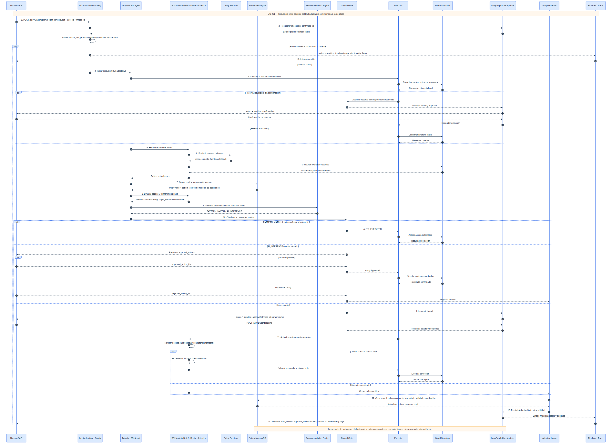
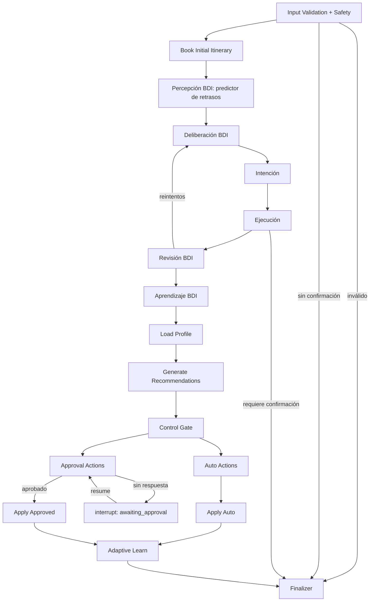
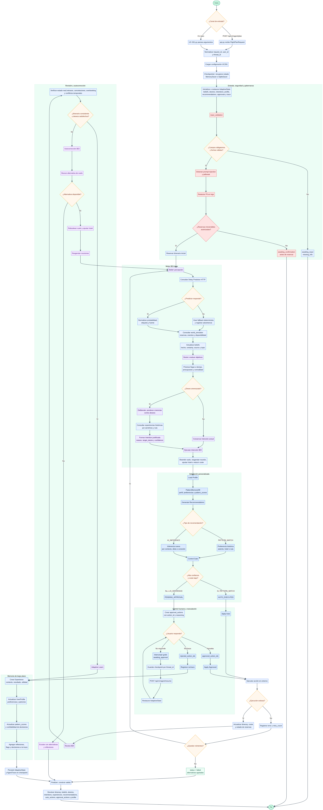

# TomoIII
## AI-Native Operations & Agentic Patterns
### CASE: UC-261 - Adaptive BDI Flight Agent

#### USO: . EXTERNO

---

## Descripción

UC-261 evoluciona los agentes de UC-259 y UC-260 hacia un **agente BDI adaptativo con memoria a largo plazo**.

El sistema no solo planifica viajes y reacciona ante retrasos: **aprende de cada interacción**, construye un **perfil de usuario** con patrones históricos y decide, mediante un **Control Gate**, qué acciones puede ejecutar en silencio y cuáles debe presentar para aprobación humana.

Además, integra el **checkpointer de LangGraph** (`MemorySaver` en memoria o `SqliteSaver` persistente) para que el estado de la sesión sobreviva entre llamadas a la API, permitiendo reanudar flujos interrumpidos por aprobaciones pendientes.

Características clave:

- **BDI base**: creencias, deseos e intenciones para planificación y autocorrección (heredado de UC-260).
- **Predictor de retrasos real**: integración con `https://flight-delays-v10p.onrender.com/predict` con fallback.
- **Memoria de patrones**: perfil de usuario, puntuación de patrones e historial de decisiones (`PatternMemoryDB`).
- **Control Gate**: separa acciones `PATTERN_MATCH` (auto-ejecutables) de `AI_INFERENCE` (requieren aprobación).
- **Aprendizaje**: las aprobaciones/rechazos actualizan el modelo mental del agente para futuras ejecuciones.
- **Checkpointer LangGraph**: persistencia de estado por `thread_id` con reanudación mediante `/api/v1/agent/resume`.
- **API REST**: endpoints para planificar, reanudar, consultar perfil y ver traza.

Dimensión	UC-259	UC-260	UC-261	UC-262
Paradigma	Reactivo cíclico	BDI	BDI + adaptativo	Orquestador multi-agente: agentes especializados BDI negocian, consensúan y aprenden de feedback humano.
Modelo mental	Sin modelo	Belief/Desire/Intention/Experience	UserProfile, Recommendation, PatternMemoryDB	AgentPool, Policy, Consensus, AuditTrail + modelo de recompensa compartido.
Estado del grafo	AgentState	BDIState	AdaptiveState	MultiAgentState (estado por agente + estado global del orquestador).
Percepción	Eventos simulados	Predictor de retrasos + fallback	Predictor + perfil histórico	Fuentes paralelas: precios, clima, calendario, preferencias sociales.
Toma de decisiones	Eventos → corrector	Deliberación BDI	Control Gate	Orquestador negocia intenciones y vota/merge según utilidad y riesgo.
Justificación	Reflexiones	reasoning + target_desire	reason + source_type + confidence	AuditTrail con trazabilidad multi-agente.
Aprendizaje	Ninguno	Experiencias por aerolínea	pattern_scores + aprobaciones/rechazos	RLHF: políticas compartidas entre agentes.
Memoria	Ejecución actual	Experiencias	Perfil + checkpoints LangGraph	Memoria compartida episódica/semántica/procedimental + vector store.
Control del usuario	Confirmación por acción	Confirmación global	Confirmación granular + interrupción	Aprobaciones selectivas, veto global, auditoría colectiva, explicabilidad.
Personalización	Preferencias de request	Preferencias + experiencias	Perfil evolutivo	Perfiles + contexto + políticas globales ajustadas por feedback colectivo.
Escalabilidad real	APIs simuladas	Predictor real	SQLite/Postgres + vector store	Agentes como servicios distribuidos, bus de eventos, observabilidad.
---

## Arquitectura




### Flujo de decisión adaptativo

1. **BDI base** genera y corrige el itinerario.
2. **Load profile** recupera preferencias y patrones aprendidos.
3. **Recommendations** propone acciones personalizadas:
   - `PATTERN_MATCH`: basadas en preferencias históricas (asiento, cadena hotelera).
   - `AI_INFERENCE`: inferencias nuevas (helicóptero por hora punta, restaurante por dieta).
4. **Control Gate** clasifica cada recomendación:
   - `PATTERN_MATCH` de alta confianza y bajo coste -> `AUTO_EXECUTED`.
   - `AI_INFERENCE` o coste elevado -> `PENDING_APPROVAL`.
5. **Approval handler** interrumpe el grafo si el usuario no ha respondido.
6. **`/api/v1/agent/resume`** actualiza el checkpoint con los IDs aprobados/rechazados y continúa el grafo.
7. **Adaptive learn** registra el resultado y actualiza el perfil para el futuro.

---

## Estructura del proyecto

| Archivo / Directorio | Responsabilidad |
|---|---|
| `UC-261.py` | CLI: `plan`, `profile`, `serve`. |
| `config.py` | Variables de entorno y configuración. |
| `models.py` | `Belief`, `Desire`, `Intention`, `Experience`, `UserProfile`, `Recommendation`, `FlightPlanRequest`. |
| `state.py` | Esquema `AdaptiveState` del grafo LangGraph. |
| `memory.py` | `PatternMemoryDB`: memoria a largo plazo de perfiles y patrones. |
| `safety.py` | Guardias de prompt injection, PII y acciones irreversibles. |
| `external_api.py` | Cliente del predictor de retrasos con fallback. |
| `world_simulator.py` | Simulación de vuelos, hoteles, clima y eventos. |
| `planner.py` | Construcción proactiva del itinerario. |
| `bdi_nodes.py` | Nodos BDI base: planificación y autocorrección. |
| `adaptive_nodes.py` | Nodos adaptativos: perfil, control gate, aprendizaje, interrupción por aprobación. |
| `graph.py` | Grafo LangGraph integrado, checkpointer, `run_agent`, `run_agent_threaded`, `resume_agent_threaded`. |
| `api.py` | API REST Flask con card views y endpoint `/resume`. |
| `tests/` | Tests unitarios e integración, incluyendo persistencia por thread. |
| `requirements.txt` | Dependencias. |

---

## Dependencias

```bash
cd /Users/utron/Documents/code-books/TomoIII/UC-261/code
python -m pip install -r requirements.txt
```

```text
langgraph==1.0.10
langchain-core==1.2.10
langgraph-checkpoint-sqlite>=3.1.1
pydantic>=2.7.4
Flask==3.0.3
requests==2.32.2
pytest==8.2.1
```

---

## Variables de entorno

| Variable | Default | Descripción |
|---|---|---|
| `UC261_WORLD_SEED` | `42` | Semilla del simulador. |
| `UC261_SIMULATED_LATENCY_MS` | `0` | Latencia simulada. |
| `UC261_MAX_RETRIES` | `3` | Reintentos BDI. |
| `UC261_PREDICTOR_URL` | `https://flight-delays-v10p.onrender.com/predict` | Predictor de retrasos. |
| `UC261_PREDICTOR_TIMEOUT` | `10` | Timeout del predictor. |
| `UC261_PATTERN_MATCH_THRESHOLD` | `0.6` | Umbral para auto-aprobar por patrón. |
| `UC261_AUTO_COST_THRESHOLD` | `200.0` | Coste máximo para auto-ejecución. |
| `UC261_REQUIRE_CONFIRMATION_IRREVERSIBLE` | `true` | Confirmación antes de reservas. |
| `UC261_ENABLE_LEARNING` | `true` | Aprendizaje activado. |
| `UC261_MEMORY_PATH` | `""` | Ruta a JSONL de perfiles (vacío = memoria). |
| `UC261_CHECKPOINT_PATH` | `""` | Ruta a SQLite para checkpointer persistente (vacío = MemorySaver). |
| `UC261_USE_MEMORY_CHECKPOINTER` | `true` | Usar MemorySaver si no hay `CHECKPOINT_PATH`. |
| `UC261_PORT` | `5261` | Puerto de la API. |

---

## CLI

```bash
# Planificar un viaje con confirmación y aprobación automática (demo)
python UC-261.py plan \
  --origin Madrid \
  --destination Barcelona \
  --departure-date 2026-09-15 \
  --return-date 2026-09-17 \
  --travelers 1 \
  --budget 2000 \
  --currency USD \
  --user-id demo-user \
  --seat window \
  --dietary vegetarian \
  --confirm \
  --auto-approve-all

# Consultar perfil aprendido
python UC-261.py profile --user-id demo-user

# Servidor Flask
python UC-261.py serve --port 5261
```

---

## API REST


### Endpoints

| Método | Endpoint | Descripción |
|---|---|---|
| `GET` | `/health` | Liveness/readiness. |
| `GET` | `/api/v1/schema` | Card views de entrada y salida. |
| `POST` | `/api/v1/agent/plan` | Ejecuta el agente BDI adaptativo. Soporta `thread_id` para persistencia. |
| `POST` | `/api/v1/agent/resume` | Reanuda un thread interrumpido por aprobaciones pendientes. |
| `GET` | `/api/v1/profile/<user_id>` | Consulta perfil y patrones aprendidos. |
| `GET` | `/api/v1/agent/last_trace` | Última traza ejecutada. |

### Card view de entrada — `POST /api/v1/agent/plan`

```json
{
  "endpoint": "POST /api/v1/agent/plan",
  "description": "Ejecuta el agente BDI adaptativo con planificación, predicción de retrasos, recomendaciones personales y aprendizaje. El estado se persiste si se incluye thread_id.",
  "parameters": [
    {"name": "origin", "type": "string", "required": true, "example": "Madrid"},
    {"name": "destination", "type": "string", "required": true, "example": "Barcelona"},
    {"name": "departure_date", "type": "string (YYYY-MM-DD)", "required": true, "example": "2026-09-15"},
    {"name": "return_date", "type": "string", "required": false, "example": "2026-09-17"},
    {"name": "travelers", "type": "integer", "required": false, "default": 1},
    {"name": "budget", "type": "number", "required": false, "example": 2000},
    {"name": "currency", "type": "string", "required": false, "default": "USD"},
    {"name": "user_id", "type": "string", "required": false, "default": "anonymous"},
    {"name": "thread_id", "type": "string", "required": false, "description": "Identificador de sesión persistente. Si no se envía se genera uno nuevo.", "example": "sess-abc123"},
    {"name": "preferences", "type": "object", "required": false, "example": {"seat":"window","hotel_chain":"Marriott","dietary":"vegetarian","meeting_time":"15:00"}},
    {"name": "constraints", "type": "list[string]", "required": false},
    {"name": "confirm_irreversible", "type": "boolean", "required": false, "default": false, "description": "Permite reservas irreversibles"},
    {"name": "predict_delays", "type": "boolean", "required": false, "default": true},
    {"name": "enable_learning", "type": "boolean", "required": false, "default": true},
    {"name": "auto_approve_all", "type": "boolean", "required": false, "default": false, "description": "Auto-aprobar todas las recomendaciones (demo)"},
    {"name": "approved_action_ids", "type": "list[string]", "required": false, "description": "IDs pre-aprobados (útil sin /resume)"},
    {"name": "rejected_action_ids", "type": "list[string]", "required": false, "description": "IDs rechazados"},
    {"name": "recursion_limit", "type": "integer", "required": false, "default": 50}
  ]
}
```

### Card view de entrada — `POST /api/v1/agent/resume`

```json
{
  "endpoint": "POST /api/v1/agent/resume",
  "description": "Reanuda un thread previamente pausado por un approval gate. Requiere el thread_id devuelto por /plan.",
  "parameters": [
    {"name": "thread_id", "type": "string", "required": true},
    {"name": "approved_action_ids", "type": "list[string]", "required": false, "default": []},
    {"name": "rejected_action_ids", "type": "list[string]", "required": false, "default": []}
  ]
}
```

### Card view de salida — `POST /api/v1/agent/plan` y `POST /api/v1/agent/resume`

```json
{
  "endpoint": "POST /api/v1/agent/plan / POST /api/v1/agent/resume",
  "description": "Resultado del agente adaptativo BDI con itinerario, recomendaciones, acciones automáticas, pendientes de aprobación y perfil actualizado.",
  "fields": [
    {"name": "request_id", "type": "string"},
    {"name": "user_id", "type": "string"},
    {"name": "thread_id", "type": "string"},
    {"name": "status", "type": "string", "enum": ["done", "awaiting_confirmation", "awaiting_approval", "awaiting_input", "failed"]},
    {"name": "itinerary", "type": "list[object]"},
    {"name": "total_cost", "type": "number"},
    {"name": "currency", "type": "string"},
    {"name": "beliefs", "type": "list[object]"},
    {"name": "desires", "type": "list[object]"},
    {"name": "intentions", "type": "list[object]"},
    {"name": "experiences", "type": "list[object]"},
    {"name": "recommendations", "type": "list[object]"},
    {"name": "auto_actions", "type": "list[object]"},
    {"name": "approval_actions", "type": "list[object]"},
    {"name": "profile", "type": "object"},
    {"name": "reflections", "type": "list[string]"},
    {"name": "safety_flags", "type": "list[string]"},
    {"name": "missing_info", "type": "list[string]"},
    {"name": "requires_confirmation", "type": "boolean"},
    {"name": "retry_count", "type": "integer"}
  ]
}
```

### Ejemplos `curl`

```bash
# 1. Planificar viaje (persistiendo en thread "demo-thread")
curl -X POST http://localhost:5261/api/v1/agent/plan \
  -H "Content-Type: application/json" \
  -d '{
    "origin": "Madrid",
    "destination": "Barcelona",
    "departure_date": "2026-09-15",
    "return_date": "2026-09-17",
    "travelers": 1,
    "budget": 2000,
    "confirm_irreversible": true,
    "user_id": "demo-user",
    "thread_id": "demo-thread",
    "preferences": {"seat":"window","dietary":"vegetarian"}
  }'
# Posible respuesta: status "awaiting_approval" con approval_actions.

# 2. Reanudar el thread aprobando todas las recomendaciones pendientes
APPROVED_IDS=$(curl -s -X POST http://localhost:5261/api/v1/agent/plan ... | jq -r '.data.approval_actions[].action_id')
curl -X POST http://localhost:5261/api/v1/agent/resume \
  -H "Content-Type: application/json" \
  -d "{\"thread_id\":\"demo-thread\",\"approved_action_ids\":[$(printf '%s\n' $APPROVED_IDS | jq -R . | jq -s . | jq -c .)]}"

# 3. Consultar perfil aprendido
curl http://localhost:5261/api/v1/profile/demo-user
```

### Persistencia real

Por defecto la API usa `MemorySaver`, lo que significa que los checkpoints sobreviven **dentro del proceso** pero no entre reinicios. Para persistencia real entre reinicios:

```bash
export UC261_CHECKPOINT_PATH="/tmp/uc261_checkpoint.db"
python UC-261.py serve --port 5261
```

Esto activa `SqliteSaver` y el estado de cada `thread_id` se guarda en SQLite.

---

## Validación

```bash
cd /Users/utron/Documents/code-books/TomoIII/UC-261/code
python -m compileall -q .
python -m pytest tests/ -q
```

Resultado esperado:

```text
20 passed
```

---




# Comparativo técnico: UC-259, UC-260, UC-261 y UC-262


| Dimensión | UC-259 (Reactivo LangGraph) | UC-260 (BDI) | UC-261 (BDI Adaptativo) | UC-262 (Multi-Agente BDI + RLHF) |
|---|---|---|---|---|---|
| **Paradigma** | Grafo cíclico reactivo: plan -> ejecuta -> monitor -> corrige. | Agente BDI con estados mentales explícitos. | Agente BDI + capa adaptativa + checkpointer LangGraph. | Orquestador multi-agente: agentes especializados BDI negocian, consensúan y aprenden de feedback humano. |
| **Modelo mental** | No existe. Estados son itinerary, logs y reflections. | `Belief`, `Desire`, `Intention`, `Experience`. | Añade `UserProfile`, `Recommendation` y `PatternMemoryDB`. | Añade `AgentPool`, `Policy`, `Consensus`, `AuditTrail` y modelo de recompensa compartido. |
| **Estado del grafo** | `AgentState`. | `BDIState`. | `AdaptiveState` (BDI + perfil, recomendaciones, acciones). | `MultiAgentState` (estados de cada agente + estado global del orquestador). |
| **Percepción** | Eventos simulados por `WorldSimulator.inject_event`. | Predictor HTTP de retrasos + fallback. | Hereda predictor + perfil histórico del usuario. | Múltiples fuentes en paralelo: predictor, precios, clima, calendario, preferencias sociales. |
| **Toma de decisiones** | Monitor detecta evento y salta al corrector. | Deliberación explícita sobre deseos amenazados. | Control Gate: separa `PATTERN_MATCH` (auto) de `AI_INFERENCE` (aprobación). | Orquestador negocia intenciones entre agentes; vota/merge propuestas según utilidad y riesgo. |
| **Justificación** | Reflexiones estructuradas. | Cada `Intention` incluye `reasoning` y `target_desire`. | Cada `Recommendation` incluye `reason`, `source_type` y `confidence`. | `AuditTrail` explica decisiones individuales y colectivas; trazabilidad multi-agente. |
| **Aprendizaje** | Ninguno. | `Experience` afecta confiabilidad de aerolíneas. | `UserProfile` con `pattern_scores` e historial; aprende de aprobaciones/rechazos. | RLHF / aprendizaje por refuerzo con feedback humano; políticas compartidas entre agentes. |
| **Memoria** | Solo estado de ejecución actual. | Experiencias dentro de la ejecución. | Memoria persistente (`PatternMemoryDB`) + checkpoints LangGraph por `thread_id`. | Memoria compartida entre agentes (episódica, semántica, procedimental) + vector store. |
| **Control del usuario** | Confirmación por acción irreversible. | Confirmación global antes de reservas. | Confirmación granular por recomendación + auto-ejecución de patrones + interrupción del grafo. | Aprobaciones selectivas, veto global, auditoría de decisiones colectivas y explicabilidad. |
| **Personalización** | Preferencias de request. | Preferencias + experiencias. | Perfil de usuario aprendido que evoluciona. | Perfiles de usuario + perfiles de contexto + políticas globales ajustadas por feedback colectivo. |
| **Escalabilidad real** | APIs simuladas. | Predictor real, resto simulado. | Perfil persistible + checkpoints SQLite/Postgres, listo para base de datos/vector store. | Arquitectura distribuible: agentes especializados como servicios, bus de eventos, observabilidad. |

### Evolución por capas

1. **UC-259** demuestra que un grafo cíclico puede autocorregir un itinerario ante retrasos.
2. **UC-260** añade una capa cognitiva BDI: el agente razona sobre qué cree, qué quiere y qué se propone hacer.
3. **UC-261** añade una capa adaptativa y persistente: el agente **recuerda** al usuario, **propone** mejoras, **aprende** de sus decisiones y puede **reanudar** la ejecución donde la dejó, balanceando autonomía y control.
4. **UC-262** escala hacia un **sistema multi-agente**: varios agentes especializados (vuelos, hoteles, presupuesto, seguridad, concierge) deliberan bajo un orquestador, consensúan planes, aprenden de retroalimentación humana mediante RLHF y dejan una **trazabilidad auditada** de cada decisión colectiva.

---

## Limitaciones y próximos pasos

- La memoria de patrones es in-memory o JSONL local. Producción requiere PostgreSQL/Mongo/vector store.
- Las recomendaciones son reglas. Se pueden enriquecer con un LLM que genere propuestas más sofisticadas.
- El feedback del usuario en `/resume` es síncrono. Una UI real podría usar webhooks o una cola de tareas.
- No se integran pagos reales; las reservas son simuladas excepto la consulta de retrasos.
- El checkpointer puede migrarse de `SqliteSaver` a `PostgresSaver` para alta disponibilidad.

---

## Referencias

- Reutiliza y extiende componentes de UC-259 (`world_simulator.py`, `planner.py`, `safety.py`).
- Reutiliza y extiende la arquitectura BDI de UC-260 (`external_api.py`, nodos de percepción/deliberación/ejecución).
- Checkpointer de LangGraph: `MemorySaver` / `SqliteSaver`.
- API de predicción de retrasos: `POST https://flight-delays-v10p.onrender.com/predict`.
