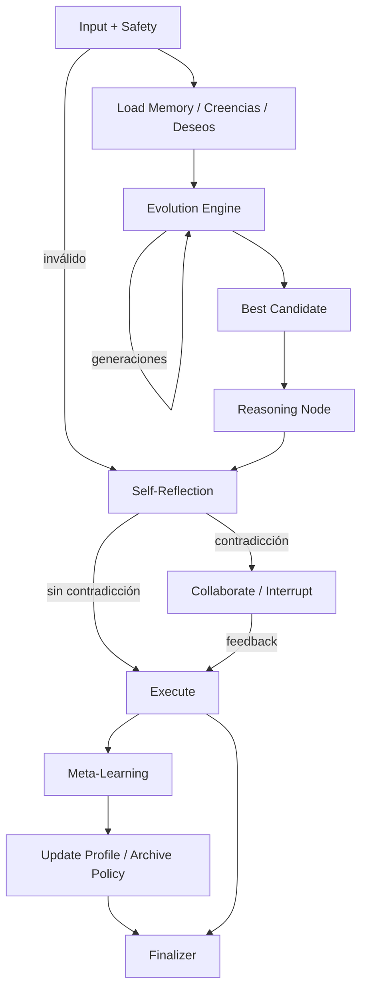

# TomoIII
## AI-Native Operations & Agentic Patterns
### CASE: UC-262 - IA Genérica (Generic AI) con razonamiento, autorreflexión y evolución multi-agente

#### USO: . EXTERNO

---

## Descripción

UC-262 representa el siguiente nivel de madurez después de UC-259 (reactivo), UC-260 (BDI) y UC-261 (BDI adaptativo con memoria persistente). En lugar de un único agente planificador, construimos un **sistema multi-agente genérico** que:

- Mantiene un **modelo mental a largo plazo** del usuario (perfil, reglas aprendidas, objetivos, errores pasados).
- **Razona explícitamente** sobre sus propias decisiones (`reasoning_chain`).
- Se **autocorrige** mediante autorreflexión antes de ejecutar (`self_critique`).
- **Colabora** con el humano cuando detecta conflictos entre el plan y la memoria (`interrupt`).
- **Evoluciona** una población de agentes candidatos con distintos genomas de decisión, permitiendo que los mejores sobrevivan, se crucen y muten.
- **Aprende** de la retroalimentación humana y actualiza tanto reglas heurísticas como políticas (`meta-learning`).
- Deja una **traza de auditoría** (`audit_trail`) explicando cada decisión colectiva.

En resumen: **UC-262 es un Copiloto Cognitivo Evolutivo**. No solo actúa; duda, argumenta, negocia consigo mismo y con el usuario, y mejora continuamente.

---

## Arquitectura



### Componentes principales

| Componente | Responsabilidad |
|---|---|
| `LongTermMemory` | Perfil de usuario persistente, reglas aprendidas, errores pasados y políticas archivadas. |
| `PolicyGenome` | Pesos de decisión (`cost`, `time`, `comfort`, `loyalty`, `risk`) que definen la estrategia de un agente. |
| `EvolutionEngine` | Población, evaluación de fitness, selección elitista, culling, cruce y mutación. |
| `CognitiveNodes` | Nodos LangGraph: memoria, evolución, razonamiento, autorreflexión, colaboración, ejecución y meta-aprendizaje. |
| `SafetyGuard` | Detección de prompt injection, PII y acciones irreversibles. |
| `WorldSimulator` | Simulación determinista de vuelos y hoteles. |
| `FlightDelayPredictor` | Cliente del predictor de retrasos con fallback. |

### Flujo cognitivo

1. **Memoria**: carga el perfil del usuario y deriva creencias y deseos.
2. **Evolución**: genera una población de agentes con genomas aleatorios, los evalúa y evoluciona durante varias generaciones.
3. **Razonamiento**: el mejor candidato explica por qué seleccionó cada vuelo/hotel.
4. **Autorreflexión**: el sistema revisa si el plan contradice reglas aprendidas o objetivos de largo plazo.
5. **Colaboración**: si hay contradicción, el grafo se interrumpe y pide al usuario que elija una alternativa.
6. **Ejecución**: reserva los elementos confirmados.
7. **Meta-aprendizaje**: actualiza el perfil con nuevas reglas y archiva políticas exitosas.

---

## Estructura del proyecto

| Archivo | Responsabilidad |
|---|---|
| `UC-262.py` | CLI: `plan`, `memory`, `serve`. |
| `config.py` | Variables de entorno y configuración (`UC262_*`). |
| `models.py` | `TravelRequest`, `Belief`, `Desire`, `Intention`, `PolicyGenome`, `AgentCandidate`, `PlanEvaluation`, `UserProfile`, `Reflection`. |
| `state.py` | Esquema `GenericAIState` del grafo LangGraph. |
| `memory.py` | `LongTermMemory`: persistencia de perfiles en JSONL opcional. |
| `safety.py` | Guardias de seguridad. |
| `external_api.py` | Cliente del predictor de retrasos. |
| `world_simulator.py` | Simulador determinista de vuelos/hoteles. |
| `planner.py` | Generador de planes usando un genoma dado y reglas de memoria. |
| `evolution.py` | Motor evolutivo con población, evaluación, selección, cruce y mutación. |
| `cognitive_nodes.py` | Nodos del grafo genérico. |
| `graph.py` | Construcción y ejecución del grafo con checkpointer. |
| `api.py` | API REST Flask con card views. |
| `tests/` | Tests unitarios e integración. |

---

## Dependencias

```bash
cd /Users/utron/Documents/code-books/TomoIII/UC-262/code
python -m pip install -r requirements.txt
```

```text
langgraph==1.0.10
langchain-core==1.2.10
langgraph-checkpoint-sqlite>=3.1.1
pydantic>=2.7.4
Flask==3.0.3
requests==2.32.2
pytest==8.2.1
```

---

## Variables de entorno

| Variable | Default | Descripción |
|---|---|---|
| `UC262_WORLD_SEED` | `42` | Semilla del simulador. |
| `UC262_SIMULATED_LATENCY_MS` | `0` | Latencia simulada. |
| `UC262_PREDICTOR_URL` | `https://flight-delays-v10p.onrender.com/predict` | Predictor de retrasos. |
| `UC262_PREDICTOR_TIMEOUT` | `10` | Timeout del predictor. |
| `UC262_MEMORY_PATH` | `""` | Ruta JSONL de perfiles (vacío = memoria). |
| `UC262_CHECKPOINT_PATH` | `""` | Ruta SQLite para checkpointer persistente. |
| `UC262_POPULATION_SIZE` | `12` | Tamaño de la población evolutiva. |
| `UC262_GENERATIONS` | `5` | Generaciones de evolución. |
| `UC262_ELITE_RATIO` | `0.25` | Fracción de élites que sobreviven directamente. |
| `UC262_CULL_RATIO` | `0.3` | Fracción de peores agentes eliminados por generación. |
| `UC262_MUTATION_RATE` | `0.2` | Tasa base de mutación. |
| `UC262_PORT` | `5262` | Puerto de la API. |

---

## CLI

```bash
# Ejecutar el copiloto genérico con confirmación
python UC-262.py plan \
  --origin Madrid \
  --destination Barcelona \
  --departure-date 2026-09-15 \
  --return-date 2026-09-17 \
  --travelers 1 \
  --budget 2000 \
  --currency USD \
  --user-id demo-generic-user \
  --airline Delta \
  --goals "Mantener estatus Platino" \
  --confirm

# Consultar memoria a largo plazo
python UC-262.py memory --user-id demo-generic-user

# Servidor Flask
python UC-262.py serve --port 5262
```

---

## API REST

### Endpoints

| Método | Endpoint | Descripción |
|---|---|---|
| `GET` | `/health` | Liveness/readiness. |
| `GET` | `/api/v1/schema` | Card views de entrada y salida. |
| `POST` | `/api/v1/generic/plan` | Ejecuta el copiloto genérico evolutivo. |
| `POST` | `/api/v1/generic/resume` | Reanuda un thread interrumpido por colaboración. |
| `GET` | `/api/v1/memory/<user_id>` | Consulta el perfil/memoria del usuario. |
| `GET` | `/api/v1/generic/last_trace` | Última traza ejecutada. |

### Card view de entrada — `POST /api/v1/generic/plan`

```json
{
  "endpoint": "POST /api/v1/generic/plan",
  "description": "Ejecuta el copiloto genérico evolutivo: memoria a largo plazo, evolución de agentes, razonamiento, autorreflexión, colaboración y meta-aprendizaje.",
  "parameters": [
    {"name": "origin", "type": "string", "required": true},
    {"name": "destination", "type": "string", "required": true},
    {"name": "departure_date", "type": "string (YYYY-MM-DD)", "required": true},
    {"name": "return_date", "type": "string", "required": false},
    {"name": "travelers", "type": "integer", "required": false, "default": 1},
    {"name": "budget", "type": "number", "required": false},
    {"name": "currency", "type": "string", "required": false, "default": "USD"},
    {"name": "user_id", "type": "string", "required": false, "default": "anonymous"},
    {"name": "thread_id", "type": "string", "required": false, "description": "Sesión persistente para colaboración"},
    {"name": "preferences", "type": "object", "required": false, "example": {"airline": "Delta", "seat": "aisle"}},
    {"name": "constraints", "type": "list[string]", "required": false},
    {"name": "long_term_goals", "type": "list[string]", "required": false, "example": ["Mantener estatus Platino"]},
    {"name": "confirm_irreversible", "type": "boolean", "required": false, "default": false},
    {"name": "enable_learning", "type": "boolean", "required": false, "default": true},
    {"name": "human_feedback", "type": "string", "required": false, "description": "Feedback previo"},
    {"name": "approved_alternative", "type": "string", "required": false, "description": "ID de alternativa aprobada"}
  ]
}
```

### Card view de salida — `POST /api/v1/generic/plan`

```json
{
  "endpoint": "POST /api/v1/generic/plan",
  "description": "Resultado del copiloto genérico con itinerario, mejor agente, estadísticas de evolución y traza de auditoría.",
  "fields": [
    {"name": "request_id", "type": "string"},
    {"name": "user_id", "type": "string"},
    {"name": "thread_id", "type": "string"},
    {"name": "status", "type": "string", "enum": ["done", "awaiting_input", "awaiting_confirmation", "awaiting_collaboration"]},
    {"name": "itinerary", "type": "list[object]"},
    {"name": "total_cost", "type": "number"},
    {"name": "currency", "type": "string"},
    {"name": "best_candidate", "type": "object"},
    {"name": "evolution_stats", "type": "object"},
    {"name": "memory_context", "type": "object"},
    {"name": "reasoning_chain", "type": "list[string]"},
    {"name": "self_critique", "type": "string"},
    {"name": "reflections", "type": "list[object]"},
    {"name": "beliefs", "type": "list[object]"},
    {"name": "desires", "type": "list[object]"},
    {"name": "intentions", "type": "list[object]"},
    {"name": "audit_trail", "type": "list[object]"},
    {"name": "safety_flags", "type": "list[string]"},
    {"name": "missing_info", "type": "list[string]"},
    {"name": "requires_confirmation", "type": "boolean"}
  ]
}
```

### Ejemplos `curl`

```bash
# 1. Ejecutar plan genérico
curl -X POST http://localhost:5262/api/v1/generic/plan \
  -H "Content-Type: application/json" \
  -d '{
    "origin": "Madrid",
    "destination": "Barcelona",
    "departure_date": "2026-09-15",
    "return_date": "2026-09-17",
    "travelers": 1,
    "budget": 2000,
    "confirm_irreversible": true,
    "user_id": "generic-demo",
    "thread_id": "generic-thread-01",
    "preferences": {"airline": "Delta"},
    "long_term_goals": ["Mantener estatus Platino"]
  }'

# 2. Reanudar después de una colaboración pendiente
curl -X POST http://localhost:5262/api/v1/generic/resume \
  -H "Content-Type: application/json" \
  -d '{
    "thread_id": "generic-thread-01",
    "human_feedback": "Prefiero la opción segura aunque salga más temprano",
    "approved_alternative": "re_evolve_safe"
  }'

# 3. Consultar memoria del usuario
curl http://localhost:5262/api/v1/memory/generic-demo
```

---

## Validación

```bash
cd /Users/utron/Documents/code-books/TomoIII/UC-262/code
python -m compileall -q .
python -m pytest tests/ -q
```

Resultado esperado:

```text
11 passed
```

---

# Relación con UC-259, UC-260 y UC-261

UC-262 **reutiliza y extiende** los componentes de los casos anteriores:

- De **UC-259** hereda el simulador de vuelos/hoteles (`world_simulator.py`), el planificador base y la idea de grafo cíclico.
- De **UC-260** hereda la arquitectura BDI (`Belief`, `Desire`, `Intention`) y el cliente del predictor de retrasos.
- De **UC-261** hereda la memoria persistente (`LongTermMemory`/`PatternMemoryDB` concept), el `Control Gate` y el uso del checkpointer de LangGraph para reanudar sesiones.

La diferencia clave es que UC-261 es un **único agente adaptativo** con un solo genoma de decisión, mientras que UC-262 es una **población de agentes** que evolucionan. UC-261 aprende de aprobaciones/rechazos; UC-262 añade **evolución de políticas**, **autorreflexión crítica** y **colaboración consciente de sus propias limitaciones**.

# Comparativo técnico: UC-259, UC-260, UC-261 y UC-262

| Dimensión | UC-259 (Reactivo LangGraph) | UC-260 (BDI) | UC-261 (BDI Adaptativo) | UC-262 (Multi-Agente BDI + RLHF) |
|---|---|---|---|---|
| **Paradigma** | Grafo cíclico reactivo: plan -> ejecuta -> monitor -> corrige. | Agente BDI con estados mentales explícitos. | Agente BDI + capa adaptativa + checkpointer LangGraph. | Orquestador multi-agente: agentes especializados BDI negocian, consensúan y aprenden de feedback humano. |
| **Modelo mental** | No existe. Estados son itinerary, logs y reflections. | `Belief`, `Desire`, `Intention`, `Experience`. | Añade `UserProfile`, `Recommendation` y `PatternMemoryDB`. | Añade `AgentPool`, `Policy`, `Consensus`, `AuditTrail` y modelo de recompensa compartido. |
| **Estado del grafo** | `AgentState`. | `BDIState`. | `AdaptiveState` (BDI + perfil, recomendaciones, acciones). | `MultiAgentState` (estados de cada agente + estado global del orquestador). |
| **Percepción** | Eventos simulados por `WorldSimulator.inject_event`. | Predictor HTTP de retrasos + fallback. | Hereda predictor + perfil histórico del usuario. | Múltiples fuentes en paralelo: predictor, precios, clima, calendario, preferencias sociales. |
| **Toma de decisiones** | Monitor detecta evento y salta al corrector. | Deliberación explícita sobre deseos amenazados. | Control Gate: separa `PATTERN_MATCH` (auto) de `AI_INFERENCE` (aprobación). | Orquestador negocia intenciones entre agentes; vota/merge propuestas según utilidad y riesgo. |
| **Justificación** | Reflexiones estructuradas. | Cada `Intention` incluye `reasoning` y `target_desire`. | Cada `Recommendation` incluye `reason`, `source_type` y `confidence`. | `AuditTrail` explica decisiones individuales y colectivas; trazabilidad multi-agente. |
| **Aprendizaje** | Ninguno. | `Experience` afecta confiabilidad de aerolíneas. | `UserProfile` con `pattern_scores` e historial; aprende de aprobaciones/rechazos. | RLHF / aprendizaje por refuerzo con feedback humano; políticas compartidas entre agentes. |
| **Memoria** | Solo estado de ejecución actual. | Experiencias dentro de la ejecución. | Memoria persistente (`PatternMemoryDB`) + checkpoints LangGraph por `thread_id`. | Memoria compartida entre agentes (episódica, semántica, procedimental) + vector store. |
| **Control del usuario** | Confirmación por acción irreversible. | Confirmación global antes de reservas. | Confirmación granular por recomendación + auto-ejecución de patrones + interrupción del grafo. | Aprobaciones selectivas, veto global, auditoría de decisiones colectivas y explicabilidad. |
| **Personalización** | Preferencias de request. | Preferencias + experiencias. | Perfil de usuario aprendido que evoluciona. | Perfiles de usuario + perfiles de contexto + políticas globales ajustadas por feedback colectivo. |
| **Escalabilidad real** | APIs simuladas. | Predictor real, resto simulado. | Perfil persistible + checkpoints SQLite/Postgres, listo para base de datos/vector store. | Arquitectura distribuible: agentes especializados como servicios, bus de eventos, observabilidad. |

### Evolución por capas

1. **UC-259**: un grafo cíclico reacciona ante retrasos.
2. **UC-260**: el agente razona con BDI.
3. **UC-261**: el agente aprende del usuario y persiste su memoria.
4. **UC-262**: una **población de agentes evoluciona** bajo un orquestador, se autorreflexiona y **colabora** con el humano cuando no está seguro, mejorando continuamente mediante RLHF.

---

## Limitaciones y próximos pasos

- Las recomendaciones y evolución usan reglas/heurísticas; se puede reemplazar por LLMs generativos para propuestas más naturales.
- La persistencia es JSONL o SQLite local. Producción requiere PostgreSQL/Redis/vector store.
- El feedback es síncrono. Un entorno real usaría webhooks o una cola de tareas para reanudar threads.
- No se integran pagos reales.
- El aprendizaje por refuerzo es regla-basado; se puede extender con algoritmos de RL clásicos (PPO, DQN) sobre el espacio de genomas.

---

## Referencias

- Reutiliza y extiende componentes de UC-259 (`world_simulator.py`, `planner.py`, `safety.py`).
- Reutiliza y extiende la arquitectura BDI de UC-260 (`external_api.py`, modelos BDI).
- Reutiliza y extiende la memoria y el checkpointer de UC-261 (`memory.py`, `PatternMemoryDB` conceptual, LangGraph checkpointer).
- API de predicción de retrasos: `POST https://flight-delays-v10p.onrender.com/predict`.
