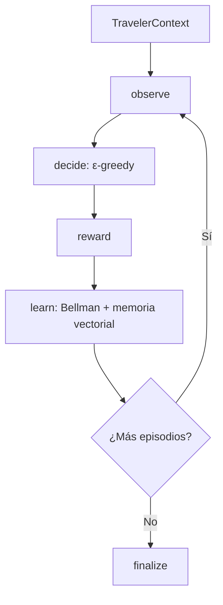
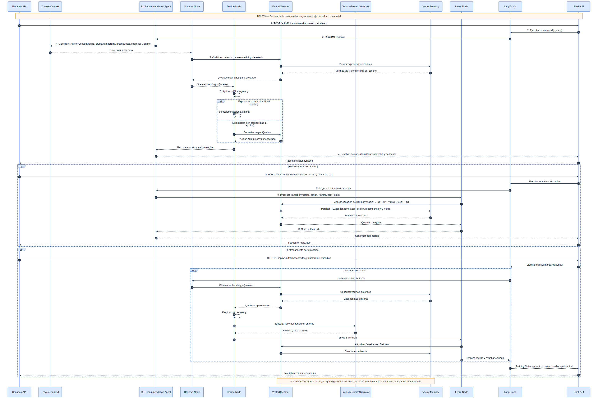
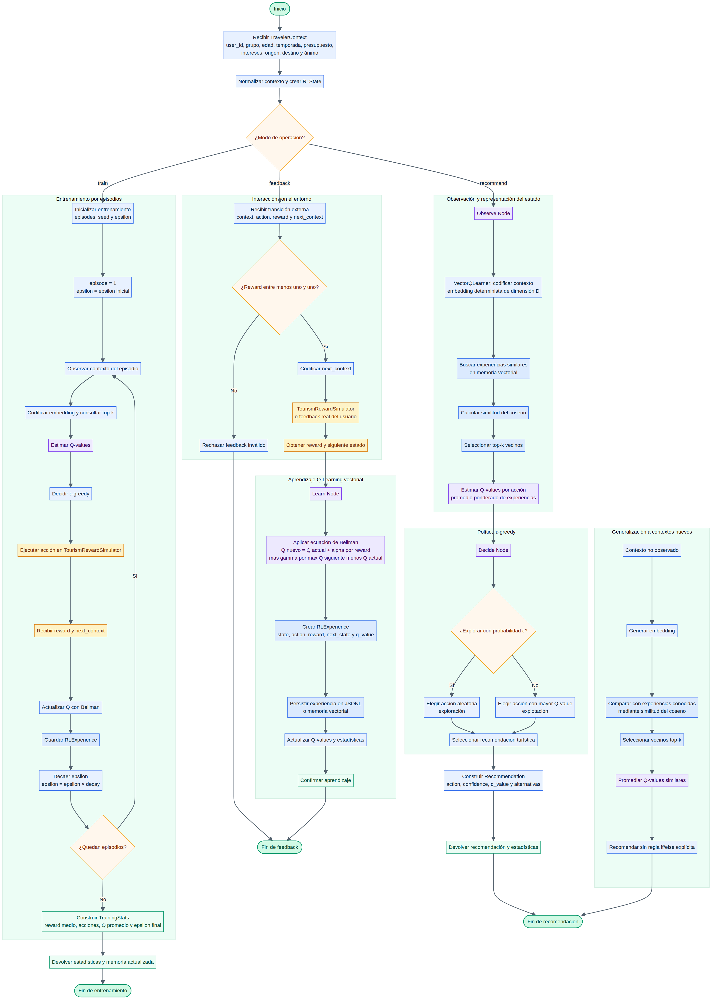

# TomoIII
## AI-Native Operations & Agentic Patterns
### CASE: UC-263 - Agente de recomendaciones turísticas con Q-Learning vectorial y RL

#### USO: . EXTERNO

---

## Descripción

UC-263 implementa un **agente de recomendación turística que aprende por sí solo** mediante **Aprendizaje por Refuerzo (RL)** y **memoria vectorial**. A diferencia de un sistema de reglas (`if familia then aventura`), este agente:

- **Explora** acciones al azar con probabilidad `epsilon` (épsilon-greedy).
- **Recibe recompensas** del entorno (o del usuario real) por cada recomendación.
- **Actualiza Q-values** con la **ecuación de Bellman**.
- **Generaliza** a turistas nunca vistos usando **similitud del coseno** sobre embeddings de estado.
- **Persiste** su memoria de experiencias en disco (JSONL opcional).

El objetivo es demostrar que los agentes pueden **aprender comportamientos en lugar de ser programados explícitamente**, adaptándose a cambios en las preferencias turísticas sin modificar su código.

---

## Arquitectura



### Flujo de aprendizaje

1. **Observar**: codificar el contexto del turista (edad, grupo, temporada, presupuesto, intereses, ánimo) en un vector de estado.
2. **Decidir**: elegir una recomendación usando **épsilon-greedy**.
   - Con probabilidad `epsilon`: explorar (acción aleatoria).
   - Con probabilidad `1 - epsilon`: explotar (mayor Q-value).
3. **Recompensa**: el entorno/devolución del usuario devuelve un valor en `[-1, 1]`.
4. **Aprender**: aplicar la ecuación de Bellman y almacenar la experiencia `(estado, acción, recompensa, Q-value)`.
5. **Generalizar**: ante un contexto nuevo, estimar el Q-value promediando los valores de experiencias similares (top-k por coseno).

### Componentes clave

| Componente | Responsabilidad |
|---|---|
| `VectorQLearner` | Memoria vectorial de experiencias, embeddings deterministas, similitud del coseno, ecuación de Bellman. |
| `TourismRewardSimulator` | Simula recompensas del entorno para que el agente aprenda patrones sin `if/else` de recomendación. |
| `RLNodes` | Nodos LangGraph: observar, decidir, recompensar, aprender, avanzar episodio. |
| `Graph` | `recommend()` para una recomendación y `train()` para entrenamiento por lotes. |
| `API Flask` | Endpoints REST con card views. |
| `UC-263.py` | CLI para recomendar, entrenar y servir. |

---

## Estructura del proyecto

| Archivo | Responsabilidad |
|---|---|
| `UC-263.py` | CLI: `recommend`, `train`, `serve`. |
| `config.py` | Variables de entorno `UC263_*`. |
| `models.py` | `TravelerContext`, `RLExperience`, `Recommendation`, `TrainingStats`. |
| `state.py` | Esquema `RLState` del grafo LangGraph. |
| `vector_q_learner.py` | Motor de Q-Learning vectorial con persistencia. |
| `environment.py` | Simulador de recompensas turísticas. |
| `nodes.py` | Nodos del grafo RL. |
| `graph.py` | Construcción del grafo y helpers `recommend`/`train`. |
| `api.py` | API Flask con card views. |
| `tests/` | Tests unitarios e integración. |

---

## Dependencias

```bash
cd /Users/utron/Documents/code-books/TomoIII/UC-263/code
python -m pip install -r requirements.txt
```

```text
langgraph==1.0.10
langchain-core==1.2.10
numpy>=1.26.0
scikit-learn>=1.5.0
pydantic>=2.7.4
Flask==3.0.3
requests==2.32.2
pytest==8.2.1
```

---

## Variables de entorno

| Variable | Default | Descripción |
|---|---|---|
| `UC263_SEED` | `42` | Semilla para reproducibilidad. |
| `UC263_MEMORY_PATH` | `""` | Ruta JSONL para persistir experiencias. |
| `UC263_EMBEDDING_DIM` | `16` | Dimensión del embedding de estado. |
| `UC263_ALPHA` | `0.2` | Tasa de aprendizaje (`α`). |
| `UC263_GAMMA` | `0.9` | Factor de descuento (`γ`). |
| `UC263_EPSILON` | `0.3` | Probabilidad de exploración inicial. |
| `UC263_EPSILON_DECAY` | `0.98` | Decaimiento de `epsilon` por episodio. |
| `UC263_EPISODES` | `50` | Episodios de entrenamiento por defecto. |
| `UC263_K_NEIGHBORS` | `5` | Vecinos más similares para estimar Q. |
| `UC263_PORT` | `5263` | Puerto de la API. |

---

## CLI

```bash
# Recomendar una actividad para un contexto de viajero
python UC-263.py recommend \
  --group-type family \
  --age-group adult \
  --season summer \
  --budget-level medium \
  --interests fun \
  --mood relaxed

# Entrenar el agente con contextos de ejemplo
python UC-263.py train --episodes 50

# Servidor Flask
python UC-263.py serve --port 5263
```

---

## API REST

### Endpoints

| Método | Endpoint | Descripción |
|---|---|---|
| `GET` | `/health` | Estado del servicio. |
| `GET` | `/api/v1/schema` | Card views de entrada y salida. |
| `POST` | `/api/v1/rl/recommend` | Recomienda una actividad para un contexto. |
| `POST` | `/api/v1/rl/feedback` | Recibe recompensa real y actualiza Q-values. |
| `POST` | `/api/v1/rl/train` | Entrena el agente con múltiples contextos. |
| `GET` | `/api/v1/rl/memory` | Estadísticas de la memoria vectorial. |

### Card view de entrada — `POST /api/v1/rl/recommend`

```json
{
  "endpoint": "POST /api/v1/rl/recommend",
  "description": "Obtiene una recomendación turística para un contexto de viajero usando Q-Learning vectorial.",
  "parameters": [
    {"name": "user_id", "type": "string", "required": false, "default": "anonymous"},
    {"name": "age_group", "type": "string", "required": false, "default": "adult", "example": "child, teen, adult, senior"},
    {"name": "group_type", "type": "string", "required": false, "default": "solo", "description": "solo, couple, family, friends"},
    {"name": "season", "type": "string", "required": false, "default": "summer"},
    {"name": "budget_level", "type": "string", "required": false, "default": "medium", "description": "low, medium, high"},
    {"name": "interests", "type": "list[string]", "required": false, "example": ["culture", "food", "adventure"]},
    {"name": "origin", "type": "string", "required": false},
    {"name": "destination", "type": "string", "required": false},
    {"name": "mood", "type": "string", "required": false, "example": "curious"}
  ]
}
```

### Card view de entrada — `POST /api/v1/rl/feedback`

```json
{
  "endpoint": "POST /api/v1/rl/feedback",
  "description": "Registra una recompensa real del usuario para actualizar la memoria vectorial.",
  "parameters": [
    {"name": "user_id", "type": "string", "required": false, "default": "anonymous"},
    {"name": "context", "type": "object", "required": true, "description": "Mismo formato que /recommend"},
    {"name": "action", "type": "string", "required": true},
    {"name": "reward", "type": "number", "required": true, "description": "Valor en [-1, 1]"},
    {"name": "next_context", "type": "object", "required": false}
  ]
}
```

### Card view de entrada — `POST /api/v1/rl/train`

```json
{
  "endpoint": "POST /api/v1/rl/train",
  "description": "Entrena el agente RL con un conjunto de contextos de ejemplo durante N episodios.",
  "parameters": [
    {"name": "contexts", "type": "list[object]", "required": true},
    {"name": "episodes", "type": "integer", "required": false, "default": 50}
  ]
}
```

### Card view de salida — `POST /api/v1/rl/recommend`

```json
{
  "endpoint": "POST /api/v1/rl/recommend",
  "description": "Recomendación generada con Q-value, confianza y alternativas ordenadas.",
  "fields": [
    {"name": "context", "type": "object"},
    {"name": "state_description", "type": "string"},
    {"name": "last_action", "type": "string"},
    {"name": "last_reward", "type": "number"},
    {"name": "last_q_value", "type": "number"},
    {"name": "final_q_values", "type": "object"},
    {"name": "recommendations", "type": "list[object]"},
    {"name": "learner_stats", "type": "object"},
    {"name": "status", "type": "string"}
  ]
}
```

### Card view de salida — `POST /api/v1/rl/train`

```json
{
  "endpoint": "POST /api/v1/rl/train",
  "description": "Estadísticas de entrenamiento y memoria actualizada.",
  "fields": [
    {"name": "stats.episodes", "type": "integer"},
    {"name": "stats.total_reward", "type": "number"},
    {"name": "stats.avg_reward", "type": "number"},
    {"name": "stats.best_action_counts", "type": "object"},
    {"name": "stats.final_epsilon", "type": "number"},
    {"name": "learner_stats.experiences", "type": "integer"},
    {"name": "learner_stats.actions", "type": "list[string]"},
    {"name": "learner_stats.avg_q", "type": "number"},
    {"name": "status", "type": "string"}
  ]
}
```

### Ejemplos `curl`

```bash
# 1. Recomendar actividad
curl -X POST http://localhost:5263/api/v1/rl/recommend \
  -H "Content-Type: application/json" \
  -d '{
    "group_type": "family",
    "age_group": "adult",
    "season": "summer",
    "budget_level": "medium",
    "interests": ["fun"],
    "mood": "relaxed"
  }'

# 2. Enviar feedback real del usuario
curl -X POST http://localhost:5263/api/v1/rl/feedback \
  -H "Content-Type: application/json" \
  -d '{
    "context": {
      "group_type": "family",
      "age_group": "adult",
      "season": "summer",
      "budget_level": "medium",
      "interests": ["fun"],
      "mood": "relaxed"
    },
    "action": "Aventura",
    "reward": 1.0
  }'

# 3. Entrenar con contextos
curl -X POST http://localhost:5263/api/v1/rl/train \
  -H "Content-Type: application/json" \
  -d '{
    "contexts": [
      {"group_type":"solo","age_group":"adult","season":"winter","interests":["culture"],"mood":"curious"},
      {"group_type":"family","age_group":"adult","season":"summer","interests":["fun"],"mood":"relaxed"},
      {"group_type":"couple","age_group":"adult","season":"autumn","interests":["food"],"mood":"romantic"}
    ],
    "episodes": 20
  }'

# 4. Consultar memoria
curl http://localhost:5263/api/v1/rl/memory
```

---

## Validación

```bash
cd /Users/utron/Documents/code-books/TomoIII/UC-263/code
python -m compileall -q .
python -m pytest tests/ -q
```

Resultado esperado:

```text
14 passed
```

---

# Relación con UC-259, UC-260, UC-261 y UC-262

| Caso | Enfoque principal | Qué aporta |
|---|---|---|
| **UC-259** | Agente reactivo LangGraph | Grafo cíclico de percepción-acción-corrección. |
| **UC-260** | Agente BDI | Estados mentales explícitos (`Belief`, `Desire`, `Intention`). |
| **UC-261** | Agente BDI adaptativo con memoria persistente | Perfil de usuario, `Control Gate`, checkpointer LangGraph. |
| **UC-262** | Multi-agente evolutivo con autorreflexión | Población de agentes, selección/mutación, colaboración humana, `AuditTrail`. |
| **UC-263** | Agente RL con Q-Learning vectorial | Aprendizaje por refuerzo real, embeddings de estado, generalización por similitud del coseno, ε-greedy. |

### Diferencias clave con respecto a UC-262

- **UC-262** evoluciona una población de **genomas de decisión** mediante operadores genéticos; aprende cuál estrategia ponderada es mejor.
- **UC-263** aprende directamente los **Q-values de cada par estado-acción** mediante interacción con el entorno y recompensas, sin una población ni genoma explícito.
- En **UC-263** la recomendación no depende de reglas heurísticas ni de una deliberación simbólica; emerge de la **experiencia acumulada** y de la capacidad de **generalizar a estados similares**.
- La política de exploración es **ε-greedy** en lugar de mutación genética.

### Evolución por capas

1. **UC-259**: reacciona.
2. **UC-260**: razona intencionalmente.
3. **UC-261**: recuerda y adapta con reglas de usuario.
4. **UC-262**: evoluciona múltiples estrategias y colabora.
5. **UC-263**: aprende directamente de la experiencia mediante RL vectorial, sin reglas ni población.

# Comparativo técnico de la evolución del agente

| Dimensión | UC-259 | UC-260 | UC-261 | UC-262 | **UC-263** |
|---|---|---|---|---|---|
| **Paradigma** | Reactivo | BDI | BDI adaptativo | Multi-agente evolutivo | **Aprendizaje por refuerzo vectorial** |
| **Modelo mental** | Sin modelo | Beliefs / Desires / Intentions | Perfil + recomendaciones | AgentPool + Policy + AuditTrail | **Q-values + embeddings de estado** |
| **Toma de decisiones** | Evento -> corrección | Deliberación BDI | Control Gate (patrón vs inferencia) | Orquestador + votación | **ε-greedy sobre Q-values** |
| **Aprendizaje** | Ninguno | Experiencias por aerolínea | Pattern scores | RLHF + políticas compartidas | **Q-Learning aproximado con vectores** |
| **Memoria** | Estado actual | Experiencias en ejecución | Perfil + checkpoints | Memoria compartida multi-agente | **Memoria vectorial de experiencias (S, A, R, Q)** |
| **Exploración** | Ninguna | Reintentos BDI | Aprobación humana | Mutación de genomas | **Exploración ε-greedy** |
| **Generalización** | No | Reutiliza experiencias similares | Perfil de usuario | Políticas aprendidas | **Similitud del coseno entre embeddings** |
| **Resiliencia** | Baja | Media | Alta | Alta | **Muy alta: se reentrena con nuevas recompensas** |
| **Control humano** | Confirmación | Confirmación global | Aprobación granular | Colaboración + veto | **Feedback por recompensas** |
| **Escalabilidad real** | APIs simuladas | Predictor real | SQLite/Postgres | Sistema distribuido de agentes | **Vector store + feedback continuo** |

---

## Limitaciones y próximos pasos

- Los embeddings son deterministas por hash; en producción se reemplazarían por modelos de embeddings reales (`text-embedding-3`, etc.).
- La función de recompensa del ejemplo es simulada; en producción provendría de interacciones reales (clics, reservas, encuestas).
- Se puede extender a **Deep Q-Networks (DQN)** o **PPO** para espacios de acción más complejos.
- Persistencia en JSONL; producción requeriría vector store (Pinecone, Weaviate, pgvector) para búsqueda eficiente de vecinos.

---

## Referencias

- Reutiliza conceptos de UC-259/260/261/262 sobre viajes y agentes.
- Algoritmo base: **Q-Learning** con aproximación por **similitud del coseno**.
- Exploración: **ε-greedy** con decaimiento.
- Implementado con **LangGraph**, **NumPy**, **scikit-learn** y **Pydantic**.
