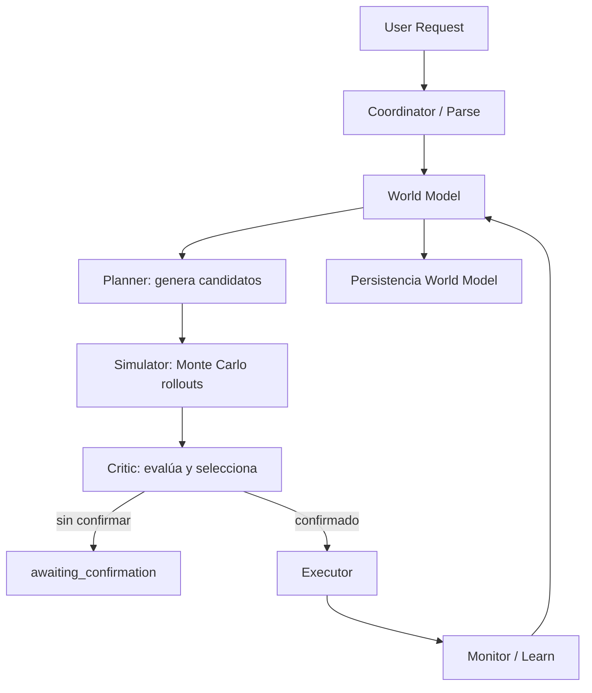

# TomoIII
## AI-Native Operations & Agentic Patterns
### CASE: UC-264 - Model-Based Multi-Agent Travel Planner

#### USO: . EXTERNO

---

## Descripción

UC-264 implementa un **agente basado en modelo** para planificación de viajes. A diferencia de los agentes *model-free* (que aprenden asociaciones directas acción-recompensa por ensayo y error), el agente basado en modelo **construye y mantiene un modelo interno del entorno de viajes**.

Esto le permite:

- **Simular** múltiples planes y ofertas antes de actuar.
- **Predecir** consecuencias (costo, riesgo, satisfacción, probabilidad de éxito).
- **Planificar con anticipación** evaluando muchas trayectorias posibles.
- **Aprender de ejecuciones reales** para refinar las predicciones del modelo.

La arquitectura se modela como un sistema multi-agente con roles especializados: **Coordinator**, **World Model**, **Simulator**, **Planner**, **Critic**, **Executor** y **Monitor**. Estos roles se mapean a capas conceptuales de Semantic Kernel (plugins/skills), MAF (multi-agent framework) y AutoGen (group chat), aunque la implementación concreta usa **LangGraph** + Python para garantizar reproducibilidad sin depender de servicios externos.

|Caso	|Tipo	|Diferencia |clave| 
|---|---|---|---|
|UC-259	|Reactivo	|Reacciona a eventos, sin modelo.|
|UC-260	|BDI	|Razona con creencias/deseos/intenciones.|
|UC-261	|BDI adaptativo	|Memoria persistente + Control Gate.|
|UC-262	|Multi-agente evolutivo	|Población de agentes + RLHF.|
|UC-263	|RL model-free	|Aprende Q-values sin modelo del entorno.|
|UC-264	|Model-based	|Construye un world model, simula planes antes de actuar y aprende transiciones.|
---

## Arquitectura



### Roles multi-agente

| Rol | Framework conceptual | Responsabilidad concreta |
|---|---|---|
| **Coordinator** | Semantic Kernel / MAF / AutoGen Manager | Recibe la solicitud, valida entrada, orquesta el flujo. |
| **Planner** | Semantic Kernel Planner Plugin | Genera planes diversos (optimista, conservador, balanceado, aleatorio). |
| **World Model** | MAF World Model Agent | Predice transiciones (estado, recompensa, probabilidad) y aprende de observaciones. |
| **Simulator** | MAF Simulator Agent | Ejecuta Monte Carlo sobre cada plan para estimar utilidad esperada y riesgo. |
| **Critic** | MAF Critic Agent | Ranquea planes y selecciona el mejor según utilidad, riesgo y alineación. |
| **Executor** | MAF Executor Agent | Reserva vuelos/hoteles en el simulador real. |
| **Monitor** | MAF Monitor Agent | Compara predicciones vs resultados reales y actualiza el world model. |

### World Model

El world model mantiene:

- **Estimaciones empíricas** de éxito/costo/recompensa por tipo de acción e item.
- **Historial de transiciones** `(s, a, s', r, p)`.
- Un **simulador físico** de vuelos/hoteles para predicciones deterministas + ruido.

Se actualiza con observaciones reales mediante aprendizaje incremental (`mean_reward = (1-α)·old + α·new`).

### Planificación multi-plan

1. El **Planner** genera N planes candidatos con distintas estrategias.
2. El **Simulator** ejecuta `MC_SIMULATIONS_PER_PLAN` rollouts de cada plan.
3. El **Critic** calcula una puntuación final:
   `score = expected_utility - risk_aversion·risk + 0.5·alignment - budget_penalty`
4. Se selecciona el mejor plan.
5. Si no hay confirmación, se devuelve `awaiting_confirmation`; si la hay, se ejecuta.

---

## Estructura del proyecto

| Archivo | Responsabilidad |
|---|---|
| `UC-264.py` | CLI: `plan`, `serve`. |
| `config.py` | Variables de entorno `UC264_*`. |
| `models.py` | `TravelPlanRequest`, `PlanAction`, `WorldModelState`, `Transition`, `CandidatePlan`, `SimulationResult`, `PlanEvaluation`, `ExecutionResult`. |
| `state.py` | Esquema `ModelBasedState` del grafo LangGraph. |
| `travel_world.py` | Simulador determinista de vuelos, hoteles y clima (entorno físico). |
| `world_model.py` | World model interno: predicción de transiciones y aprendizaje empírico. |
| `planner.py` | Generación diversificada de planes candidatos. |
| `simulator.py` | Motor Monte Carlo de simulación multi-plan. |
| `critic.py` | Evaluación y selección del mejor plan. |
| `nodes.py` | Nodos LangGraph de cada rol multi-agente. |
| `graph.py` | Construcción y ejecución del grafo model-based. |
| `api.py` | API Flask con card views de entrada/salida. |
| `tests/` | Tests unitarios e integración. |

---

## Dependencias

```bash
cd /Users/utron/Documents/code-books/TomoIII/UC-264/code
python -m pip install -r requirements.txt
```

```text
langgraph==1.0.10
langchain-core==1.2.10
pydantic>=2.7.4
numpy>=1.26.0
Flask==3.0.3
requests==2.32.2
pytest==8.2.1
```

> **Nota**: Semantic Kernel, MAF y AutoGen se mencionan en la arquitectura conceptual. La implementación funcional usa LangGraph, pero los roles y flujos están diseñados para poder adaptarse a esos frameworks mediante plugins/agents equivalentes.

---

## Variables de entorno

| Variable | Default | Descripción |
|---|---|---|
| `UC264_WORLD_SEED` | `42` | Semilla del simulador. |
| `UC264_SIMULATED_LATENCY_MS` | `0` | Latencia simulada. |
| `UC264_PREDICTOR_URL` | `https://flight-delays-v10p.onrender.com/predict` | Predictor de retrasos. |
| `UC264_PREDICTOR_TIMEOUT` | `10` | Timeout del predictor. |
| `UC264_NUM_CANDIDATE_PLANS` | `16` | Número de planes candidatos. |
| `UC264_MC_SIMULATIONS_PER_PLAN` | `200` | Rollouts Monte Carlo por plan. |
| `UC264_MC_BUDGET_SAMPLES` | `50` | Muestras de presupuesto (reservado). |
| `UC264_HORIZON` | `5` | Horizonte de planificación. |
| `UC264_UCB_CONSTANT` | `1.414` | Constante UCB (reservado para MCTS). |
| `UC264_RISK_AVERSION` | `0.5` | Peso del riesgo en el score del crítico. |
| `UC264_COST_WEIGHT` | `0.3` | Peso del coste (reservado). |
| `UC264_TIME_WEIGHT` | `0.2` | Peso del tiempo (reservado). |
| `UC264_COMFORT_WEIGHT` | `0.2` | Peso del confort (reservado). |
| `UC264_SUCCESS_WEIGHT` | `0.3` | Peso del éxito (reservado). |
| `UC264_WORLD_MODEL_LR` | `0.2` | Tasa de aprendizaje del world model. |
| `UC264_REQUIRE_CONFIRMATION_IRREVERSIBLE` | `true` | Requerir confirmación antes de reservar. |
| `UC264_PORT` | `5264` | Puerto de la API. |

---

## CLI

```bash
# Planificar un viaje (sin ejecutar reservas)
python UC-264.py plan \
  --origin Madrid \
  --destination Barcelona \
  --departure-date 2026-09-15 \
  --return-date 2026-09-17 \
  --travelers 1 \
  --budget 2000 \
  --user-id demo-model-user \
  --airline Delta \
  --direct

# Planificar y ejecutar reservas
python UC-264.py plan \
  --origin Madrid --destination Barcelona \
  --departure-date 2026-09-15 --return-date 2026-09-17 \
  --budget 2000 --confirm

# Servidor Flask
python UC-264.py serve --port 5264
```

---

## API REST

### Endpoints

| Método | Endpoint | Descripción |
|---|---|---|
| `GET` | `/health` | Estado del servicio. |
| `GET` | `/api/v1/schema` | Card views de entrada y salida. |
| `POST` | `/api/v1/model/plan` | Genera, simula y selecciona el mejor plan. |
| `POST` | `/api/v1/model/execute` | Planifica con `confirm_irreversible=true` y ejecuta. |
| `POST` | `/api/v1/model/feedback` | Envía observación real para actualizar el world model. |
| `GET` | `/api/v1/model/world_model` | Devuelve el estado del world model. |
| `GET` | `/api/v1/model/last_trace` | Última traza ejecutada. |

### Card view de entrada — `POST /api/v1/model/plan`

```json
{
  "endpoint": "POST /api/v1/model/plan",
  "description": "Planifica un viaje generando múltiples planes, simulándolos con Monte Carlo y seleccionando el mejor según utilidad esperada y riesgo.",
  "parameters": [
    {"name": "origin", "type": "string", "required": true},
    {"name": "destination", "type": "string", "required": true},
    {"name": "departure_date", "type": "string (YYYY-MM-DD)", "required": true},
    {"name": "return_date", "type": "string", "required": false},
    {"name": "travelers", "type": "integer", "required": false, "default": 1},
    {"name": "budget", "type": "number", "required": false},
    {"name": "currency", "type": "string", "required": false, "default": "USD"},
    {"name": "user_id", "type": "string", "required": false, "default": "anonymous"},
    {"name": "preferences", "type": "object", "required": false, "example": {"airline": "Delta", "direct_only": true, "hotel_chain": "Marriott"}},
    {"name": "constraints", "type": "list[string]", "required": false},
    {"name": "confirm_irreversible", "type": "boolean", "required": false, "default": false, "description": "Autoriza reservas irreversibles"},
    {"name": "predict_delays", "type": "boolean", "required": false, "default": true}
  ]
}
```

### Card view de entrada — `POST /api/v1/model/feedback`

```json
{
  "endpoint": "POST /api/v1/model/feedback",
  "description": "Actualiza el world model con una observación real de ejecución.",
  "parameters": [
    {"name": "action_type", "type": "string", "required": true, "example": "flight"},
    {"name": "item_id", "type": "string", "required": true},
    {"name": "predicted_success_prob", "type": "number", "required": false, "default": 0.95},
    {"name": "actual_success", "type": "boolean", "required": true},
    {"name": "actual_cost", "type": "number", "required": true},
    {"name": "reward", "type": "number", "required": true}
  ]
}
```

### Card view de salida — `POST /api/v1/model/plan`

```json
{
  "endpoint": "POST /api/v1/model/plan",
  "description": "Resultado de la planificación basada en modelo: candidatos, simulaciones, plan seleccionado, ejecución y estado del world model.",
  "fields": [
    {"name": "request_id", "type": "string"},
    {"name": "user_id", "type": "string"},
    {"name": "status", "type": "string", "enum": ["done", "awaiting_input", "awaiting_confirmation", "failed"]},
    {"name": "selected_plan", "type": "object"},
    {"name": "candidates", "type": "list[object]"},
    {"name": "evaluations", "type": "list[object]"},
    {"name": "execution_result", "type": "object"},
    {"name": "world_model", "type": "object"},
    {"name": "reflections", "type": "list[object]"},
    {"name": "logs", "type": "list[object]"},
    {"name": "missing_info", "type": "list[string]"},
    {"name": "requires_confirmation", "type": "boolean"}
  ]
}
```

### Ejemplos `curl`

```bash
# 1. Generar y seleccionar un plan (sin ejecutar)
curl -X POST http://localhost:5264/api/v1/model/plan \
  -H "Content-Type: application/json" \
  -d '{
    "origin": "Madrid",
    "destination": "Barcelona",
    "departure_date": "2026-09-15",
    "return_date": "2026-09-17",
    "travelers": 1,
    "budget": 2000,
    "user_id": "model-demo",
    "preferences": {"airline": "Delta", "direct_only": true}
  }'

# 2. Ejecutar el mejor plan
curl -X POST http://localhost:5264/api/v1/model/execute \
  -H "Content-Type: application/json" \
  -d '{
    "origin": "Madrid",
    "destination": "Barcelona",
    "departure_date": "2026-09-15",
    "return_date": "2026-09-17",
    "budget": 2000,
    "confirm_irreversible": true
  }'

# 3. Enviar observación real para refinar el world model
curl -X POST http://localhost:5264/api/v1/model/feedback \
  -H "Content-Type: application/json" \
  -d '{
    "action_type": "flight",
    "item_id": "FL-MADBAR-100",
    "actual_success": false,
    "actual_cost": 150.0,
    "reward": -3.0
  }'

# 4. Consultar world model
curl http://localhost:5264/api/v1/model/world_model
```

---

## Validación

```bash
cd /Users/utron/Documents/code-books/TomoIII/UC-264/code
python -m compileall -q .
python -m pytest tests/ -q
```

Resultado esperado:

```text
15 passed
```

---

# Relación con UC-259, UC-260, UC-261, UC-262 y UC-263

| Caso | Tipo de agente | Enfoque principal | Diferencia con model-based |
|---|---|---|---|
| **UC-259** | Reactivo | Evento -> corrección | No tiene modelo interno; reacciona a cambios. |
| **UC-260** | BDI | Creencias, deseos, intenciones | Tiene estados mentales pero no simula futuro. |
| **UC-261** | BDI adaptativo | Memoria + Control Gate | Aprende del usuario pero no simula múltiples planes. |
| **UC-262** | Multi-agente evolutivo | Población + RLHF | Evoluciona estrategias, no un world model de transiciones. |
| **UC-263** | Model-free RL | Q-Learning vectorial | Aprende acción -> valor sin modelo del entorno. |
| **UC-264** | **Model-based** | **World model + simulación + planificación** | Construye un modelo interno, simula planes antes de actuar y lo refina con observaciones. |

### Model-Free vs Model-Based

- **Model-free** (UC-263): aprende `Q(s,a)` directamente. Útil cuando modelar el entorno es difícil.
- **Model-based** (UC-264): aprende `P(s',r|s,a)` y usa ese modelo para planificar. Más eficiente en muestras y permite anticiparse.

### Evolución por capas

1. **UC-259**: reacciona.
2. **UC-260**: razona con intenciones.
3. **UC-261**: recuerda y adapta.
4. **UC-262**: evoluciona y colabora.
5. **UC-263**: aprende por refuerzo sin modelo.
6. **UC-264**: **construye un world model, simula planes y actúa con anticipación**.

# Comparativo técnico de la evolución del agente

| Dimensión | UC-259 | UC-260 | UC-261 | UC-262 | UC-263 | **UC-264** |
|---|---|---|---|---|---|---|
| **Paradigma** | Reactivo | BDI | BDI adaptativo | Multi-agente evolutivo | RL model-free | **Model-based planning** |
| **Modelo del entorno** | Ninguno | Creencias estáticas | Perfil de usuario | Políticas aprendidas | Q-values | **World model con transiciones y recompensas** |
| **Planificación** | Sin planificación | Intenciones simples | Recomendaciones + gate | Consenso multi-agente | Política reactiva | **Simulación multi-plan + selección óptima** |
| **Decisión** | Regla de corrección | Deliberación BDI | Control Gate | Votación/negociación | ε-greedy Q | **Lookahead + Monte Carlo + crítico** |
| **Aprendizaje** | Ninguno | Experiencias por aerolínea | Pattern scores | RLHF + genomas | Q-Learning vectorial | **World model learning de transiciones** |
| **Memoria** | Estado actual | Experiencias | Perfil + checkpoints | Memoria compartida | Memoria vectorial de experiencias | **Estimaciones empíricas + historial de transiciones** |
| **Exploración** | Ninguna | Reintentos BDI | Aprobación humana | Mutación genética | ε-greedy | **Generación diversa de planes + MC rollouts** |
| **Resiliencia** | Baja | Media | Alta | Alta | Muy alta | **Muy alta: simula antes de actuar** |
| **Eficiencia en muestras** | N/A | Media | Media | Media | Baja-Media | **Alta: aprende modelo y planifica offline** |
| **Control humano** | Confirmación | Confirmación | Aprobación granular | Colaboración | Recompensas | **Confirmación antes de ejecución + feedback al world model** |
| **Escalabilidad real** | APIs simuladas | Predictor real | SQLite/Postgres | Sistema distribuido | Vector store + feedback | **World model escalable + simulador físico** |

---

## Limitaciones y próximos pasos

- El world model actual es híbrido: simulador determinista + estimaciones empíricas. Se puede reemplazar por modelos probabilísticos más sofisticados (redes neuronales, Gaussian processes).
- La planificación es greedy por estrategias; se puede extender a **MCTS** completo sobre el espacio de acciones.
- No se integran LLMs reales ni Semantic Kernel/AutoGen por defecto; la arquitectura está preparada para adaptadores.
- Persistencia JSONL; producción requeriría base de datos/vector store.

---

## Referencias

- Reutiliza simulador de vuelos/hoteles inspirado en UC-259/UC-261.
- Hereda conceptos BDI y memoria de UC-260/UC-261.
- Contrasta con RL model-free de UC-263.
- Implementado con **LangGraph**, **Pydantic**, **NumPy** y **Flask**.
