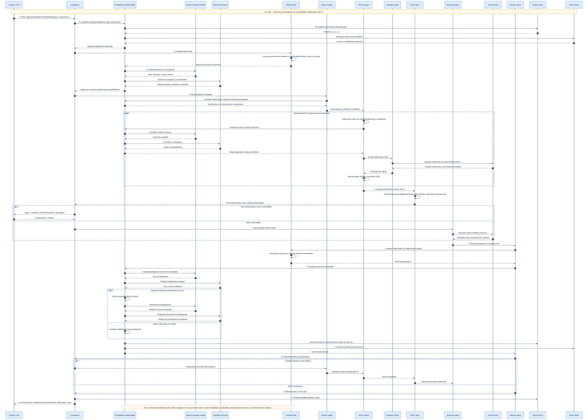
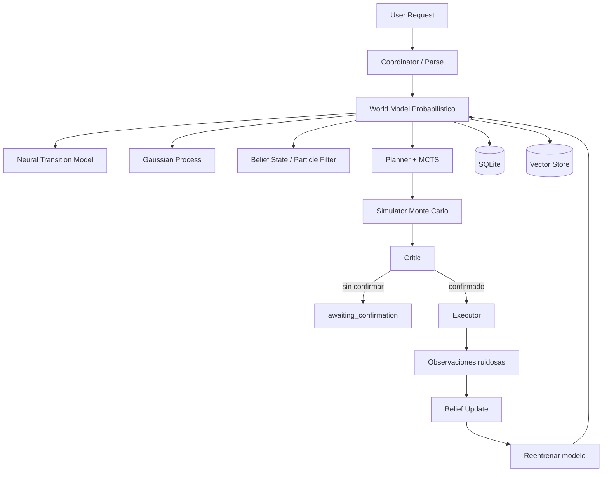
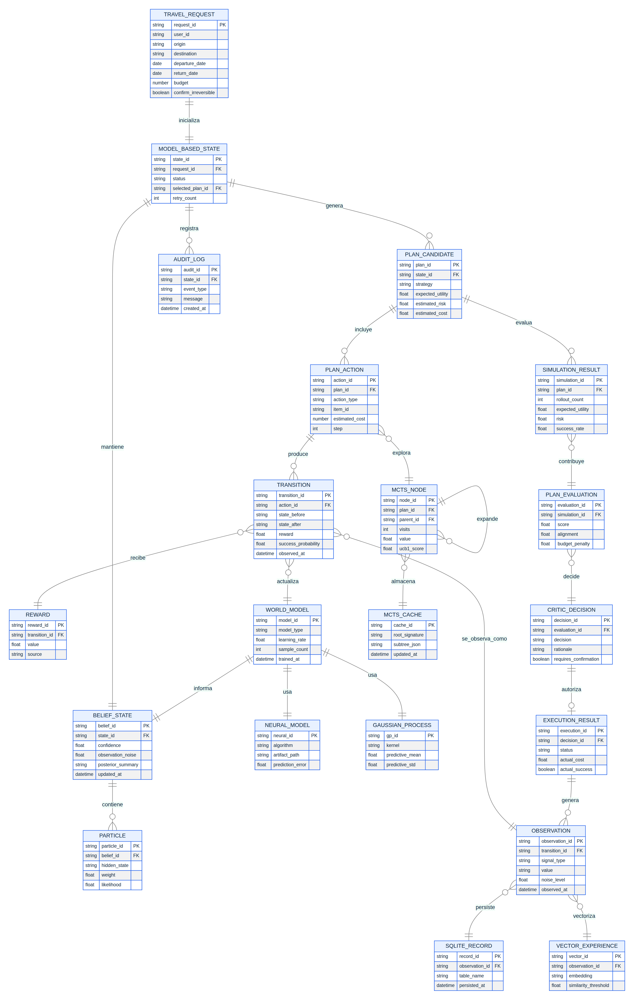
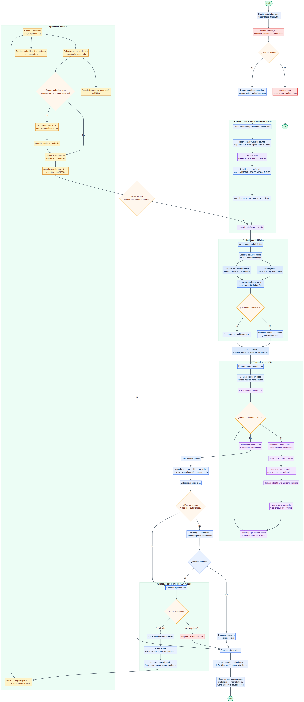

# TomoIII
## AI-Native Operations & Agentic Patterns
### CASE: UC-265 - World Model Probabilístico, MCTS y Entornos Parcialmente Observables

#### USO: . EXTERNO

---

## Descripción

UC-265 mejora el agente basado en modelo de **UC-264** reemplazando el híbrido determinista + empírico por **modelos probabilísticos más sofisticados** (redes neuronales y procesos Gaussianos), extendiendo la planificación a un **MCTS completo** sobre el espacio de acciones, y añadiendo persistencia en **SQLite y vector store**.

El objetivo es demostrar que en **entornos parcialmente observables** —donde el agente no ve todo el estado real (disponibilidad real, retrasos, clima, presión de mercado)— un **world model probabilístico** es crítico: no solo predice, sino que estima su propia incertidumbre y mantiene un **estado de creencia** (belief state) que se actualiza con observaciones ruidosas.

Diferencia clave con un modelo híbrido determinista:

- **Modelo determinista**: asume que si sabe el precio y la disponibilidad reportados, conoce el resultado.
- **Modelo probabilístico**: sabe que las observaciones tienen ruido, que las verdaderas variables están ocultas, y cuantifica la incertidumbre para tomar decisiones más robustas.



## 1. World model probabilístico (MLPRegressor + GaussianProcessRegressor)
Es la **parte del cerebro que predice resultados**. Antes el agente usaba reglas fijas; ahora usa dos modelos:
- **MLPRegressor** (una red neuronal): predice "si elijo este vuelo, ¿qué tan bueno será el resultado y cuánta recompensa obtengo?"
- **GaussianProcessRegressor**: además de predecir, dice **cuánta confianza tiene** en esa predicción (la "std" = desviación estándar). Si no está seguro, lo admite.

En simple: **una red neuronal adivina el resultado y un proceso gaussiano dice "estoy seguro al 80% o al 30%".**

## 2. Belief state con particle filter
Es **cómo el agente maneja lo que no puede ver**. El mundo tiene cosas ocultas (si el hotel está realmente disponible, el clima, la presión del mercado). Como no las ve directamente, mantiene una **creencia** (una lista de posibles estados, llamados "partículas") y la va **corrigiendo con cada observación ruidosa**.

En simple: **el agente no sabe la verdad, pero tiene muchas hipótesis y las va ajustando con lo que va viendo.** Es como adivinar si lloverá: empiezas con varias posibilidades y las actualizas al mirar el cielo.

## 3. MCTS completo con UCB1
Es **cómo el agente decide qué hacer**. MCTS (Monte Carlo Tree Search) explora las opciones como ramas de un árbol: vuelos, hoteles, actividades. **UCB1** es la regla que equilibra dos cosas: probar opciones que parecen buenas (explotar) y probar opciones poco exploradas (explorar).

En simple: **el agente "juega mentalmente" varias combinaciones y elige la más prometedora, sin descuidar opciones que aún no ha probado.**

## 4. Reentrenamiento continuo
Cada cierto número de observaciones (N), el agente **vuelve a entrenar sus modelos** con los datos nuevos.

En simple: **el cerebro se actualiza solo con la experiencia, en vez de quedarse con lo que aprendió al inicio.**

## 5. Persistencia (SQLite + vector store)
Es **la memoria a largo plazo**:
- **SQLite**: guarda las transiciones y observaciones (qué pasó, qué decidió, qué resultado obtuvo).
- **Vector store**: guarda experiencias similares para recuperarlas rápido cuando se enfrenta a una situación parecida.

En simple: **el agente recuerda todo lo que vivió y puede "acordarse" de experiencias parecidas cuando necesita decidir.**

## 6. Entornos parcialmente observables
Es la idea de fondo: **las observaciones tienen ruido y el agente nunca asume que conoce el estado real del mundo.** Siempre actúa con incertidumbre.

En simple: **el agente sabe que lo que ve puede estar distorsionado, así que nunca confía al 100% en lo que percibe.**

***

## La idea en una frase

Todos estos cambios juntos forman un agente que **no actúa a ciegas ni con reglas fijas**: predice resultados con confianza medida (1), maneja lo que no ve (2), decide explorando opciones (3), aprende de la experiencia (4), recuerda todo (5) y siempre asume que el mundo tiene ruido (6). Es como pasar de un agente "programado" a un agente "que aprende y se adapta".
---

## Arquitectura



### Componentes probabilísticos

| Componente | Tecnología | Función |
|---|---|---|
| **Neural Transition Model** | `MLPRegressor` (scikit-learn) | Predice probabilidad de éxito y recompensa esperada a partir de (estado, acción). |
| **Gaussian Process** | `GaussianProcessRegressor` (scikit-learn) | Predice recompensa con estimación de incertidumbre (std). |
| **Belief State** | Particle Filter | Mantiene distribución sobre variables ocultas (disponibilidad real, clima, presión de mercado). |
| **MCTS** | Árbol UCB1 | Búsqueda completa sobre el espacio de acciones de vuelos/hoteles/actividades. |
| **SQLite Store** | sqlite3 | Persistencia de transiciones y observaciones. |
| **Vector Store** | numpy + coseno | Almacena embeddings de experiencias para recuperación similar. |

### Entornos totalmente vs parcialmente observables

| Característica | Totalmente observable | Parcialmente observable |
|---|---|---|
| Ejemplo | Ajedrez | Mercado de valores, conducción, reservas de viaje |
| Información del agente | Estado completo | Estado parcial y ruidoso |
| World model | Determinista o de transición exacta | Probabilístico con belief state |
| Planificación | Sencilla: modelar futuro exacto | Compleja: razonar sobre incertidumbre |
| Decisión | Máxima recompensa esperada | Robustez ante incertidumbre |

---




## Estructura del proyecto

| Archivo | Responsabilidad |
|---|---|
| `UC-265.py` | CLI: `plan`, `serve`. |
| `config.py` | Variables de entorno `UC265_*`. |
| `models.py` | Entidades: request, acción, estado, transición, belief, observación, resultados. |
| `state.py` | `ModelBasedState` del grafo LangGraph. |
| `travel_world.py` | Simulador físico de vuelos/hoteles (entorno real oculto). |
| `synthetic_data.py` | Generador de datos sintéticos de viajes para entrenamiento. |
| `model_persistence.py` | Guarda/carga modelos entrenados con joblib. |
| `train.py` | Entrena el world model con datos sintéticos y persiste modelos. |
| `flight_delay_adapter.py` | Integración con el modelo externo de retrasos de vuelos. |
| `probabilistic_model.py` | Red neuronal, GP, particle filter y codificador de estados. |
| `world_model.py` | World model probabilístico + aprendizaje + persistencia. |
| `mcts.py` | MCTS completo con UCB1 sobre acciones de viaje. |
| `mcts_store.py` | Cache persistente de subárboles MCTS entre solicitudes similares. |
| `planner.py` | Generación heurística de candidatos + invocación de MCTS. |
| `simulator.py` | Monte Carlo multi-plan. |
| `critic.py` | Evaluación y selección del mejor plan. |
| `nodes.py` | Nodos LangGraph de cada rol multi-agente. |
| `graph.py` | Construcción y ejecución del grafo. |
| `sqlite_store.py` | Persistencia en SQLite. |
| `vector_store.py` | Vector store ligero por similitud del coseno. |
| `api.py` | API Flask con card views. |
| `tests/` | Tests unitarios e integración. |

---

## Dependencias

```bash
cd /Users/utron/Documents/code-books/TomoIII/UC-265/code
python -m pip install -r requirements.txt
```

```text
langgraph==1.0.10
langchain-core==1.2.10
pydantic>=2.7.4
numpy>=1.26.0
scikit-learn>=1.5.0
joblib>=1.4.0
pandas>=2.0.0
xgboost>=1.7.0
Flask==3.0.3
requests==2.32.2
pytest==8.2.1
```

---

## Variables de entorno

| Variable | Default | Descripción |
|---|---|---|
| `UC265_WORLD_SEED` | `42` | Semilla del simulador. |
| `UC265_PARTIAL_OBSERVABILITY` | `true` | Activa observaciones ruidosas y belief state. |
| `UC265_OBSERVATION_NOISE` | `0.1` | Nivel de ruido en observaciones. |
| `UC265_WORLD_MODEL_TYPE` | `neural` | `neural`, `gp` o `hybrid`. |
| `UC265_MIN_SAMPLES_TO_TRAIN` | `5` | Mínimas experiencias para entrenar modelo. |
| `UC265_RETRAIN_AFTER` | `10` | Observaciones antes de reentrenar. |
| `UC265_UNCERTAINTY_RETRAIN_THRESHOLD` | `0.5` | Disparar retrain si GP std supera este valor. |
| `UC265_PREDICTION_ERROR_RETRAIN_THRESHOLD` | `0.3` | Disparar retrain si error promedio de predicción supera este valor. |
| `UC265_PREDICTION_ERROR_WINDOW` | `20` | Ventana de errores de predicción a considerar. |
| `UC265_EMBEDDING_DIM` | `16` | Dimensión de embeddings de estado/acción. |
| `UC265_NN_MAX_ITER` | `500` | Iteraciones máximas del MLP. |
| `UC265_GP_KERNEL` | `rbf` | Kernel del GP. |
| `UC265_MCTS_ITERATIONS` | `200` | Iteraciones MCTS. |
| `UC265_MCTS_UCB_CONSTANT` | `1.414` | Constante de exploración UCB. |
| `UC265_MCTS_MAX_DEPTH` | `5` | Profundidad máxima del árbol. |
| `UC265_MCTS_ENABLE_PERSISTENT_TREE` | `true` | Habilitar cache persistente de subárboles MCTS. |
| `UC265_MCTS_PERSISTENT_TREE_PATH` | `""` | Ruta del archivo JSON del cache MCTS. |
| `UC265_MC_SIMULATIONS_PER_PLAN` | `100` | Rollouts Monte Carlo por plan. |
| `UC265_FLIGHT_DELAYS_MODEL_PATH` | `flight-delays/challenge/model.pkl` | Ruta al modelo de retrasos de vuelos. |
| `UC265_NUM_CANDIDATE_PLANS` | `16` | Candidatos heurísticos + MCTS. |
| `UC265_RISK_AVERSION` | `0.5` | Peso del riesgo en el crítico. |
| `UC265_SQLITE_PATH` | `""` | Ruta de la base SQLite. |
| `UC265_VECTOR_STORE_PATH` | `""` | Ruta del vector store JSON. |
| `UC265_USE_VECTOR_STORE` | `true` | Habilitar vector store. |
| `UC265_REQUIRE_CONFIRMATION_IRREVERSIBLE` | `true` | Requiere confirmación para reservar. |
| `UC265_PORT` | `5265` | Puerto API. |

---

## Entrenamiento sintético, persistencia e inferencia

### CLI

```bash
# 1. Entrenar el world model con datos sintéticos y guardar los modelos
python UC-265.py train --samples 1000 --output-dir models

# 2. Realizar inferencia con el modelo entrenado
python UC-265.py infer --output-dir models \
  --budget 2000 --airline Delta --direct \
  --action-type flight --item-id FL-TEST --cost 300

# 3. Planificar un viaje usando el modelo entrenado (si existe)
python UC-265.py plan \
  --origin Madrid --destination Barcelona \
  --departure-date 2026-09-15 --return-date 2026-09-17 \
  --budget 2000 --airline Delta --direct

# 4. Planificar y ejecutar reservas
python UC-265.py plan \
  --origin Madrid --destination Barcelona \
  --departure-date 2026-09-15 --return-date 2026-09-17 \
  --budget 2000 --confirm

# 5. Servidor Flask
python UC-265.py serve --port 5265
```

---

## API REST


### Endpoints

| Método | Endpoint | Descripción |
|---|---|---|
| `GET` | `/health` | Estado del servicio. |
| `GET` | `/api/v1/schema` | Card views de entrada/salida. |
| `POST` | `/api/v1/model/train` | Genera datos sintéticos, entrena y guarda modelos. |
| `POST` | `/api/v1/model/infer` | Predice éxito/recompensa con modelo entrenado. |
| `POST` | `/api/v1/model/plan` | Genera, simula y selecciona el mejor plan. |
| `POST` | `/api/v1/model/execute` | Planifica con confirmación y ejecuta reservas. |
| `POST` | `/api/v1/model/feedback` | Envía observación real y reentrena si corresponde. |
| `POST` | `/api/v1/model/retrain` | Fuerza el reentrenamiento del world model. |
| `GET` | `/api/v1/model/world_model` | Estado del world model. |
| `GET` | `/api/v1/model/last_trace` | Última traza. |

### Card view de entrada — `POST /api/v1/model/plan`

```json
{
  "endpoint": "POST /api/v1/model/plan",
  "description": "Planifica un viaje con world model probabilístico, MCTS, Monte Carlo y belief state para entornos parcialmente observables.",
  "parameters": [
    {"name": "origin", "type": "string", "required": true},
    {"name": "destination", "type": "string", "required": true},
    {"name": "departure_date", "type": "string (YYYY-MM-DD)", "required": true},
    {"name": "return_date", "type": "string", "required": false},
    {"name": "travelers", "type": "integer", "required": false, "default": 1},
    {"name": "budget", "type": "number", "required": false},
    {"name": "currency", "type": "string", "required": false, "default": "USD"},
    {"name": "user_id", "type": "string", "required": false, "default": "anonymous"},
    {"name": "preferences", "type": "object", "required": false, "example": {"airline": "Delta", "direct_only": true}},
    {"name": "constraints", "type": "list[string]", "required": false},
    {"name": "confirm_irreversible", "type": "boolean", "required": false, "default": false},
    {"name": "predict_delays", "type": "boolean", "required": false, "default": true}
  ]
}
```

### Card view de entrada — `POST /api/v1/model/train`

```json
{
  "endpoint": "POST /api/v1/model/train",
  "description": "Genera datos sintéticos de viajes, entrena el world model probabilístico y guarda los modelos entrenados en disco.",
  "parameters": [
    {"name": "samples", "type": "integer", "required": false, "default": 500},
    {"name": "output_dir", "type": "string", "required": false, "default": "models"}
  ]
}
```

### Card view de salida — `POST /api/v1/model/train`

```json
{
  "endpoint": "POST /api/v1/model/train",
  "description": "Estadísticas del entrenamiento sintético y rutas de los modelos guardados.",
  "fields": [
    {"name": "status", "type": "string"},
    {"name": "metadata.n_samples", "type": "integer"},
    {"name": "metadata.n_transitions", "type": "integer"},
    {"name": "metadata.n_observations", "type": "integer"},
    {"name": "metadata.model_type", "type": "string"},
    {"name": "saved_paths", "type": "object"}
  ]
}
```

### Card view de entrada — `POST /api/v1/model/infer`

```json
{
  "endpoint": "POST /api/v1/model/infer",
  "description": "Realiza inferencia con el modelo entrenado para un estado y acción dados. Devuelve probabilidad de éxito, recompensa esperada e incertidumbre.",
  "parameters": [
    {"name": "state", "type": "object", "required": true, "example": {"remaining_budget": 2000, "step": 0, "preferences": {"airline": "Delta"}}},
    {"name": "action", "type": "object", "required": true, "example": {"action_type": "flight", "item_id": "FL-TEST", "estimated_cost": 300}},
    {"name": "output_dir", "type": "string", "required": false, "default": "models"}
  ]
}
```

### Card view de salida — `POST /api/v1/model/infer`

```json
{
  "endpoint": "POST /api/v1/model/infer",
  "description": "Predicción del modelo entrenado.",
  "fields": [
    {"name": "state", "type": "object"},
    {"name": "action", "type": "object"},
    {"name": "predicted_success_probability", "type": "number"},
    {"name": "predicted_reward", "type": "number"},
    {"name": "uncertainty", "type": "number"}
  ]
}
```

### Card view de entrada — `POST /api/v1/model/feedback`

```json
{
  "endpoint": "POST /api/v1/model/feedback",
  "description": "Envía una observación real para actualizar el world model. Puede desencadenar reentrenamiento del modelo probabilístico.",
  "parameters": [
    {"name": "action_type", "type": "string", "required": true},
    {"name": "item_id", "type": "string", "required": true},
    {"name": "actual_success", "type": "boolean", "required": true},
    {"name": "actual_cost", "type": "number", "required": true},
    {"name": "reward", "type": "number", "required": true}
  ]
}
```

### Card view de salida — `POST /api/v1/model/plan`

```json
{
  "endpoint": "POST /api/v1/model/plan",
  "description": "Resultado de la planificación probabilística con MCTS, belief state y estadísticas del world model.",
  "fields": [
    {"name": "request_id", "type": "string"},
    {"name": "user_id", "type": "string"},
    {"name": "status", "type": "string", "enum": ["done", "awaiting_input", "awaiting_confirmation", "failed"]},
    {"name": "selected_plan", "type": "object"},
    {"name": "candidates", "type": "list[object]"},
    {"name": "evaluations", "type": "list[object]"},
    {"name": "execution_result", "type": "object"},
    {"name": "world_model", "type": "object"},
    {"name": "belief_state", "type": "object"},
    {"name": "partial_observations", "type": "list[object]"},
    {"name": "reflections", "type": "list[object]"},
    {"name": "logs", "type": "list[object]"},
    {"name": "requires_confirmation", "type": "boolean"}
  ]
}
```

### Ejemplos `curl`

```bash
# 1. Entrenar el world model con datos sintéticos y guardar los modelos
curl -X POST http://localhost:5265/api/v1/model/train \
  -H "Content-Type: application/json" \
  -d '{"samples": 1000, "output_dir": "models"}'

# 2. Inferir con el modelo entrenado
curl -X POST http://localhost:5265/api/v1/model/infer \
  -H "Content-Type: application/json" \
  -d '{
    "state": {"remaining_budget": 2000, "step": 0, "preferences": {"airline": "Delta", "direct_only": true}},
    "action": {"action_type": "flight", "item_id": "FL-TEST", "estimated_cost": 300},
    "output_dir": "models"
  }'

# 3. Planificar con modelo probabilístico y MCTS
curl -X POST http://localhost:5265/api/v1/model/plan \
  -H "Content-Type: application/json" \
  -d '{
    "origin": "Madrid",
    "destination": "Barcelona",
    "departure_date": "2026-09-15",
    "return_date": "2026-09-17",
    "travelers": 1,
    "budget": 2000,
    "user_id": "prob-demo",
    "preferences": {"airline": "Delta", "direct_only": true}
  }'

# 4. Ejecutar el mejor plan
curl -X POST http://localhost:5265/api/v1/model/execute \
  -H "Content-Type: application/json" \
  -d '{
    "origin": "Madrid",
    "destination": "Barcelona",
    "departure_date": "2026-09-15",
    "return_date": "2026-09-17",
    "budget": 2000,
    "confirm_irreversible": true
  }'

# 5. Feedback real para reentrenar
curl -X POST http://localhost:5265/api/v1/model/feedback \
  -H "Content-Type: application/json" \
  -d '{
    "action_type": "flight",
    "item_id": "FL-MADBAR-100",
    "actual_success": false,
    "actual_cost": 150.0,
    "reward": -3.0
  }'

# 6. Forzar reentrenamiento
curl -X POST http://localhost:5265/api/v1/model/retrain

# 7. Consultar world model
curl http://localhost:5265/api/v1/model/world_model
```

---

## Mejoras avanzadas implementadas

### 1. Reentrenamiento por incertidumbre (GP)

Si el modelo de Proceso Gaussiano devuelve una desviación estándar superior a `UC265_UNCERTAINTY_RETRAIN_THRESHOLD`, el agente ejecuta `retrain()` automáticamente para reducir la incertidumbre con datos frescos.

```python
if self.last_uncertainty > cfg.uncertainty_retrain_threshold:
    return True
```

### 2. Reentrenamiento por error de predicción

Cada observación real se compara con la probabilidad de éxito predicha. Se mantiene una ventana de errores absolutos. Si el error promedio supera `UC265_PREDICTION_ERROR_RETRAIN_THRESHOLD`, se reentrena.

```python
self.prediction_errors.append(abs(pred - actual))
avg_error = sum(self.prediction_errors) / len(self.prediction_errors)
if avg_error > cfg.prediction_error_retrain_threshold:
    self.retrain()
```

### 3. Belief state como entrada del modelo

El `StateEncoder` resume las partículas del particle filter en un vector fijo de 6 dimensiones (media y desviación de `market_pressure`, proporciones de clima). Este vector se concatena al embedding de estado+acción, permitiendo que la red neuronal aprenda a condicionar sus predicciones a la incertidumbre sobre variables ocultas.

```python
return np.concatenate([state_vec, action_vec, belief_vec])
```

### 4. MCTS persistente

Los subárboles MCTS (hijos de la raíz con sus visitas y valores acumulados) se cachean por firma de solicitud. Si llega un viaje similar, el MCTS arranca con estadísticas previas en lugar de desde cero, acelerando convergencia.

- Cache en `mcts_store.py`.
- Habilitado por `UC265_MCTS_ENABLE_PERSISTENT_TREE`.
- Firma basada en origen, destino, fechas, viajeros, presupuesto y preferencias.

### 5. Integración con modelo de retrasos de vuelos

El adaptador `flight_delay_adapter.py` carga el modelo XGBoost entrenado de `flight-delays/challenge/model.pkl` y predice la probabilidad de retraso >15 min para cada vuelo.

```python
delay_prob = flight_delay_adapter.predict_delay_probability(flight)
success_prob = success_prob * (1.0 - delay_prob * 0.5)
```

El resultado se integra directamente en `predict_transition`, ajustando la probabilidad de éxito del vuelo y quedando registrado en el `Transition.info`.

---

## Validación

```bash
cd /Users/utron/Documents/code-books/TomoIII/UC-265/code
python -m compileall -q .
python -m pytest tests/ -q
```

Resultado esperado:

```text
32 passed
```

---

# Relación con UC-259–UC-265

| Caso | Tipo | Diferencia clave |
|---|---|---|
| **UC-259** | Reactivo | Reacciona a eventos, sin modelo. |
| **UC-260** | BDI | Razona con creencias/deseos/intenciones. |
| **UC-261** | BDI adaptativo | Memoria persistente + Control Gate. |
| **UC-262** | Multi-agente evolutivo | Población de agentes + RLHF. |
| **UC-263** | RL model-free | Aprende Q-values sin modelo del entorno. |
| **UC-264** | Model-based (híbrido) | World model empírico/determinista, simula planes. |
| **UC-265** | **Model-based probabilístico** | **Red neuronal / GP, MCTS completo, belief state, entornos parcialmente observables, persistencia DB/vector store.** |

### ¿Por qué reemplazar el híbrido por modelos probabilísticos?

- **El mundo real es incierto y parcialmente observable**: el agente no conoce la disponibilidad real, retrasos, cancelaciones ni presión de mercado.
- **Una red neuronal** aprende patrones complejos directamente de datos históricos que un humano no modelaría.
- **Un proceso Gaussiano** no solo predice, sino que devuelve una medida de incertidumbre, decisiva para planificar bajo riesgo.
- **MCTS** permite explorar muchas combinaciones de vuelos/hoteles/actividades antes de actuar, como un motor de ajedrez.
- **Reentrenamiento continuo** hace que el agente mejore con cada planificación y feedback real.
- **Persistencia** (SQLite + vector store) permite recordar y consultar experiencias similares.

# Comparativo técnico de la evolución del agente

| Dimensión | UC-259 | UC-260 | UC-261 | UC-262 | UC-263 | UC-264 | **UC-265** |
|---|---|---|---|---|---|---|---|
| **Paradigma** | Reactivo | BDI | BDI adaptativo | Multi-agente evolutivo | RL model-free | Model-based híbrido | **Model-based probabilístico** |
| **Modelo del entorno** | Ninguno | Creencias | Perfil + scores | Políticas | Q-values | Simulador + empírico | **Neural / GP + particle filter** |
| **Planificación** | Sin planificación | Intenciones simples | Recomendaciones + gate | Consenso | Política reactiva | Simulación multi-plan + Monte Carlo | **MCTS completo + belief state** |
| **Observabilidad** | N/A | Total | Total | Total | Total | Total | **Parcial / ruidosa** |
| **Aprendizaje** | Ninguno | Experiencias | Pattern scores | RLHF + genomas | Q-Learning | Transiciones empíricas | **Reentrenamiento NN/GP** |
| **Memoria** | Estado | Experiencias | Perfil + checkpoints | Compartida | Vectorial | Transiciones | **SQLite + vector store** |
| **Exploración** | Ninguna | Reintentos | Aprobación | Mutación | ε-greedy | Diversas estrategias | **UCB1 en MCTS** |
| **Incertidumbre** | No | No | Aprobaciones | Votación | No | Ruido en simulador | **GP std + belief update** |
| **Resiliencia** | Baja | Media | Alta | Alta | Muy alta | Alta | **Muy alta** |
| **Control humano** | Confirmación | Confirmación | Aprobación granular | Colaboración | Recompensas | Confirmación previa | **Confirmación + feedback** |

---

## Limitaciones y próximos pasos

- Los modelos de scikit-learn son una demostración funcional; producción podría usar PyTorch/TensorFlow para redes más profundas o GPyTorch para GP escalables.
- El vector store actual es en memoria/JSON; producción usaría FAISS, Weaviate o pgvector.
- El MCTS explora un espacio reducido de acciones; se puede escalar con representaciones más compactas y rollouts más eficientes.


## Validación

```bash
cd /Users/utron/Documents/code-books/TomoIII/UC-265/code
python -m compileall -q .
python -m pytest tests/ -q
```

Resultado esperado:

```text
33 passed
```

---

## Referencias

- Hereda simulador de vuelos/hoteles de UC-259/UC-261/UC-264.
- Extiende arquitectura multi-agente de UC-264 con Semantic Kernel / MAF / AutoGen.
- Contrasta con RL model-free de UC-263.
- Implementado con **LangGraph**, **Pydantic**, **NumPy**, **scikit-learn**, **Flask** y **SQLite**.

## Overview
vuelo candidato
    │
    ▼
flight_delay_adapter.predict_delay_probability(vuelo)
    │
    ▼
se ajusta observed_delay y observed_price en la observación ruidosa
    │
    ▼
belief_tracker.update(belief, observation)  # particle filter
    │
    ▼
world_model.predict_transition ajusta success_prob con delay_prob
    │
    ▼
MCTS explora con esa información