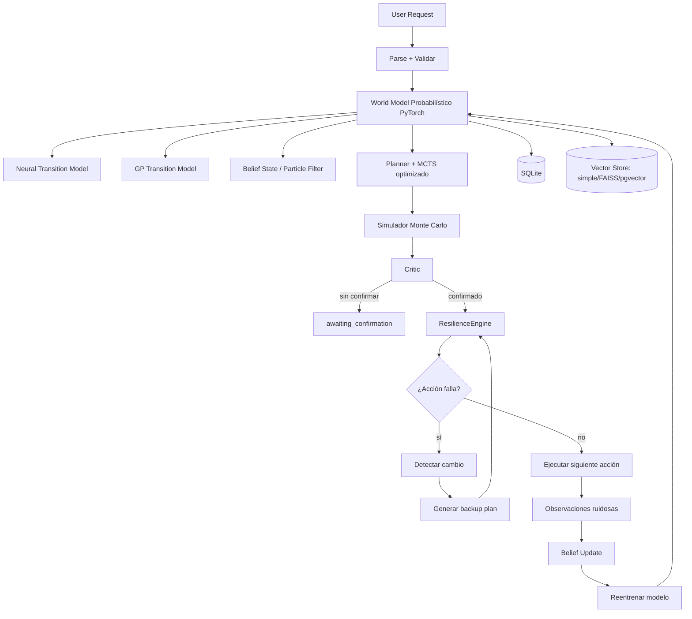

# TomoIII
## AI-Native Operations & Agentic Patterns
### CASE: UC-266 - Agente Resiliente y Robusto ante Cambios del Entorno

#### USO: . EXTERNO

---

## Descripción

UC-266 mejora el agente de **UC-265** convirtiéndolo en un sistema **resiliente y robusto**: no solo predice y planifica bien, sino que **detecta cuando el mundo real deja de coincidir con su modelo**, se **recupera** de fallos y se **adapta** continuamente.

El daño se manifiesta en dos momentos:

1. **En la planificación (antes de actuar)**
   - **Parálisis por análisis**: el agente explora tantas opciones que nunca decide.
   - **Suposiciones erróneas**: el entorno cambió (clima, disponibilidad, precios) y el agente planifica con datos desactualizados.

2. **En la ejecución (al actuar)**
   - **Detección deficiente**: sensores ruidosos o desactualizados no reportan el cambio.
   - **Acciones incorrectas**: elige opciones que ya no tienen sentido.
   - **Comunicación deficiente**: no coordina cambios con otros agentes o sistemas a tiempo.

UC-266 resuelve esto con:

- **Detección de cambios** comparando predicción vs realidad.
- **Planes de respaldo** generados automáticamente si una acción falla.
- **Bucles de autocorrección**: actualizar el *belief state* con el particle filter y replanificar.
- **Migración a producción** de modelos (PyTorch, GPyTorch) y vector store (FAISS / pgvector).
- **MCTS optimizado** con poda de acciones y cache persistente.

---

## 1. Detección de cambios del entorno

El agente compara, para cada acción ejecutada:

- probabilidad de éxito predicha vs resultado real,
- costo predicho vs costo real,
- retrasos observados.

Si la desviación supera `UC266_CHANGE_DETECTION_THRESHOLD`, se emite un `ChangeEvent` con tipo (`cancellation`, `delay`, `price`, `drift`) y severidad.

```python
event = world_model.detect_change(
    action, predicted_success_prob, observed_success,
    predicted_cost, actual_cost, observed_delay
)
```

## 2. Planes de respaldo y recuperación

Si una acción falla, el `ResilienceEngine`:

1. Detecta el evento.
2. Genera hasta `UC266_BACKUP_PLAN_COUNT` planes alternativos que no incluyan la acción fallida.
3. Ejecuta el plan de respaldo, con un máximo de `UC266_MAX_RECOVERY_ATTEMPTS` intentos.
4. Actualiza el *belief state* y el world model con la nueva evidencia.

```python
backups, meta = resilience.generate_backup_plans(request, state, failed_action)
```

## 3. Autocorrección con belief state

Tras cada observación ruidosa, el particle filter actualiza la creencia sobre variables ocultas (`market_pressure`, `weather_condition`). Si la evidencia contradice fuertemente el modelo actual, el agente puede forzar un reentrenamiento automático.

## 4. Migración de modelos a producción

- **PyTorch**: `NeuralTransitionModel` entrena un MLP con `state_dict` persistente en `.pt`.
- **GP con PyTorch**: `GPTransitionModel` implementa regresión exacta con Cholesky; si `gpytorch` está instalado, puede activarse un backend más escalable.
- **Persistencia**: `ModelPersistence` guarda redes, experiencias y metadatos, y los reconecta al world model al iniciar.

## 5. Vector store de producción

La fachada `VectorStore` soporta tres backends:

- `simple`: memoria + JSON (fallback por defecto).
- `faiss`: índice FAISS `IndexFlatIP` para búsqueda rápida por similitud.
- `pgvector`: PostgreSQL + extensión `pgvector` (requiere `psycopg2` y credenciales).

Se elige vía `UC266_VECTOR_BACKEND`.

## 6. MCTS optimizado

El `MCTSPlanner` ahora:

- **Poda acciones**: reduce cada nivel a `UC266_MCTS_ACTION_BUDGET` candidatos con mejor heurística.
- **Cache persistente**: reutiliza subárboles de solicitudes similares.
- **Rollouts eficientes**: simula desde la profundidad actual hasta el horizonte.

---

## Arquitectura



### Componentes principales

| Componente | Tecnología | Función |
|---|---|---|
| Neural Transition Model | PyTorch | Predice éxito y recompensa. |
| Gaussian Process | PyTorch / GPyTorch | Predice recompensa con incertidumbre. |
| Belief State | Particle Filter | Mantiene distribución sobre variables ocultas. |
| MCTS | UCB1 + poda + cache persistente | Búsqueda sobre espacio de acciones de viaje. |
| ResilienceEngine | Python | Detección de cambios, backups, autocorrección. |
| SQLite Store | sqlite3 | Persistencia relacional. |
| Vector Store | simple / FAISS / pgvector | Recuperación por similitud. |

---

## Estructura del proyecto

| Archivo | Responsabilidad |
|---|---|
| `UC-266.py` | CLI: `plan`, `train`, `infer`, `serve`. |
| `config.py` | Variables de entorno `UC266_*`. |
| `models.py` | Entidades: request, acción, estado, transición, belief, observación, resultados, eventos de cambio, planes de respaldo. |
| `state.py` | `ModelBasedState` del grafo LangGraph. |
| `travel_world.py` | Simulador físico de vuelos/hoteles (entorno real oculto). |
| `synthetic_data.py` | Generador de datos sintéticos de viajes. |
| `model_persistence.py` | Guarda/carga modelos PyTorch y experiencias. |
| `train.py` | Entrena el world model con datos sintéticos y persiste modelos. |
| `flight_delay_adapter.py` | Integración con modelo externo de retrasos. |
| `probabilistic_model.py` | StateEncoder, MLP PyTorch, GP PyTorch, particle filter. |
| `world_model.py` | World model + aprendizaje + detección de cambios + persistencia. |
| `mcts.py` | MCTS completo con poda y cache persistente. |
| `mcts_store.py` | Cache JSON de subárboles MCTS. |
| `planner.py` | Generación heurística de candidatos + MCTS. |
| `resilience.py` | Motor de resiliencia: detectar, diagnosticar, recuperar. |
| `simulator.py` | Monte Carlo multi-plan. |
| `critic.py` | Evaluación y selección del mejor plan. |
| `nodes.py` | Nodos LangGraph con integración de resiliencia. |
| `graph.py` | Construcción y ejecución del grafo. |
| `sqlite_store.py` | Persistencia en SQLite. |
| `vector_store.py` | Vector store con backends simple, FAISS y pgvector. |
| `api.py` | API Flask con card views. |
| `tests/` | Tests unitarios e integración. |

---

## Dependencias

```bash
cd /Users/utron/Documents/code-books/TomoIII/UC-266/code
python -m pip install -r requirements.txt
```

```text
langgraph==1.0.10
langchain-core==1.2.10
pydantic>=2.7.4
numpy>=1.26.0
scikit-learn>=1.5.0
joblib>=1.4.0
pandas>=2.0.0
xgboost>=1.7.0
Flask==3.0.3
requests==2.32.2
pytest==8.2.1
torch>=2.1.0
gpytorch>=1.11
faiss-cpu>=1.7.4
psycopg2-binary>=2.9.9
pgvector>=0.2.5
```

---

## Variables de entorno

| Variable | Default | Descripción |
|---|---|---|
| `UC266_WORLD_SEED` | `42` | Semilla del simulador. |
| `UC266_PARTIAL_OBSERVABILITY` | `true` | Activa observaciones ruidosas y belief state. |
| `UC266_OBSERVATION_NOISE` | `0.1` | Nivel de ruido en observaciones. |
| `UC266_CHANGE_EVENT_PROB` | `0.05` | Probabilidad de evento de cambio en simulación. |
| `UC266_WORLD_MODEL_TYPE` | `neural` | `neural`, `gp` o `hybrid`. |
| `UC266_MIN_SAMPLES_TO_TRAIN` | `10` | Mínimas experiencias para entrenar. |
| `UC266_RETRAIN_AFTER` | `10` | Observaciones antes de reentrenar. |
| `UC266_UNCERTAINTY_RETRAIN_THRESHOLD` | `0.5` | Disparar retrain si GP std supera este valor. |
| `UC266_PREDICTION_ERROR_RETRAIN_THRESHOLD` | `0.3` | Disparar retrain si error promedio supera este valor. |
| `UC266_PREDICTION_ERROR_WINDOW` | `20` | Ventana de errores de predicción. |
| `UC266_EMBEDDING_DIM` | `16` | Dimensión de embeddings de estado/acción. |
| `UC266_BELIEF_DIM` | `6` | Dimensión del belief vector. |
| `UC266_TORCH_DEVICE` | `cpu` | Dispositivo PyTorch. |
| `UC266_TORCH_EPOCHS` | `80` | Épocas de entrenamiento. |
| `UC266_TORCH_LR` | `1e-3` | Learning rate. |
| `UC266_TORCH_HIDDEN_DIM` | `64` | Neuronas ocultas del MLP. |
| `UC266_TORCH_DROPOUT` | `0.1` | Dropout. |
| `UC266_GP_KERNEL` | `rbf` | Kernel del GP. |
| `UC266_GP_ALPHA` | `1e-2` | Ruido del GP. |
| `UC266_MCTS_ITERATIONS` | `200` | Iteraciones MCTS. |
| `UC266_MCTS_UCB_CONSTANT` | `1.414` | Constante UCB. |
| `UC266_MCTS_MAX_DEPTH` | `5` | Profundidad máxima. |
| `UC266_MCTS_ACTION_BUDGET` | `6` | Acciones por nivel tras poda. |
| `UC266_MCTS_ENABLE_PERSISTENT_TREE` | `true` | Cache persistente de subárboles. |
| `UC266_VECTOR_BACKEND` | `simple` | `simple`, `faiss` o `pgvector`. |
| `UC266_VECTOR_STORE_PATH` | `""` | Ruta del vector store. |
| `UC266_VECTOR_DIM` | `16` | Dimensión de vectores. |
| `UC266_RESILIENCE_ENABLE` | `true` | Habilitar motor de resiliencia. |
| `UC266_BACKUP_PLAN_COUNT` | `3` | Planes de respaldo a generar. |
| `UC266_MAX_RECOVERY_ATTEMPTS` | `3` | Intentos de recuperación. |
| `UC266_CHANGE_DETECTION_THRESHOLD` | `0.3` | Umbral de detección de cambio. |
| `UC266_DRIFT_THRESHOLD` | `0.25` | Umbral de deriva global. |
| `UC266_REPLAN_AFTER_FAILURE` | `true` | Replanificar tras fallo. |
| `UC266_REQUIRE_CONFIRMATION_IRREVERSIBLE` | `true` | Confirmación para reservar. |
| `UC266_PORT` | `5266` | Puerto API. |
| `UC266_FLIGHT_DELAYS_MODEL_PATH` | `flight-delays/challenge/model.pkl` | Modelo de retrasos. |

---

## CLI

```bash
# 1. Entrenar el world model con datos sintéticos
python UC-266.py train --samples 1000 --output-dir models

# 2. Inferir con el modelo entrenado
python UC-266.py infer --output-dir models \
  --budget 2000 --airline Delta --direct \
  --action-type flight --item-id FL-TEST --cost 300

# 3. Planificar un viaje
python UC-266.py plan \
  --origin Madrid --destination Barcelona \
  --departure-date 2026-09-15 --return-date 2026-09-17 \
  --budget 2000 --airline Delta --direct

# 4. Planificar y ejecutar reservas
python UC-266.py plan \
  --origin Madrid --destination Barcelona \
  --departure-date 2026-09-15 --return-date 2026-09-17 \
  --budget 2000 --confirm

# 5. Servidor Flask
python UC-266.py serve --port 5266
```

---

## API REST

### Endpoints

| Método | Endpoint | Descripción |
|---|---|---|
| `GET` | `/health` | Estado del servicio. |
| `GET` | `/api/v1/schema` | Card views de entrada/salida. |
| `POST` | `/api/v1/model/train` | Genera datos sintéticos, entrena y guarda modelos. |
| `POST` | `/api/v1/model/infer` | Predice éxito/recompensa con modelo entrenado. |
| `POST` | `/api/v1/model/plan` | Genera, simula y selecciona el mejor plan. |
| `POST` | `/api/v1/model/execute` | Planifica con confirmación y ejecuta reservas. |
| `POST` | `/api/v1/model/feedback` | Envía observación real y reentrena. |
| `POST` | `/api/v1/model/retrain` | Fuerza reentrenamiento. |
| `POST` | `/api/v1/model/detect_change` | Detecta cambio del entorno. |
| `POST` | `/api/v1/model/recover` | Genera planes de respaldo. |
| `GET` | `/api/v1/model/world_model` | Estado del world model. |
| `GET` | `/api/v1/model/last_trace` | Última traza. |

### Card view de entrada — `POST /api/v1/model/plan`

```json
{
  "endpoint": "POST /api/v1/model/plan",
  "description": "Planifica un viaje con world model probabilístico, MCTS optimizado, detección de cambios y resiliencia ante fallos.",
  "parameters": [
    {"name": "origin", "type": "string", "required": true},
    {"name": "destination", "type": "string", "required": true},
    {"name": "departure_date", "type": "string (YYYY-MM-DD)", "required": true},
    {"name": "return_date", "type": "string", "required": false},
    {"name": "travelers", "type": "integer", "required": false, "default": 1},
    {"name": "budget", "type": "number", "required": false},
    {"name": "currency", "type": "string", "required": false, "default": "USD"},
    {"name": "user_id", "type": "string", "required": false, "default": "anonymous"},
    {"name": "preferences", "type": "object", "required": false, "example": {"airline": "Delta", "direct_only": true}},
    {"name": "constraints", "type": "list[string]", "required": false},
    {"name": "confirm_irreversible", "type": "boolean", "required": false, "default": false},
    {"name": "predict_delays", "type": "boolean", "required": false, "default": true}
  ]
}
```

### Card view de entrada — `POST /api/v1/model/detect_change`

```json
{
  "endpoint": "POST /api/v1/model/detect_change",
  "description": "Compara predicción y observación real para detectar un cambio del entorno.",
  "parameters": [
    {"name": "action", "type": "object", "required": true},
    {"name": "predicted_success_prob", "type": "number", "required": true},
    {"name": "predicted_cost", "type": "number", "required": true},
    {"name": "actual_success", "type": "boolean", "required": true},
    {"name": "actual_cost", "type": "number", "required": true},
    {"name": "observed_delay", "type": "number", "required": false, "default": 0}
  ]
}
```

### Card view de entrada — `POST /api/v1/model/recover`

```json
{
  "endpoint": "POST /api/v1/model/recover",
  "description": "Genera planes de respaldo evitando la acción fallida.",
  "parameters": [
    {"name": "request", "type": "object", "required": true, "description": "Mismo payload que /plan"},
    {"name": "failed_action", "type": "object", "required": false, "description": "Acción que falló y debe evitarse"}
  ]
}
```

### Card view de salida — `POST /api/v1/model/plan`

```json
{
  "endpoint": "POST /api/v1/model/plan",
  "description": "Resultado de la planificación con resiliencia.",
  "fields": [
    {"name": "request_id", "type": "string"},
    {"name": "user_id", "type": "string"},
    {"name": "status", "type": "string", "enum": ["done", "awaiting_input", "awaiting_confirmation", "failed"]},
    {"name": "selected_plan", "type": "object"},
    {"name": "candidates", "type": "list[object]"},
    {"name": "evaluations", "type": "list[object]"},
    {"name": "execution_result", "type": "object"},
    {"name": "world_model", "type": "object"},
    {"name": "belief_state", "type": "object"},
    {"name": "partial_observations", "type": "list[object]"},
    {"name": "change_events", "type": "list[object]", "description": "Cambios detectados durante ejecución"},
    {"name": "resilience_logs", "type": "list[object]", "description": "Logs del motor de resiliencia"},
    {"name": "reflections", "type": "list[object]"},
    {"name": "logs", "type": "list[object]"},
    {"name": "requires_confirmation", "type": "boolean"}
  ]
}
```

### Ejemplos `curl`

```bash
# Planificar
curl -X POST http://localhost:5266/api/v1/model/plan \
  -H "Content-Type: application/json" \
  -d '{
    "origin": "Madrid",
    "destination": "Barcelona",
    "departure_date": "2026-09-15",
    "return_date": "2026-09-17",
    "travelers": 1,
    "budget": 2000,
    "preferences": {"airline": "Delta", "direct_only": true}
  }'

# Detectar cambio
curl -X POST http://localhost:5266/api/v1/model/detect_change \
  -H "Content-Type: application/json" \
  -d '{
    "action": {"action_type": "flight", "item_id": "FL-1", "estimated_cost": 300},
    "predicted_success_prob": 0.95,
    "predicted_cost": 300,
    "actual_success": false,
    "actual_cost": 0
  }'

# Recuperar con backup plans
curl -X POST http://localhost:5266/api/v1/model/recover \
  -H "Content-Type: application/json" \
  -d '{
    "request": {"origin": "Madrid", "destination": "Barcelona", "departure_date": "2026-09-15", "return_date": "2026-09-17", "budget": 2000},
    "failed_action": {"action_type": "flight", "item_id": "FL-1"}
  }'
```

---

## Flujo de resiliencia

```text
acción planificada
    │
    ▼
world_model.predict_transition(action)
    │
    ▼
executor.book_flight(action)
    │
    ▼
¿falló?
    ├─ no ──▶ continuar plan
    │
    └─ sí
        │
        ▼
resilience.detect_change(predicción, realidad)
        │
        ▼
generate_backup_plans(request, state, failed_action)
        │
        ▼
execute_recovery_loop(backups)
        │
        ▼
belief_tracker.update(observación)
        │
        ▼
world_model.retrain() si es necesario
```

---

## Limitaciones y próximos pasos

- El vector store `simple` es adecuado para tests; producción debe usar `faiss` o `pgvector`.
- El GP implementado en PyTorch puro es exacto y escalable solo hasta miles de experiencias; para más datos se recomienda `gpytorch` con SVGP.
- La detección de cambios usa umbrales fijos; en producción se puede enriquecer con tests estadísticos (CUSUM, KL-divergencia) o modelos de drift.
- La integración con sistemas externos (aerolíneas, hoteles) requeriría adaptadores reales en lugar del simulador.

---

## Validación

```bash
cd /Users/utron/Documents/code-books/TomoIII/UC-266/code
python -m compileall -q .
python -m pytest tests/ -q
```

Resultado esperado:

```text
38 passed
```

---

## Referencias

- Hereda simulador de vuelos/hoteles de UC-259/UC-261/UC-264/UC-265.
- Extiende arquitectura multi-agente de UC-264 y world model probabilístico de UC-265.
- Implementado con **LangGraph**, **Pydantic**, **NumPy**, **PyTorch**, **Flask** y **SQLite/FAISS/pgvector**.
