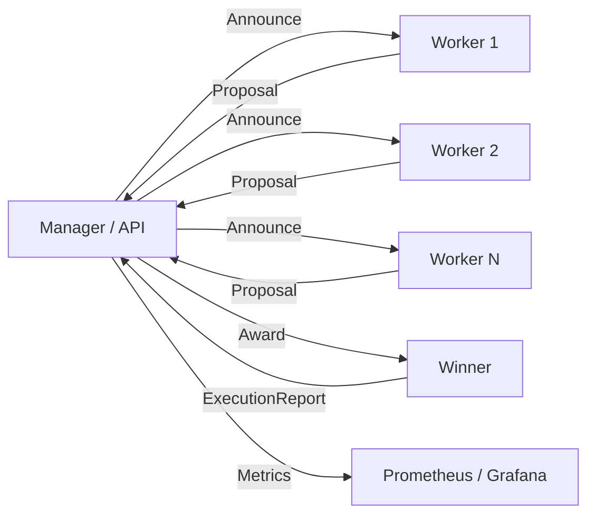

# TomoIII
## AI-Native Operations & Agentic Patterns
### CASE: UC-269 - Protocolo Contract Net con Métricas para Grafana

#### USO: . EXTERNO

---

## Descripción

UC-269 implementa el **protocolo Contract Net** para sistemas multiagente. En este protocolo un agente **manager** anuncia una tarea, los agentes **workers** presentan propuestas, y el manager selecciona la mejor oferta y adjudica el contrato. Una vez ejecutada, se genera un **reporte de auditoría** y se exponen **métricas compatibles con Prometheus** para visualizarlas en un **dashboard de Grafana**.

### Fases del protocolo

1. **Announce**: el manager publica la tarea con requisitos y deadline.
2. **Bid**: cada worker evalúa la tarea y envía una propuesta con score, costo, latencia y confianza.
3. **Award**: el manager selecciona la mejor propuesta mediante una función de scoring configurable.
4. **Execute**: el worker adjudicatario ejecuta la tarea y reporta el resultado.
5. **Audit**: se registra un `ConsensusLog` con todas las propuestas, ganador y reporte.
6. **Metrics**: se actualizan contadores/histogramas para Grafana.

---

## 1. Arquitectura



### Componentes

| Componente | Archivo | Responsabilidad |
|---|---|---|
| Manager | `contract_net.py` | Anuncia, selecciona ganador, coordina ejecución. |
| Worker | `contract_net.py` | Genera propuestas y ejecuta si gana. |
| Modelos | `models.py` | Schemas Pydantic de tareas, propuestas, adjudicaciones, reportes. |
| Métricas | `metrics.py` | Registro Prometheus con fallback en memoria. |
| API | `api.py` | Flask: `/run`, `/outcome`, `/metrics`, `/schema`. |
| CLI | `UC-269.py` | Ejecutar ronda local o servir API. |
| Dashboard | `grafana/dashboard.json` | Dashboard de ejemplo para Grafana. |

---

## 2. Scoring de propuestas

Cada propuesta se puntúa como:

```text
score = skill_score * w_skill
      + (1 / cost_factor) * w_cost
      + (1 / latency_factor) * w_latency
      + reliability * w_reliability
```

Los pesos se configuran mediante variables de entorno:

| Variable | Default | Descripción |
|---|---|---|
| `UC269_WEIGHT_SKILL` | `0.50` | Peso de la habilidad del worker. |
| `UC269_WEIGHT_COST` | `0.25` | Peso del costo inverso. |
| `UC269_WEIGHT_LATENCY` | `0.15` | Peso de la latencia inversa. |
| `UC269_WEIGHT_RELIABILITY` | `0.10` | Peso de la fiabilidad. |

---

## 3. Métricas para Grafana

El endpoint `/api/v1/metrics` expone en formato Prometheus:

| Métrica | Tipo | Descripción |
|---|---|---|
| `contractnet_tasks_total{status}` | counter | Tareas iniciadas/completadas/fallidas. |
| `contractnet_proposals_total{agent}` | counter | Propuestas recibidas por agente. |
| `contractnet_selection_score_bucket` | histogram | Distribución del score del ganador. |
| `contractnet_execution_duration_seconds_bucket` | histogram | Duración de la ejecución. |
| `contractnet_results_total{status}` | counter | Resultados exitosos/fallidos. |

Si `prometheus_client` no está instalado, se usa un registro en memoria que genera el mismo formato de exposición.

---

## 4. API REST

### Endpoints

| Método | Endpoint | Descripción |
|---|---|---|
| `GET` | `/health` | Estado del servicio. |
| `GET` | `/api/v1/schema` | Card views de entrada/salida. |
| `POST` | `/api/v1/contractnet/run` | Ejecuta una ronda completa Contract Net. |
| `GET` | `/api/v1/contractnet/outcome/<task_id>` | Consulta resultado almacenado. |
| `GET` | `/api/v1/metrics` | Métricas Prometheus. |
| `GET` | `/api/v1/metrics/json` | Métricas como JSON. |

### Card view de entrada — `POST /api/v1/contractnet/run`

```json
{
  "endpoint": "POST /api/v1/contractnet/run",
  "description": "Ejecuta una ronda del protocolo Contract Net: anuncio, propuestas, adjudicación y ejecución.",
  "parameters": [
    {"name": "title", "type": "string", "required": true, "example": "Clasificación de patrones con Fourier"},
    {"name": "description", "type": "string", "required": false},
    {"name": "requirements", "type": "object", "required": false, "example": {"domain": "signal_processing", "min_accuracy": 0.9}},
    {"name": "workers", "type": "list[object]", "required": false, "description": "Lista de WorkerProfile opcional"}
  ]
}
```

### WorkerProfile (opcional)

```json
{
  "name": "coder",
  "skills": ["classification"],
  "skill_score": 0.85,
  "reliability": 0.88,
  "cost_factor": 1.1,
  "latency_factor": 0.6,
  "metadata": {}
}
```

### Card view de salida — `POST /api/v1/contractnet/run`

```json
{
  "endpoint": "POST /api/v1/contractnet/run",
  "description": "Resultado completo de la ronda Contract Net.",
  "fields": [
    {"name": "task_id", "type": "UUID"},
    {"name": "task_title", "type": "string"},
    {"name": "status", "type": "string", "enum": ["announced", "bidding", "awarded", "executing", "completed", "failed"]},
    {"name": "proposals", "type": "list[object]", "description": "Propuestas ordenadas por score"},
    {"name": "winner", "type": "string"},
    {"name": "award", "type": "object"},
    {"name": "report", "type": "object"},
    {"name": "consensus_log", "type": "object", "description": "Traza de auditoría"},
    {"name": "metrics", "type": "object"}
  ]
}
```

### Ejemplo `curl`

```bash
curl -X POST http://localhost:5269/api/v1/contractnet/run \
  -H "Content-Type: application/json" \
  -d '{
    "title": "Clasificación de patrones",
    "description": "Extraer características con Fourier y clasificar",
    "requirements": {"domain": "signal_processing", "min_accuracy": 0.9}
  }'
```

---

## 5. CLI

```bash
# Ejecutar una ronda localmente
python UC-269.py run --title "Clasificación de patrones" --description "Fourier + clasificación"

# Servir API Flask
python UC-269.py serve --port 5269
```

---

## 6. Dashboard de Grafana

El archivo `grafana/dashboard.json` contiene un dashboard de ejemplo con paneles para:

- Tareas iniciadas vs completadas.
- Propuestas por agente.
- Distribución del score del ganador.
- Duración de ejecución.
- Resultados exitosos/fallidos.

### Configuración de Prometheus

Añade un job en `prometheus.yml`:

```yaml
scrape_configs:
  - job_name: 'uc269-contract-net'
    static_configs:
      - targets: ['localhost:5269']
```

Luego importa `grafana/dashboard.json` en Grafana.

---

## 7. Estructura del proyecto

| Archivo | Responsabilidad |
|---|---|
| `UC-269.py` | CLI (`run`, `serve`). |
| `config.py` | Variables de entorno `UC269_*`. |
| `models.py` | Schemas Pydantic: tareas, propuestas, adjudicaciones, reportes, logs. |
| `contract_net.py` | `ContractNetManager` y `WorkerAgent`. |
| `metrics.py` | Registro Prometheus con fallback. |
| `api.py` | Flask API con card views. |
| `grafana/dashboard.json` | Dashboard de ejemplo. |
| `tests/` | Tests unitarios e integración. |

---

## 8. Dependencias

```bash
cd /Users/utron/Documents/code-books/TomoIII/UC-269/code
python -m pip install pydantic Flask
# Opcional para producción
python -m pip install prometheus-client
```

```text
pydantic>=2.7.4
Flask==3.0.3
pytest==8.2.1
# opcional
prometheus-client>=0.17.0
```

---

## 9. Variables de entorno

| Variable | Default | Descripción |
|---|---|---|
| `UC269_PORT` | `5269` | Puerto API. |
| `UC269_DEBUG` | `false` | Modo debug Flask. |
| `UC269_WEIGHT_SKILL` | `0.50` | Peso skill en scoring. |
| `UC269_WEIGHT_COST` | `0.25` | Peso costo. |
| `UC269_WEIGHT_LATENCY` | `0.15` | Peso latencia. |
| `UC269_WEIGHT_RELIABILITY` | `0.10` | Peso fiabilidad. |
| `UC269_ENABLE_PROMETHEUS` | `true` | Usar `prometheus_client` si está disponible. |
| `UC269_LOG_LEVEL` | `INFO` | Nivel de log. |

---

## 10. Validación

```bash
cd /Users/utron/Documents/code-books/TomoIII/UC-269/code
python -m compileall -q .
python -m pytest tests/ -q
```

Resultado esperado:

```text
11 passed
```

---

## 11. Limitaciones y próximos pasos

- El registro de métricas en memoria es volátil; en producción usar `prometheus_client` o un broker.
- La ejecución es síncrona; tareas largas deberían ejecutarse en workers asíncronos con notificaciones.
- Los workers son simulados; reemplazar por agentes reales conectados vía A2A/MCP.
- Añadir persistencia de `ConsensusLog` en SQLite/PostgreSQL para auditoría histórica.
