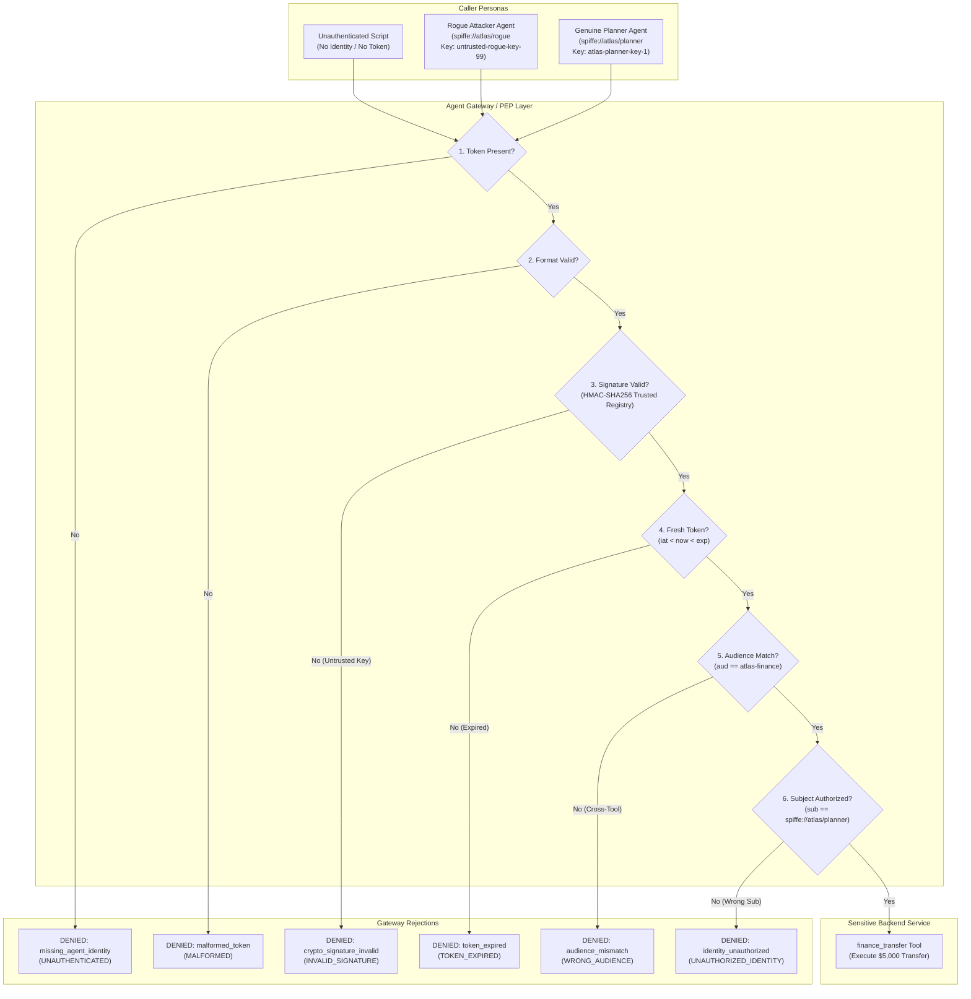

# Demo 3 runbook — Cryptographic Identity & Agent Gateway Control

Atlas is a multi-agent system: a **planner agent** delegates sensitive tasks to backend **tool services** (such as `finance_transfer`). Without cryptographic verification, an unauthenticated caller or a **rogue agent** can impersonate the planner, forge tokens, or replay credentials to move corporate funds.

In this demo, you show the rogue agent succeeding when guardrails are off, then turn on **Agent Identity** to demonstrate how an **Agent Gateway** Policy Enforcement Point (PEP) validates cryptographic SPIFFE/JWT tokens, enforces key authenticity, checks token audiences and expiration, and evaluates tool-level authorization policies.

```bash
# Automatically discover the active Project ID and Cloud Run Service URL
export PROJECT_ID=$(gcloud config get-value project 2>/dev/null)
export URL=$(terraform -chdir=terraform output -raw service_url 2>/dev/null \
  || gcloud run services describe atlas-agent --region=us-central1 --format='value(status.url)' 2>/dev/null \
  || echo "http://localhost:8080")

echo "Project: $PROJECT_ID | Service URL: $URL"
```

The trusted planner identity is `spiffe://atlas/planner` (env `FINANCE_TRUSTED_IDENTITY`).

---

## 1. Key Code Walkthrough (What to show the audience)

To show *how* cryptographic Agent Identity and Gateway PEP verification are implemented:

### A. Cryptographic Token Issuance (`app/guardrails.py:L257-285`)
* **File:** [`app/guardrails.py`](../app/guardrails.py#L257-L285)
* **How it works:** Generates base64url-encoded JWT tokens containing SPIFFE subject identity, audience, timestamps, and an HMAC-SHA256 signature signed by trusted key ID `atlas-planner-key-1`:
```python
# app/guardrails.py:267-284
header = {"alg": "HS256", "typ": "JWT", "kid": key_id}
payload = {"iss": issuer, "sub": identity, "aud": audience, "iat": now, "exp": now + expires_in_seconds}
signing_input = f"{_b64url_encode(header_bytes)}.{_b64url_encode(payload_bytes)}"
signature = hmac.new(secret_key.encode("utf-8"), signing_input.encode("utf-8"), hashlib.sha256).digest()
return f"{signing_input}.{_b64url_encode(signature)}"
```

### B. Gateway PEP Verification Engine (`app/guardrails.py:L323-457`)
* **File:** [`app/guardrails.py`](../app/guardrails.py#L323-L457)
* **How it works:** Executes a 6-stage validation pipeline:
  1. **Token presence & format check** (rejects missing/malformed tokens)
  2. **Cryptographic signature check** (compares against `TRUSTED_AGENT_SECRET` / key registry)
  3. **Expiration check** (`exp < now`)
  4. **Audience check** (`aud == "atlas-finance"`)
  5. **Subject IAM check** (`sub == "spiffe://atlas/planner"`)

### C. Tool-Level Gate (`app/tools.py:L150-181`)
* **File:** [`app/tools.py`](../app/tools.py#L150-L181)
* **How it works:** `finance_transfer` invokes `verify_agent_token` and raises `ToolDenied` on any cryptographic or policy failure before debiting accounts.

### D. REST Gateway Ingress (`app/main.py:L106-144`)
* **File:** [`app/main.py`](../app/main.py#L106-L144)
* **How it works:** Extracts tokens from standard `Authorization: Bearer <JWT>` or `X-Agent-Identity-Token` HTTP headers.

---

## 2. Google Cloud Console Walkthrough (What to show in the GCP Console)

1. **Cloud Run Service Configuration:**
   - **Navigation:** Navigate to **Cloud Run** > **atlas-agent** > **Configuration** tab.
   - **What to show:**
     - `FINANCE_TRUSTED_IDENTITY = spiffe://atlas/planner`
     - `ENABLE_AGENT_IDENTITY = false` (baseline attack) / `true` (defended)

2. **Cloud Logging (Cryptographic Audit Trail):**
   - **Navigation:** Navigate to **Logging** > **Logs Explorer**.
   - **Query:**
     ```text
     resource.type="cloud_run_revision"
     resource.labels.service_name="atlas-agent"
     "Agent Gateway"
     ```
   - **What to show:** Show structured log entries detailing:
     - `crypto_status`: `VALID`, `INVALID_SIGNATURE`, `TOKEN_EXPIRED`, `UNAUTHENTICATED`
     - Authenticated SPIFFE subjects and Key IDs (`kid`)

3. **IAM & Admin (Agent Service Accounts):**
   - **Navigation:** Navigate to **IAM & Admin** > **Service Accounts**.
   - **What to show:** Show `atlas-agent-sa@${PROJECT_ID}.iam.gserviceaccount.com` and discuss how Workload Identity Federation maps cloud IAM to SPIFFE SVIDs for machine-to-machine zero trust.

---

## Architecture & Enforcement Flow



---

## The attack (no identity check / unauthenticated rogue agent)

In the Atlas console (`/`), select **(none — unauthenticated rogue agent)** and click **Run attack (no identity check)**, or run via `curl`:

```bash
curl -sX POST "$URL/api/finance/transfer" \
  -H 'content-type: application/json' \
  -d '{"identity":null,"amount_usd":5000,"to_account":"4471","guardrails":{}}' | jq
```

Response:
```json
{
  "status": "ok",
  "amount_usd": 5000.0,
  "to_account": "4471",
  "outcome": "authorized",
  "verification": {
    "crypto_status": "BYPASSED",
    "detail": "Agent Gateway identity enforcement disabled (baseline attack path)"
  },
  "presented_identity": null,
  "token_attached": false
}
```

### Attack mechanics
1. **Network-Only Trust:** The tool server blindly trusted any HTTP caller on the network.
2. An unauthorized rogue agent moved $5,000 to account `4471` without presenting any identity credentials.

---

## The defense — Agent Gateway & Cryptographic Agent Identity

When `enable_agent_identity: true` is enabled, the request is intercepted by the **Agent Gateway** layer and must pass full cryptographic verification:

1. **Proof-of-Possession / Token Presence:** Requests must carry a cryptographic Agent Identity token (SPIFFE/SVID JWT or mTLS proof).
2. **Signature Verification:** The gateway validates the cryptographic signature against the trusted Agent Authority's key registry (`kid=atlas-planner-key-1`).
3. **Anti-Replay & Freshness:** Expiration (`exp`) and nonce (`jti`) prevent token replay.
4. **Tool Audience Scoping:** The token audience (`aud`) must explicitly match the target tool (`atlas-finance`).
5. **Tool-Level IAM / ABAC:** The authenticated subject (`sub: spiffe://atlas/planner`) must hold permissions for `finance.transfers.create`.

---

### Test Case 1: Unauthenticated Rogue Agent (Missing Token)

Run defended with no identity presented:

```bash
curl -sX POST "$URL/api/finance/transfer" \
  -H 'content-type: application/json' \
  -d '{"identity":null,"guardrails":{"enable_agent_identity":true}}' | jq
```

```json
{
  "outcome": "denied",
  "label": "missing_agent_identity",
  "detail": "Agent Gateway rejected request: no cryptographic Agent Identity token presented (missing mTLS/Bearer proof)",
  "verification": {
    "valid": false,
    "label": "missing_agent_identity",
    "crypto_status": "UNAUTHENTICATED"
  },
  "presented_identity": null,
  "token_attached": false
}
```

---

### Test Case 2: Untrusted Key / Forged Token Signature

A rogue agent attempts to forge a token or sign with an untrusted private key (`untrusted-rogue-key-99`):

```bash
curl -sX POST "$URL/api/finance/transfer" \
  -H 'content-type: application/json' \
  -d '{"identity":"spiffe://atlas/rogue","token_preset":"untrusted_signature","guardrails":{"enable_agent_identity":true}}' | jq
```

```json
{
  "outcome": "denied",
  "label": "crypto_signature_invalid",
  "detail": "Agent Gateway: Cryptographic signature verification failed; token was forged or signed by untrusted key 'untrusted-rogue-key-99'",
  "verification": {
    "valid": false,
    "label": "crypto_signature_invalid",
    "crypto_status": "INVALID_SIGNATURE",
    "algorithm": "HS256",
    "key_id": "untrusted-rogue-key-99",
    "issuer": "https://agent-identity.atlas.internal",
    "subject": "spiffe://atlas/rogue",
    "audience": "atlas-finance"
  },
  "presented_identity": "spiffe://atlas/rogue",
  "token_attached": true
}
```

---

### Test Case 3: Replayed / Expired Token

A rogue agent sniffs an expired token and attempts to replay it:

```bash
curl -sX POST "$URL/api/finance/transfer" \
  -H 'content-type: application/json' \
  -d '{"identity":"spiffe://atlas/planner","token_preset":"expired","guardrails":{"enable_agent_identity":true}}' | jq
```

```json
{
  "outcome": "denied",
  "label": "token_expired",
  "detail": "Agent Gateway: Agent Identity token expired at timestamp 1786734721 (current: 1786735021)",
  "verification": {
    "valid": false,
    "label": "token_expired",
    "crypto_status": "TOKEN_EXPIRED",
    "algorithm": "HS256",
    "key_id": "atlas-planner-key-1",
    "subject": "spiffe://atlas/planner",
    "audience": "atlas-finance"
  },
  "presented_identity": "spiffe://atlas/planner",
  "token_attached": true
}
```

---

### Test Case 4: Wrong Tool Audience (Cross-Tool Token Replay)

A token generated for `atlas-analytics` is replayed against the sensitive `atlas-finance` tool:

```bash
curl -sX POST "$URL/api/finance/transfer" \
  -H 'content-type: application/json' \
  -d '{"identity":"spiffe://atlas/planner","token_preset":"wrong_audience","guardrails":{"enable_agent_identity":true}}' | jq
```

```json
{
  "outcome": "denied",
  "label": "audience_mismatch",
  "detail": "Agent Gateway: Target tool 'atlas-finance' rejected token issued for audience 'atlas-analytics'",
  "verification": {
    "valid": false,
    "label": "audience_mismatch",
    "crypto_status": "WRONG_AUDIENCE",
    "algorithm": "HS256",
    "key_id": "atlas-planner-key-1",
    "subject": "spiffe://atlas/planner",
    "audience": "atlas-analytics"
  },
  "presented_identity": "spiffe://atlas/planner",
  "token_attached": true
}
```

---

### Test Case 5: Authenticated Planner Agent (Authorized)

The genuine planner presents a cryptographically signed token signed with the trusted key (`atlas-planner-key-1`):

```bash
curl -sX POST "$URL/api/finance/transfer" \
  -H 'content-type: application/json' \
  -d '{"identity":"spiffe://atlas/planner","token_preset":"valid","guardrails":{"enable_agent_identity":true}}' | jq
```

Or pass a direct HTTP Authorization header:

```bash
TOKEN=$(python3 -c "from app import guardrails; print(guardrails.issue_token_for_preset('valid', 'spiffe://atlas/planner'))")

curl -sX POST "$URL/api/finance/transfer" \
  -H "Authorization: Bearer $TOKEN" \
  -H 'content-type: application/json' \
  -d '{"amount_usd":5000,"to_account":"4471","guardrails":{"enable_agent_identity":true}}' | jq
```

```json
{
  "status": "ok",
  "amount_usd": 5000.0,
  "to_account": "4471",
  "verification": {
    "valid": true,
    "label": "authorized",
    "detail": "Agent Gateway: Cryptographically verified identity 'spiffe://atlas/planner' (signature VALID, key=atlas-planner-key-1)",
    "crypto_status": "VALID",
    "algorithm": "HS256",
    "key_id": "atlas-planner-key-1",
    "issuer": "https://agent-identity.atlas.internal",
    "subject": "spiffe://atlas/planner",
    "audience": "atlas-finance"
  },
  "outcome": "authorized",
  "presented_identity": "spiffe://atlas/planner",
  "token_attached": true
}
```

---

## Threat Matrix & Agent Gateway Mitigations

| Threat Vector | Attacker Action | Agent Gateway Verification Step | Enforcement Result |
|---|---|---|---|
| **Unauthenticated Caller** | Calls backend tool directly with no token | Enforces token presence & mTLS / Bearer proof | `DENIED (UNAUTHENTICATED)` |
| **Identity Forgery** | Signs token with rogue private key | Cryptographic HMAC-SHA256 signature check against Key Registry | `DENIED (INVALID_SIGNATURE)` |
| **Token Replay** | Replays intercepted token after task completion | Timestamp expiration (`exp`) and nonce (`jti`) validation | `DENIED (TOKEN_EXPIRED)` |
| **Cross-Tool Elevation** | Replays analytics token to finance tool | Audience check (`aud: atlas-finance`) | `DENIED (WRONG_AUDIENCE)` |
| **Unauthorized Agent** | Validly signed token for non-planner persona | Tool-level IAM policy evaluation (`finance.transfers.create`) | `DENIED (UNAUTHORIZED_IDENTITY)` |
| **Trusted Planner** | Genuine token signed by trusted planner key | Full cryptographic validation + IAM policy match | `AUTHORIZED (VALID)` |

---

## Speaker Talk Track

> *"In autonomous multi-agent architectures, network access is not authorization. If an internal tool trusts any connection on the subnet, a compromised subagent or rogue script can execute sensitive operations.
>
> 1. In our baseline attack, a rogue caller moves $5,000 without proving who they are.
> 2. With **Agent Gateway** enabled, every agent must present a cryptographic **Agent Identity** (SPIFFE SVID / JWT).
> 3. Notice what happens when the attacker attempts to forge a token: the gateway detects the untrusted signing key and rejects it at the cryptographic layer.
> 4. When an attacker attempts to replay an expired or cross-scoped token, the audience and timestamp validations drop the request before it ever reaches business logic.
> 5. Only the genuine planner possessing the registered key is authorized to execute the transfer."*

---

## Verification & Observability

- **Cloud Run Console:** Inspect environment variable `FINANCE_TRUSTED_IDENTITY=spiffe://atlas/planner` under the `atlas-agent` service configuration.
- **Cloud Logging:** Every gateway decision, cryptographic status, key ID, and rejection reason is streamed to Cloud Logging under:
  ```text
  resource.type="cloud_run_revision"
  resource.labels.service_name="atlas-agent"
  ```
- **CLI Log Inspection:**
  ```bash
  gcloud logging read "resource.type=cloud_run_revision AND resource.labels.service_name=atlas-agent" --limit=15 --format="table(timestamp,textPayload)"
  ```
