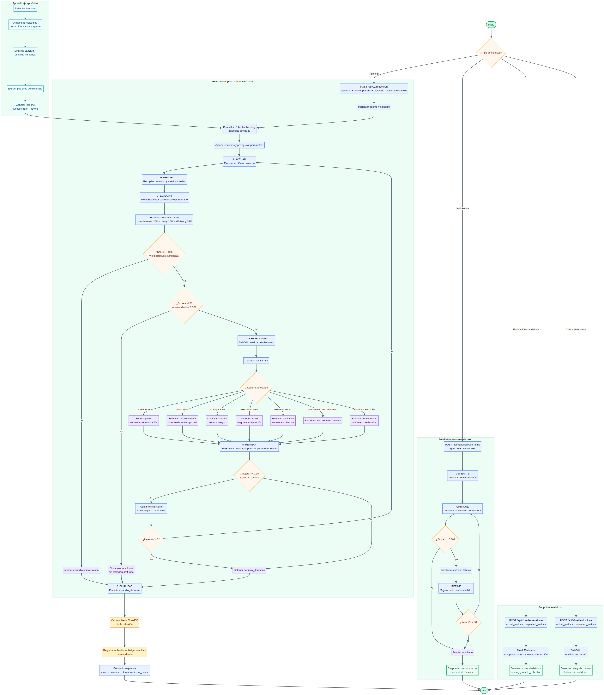

# TomoIII
## AI-Native Operations & Agentic Patterns
### CASE: UC-275 — ¿Cómo mejora la autorreflexión el rendimiento de la IA agéntica? Sistema Avanzado Self-Refine + Reflexion

#### USO: EXTERNO

#### EXECUTION
```bash
# Ejecutar demo del sistema de autorreflexión
cd code/
python UC-275.py run

# Iniciar API Flask
python UC-275.py serve --port 5275

# Ejecutar tests
python -m pytest tests/ -v
```

---

# DESCRIPTION

## 1. Objetivo

UC-275 implementa un **sistema avanzado de autorreflexión para agentes de IA** que combina los patrones **Self-Refine** (Madaan et al., 2023) y **Reflexion** (Shinn et al., NeurIPS 2023). El agente evalúa sus propios resultados, identifica causas raíz de desviaciones, genera propuestas de refinamiento y aplica mejoras iterativamente — todo con memoria episódica de aprendizaje y hash on-chain para auditoría.

La autorreflexión permite al sistema evaluar sus propios resultados y refinarlos antes de finalizarlos, en lugar de producir una respuesta y seguir adelante. Se pregunta: "¿Esto parece correcto? ¿Puedo mejorarlo?". Esto crea un ciclo de retroalimentación dentro del propio agente.

```
┌─────────────────────────────────────────────────────────────────┐
│         CICLO DE AUTORREFLEXIÓN (REFLEXION PATTERN)              │
├─────────────────────────────────────────────────────────────────┤
│                                                                  │
│              ┌─────────────────────┐                            │
│              │   1. ACTUAR         │  → Ejecuta acción/trade    │
│              └──────────┬──────────┘                            │
│                         ↓                                        │
│              ┌─────────────────────┐                            │
│              │   2. OBSERVAR       │  → Recopila resultados     │
│              └──────────┬──────────┘                            │
│                         ↓                                        │
│              ┌─────────────────────┐                            │
│              │   3. EVALUAR        │  → Compara vs expectativas │
│              └──────────┬──────────┘                            │
│                         ↓                                        │
│              ┌─────────────────────┐                            │
│              │   4. REFLEXIONAR    │  → Identifica causas raíz  │
│              └──────────┬──────────┘                            │
│                         ↓                                        │
│              ┌─────────────────────┐                            │
│              │   5. REFINAR        │  → Ajusta estrategia       │
│              └──────────┬──────────┘                            │
│                         ↓                                        │
│                    ¿Suficiente?                                  │
│                   /          \                                   │
│                 NO            SÍ                                 │
│                 ↓              ↓                                 │
│          (vuelve a 1)    ┌──────────────┐                       │
│                          │  6. FINALIZAR │ → Commit on-chain    │
│                          └──────────────┘                       │
│                                                                  │
│  PRINCIPIOS:                                                     │
│  • Máx iteraciones acotadas (evita loops infinitos)              │
│  • Criterios de convergencia explícitos                          │
│  • Memoria episódica de reflexiones pasadas                      │
│  • Reflexiones almacenadas on-chain (auditoría)                  │
│                                                                  │
└─────────────────────────────────────────────────────────────────┘
```

---

## 2. Arquitectura del Sistema

### 5 Capas de la Arquitectura

| Capa | Módulo | Responsabilidad |
|---|---|---|
| 1. Evaluación | `evaluator.py` | MetricEvaluator: scoring multi-criterio ponderado (correctness, completeness, clarity, efficiency) |
| 2. Crítica | `critic.py` | SelfCritic: análisis de causa raíz con heurísticas de dominio + fallback |
| 3. Refinamiento | `refiner.py` | SelfRefiner: propuestas de mejora específicas por categoría de causa |
| 4. Memoria | `memory.py` | ReflectionMemory: memoria episódica, patrones de éxito/fallo, similitud Jaccard, lecciones aprendidas |
| 5. Orquestación | `reflexion_loop.py` | ReflexionLoop (6 fases) + SelfReflectiveAgent (Self-Refine) |

### Componentes Clave

```
┌──────────────┐    ┌──────────────┐    ┌──────────────┐
│  MetricEval  │    │  SelfCritic  │    │  SelfRefiner │
│  (score      │───>│  (causa raíz │───>│  (propuestas │
│   ponderado) │    │   heurísticas│    │   por causa) │
└──────┬───────┘    └──────────────┘    └──────┬───────┘
       │                                        │
       ↓                                        ↓
┌──────────────────────────────────────────────────────┐
│              ReflexionLoop (6 fases)                  │
│  ACT → OBSERVE → EVALUATE → REFLECT → REFINE → FINAL │
└──────────────────────┬───────────────────────────────┘
                       ↓
              ┌──────────────────┐
              │ ReflectionMemory │
              │ (episódica,      │
              │  patrones,       │
              │  lessons)        │
              └──────────────────┘
```

---

## 3. Los Dos Patrones de Autorreflexión

### 3.1 Patrón Self-Refine (SelfReflectiveAgent)

Implementa el ciclo de Madaan et al. (2023):

1. **GENERATE** — el agente produce una primera versión.
2. **CRITIQUE** — se auto-evalúa contra criterios ponderados (correctness 40%, completeness 25%, clarity 20%, efficiency 15%).
3. **DECIDE** — si score >= threshold (0.80), **acepta** y finaliza.
4. **REFINE** — si no, refina solo los criterios fallidos usando el feedback.
5. **REPEAT** — repite hasta aceptar o agotar max_iterations (3).

```python
agent = SelfReflectiveAgent(
    criteria={"correctness": 0.40, "completeness": 0.25, "clarity": 0.20, "efficiency": 0.15},
    threshold=0.80,
    max_iterations=3,
)
result = agent.run("Implementa una función que duplique un número")
# → {"output": "...", "score": 0.91, "accepted": True, "iterations": 1}
```

### 3.2 Patrón Reflexion (ReflexionLoop)

Implementa el ciclo de Shinn et al. (NeurIPS 2023) con 6 fases:

1. **ACTUAR** — ejecuta acción con parámetros (pre-ajustados si la memoria tiene lecciones).
2. **OBSERVAR** — recopila métricas del resultado real.
3. **EVALUAR** — compara métricas vs expectativas con MetricEvaluator.
4. **REFLEXIONAR** — SelfCritic identifica la causa raíz (model_error, data_stale, strategy_flaw, execution_error, external_shock, parameter_miscalibration).
5. **REFINAR** — SelfRefiner genera propuestas ordenadas por beneficio neto.
6. **FINALIZAR** — almacena episodio en memoria + hash SHA-256 para auditoría on-chain.

---

## 4. Análisis de Causa Raíz

El SelfCritic usa heurísticas de dominio para clasificar las causas:

| Categoría | Heurísticas | Refinamiento Asociado |
|---|---|---|
| `model_error` | prediction_error > 0.3, model_confidence < 0.5 | Reducir pesos, aumentar regularización |
| `data_stale` | data_age > 300s, volatility > 0.5 | Reducir refresh interval, feeds tiempo real |
| `strategy_flaw` | opportunity_cost > 0.2, relative_performance < 0.7 | Cambiar variante de estrategia, reducir riesgo |
| `execution_error` | slippage > 5%, latency > 1000ms | Órdenes límite, fragmentación |
| `external_shock` | regime_change > 0.7, black_swan > 0.5 | Reducir exposición, aumentar cobertura |
| `parameter_miscalibration` | risk_realized - risk_expected > 0.2 | Recalibrar con ventana reciente |

Cuando las heurísticas no son concluyentes (confidence < 0.3), aplica análisis fallback basado en severidad y número de desvíos.

---

## 5. Memoria Episódica

La ReflectionMemory implementa aprendizaje episódico inspirado en Reflexion:

- **Almacenamiento**: episodios completos indexados por tipo de acción, causa raíz y agente.
- **Similitud**: Jaccard sobre keys + similitud numérica sobre values de los parámetros.
- **Patrones**: extrae automáticamente patrones de éxito y fallo.
- **Lecciones Aprendidas**: success_rate, causas comunes, consejos de refinamientos exitosos.
- **Pre-ajuste**: antes de ejecutar una acción, consulta memoria para aplicar lecciones de episodios similares exitosos.

---

## 6. Configuración

| Variable | Default | Descripción |
|---|---|---|
| `UC275_PORT` | 5275 | Puerto del servidor |
| `UC275_CONVERGENCE` | 0.80 | Umbral de convergencia (score mínimo) |
| `UC275_REFLECT_SCORE` | 0.70 | Score bajo el cual se activa reflexión |
| `UC275_REFLECT_SEVERITY` | 0.50 | Severidad sobre la cual se activa reflexión |
| `UC275_MAX_ITERATIONS` | 3 | Máx iteraciones de refinamiento |
| `UC275_MIN_IMPROVEMENT` | 0.10 | Mejora mínima para aceptar refinamiento |
| `UC275_MAX_REFINE_STEPS` | 3 | Máx propuestas de refinamiento por ciclo |
| `UC275_MAX_EPISODES` | 1000 | Capacidad de la memoria episódica |
| `UC275_SIMILARITY_THRESH` | 0.70 | Umbral de similitud para recall de episodios |

---

# API

## Card Views — Entrada

### `POST /api/v1/agent/create`
Crea un agente reflexivo con ID único.
```json
{"agent_id": "trading_agent_alpha"}
```

### `POST /api/v1/reflect/run`
Ejecuta acción con ciclo completo de autorreflexión (6 fases: ACT→OBSERVE→EVALUATE→REFLECT→REFINE→FINALIZE).
```json
{
  "agent_id": "trading_agent_alpha",
  "action_params": {"type": "trade", "risk_tolerance": 0.5, "position_size": 1.0},
  "expected_outcome": {"correctness": 0.8, "completeness": 0.7, "clarity": 0.8, "efficiency": 0.7},
  "context": {"market": "crypto"}
}
```

### `POST /api/v1/reflect/self-refine`
Ejecuta ciclo Self-Refine (generate→critique→refine) sobre una tarea de texto.
```json
{"agent_id": "code_agent", "task": "Implementa una funcion que duplique un numero"}
```

### `POST /api/v1/reflect/evaluate`
Evalúa métricas contra expectativas sin ejecutar acción (standalone).
```json
{
  "actual_metrics": {"correctness": 0.9, "completeness": 0.6, "clarity": 0.8, "efficiency": 0.7},
  "expected_metrics": {"correctness": 0.8, "completeness": 0.8, "clarity": 0.7, "efficiency": 0.7}
}
```

### `POST /api/v1/reflect/critique`
Analiza causa raíz a partir de métricas actuales vs esperadas.
```json
{
  "actual_metrics": {"correctness": 0.4, "completeness": 0.3, "slippage": 0.1},
  "expected_metrics": {"correctness": 0.8, "completeness": 0.8, "slippage": 0.02}
}
```

### `POST /api/v1/memory/similar`
Busca episodios similares en la memoria episódica.
```json
{"agent_id": "unknown", "action_type": "trade", "action_params": {"risk_tolerance": 0.5}, "top_k": 5}
```

---

## Card Views — Salida

### `POST /api/v1/reflect/run` → Response
```json
{
  "data": {
    "episode_id": "abc123...",
    "agent_id": "trading_agent_alpha",
    "final_outcome": "good",
    "final_score": 0.85,
    "iterations": 2,
    "duration_seconds": 0.0034,
    "reflection_hash": "sha256...",
    "refinements_applied": 2,
    "root_cause": "strategy_flaw"
  }
}
```

### `POST /api/v1/reflect/self-refine` → Response
```json
{
  "data": {
    "output": "def double(x): return x * 2",
    "score": 0.91,
    "iterations": 1,
    "accepted": true,
    "outcome": "excellent",
    "history": [{"iteration": 1, "score": 0.91, "outcome": "excellent", "failed_criteria": []}]
  }
}
```

### `POST /api/v1/reflect/evaluate` → Response
```json
{
  "data": {
    "outcome": "good",
    "score": 0.81,
    "metric_breakdown": {"correctness": 0.95, "completeness": 0.6, "clarity": 0.89, "efficiency": 0.85},
    "expectations_met": false,
    "deviations": ["completeness: 0.600 vs expected 0.800"],
    "severity": 0.25,
    "needs_reflection": false
  }
}
```

### `POST /api/v1/reflect/critique` → Response
```json
{
  "data": {
    "evaluation": {"outcome": "poor", "score": 0.35, "needs_reflection": true},
    "root_cause": {
      "category": "model_error",
      "primary_cause": "Modelo interno impreciso. Desvíos: [...]",
      "contributing_factors": ["Datos de entrada obsoletos"],
      "confidence": 0.85
    }
  }
}
```

### `GET /api/v1/system/status` → Response
```json
{
  "data": {
    "total_agents": 3,
    "total_episodes": 42,
    "avg_score": 0.78,
    "avg_iterations": 1.2,
    "convergence_rate": 0.85,
    "memory_size": 42,
    "success_patterns": 35,
    "failure_patterns": 7,
    "registered_agents": 3
  }
}
```

### `GET /api/v1/memory/lessons/<action_type>` → Response
```json
{
  "data": {
    "success_rate": 0.83,
    "common_causes": [["strategy_flaw", 3], ["model_error", 2]],
    "advice": ["Reducir exposición al riesgo tras desvío"],
    "total_episodes": 12
  }
}
```

---


## Otros Endpoints

| Endpoint | Método | Descripción |
|---|---|---|
| `/health` | GET | Estado del servicio |
| `/api/v1/schema` | GET | Card views de entrada/salida |
| `/api/v1/agent/<agent_id>` | GET | Información y stats del agente |
| `/api/v1/agents` | GET | Listar todos los agentes |
| `/api/v1/reflect/episodes` | GET | Listar episodios (filtro por agent_id, limit) |
| `/api/v1/reflect/episode/<id>` | GET | Detalle completo de un episodio |
| `/api/v1/memory/stats` | GET | Estadísticas de la memoria episódica |

---

## 7. Estructura del Proyecto

| Archivo | Responsabilidad |
|---|---|
| `UC-275.py` | CLI: `run` (demo), `serve` (API) |
| `config.py` | Configuración centralizada (5 subcategorías) |
| `models.py` | 10+ modelos Pydantic/dataclass (enums, DTOs, API responses) |
| `evaluator.py` | MetricEvaluator: scoring multi-criterio ponderado (Self-Refine) |
| `critic.py` | SelfCritic: heurísticas de causa raíz + fallback analysis |
| `refiner.py` | SelfRefiner: propuestas por categoría (model, data, strategy, execution, params) |
| `memory.py` | ReflectionMemory: episódica, patrones, similitud Jaccard, lecciones |
| `reflexion_loop.py` | ReflexionLoop (6 fases) + SelfReflectiveAgent (Self-Refine) |
| `api.py` | API Flask con 18 endpoints y card views |
| `tests/` | 78 tests unitarios e integración |

---

## 8. Integración con Repositorios de Referencia

Este sistema integra los conceptos clave de los siguientes repositorios avanzados de autorreflexión:

| Repositorio | Concepto Integrado | Módulo |
|---|---|---|
| **madaan/self-refine** | Generate → Feedback → Refine iterativo | `reflexion_loop.py` (SelfReflectiveAgent) |
| **noahshinn/reflexion** | Aprendizaje por refuerzo verbal con memoria dinámica | `memory.py` + `reflexion_loop.py` (ReflexionLoop) |
| **sanikacentric/Agents_Reflection_Rewoo_ReAct** | Bucle Generate → Reflect → Revise → Accept con umbrales | `evaluator.py` + `reflexion_loop.py` |
| **kargarisaac/reflexion** | Reflexion sobre smolagents (aprende de errores vía reflexión verbal) | `critic.py` + `refiner.py` |
| **XMUDeepLIT/Awesome-Self-Evolving-Agents** | Patrones de agentes auto-evolutivos | Arquitectura general (5 capas) |

---

## 9. Dependencias

```
pydantic>=2.0
flask>=3.0
pytest>=8.0
```

---

## 10. Referencias

- **Self-Refine** (Madaan et al., 2023): Iterative Refinement with Self-Feedback. https://github.com/madaan/self-refine
- **Reflexion** (Shinn et al., NeurIPS 2023): Language Agents with Verbal Reinforcement Learning. https://github.com/noahshinn/reflexion
- **Agents_Reflection_Rewoo_ReAct** (sanikacentric): Reflection agents in LangGraph/LangChain. https://github.com/sanikacentric/Agents_Reflection_Rewoo_ReAct
- **Reflexion on smolagents** (kargarisaac): https://github.com/kargarisaac/reflexion
- **Awesome Self-Evolving Agents** (XMUDeepLIT): Survey de agentes auto-evolutivos. https://github.com/XMUDeepLIT/Awesome-Self-Evolving-Agents
