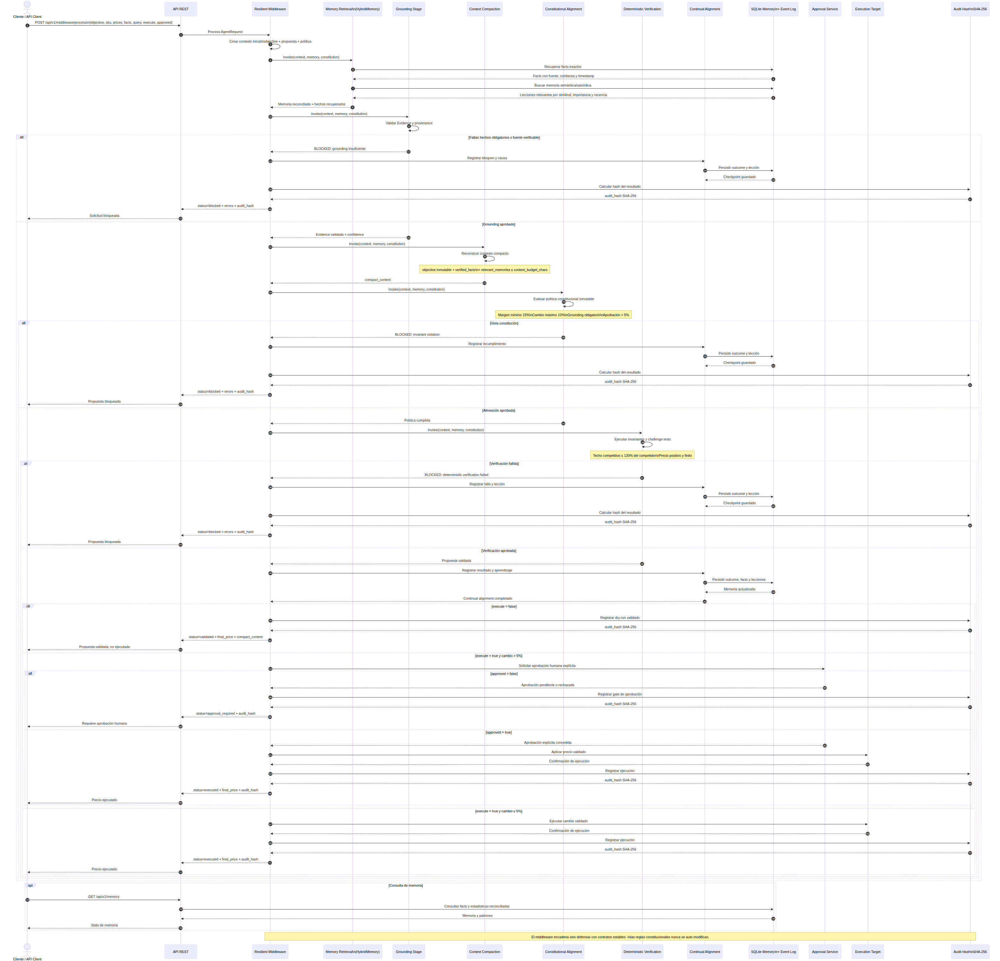
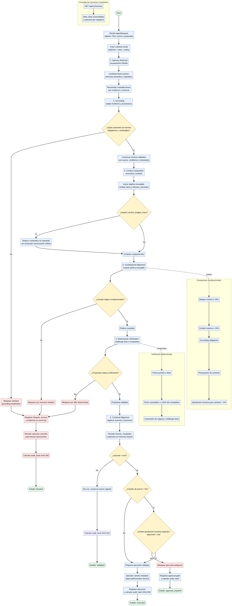

# Tomo III — UC-284

## Middleware resiliente para sistemas de IA agéntica

UC-284 detalla cómo el middleware Qbex debe invocar mecanismos especializados para mitigar las limitaciones actuales de los agentes: alucinaciones, pérdida de contexto, sobre-planificación, memoria insuficiente y deriva respecto de la intención humana.

Un middleware no resuelve estos problemas por sí solo. Actúa como plano de control que encadena recuperación, grounding, compactación, alineación, verificación y aprendizaje con contratos estables.

## Ejecución

```bash
cd /Users/utron/Documents/code-books/TomoIII/UC-284/code
python -m pip install -r requirements.txt
python UC-284.py run
python UC-284.py run --db uc284.db
python UC-284.py serve --port 5284
python -m pytest tests -q
```

## Arquitectura

```text
AgentRequest
    |
    v
[1 Memory Retrieval] -- episodic/semantic/exact memory
    |
[2 Grounding] -- provenance + confidence + required facts
    |
[3 Context Compaction] -- objective + verified facts + relevant lessons
    |
[4 Constitutional Alignment] -- immutable human policy
    |
[5 Deterministic Verification] -- business invariants/challenge tests
    |
[6 Continual Alignment] -- store outcomes and lessons
    |
validated / blocked / approval_required / executed
```

Cada stage implementa `invoke(context, memory, constitution)`. El middleware puede insertar, sustituir o deshabilitar stages sin modificar al agente o al LLM.

## Componentes

| Archivo | Responsabilidad |
|---|---|
| `models.py` | Request, evidencia, constitución y contexto del pipeline |
| `memory.py` | Memoria SQLite, recuperación híbrida y reconciliación |
| `middleware.py` | Chain of Responsibility y seis mecanismos de defensa |
| `api.py` | API Flask y card views |
| `UC-284.py` | CLI |
| `tests/` | Pruebas unitarias e integración |

## Integraciones dentro del middleware

### 1. Memoria jerárquica y escalable

`HybridMemory` separa:

- **Facts exactos**: clave/valor, fuente, confianza y timestamp.
- **Memoria semántica/episódica**: texto, tipo, importancia y fecha.
- **Recuperación híbrida**: similitud léxica, importancia y recencia.
- **Contradicciones**: una nueva creencia reemplaza a la anterior solo si tiene confianza igual o mayor.

En producción, la interfaz puede conectarse a Redis/PostgreSQL para facts y Pinecone, Weaviate, pgvector o Chroma para memoria semántica. La política de reconciliación debe mantenerse en el middleware, no en el proveedor.

### 2. Grounding contra alucinaciones

Toda decisión usa `Evidence`:

```text
key + value + source + confidence + timestamp
```

Para pricing son obligatorios `{sku}_cost` y `competitor_price`. Si falta una fuente verificable, el stage bloquea. El agente nunca puede convertir conocimiento paramétrico del LLM en un hecho confiable.

### 3. Context rebuilding

No se reinyecta una conversación infinita. En cada ejecución se reconstruye:

```json
{
  "objective": "intención humana inmutable",
  "sku": "SKU-001",
  "verified_facts": {},
  "relevant_memories": []
}
```

El resultado está limitado por `context_budget_chars`. Esto reduce pérdida de instrucciones, costo, latencia y ataques escondidos en historiales extensos.

### 4. Control de complejidad

- Máximo de stages por ejecución.
- Una responsabilidad por stage.
- Salida anticipada ante bloqueo.
- Sin bucles abiertos ni herramientas irrelevantes.
- Contratos pequeños y observables.

### 5. Constitución y alineación continua

`Constitution` contiene reglas que el modelo no puede cambiar:

- Margen mínimo de 15%.
- Cambio máximo de precio de 10%.
- Grounding obligatorio.
- Presupuesto de contexto.
- Aprobación humana para cambios superiores a 5%.

La alineación se evalúa después de proponer y antes de ejecutar. Los resultados alimentan memoria para detectar patrones futuros, pero nunca auto-modifican las reglas constitucionales.

### 6. Verificación determinista

Además de la constitución se verifica el techo competitivo: el precio no puede superar 120% del competidor. Los invariantes deben ampliarse con tests de inventario, elasticidad, regulación, discriminación, impuestos y promociones.


## Estados

| Estado | Significado |
|---|---|
| `validated` | Propuesta segura; dry-run |
| `blocked` | Falta evidencia o viola un invariante |
| `approval_required` | Cumple reglas, pero tiene impacto material |
| `executed` | Aprobada explícitamente y lista para ejecución |

## API REST

### Card view de entrada

`POST /api/v1/middleware/process`

```json
{
  "objective": "Maximizar profit preservando confianza del cliente",
  "sku": "SKU-001",
  "current_price": 249.99,
  "proposed_price": 255.0,
  "facts": {
    "SKU-001_cost": 150.0,
    "competitor_price": 245.0
  },
  "query": "lecciones de pricing y comportamiento competitivo",
  "execute": false,
  "approved": false
}
```

| Campo | Tipo | Requerido | Uso |
|---|---|---:|---|
| `objective` | string | Sí | Intención humana |
| `sku` | string | Sí | Producto |
| `current_price` | number | Sí | Estado actual |
| `proposed_price` | number | Sí | Acción propuesta |
| `facts` | object | Sí para grounding | Evidencia externa |
| `query` | string | No | Consulta de memoria |
| `execute` | boolean | No | Solicita ejecución |
| `approved` | boolean | No | Aprobación humana |

### Card view de salida

```json
{
  "status": "ok",
  "data": {
    "run_id": "8449a477fefe43cf",
    "evidence": {
      "SKU-001_cost": {
        "value": 150,
        "source": "request",
        "confidence": 0.95
      }
    },
    "compact_context": "{...}",
    "stages": [
      {"stage": "memory_retrieval", "status": "pass"},
      {"stage": "grounding", "status": "pass"},
      {"stage": "constitutional_alignment", "status": "pass"}
    ],
    "final_price": 255.0,
    "status": "validated",
    "errors": [],
    "audit_hash": "sha256..."
  }
}
```

## Endpoints

| Método | Endpoint | Uso |
|---|---|---|
| GET | `/health` | Salud |
| GET | `/api/v1/schema` | Card views |
| POST | `/api/v1/middleware/process` | Ejecutar cadena resiliente |
| GET | `/api/v1/memory` | Stats y facts reconciliados |

## Cómo invocar nuevas mejoras

```python
class DriftDetectionStage(Stage):
    name = "drift_detection"
    def invoke(self, ctx, memory, policy):
        # consultar monitor de drift
        return StageStatus.PASS

middleware = ResilientAgentMiddleware(
    stages=[RetrievalStage(), GroundingStage(), DriftDetectionStage(),
            ContextStage(), AlignmentStage(), VerificationStage(), LearningStage()]
)
```

Para producción deben añadirse adapters externos detrás de estas interfaces:

- Vector store y reranker híbrido.
- Knowledge graph temporal.
- Model registry y drift monitor.
- Policy service versionado.
- Vault para secretos.
- OpenTelemetry para trazas.
- Cola/event bus para trabajos asíncronos.
- Approval service con identidad y separación de funciones.

## Limitaciones explícitas

- La búsqueda local demuestra el algoritmo; no sustituye un índice vectorial distribuido.
- La alineación continua ajusta memoria y routing, no garantiza alineación absoluta.
- El grounding reduce alucinaciones factuales, pero depende de la calidad de las fuentes.
- SQLite sirve para demo y single-node; producción requiere un backend transaccional distribuido.
- El middleware no resuelve olvido catastrófico dentro del modelo; usa memoria externa.

## Validación

```text
11 passed
compileall: success
CLI pipeline: six stages passed
API integration: success
context budget, contradiction resolution and approval gate: tested
```
