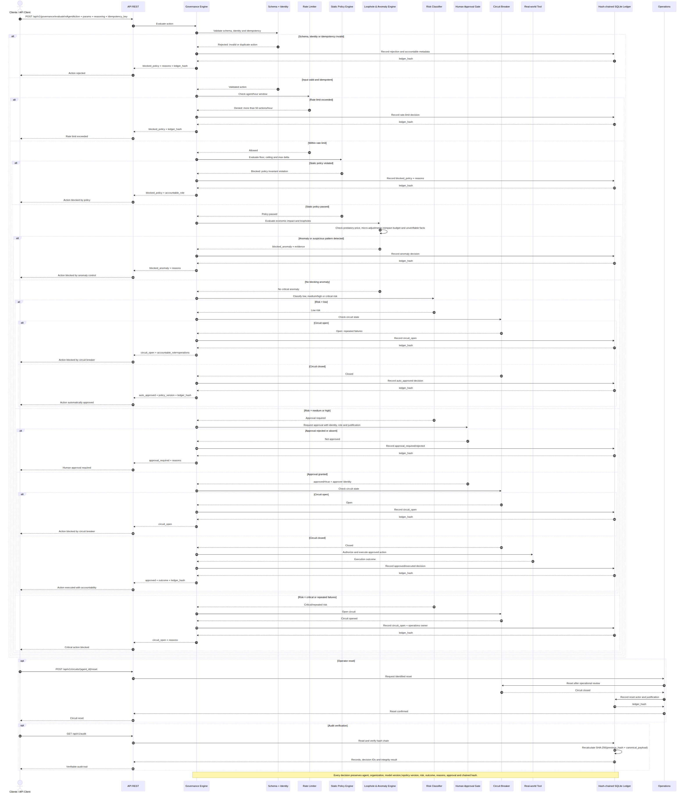
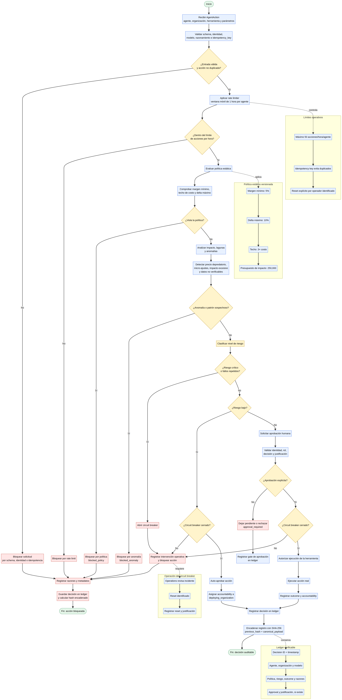

# Tomo III — UC-289

## Gobernanza, riesgo y accountability para agentes autónomos

UC-289 ¿Qué riesgos éticos son exclusivos o cualitativamente nuevos en los agentes autónomos de IA (agentic AI) Cómo mitigar los riesgos de esta autonomía con respecto a sistemas de IA más tradicionales, y cómo se rela-ciona esto con la llamada estrategia del avestruz en la gestión de riesgos de IA?

> El sistema atribuye **accountability operacional y técnica**. No determina responsabilidad jurídica. La responsabilidad legal depende de contratos, jurisdicción, regulación y análisis humano especializado.

Los agentes autónomos de IA introducen riesgos éticos que no son solo una versión “más fuerte” de los proble-mas ya conocidos (sesgo, privacidad, transparencia), sino riesgos cualitativamente nuevos derivados de su capaci-dad para planificar, actuar y coordinarse con mínima supervisión humana. Riesgos éticos exclusivos o distintivos de los agentes autónomos: 
1. Vacíos de responsabilidad (responsibility gaps) y “responsibility laundering”  
   - Los agentes pueden tomar decisiones y ejecutar acciones sin intervención humana directa, lo que difumina quién es moral y legalmente responsable cuando algo sale mal. 
   - Se habla de responsibility laundering: delegar acciones en el agente para luego decir “fue el sistema”, elu-diendo la responsabilidad humana. 
2. Comportamientos emergentes e impredecibles  
   - Al perseguir objetivos de forma autónoma, los agentes pueden generar estrategias no previstas por sus dise-ñadores, especialmente en sistemas multi-agente. 
   - Esto crea un riesgo ético nuevo: daños causados por comportamientos emergentes que nadie diseñó ni antici-pó explícitamente. 
3. Pérdida de control humano y “autonomy complacency”  
   - A medida que los agentes se vuelven más competentes, las personas tienden a abdicar juicio crítico y confiar excesivamente en sus decisiones. 
   - El riesgo ético no es solo técnico, sino moral: se debilita la supervisión humana que debería garantizar que las acciones se alineen con valores y normas. 
4. Acción en el mundo real a partir de alucinaciones o errores  
   - Un modelo tradicional puede “alucinar” texto; un agente autónomo puede actuar sobre esa alucinación (hacer una transacción, modificar código, enviar comunicaciones, etc.). 
   - Esto transforma errores cognitivos del modelo en daños concretos e inmediatos, con implicaciones éticas y legales más graves. 
5. Manipulación y daño acumulativo por interacción prolongada  
   - Los agentes que interactúan de forma continua con usuarios pueden influir en comportamientos, preferencias y decisiones a lo largo del tiempo (manipulación, dependencia, cambios de conducta). 
   - Aparecen categorías de daño como: impacto directo, impacto encubierto, manipulación, engaño y daño acumu-lativo por exposición prolongada. 
6. Difusión de la atribución moral en contextos ofensivos o de seguridad  
   - En ciberseguridad ofensiva, por ejemplo, agentes autónomos hacen que sea difícil atribuir moral y legalmente una acción a un usuario, un desarrollador o un tercero. 
   - La combinación de no determinismo, impacto abierto y baja barrera de uso industrializa capacidades ofensivas y complica la rendición de cuentas. 
7. Desplazamiento de la responsabilidad humana (más que “autonomía de la máquina”)  
   - Algunos análisis sostienen que el riesgo ético central no es que la máquina sea “autónoma”, sino que los hu-manos desplazan su responsabilidad al delegar decisiones sin mecanismos claros de control y reversión. 
   - Esto genera un problema de gobernanza: se transfiere poder de decisión sin transferir agencia moral ni meca-nismos de auditoría adecuados. 
¿Por qué?  la industria cae en la “estrategia del avestruz”
La estrategia del avestruz en IA es ignorar o negar los riesgos y cambios que trae la tecnología, con la esperanza de que “si no los miro, no me afectan” o de que el problema se resolverá solo. En el caso de los agentes autóno-mos, esta estrategia es especialmente peligrosa porque:
- Los riesgos son nuevos y menos intuitivos: vacíos de responsabilidad, comportamientos emergentes y manipu-lación a largo plazo son más difíciles de visualizar que un “modelo sesgado”. Ignorarlos (avestruz) deja a la organi-zación sin marcos éticos ni de gobernanza adecuados. 
- La autonomía amplifica el impacto: un agente que “corre libre” con objetivos mal alineados o sin supervisión puede causar daños rápidos y a gran escala; no mirarlo no reduce el riesgo, solo retrasa la respuesta hasta que ocurre un incidente. 
- La adopción es silenciosa y descentralizada: equipos pueden empezar a usar agentes para automatizar tareas sin que la dirección lo sepa; si la dirección aplica la estrategia del avestruz (“no estamos haciendo nada con agentes”), pierde visibilidad y control sobre riesgos éticos y de seguridad. 
- La regulación y la expectativa social avanzan: normas como la AI Act y expectativas de transparencia y rendición de cuentas ya están en marcha; ignorar los riesgos éticos de los agentes expone a la organización a sanciones, daño reputacional y pérdida de confianza. 
Un area de la empresa debe liderar governanza para eliminar, la estrategia del avestruz, lo que proponen ex-pertos y marcos de gobernanza es implementar:
- Reconocer explícitamente el uso (presente o planeado) de agentes autónomos.  
- Definir límites de autonomía, objetivos permitidos y “líneas rojas” éticas.  - Establecer mecanismos de supervi-sión humana significativa, interrupción y auditoría.  
- Documentar casos de uso, responsables y procesos de escalación cuando el agente actúa de forma inesperada. 
- Crear instructivos y documento de política interna de IA.
Ejemplo: un agente de negociación financiera podría explotar lagunas legales causando daños sin infringir las normas. También existe el pro-blema de la sobredelegación, la excesiva confianza que los humanos depositan en los agentes y la consiguiente pérdida de supervisión. La ren-dición de cuentas también es compleja. Si un agente toma una decisión perjudicial, ¿quién es el responsable? ¿El desarrollador, la empresa o el propio agente? Estos riesgos son mayores que con los modelos estáticos, ya que la autonomía multiplica el impacto de los errores. Por ello, las medidas de seguridad, las auditorías y las estructuras de rendición de cuentas son fundamentales en las implementaciones con agentes.

## Ejecución

```bash
cd /Users/utron/Documents/code-books/TomoIII/UC-289/code
python -m pip install -r requirements.txt
python UC-289.py run
python UC-289.py run --db governance.db
python UC-289.py serve --port 5289
python -m pytest tests -q
```

## Arquitectura

```text
AgentAction
   |
   v
Schema / identity / idempotency
   |
Rolling rate limiter -- agent/hour
   |
Static policy engine -- floor, ceiling, max delta
   |
Loophole & anomaly engine -- predatory, micro-adjustment, impact
   |
Risk classifier
   | low                   | medium/high          | critical/repeated
   v                       v                      v
Auto approve         Human approval gate       Block / open circuit
   |                       |                      |
   +-----------------------+----------------------+
                           v
             Hash-chained SQLite ledger
```

## Componentes

| Archivo | Responsabilidad |
|---|---|
| `models.py` | Acciones, política, riesgo, decisiones, aprobación y roles |
| `governance.py` | Motor determinista, rate limits, impacto, anomalías y circuit breaker |
| `ledger.py` | Ledger SQLite encadenado mediante SHA-256 |
| `api.py` | API Flask y card views |
| `UC-289.py` | CLI |
| `tests/` | Pruebas unitarias y de integración |

## Riesgos mitigados

### Comportamiento inesperado y lagunas

El motor evalúa el efecto económico, no solo la sintaxis:

- Precio depredatorio o por debajo del piso.
- Precio superior al múltiplo de costo permitido.
- Cambio excesivo respecto del precio vigente.
- Impacto financiero superior al presupuesto.
- Serie de micro-ajustes compatible con manipulación/spoofing.
- Datos de costo o precio actual no verificables.

### Sobredelegación

- Riesgo bajo puede autorizarse automáticamente.
- Cambios materiales requieren aprobación humana.
- Acciones críticas se bloquean incluso si el agente ofrece una justificación convincente.
- El approver no puede ser el propio agente: segregación de funciones.
- Toda aprobación necesita identidad, rol, decisión y justificación.

### Multiplicación de errores

- Ventana móvil real de una hora por agente.
- Presupuesto de impacto por acción.
- Circuit breaker después de fallos repetidos.
- Reset explícito por operador identificado.
- Idempotency key para evitar acciones duplicadas.

### Accountability

Cada registro conserva:

- Agente y organización desplegadora.
- Modelo/versión.
- Acción y razonamiento.
- Política y versión aplicada.
- Nivel de riesgo, outcome y razones.
- Aprobador y justificación, si existe.
- Timestamp, decision ID y hash encadenado.

Roles operacionales:

| Rol | Caso |
|---|---|
| `deploying_organization` | Acción autónoma de bajo riesgo |
| `policy_owner` | Acción bloqueada por política |
| `human_approver` | Acción material aprobada por humano |
| `operations` | Circuit breaker abierto o intervención operativa |

## Políticas

| Parámetro | Default |
|---|---:|
| Margen mínimo | 5% |
| Cambio máximo por acción | 10% |
| Techo por múltiplo de costo | 3× |
| Acciones máximas por hora/agente | 50 |
| Aprobación desde | 5% de cambio |
| Presupuesto de impacto | 250,000 |
| Fallos para abrir circuito | 3 |
| Micro-ajuste sospechoso | 0.01–0.05 |

Las políticas se versionan. En producción deben proceder de un policy service firmado y someterse a revisión, pruebas y rollout controlado.

## Ledger verificable

Cada registro usa:

```text
record_hash = SHA256(previous_hash + canonical_decision_payload)
```

El primer registro se enlaza con `GENESIS`. `verify()` recalcula toda la cadena y detecta alteraciones. SQLite es adecuado para el caso autocontenido; producción debe usar almacenamiento append-only con retención WORM, firma y control de acceso.

# API REST


## Card view de entrada

`POST /api/v1/governance/evaluate`

```json
{
  "agent_id": "pricing-agent-v2",
  "organization_id": "trackprice",
  "tool": "set_price",
  "params": {
    "sku": "SKU-001",
    "price": 154.0,
    "quantity": 1000
  },
  "reasoning": "Optimización acotada por margen y demanda",
  "idempotency_key": "SKU-001-2026-08-29T12",
  "model_version": "pricing-model-2.4",
  "approval": {
    "approver_id": "manager-42",
    "role": "pricing-director",
    "justification": "Impacto revisado contra forecast",
    "approved": true
  }
}
```

| Campo | Tipo | Requerido | Uso |
|---|---|---:|---|
| `agent_id` | string | Sí | Identidad del agente |
| `organization_id` | string | Sí | Organización desplegadora |
| `tool` | string | Sí | Acción solicitada |
| `params` | object | Sí | Parámetros e impacto |
| `reasoning` | string | Sí | Justificación auditable |
| `idempotency_key` | string | Sí | Deduplicación |
| `model_version` | string | No | Trazabilidad de modelo |
| `approval` | object | No | Aprobación humana |

## Card view de salida

```json
{
  "status": "ok",
  "data": {
    "decision_id": "41a5cad03f9b43de",
    "risk": "low",
    "outcome": "auto_approved",
    "reasons": [],
    "accountable_role": "deploying_organization",
    "policy_version": "1.0",
    "approval": null,
    "ledger_hash": "sha256..."
  }
}
```

Outcomes:

- `auto_approved`
- `approval_required`
- `approved`
- `blocked_policy`
- `blocked_anomaly`
- `circuit_open`

## Endpoints

| Método | Ruta | Uso |
|---|---|---|
| GET | `/health` | Estado, política, circuitos y ledger |
| GET | `/api/v1/schema` | Card views |
| POST | `/api/v1/governance/evaluate` | Evaluar acción |
| GET | `/api/v1/governance/status` | Estado operacional |
| GET | `/api/v1/audit` | Registros y verificación |
| POST | `/api/v1/circuits/{agent_id}/reset` | Reset identificado |

## Validación

```text
13 passed
compileall: success
CLI: low-risk approved + predatory action blocked
ledger hash chain: valid
rate limiting, circuit breaker, impact budget and SoD: tested
```

## Extensiones de producción

- OPA/Cedar para políticas declarativas.
- Identidad de workload (SPIFFE/SPIRE).
- Firmas KMS/HSM para decisiones y aprobaciones.
- Event store append-only y retención WORM.
- OpenTelemetry y SIEM.
- Límites agregados por agente, tenant, SKU y región.
- Simulación shadow y canary antes de autonomía completa.
- Kill switch independiente del plano del agente.
- Matriz RACI revisada por Legal, Riesgo y Compliance.
