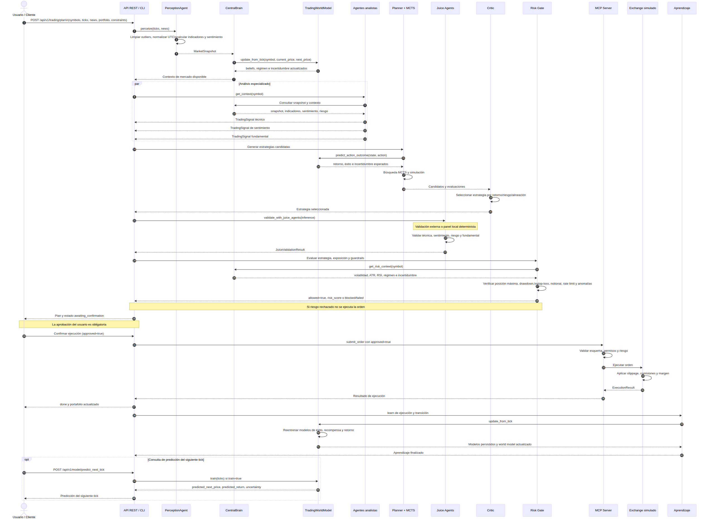
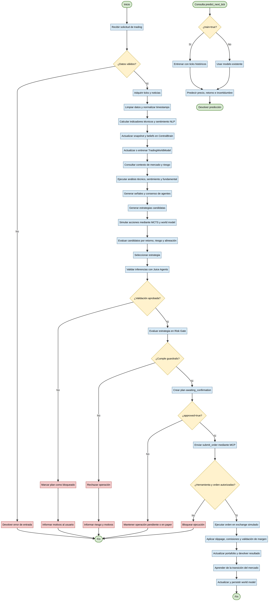

# TomoIII — UC-292

## Multi-Agente de Trading: Percepción del Entorno y Ciclo Agente-Entorno

UC-292 implementa un sistema **agentic AI** para mercados financieros. Un agente asesor de trading percibe datos brutos de mercado, los transforma en un modelo del mundo estructurado, razona con múltiples agentes especializados, valida inferencias con **Juice Agents**, se conecta con herramientas vía **MCP**, gestiona riesgo y ejecuta órdenes en un exchange simulado.

```text
  ┌─────────────┐      ┌──────────────┐      ┌────────────────┐
  │  Sensores   │----->│  Percepción  │----->│ Modelo Mundo   │
  │ ticks/news  │      │ técnica/NLP  │      │ probabilístico │
  └─────────────┘      └──────────────┘      └────────────────┘
                                                        │
  ┌────────────────┐   ┌──────────────┐   ┌─────────────▼──────────┐
  │  Ejecución     │<--│ Risk Gate /  │<--│ Estrategias + MCTS     │
  │  exchange sim  │   │ confirmación │   │ Juice validation       │
  └────────────────┘   └──────────────┘   └────────────────────────┘
          │
  ┌───────▼────────┐
  │ Aprendizaje    │ (world model update / retrain)
  └────────────────┘
```

## Ejecución

```bash
cd /Users/utron/Documents/code-books/TomoIII/UC-292/code
python -m pip install -r requirements.txt

# Demo completo con datos sintéticos (paper, sin aprobar)
python UC-292.py run

# Demo ejecutando orden aprobada
python UC-292.py run --approved

# Procesar ticks/noticias de un archivo JSON
python agent_run.py perceive --input tick.json --symbol AAPL
python agent_run.py analyze --input tick.json --symbol AAPL
python agent_run.py plan --input request.json
python agent_run.py execute --input request.json

# Entrenar world model
python agent_run.py train --samples 500

# Servir API REST
python agent_run.py serve --port 5292

# Tests
python -m pytest tests -q
```

## Arquitectura

| Archivo | Responsabilidad |
|---|---|
| `config.py` | Configuración centralizada por variables de entorno `UC292_*` |
| `models.py` | Modelos Pydantic: ticks, noticias, señales, portafolio, transiciones, resultados, MCP |
| `technical_indicators.py` | Indicadores técnicos reutilizables (SMA, EMA, RSI, MACD, ATR, OBV, Bollinger) |
| `perception.py` | Pipeline de percepción: limpieza, outliers, NLP ligero, sentimiento, snapshot |
| `probabilistic_model.py` | Cerebro del world model: MLP y GP para predecir éxito, recompensa y **siguiente retorno de tick** |
| `world_model.py` | World model de trading con `predict_next_price`, `update_from_tick` y reentrenamiento |
| `central_brain.py` | Cerebro central: world model + percepción + estado compartido consultado por agentes |
| `market_data.py` | Generador sintético de ticks para entrenamiento y backtests |
| `exchange.py` | Exchange simulado con slippage, comisiones y validación de margen |
| `risk.py` | Motor de riesgo, guardrails, circuit breaker, rate limit, anomalías |
| `juice_agents.py` | Validadores especializados (técnico, sentimiento, riesgo, fundamental) |
| `mcp_server.py` | Registro dinámico de herramientas MCP con JSON Schema y riesgo |
| `trading_agents.py` | Agentes especializados: técnico, sentimiento, fundamental, trader, portfolio manager |
| `planner.py` / `mcts.py` | Generación de estrategias candidatas + búsqueda MCTS |
| `critic.py` | Evaluación y selección de estrategias por retorno/riesgo/alineación |
| `nodes.py` / `graph.py` / `state.py` | Grafo LangGraph del ciclo agente-entorno |
| `api.py` | API REST Flask con card views de entrada/salida |
| `agent_run.py` / `UC-292.py` | CLI y punto de entrada |
| `tests/` | Pruebas unitarias e integración |

## Cerebro Central (CentralBrain)

`CentralBrain` es la interfaz única de consulta para todos los agentes. Encapsula el world model, el pipeline de percepción, el estado de mercado actual, las creencias (particle filter) y las predicciones. Cada agente consulta el cerebro en lugar de acceder directamente a los datos brutos:

- `observe(request)`: procesa ticks/noticias y actualiza snapshots, historial y beliefs.
- `get_context(symbol)`: devuelve snapshot, belief, régimen, sentimiento, predicción de precio, incertidumbre y contexto de riesgo.
- `predict_next_price(symbol)`: predicción del siguiente tick.
- `get_risk_context(symbol)`: volatilidad, ATR, RSI, régimen e incertidumbre para el motor de riesgo.
- `predict_action_outcome(state, action)`: transición (s, a) consultada al world model.
- `to_dict()`: estado serializable del cerebro.

<ref_file file="/Users/utron/Documents/code-books/TomoIII/UC-292/code/central_brain.py" />

## World Model Brain — Arquitectura Técnica Exhaustiva

El cerebro de UC-292 es un **modelo probabilístico híbrido** compuesto por un predictor neuronal, un estimador empírico, un filtro de partículas para estados ocultos y un mecanismo de reentrenamiento continuo. Su objetivo es predecir el siguiente tick, estimar el éxito/recompensa de una acción y mejorar con cada interacción.

### 1. Datos de entrada y codificación del estado

Cada transición se codifica como un vector fijo de dimensión `embedding_dim * 2 + belief_dim` (por defecto 38). Los componentes son:

- **Estado de mercado normalizado**: `latest_price/1000`, `sma_fast/1000`, `sma_slow/1000`, `rsi/100`, `macd/100`, `macd_signal/100`, `atr/100`, `bollinger_position`, `obv/1e6`, `volume_trend`, `trend_direction`, `volatility*100`, `price/1000`, `cash/1e6`, `position/1000`.
- **Acción**: `side` codificado como 0=HOLD, 0.5=BUY, 1.0=SELL; `quantity/1000`; `price/1000`.
- **Belief**: media y desviación de sentimiento oculto, proporción de partículas "whale", confianza del belief.

El encoder se encuentra en `StateEncoder`.

<ref_file file="/Users/utron/Documents/code-books/TomoIII/UC-292/code/probabilistic_model.py" />

### 2. Arquitectura del modelo

`NeuralTransitionModel` entrena tres MLPs independientes con scikit-learn:

| Modelo | Salida | Propósito |
|---|---|---|
| `model_success` | probabilidad [0,1] | Probabilidad de que una orden se ejecute con éxito |
| `model_reward` | recompensa real | Retorno ajustado por riesgo esperado de la transición |
| `model_next_return` | retorno real | Retorno esperado del siguiente tick (`(p_{t+1}-p_t)/p_t`) |

Hiperparámetros por defecto:

- `hidden_layers = (64, 32)`
- `max_iter = 500`
- `activation = 'relu'` (default de MLPRegressor)
- `solver = 'adam'`
- `embedding_dim = 16`
- `min_samples_to_train = 5`

Como alternativa bayesiana se ofrece `GPTransitionModel` (Gaussian Process con kernel RBF + WhiteKernel) para recompensa e incertidumbre epistémica, activado con `UC292_WORLD_MODEL_TYPE=gp`.

### 3. Pipeline de entrenamiento

#### 3.1 Online learning (`update_from_tick`)

Cada par de ticks consecutivos genera una experiencia:

```
(current_price, next_price) -> compute actual_return
        |
        v
add_experience(state, action, next_state, reward=actual_return, next_return=actual_return)
        |
        v
update empirical estimate for (symbol, side)
        |
        v
if observations_since_train >= retrain_after
   or uncertainty > uncertainty_retrain_threshold
   or avg_prediction_error > prediction_error_retrain_threshold:
        retrain()
```

Parámetros clave:

- `retrain_after = 10`
- `uncertainty_retrain_threshold = 0.5`
- `prediction_error_retrain_threshold = 0.3`
- `prediction_error_window = 20`

#### 3.2 Batch learning (`train_world_model`)

Genera `n_samples` trayectorias sintéticas y alimenta el modelo sin disparar reentrenamientos parciales (se elevan temporalmente los umbrales); al final se llama a `retrain()` una sola vez. Persiste los modelos con `joblib`.

```bash
python agent_run.py train --samples 1000 --output-dir models/uc292_brain
```

#### 3.3 Aprendizaje desde interacciones de agentes

Durante el ciclo LangGraph:

1. `simulate_node` ejecuta rollouts Monte Carlo.
2. Cada rollout produce una transición simulada.
3. `record_transition` la almacena en el world model, SQLite y vector store.
4. `execute_node` genera observaciones reales (éxito/fallo, costo, PnL).
5. `learn_node` llama `update_from_observation`, actualizando estimaciones empíricas y, si es necesario, reentrenando.

### 4. Pipeline de inferencia


Dado un estado `s` y una acción `a`, el world model:

1. Codifica `(s, a, belief)`.
2. Consulta los tres MLPs.
3. Combina la predicción neuronal con el prior empírico:
   ```
   weight = min(0.8, empirical_attempts / 10)
   combined = weight * empirical + (1 - weight) * neural
   ```
4. Predice el retorno del siguiente tick mezclando `model_next_return` (70%) y la media empírica (30%).
5. Añade ruido gaussiano proporcional a la volatilidad observada.
6. Calcula el siguiente precio: `p_{t+1} = max(0.01, p_t * (1 + retorno_predicho + ruido))`.
7. Actualiza portafolio, recompensa y probabilidad de éxito.

<ref_file file="/Users/utron/Documents/code-books/TomoIII/UC-292/code/world_model.py" />

### 5. Filtro de partículas (estado oculto)

`BeliefStateTracker` mantiene 100 partículas sobre variables ocultas:

- `sentiment`: drift de sentimiento de mercado.
- `whale`: evento de gran participante (5% de probabilidad inicial).
- `vol`: volatilidad oculta.

Cada observación de precio actualiza los pesos por likelihood gaussiana y realiza **systematic resampling** cuando la entropía cae.

### 6. Hiperparámetros y ajuste (hypertuning)

| Parámetro | Default | Efecto | Ajuste recomendado |
|---|---|---|---|
| `UC292_WORLD_MODEL_TYPE` | neural | Tipo de modelo | neural para datos abundantes; gp para incertidumbre epistémica |
| `UC292_EMBEDDING_DIM` | 16 | Dimensión del vector de estado | aumentar si se añaden más features |
| `UC292_NN_MAX_ITER` | 500 | Iteraciones MLP | subir si el loss no converge |
| `UC292_MIN_SAMPLES_TO_TRAIN` | 5 | Mínimo de muestras para entrenar | subir si hay sobreajuste |
| `UC292_RETRAIN_AFTER` | 10 | Periodo de reentrenamiento online | bajar para adaptación rápida; subir para estabilidad |
| `UC292_UNCERTAINTY_RETRAIN_THRESHOLD` | 0.5 | Disparador de reentreno por incertidumbre | bajar para reacción más sensible |
| `UC292_LEARNING_RATE` | 0.2 | Tasa de actualización de estimaciones empíricas | bajar en mercados estacionarios |
| `UC292_MCTS_ITERATIONS` | 200 | Iteraciones MCTS | subir para mayor exploración |
| `UC292_MC_SIMULATIONS_PER_STRATEGY` | 100 | Rollouts por estrategia | subir para estimaciones más estables |
| `UC292_RISK_AVERSION` | 0.5 | Peso del riesgo en el crítico | subir para portafolios conservadores |

Estrategia de hypertuning:

1. Generar un dataset sintético de validación fijo con `SyntheticMarketDataGenerator`.
2. Entrenar el brain con diferentes combinaciones de `embedding_dim`, `hidden_layers`, `max_iter`, `retrain_after` y `learning_rate`.
3. Medir MAPE y directional accuracy sobre el hold-out.
4. Seleccionar la configuración que minimice `MAPE + λ * (1 - directional_accuracy)`.
5. Fijar los hiperparámetros en variables de entorno o `config.py`.

### 7. Archivos de salida del cerebro

Tras entrenar (`python agent_run.py train`):

```
models/
├── neural_success_model.joblib
├── neural_reward_model.joblib
├── neural_next_return_model.joblib
├── gp_model.joblib          # solo si UC292_WORLD_MODEL_TYPE=gp
└── model_metadata.json
```

Además, si están configurados:

- `UC292_SQLITE_PATH`: transiciones, observaciones y lotes de entrenamiento.
- `UC292_VECTOR_STORE_PATH`: embeddings de transiciones para recuperación de experiencias similares.

### 8. Esquemas de entrenamiento

#### Online

```json
{
  "symbol": "AAPL",
  "current_price": 150.0,
  "next_price": 151.2,
  "side": "BUY",
  "quantity": 10
}
```

Proceso: `update_from_tick` -> `add_experience` -> posible `retrain()`.

#### Batch

```bash
POST /api/v1/model/train
{
  "samples": 1000,
  "output_dir": "models/uc292_brain"
}
```

Respuesta:

```json
{
  "status": "trained",
  "metadata": {
    "n_samples": 1000,
    "n_transitions": 599400,
    "n_observations": 599400,
    "model_type": "neural",
    "embedding_dim": 16
  },
  "saved_paths": {
    "neural_success": "models/uc292_brain/neural_success_model.joblib",
    "neural_reward": "models/uc292_brain/neural_reward_model.joblib",
    "neural_next_return": "models/uc292_brain/neural_next_return_model.joblib",
    "metadata": "models/uc292_brain/model_metadata.json"
  }
}
```

#### Inferencia

```bash
POST /api/v1/model/predict_next_tick
{
  "symbol": "AAPL",
  "current_price": 150.0
}
```

Respuesta:

```json
{
  "symbol": "AAPL",
  "current_price": 150.0,
  "predicted_next_price": 150.45,
  "predicted_return": 0.003,
  "model_return": 0.003,
  "empirical_return": 0.0012,
  "uncertainty": 0.17,
  "model_type": "neural"
}
```

### 9. Cómo los agentes consumen el cerebro

```text
PerceptionAgent  -> CentralBrain.observe()              -> snapshot + belief
TechnicalAgent   -> snapshot.features                 -> señal técnica
SentimentAgent   -> snapshot.news_sentiment           -> señal de sentimiento
TraderAgent      -> risk_context + signals            -> orden candidata
JuiceValidator   -> signal + snapshot                -> validación
RiskEngine       -> brain.get_risk_context()          -> guardrails
Planner/MCTS     -> world_model.predict_transition()  -> simular estrategias
Critic           -> expected_return / risk            -> selección
Executor         -> exchange + observations           -> feedback al brain
```

### 10. Validación del cerebro

```bash
python validate_brain.py
```

Genera `brain_validation_report.json` con métricas porcentuales:

- `trained_model`: true/false
- `mape_percent`: error porcentual medio absoluto
- `directional_accuracy_percent`: acierto en dirección sube/baja
- `within_1_percent`, `within_5_percent`, `within_10_percent`: predicciones dentro del umbral
- `consistency_percent`: 100% si snapshot, belief, predicción y contexto de riesgo existen

CLI de uso rápido:

```bash
python agent_run.py predict-tick --input aapl_ticks.json --symbol AAPL
python agent_run.py brain --input aapl_ticks.json --symbol AAPL
```

## Pipeline de Percepción

1. **Adquisición**: ticks `bid/ask/last/volume` y noticias con `source`, `published_at`, `received_at`.
2. **Limpieza**: descarte de outliers (`zscore < 4`), timestamps UTC, resampleo/forward-fill.
3. **Feature Engineering**: RSI, MACD, ATR, OBV, Bollinger, volatilidad, tendencia.
4. **NLP ligero**: tokenización, stopwords, detección de entidades (tickers), sentimiento léxico, scoring de fuente, latencia.
5. **Modelo del mundo**: snapshot con régimen de mercado, indicadores y sentimiento agregado.

## Agentes Especializados

| Agente | Rol | Salida |
|---|---|---|
| `PerceptionAgent` | Preprocesa datos brutos | `MarketSnapshot` |
| `TechnicalAnalyst` | Señales basadas en indicadores | `TradingSignal` |
| `SentimentAnalyst` | Señales desde noticias | `TradingSignal` |
| `FundamentalAnalyst` | Placeholder macro/earnings | `TradingSignal` |
| `TraderAgent` | Consenso y generación de orden | `AgentAction` |
| `PortfolioManager` | Supervisión de exposición | lista de acciones aprobadas |
| `JuiceValidator` | Validación adversarial de inferencias | `JuiceValidationResult` |

## Juice Agents

Juice Agents actúa como panel de validación independiente de las inferencias del modelo:

- `JuiceTechnicalAgent`: detecta señales contra la tendencia, RSI extremo, volatilidad alta.
- `JuiceSentimentAgent`: valida coherencia entre sentimiento de noticias y dirección propuesta.
- `JuiceRiskAgent`: revisa stop-loss, tamaño de posición y volatilidad.
- `JuiceFundamentalAgent`: stub para validaciones macro/earnings.

Si `JUICE_ENABLED=true` y `JUICE_URL` están configurados, las inferencias se envían al endpoint externo; de lo contrario se ejecuta el panel local determinista.

## MCP - Herramientas Dinámicas

El sistema expone herramientas MCP:

| Tool | Riesgo | Función |
|---|---|---|
| `get_market_snapshot` | safe | Snapshot procesado |
| `run_technical_analysis` | safe | Indicadores técnicos |
| `run_risk_assessment` | safe | Evaluación de riesgo |
| `validate_with_juice_agents` | safe | Validación de inferencias |
| `get_portfolio` | safe | Estado del portafolio |
| `submit_order` | dangerous | Ejecución de orden (requiere `approved=true`) |

## Riesgo y Guardrails

- Tamaño máximo de posición (% del portafolio).
- Drawdown máximo.
- Stop-loss / take-profit obligatorios.
- Notional máximo por operación.
- Rate limiting por minuto.
- Circuit breaker tras N fallos consecutivos.
- Detección de saltos de precio anómalos.
- Validación de confianza mínima de señal.

## Grafo LangGraph

```text
START -> perceive -> analyze -> validate -> plan -> simulate -> evaluate -> risk_gate -> confirm_or_execute
                                                                                         │
                                                                                    awaiting_confirmation -> finalize
                                                                                         │
                                                                                    execute -> learn -> finalize -> END
```

## API REST - Card view de entrada

### `POST /api/v1/market/perceive`

```json
{
  "symbol": "AAPL",
  "ticks": [
    {
      "timestamp": "2026-07-09T06:25:00.123Z",
      "symbol": "AAPL",
      "bid": 234.56,
      "ask": 234.58,
      "last_price": 234.57,
      "volume": 45238921
    }
  ],
  "news": [
    {"text": "AAPL announces partnership with OpenAI", "source": "bloomberg"}
  ]
}
```

| Campo | Tipo | Requerido | Descripción |
|---|---|---|---|
| `symbol` | string | Sí | Ticker |
| `ticks` | list[object] | Sí | Serie de ticks |
| `news` | list[object] | No | Noticias con `text`, `source`, timestamps |

### `POST /api/v1/trading/plan`

```json
{
  "symbols": ["AAPL"],
  "ticks": [...],
  "news": [...],
  "portfolio": {"cash": 100000, "positions": {}},
  "constraints": {"max_position_pct": 0.2, "max_drawdown_pct": 0.05},
  "risk_tolerance": "moderate",
  "mode": "paper",
  "approved": false
}
```

| Campo | Tipo | Requerido | Descripción |
|---|---|---|---|
| `symbols` | list[string] | Sí | Activos a analizar |
| `ticks` | list[object] | Sí | Ticks (al menos 50 recomendado) |
| `news` | list[object] | No | Noticias |
| `portfolio` | object | No | `cash`, `positions` |
| `constraints` | object | No | Restricciones de riesgo |
| `risk_tolerance` | string | No | `conservative`/`moderate`/`aggressive` |
| `mode` | string | No | `paper`/`live`/`sim` |
| `approved` | boolean | No | Autoriza ejecución de orden |

### `POST /api/v1/model/predict_next_tick`

Predice el siguiente tick price para un símbolo y entrena el cerebro con ticks previos si `train=true`.

```json
{
  "symbol": "AAPL",
  "current_price": 150.25,
  "ticks": [{"last_price": 150.0, "volume": 1000}, ...],
  "train": true
}
```

| Campo | Tipo | Requerido | Descripción |
|---|---|---|---|
| `symbol` | string | Sí | Ticker |
| `current_price` | number | No* | Precio actual (se usa el último de `ticks` si se omite) |
| `ticks` | list[object] | No* | Serie histórica para entrenar/retroalimentar |
| `train` | boolean | No | Entrenar con `ticks` antes de predecir |

*Requerido `current_price` o `ticks` con al menos un elemento.

## API REST - Card view de salida

### `POST /api/v1/trading/plan`

```json
{
  "status": "ok",
  "timestamp": "2026-09-02T...",
  "data": {
    "request_id": "...",
    "status": "awaiting_confirmation",
    "snapshots": {
      "AAPL": {
        "latest_price": 234.57,
        "features": {"rsi": 68, "macd": 0.12, ...},
        "regime": "trending_bullish"
      }
    },
    "signals": [
      {"symbol": "AAPL", "side": "BUY", "confidence": 0.82, ...}
    ],
    "juice_validations": [
      {"consensus_score": 0.78, "approved": true, "issues": []}
    ],
    "candidates": [...],
    "evaluations": [...],
    "selected_strategy": {...},
    "risk_decision": {"allowed": true, "risk_score": 0.12},
    "requires_confirmation": true
  }
}
```

| Campo | Tipo | Descripción |
|---|---|---|
| `request_id` | string | Identificador de la solicitud |
| `status` | string | `done`, `awaiting_confirmation`, `blocked`, `failed` |
| `snapshots` | object | Snapshot por símbolo |
| `signals` | list[object] | Señales de analistas |
| `juice_validations` | list[object] | Validaciones de Juice Agents |
| `candidates` | list[object] | Estrategias candidatas |
| `evaluations` | list[object] | Puntuaciones del crítico |
| `selected_strategy` | object | Estrategia elegida |
| `risk_decision` | object | Dictamen del motor de riesgo |
| `execution_result` | object | Resultado de ejecución (si `approved`) |
| `portfolio` | object | Portafolio actualizado |
| `requires_confirmation` | boolean | Si requiere aprobación humana |

### `POST /api/v1/model/predict_next_tick`

| Campo | Tipo | Descripción |
|---|---|---|
| `symbol` | string | Ticker |
| `current_price` | number | Precio de entrada |
| `predicted_next_price` | number | Precio predicho para el siguiente tick |
| `predicted_return` | number | Retorno predicho |
| `uncertainty` | number | Incertidumbre del modelo |
| `model_type` | string | Tipo de modelo usado |

### `POST /api/v1/brain/query`

| Campo | Tipo | Descripción |
|---|---|---|
| `symbol` | string | Ticker |
| `request_id` | string | ID de la solicitud |
| `snapshot` | object | Snapshot de mercado |
| `belief` | object | Creencias del particle filter |
| `regime` | string | Régimen de mercado |
| `sentiment` | number | Sentimiento agregado |
| `uncertainty` | number | Incertidumbre del world model |
| `price_prediction` | object | Predicción del siguiente tick |
| `risk_context` | object | Contexto de riesgo |

### `GET /api/v1/brain/state`

| Campo | Tipo | Descripción |
|---|---|---|
| `request_id` | string | ID de la última solicitud |
| `symbols` | list[string] | Símbolos observados |
| `snapshots` | object | Snapshots por símbolo |
| `beliefs` | object | Creencias por símbolo |
| `last_predictions` | object | Últimas predicciones |
| `world_model` | object | Estado del world model |

## Endpoints

| Método | Endpoint | Uso |
|---|---|---|
| GET | `/health` | Salud |
| GET | `/api/v1/schema` | Card views |
| POST | `/api/v1/market/perceive` | Preprocesar ticks/news |
| POST | `/api/v1/market/analyze` | Análisis técnico + sentimiento |
| POST | `/api/v1/trading/plan` | Planificar sin ejecutar |
| POST | `/api/v1/trading/execute` | Planificar y ejecutar aprobado |
| POST | `/api/v1/model/train` | Entrenar world model |
| GET | `/api/v1/model/world_model` | Estado del world model |
| POST | `/api/v1/model/predict_next_tick` | Predecir siguiente tick y entrenar cerebro |
| GET | `/api/v1/brain/state` | Estado completo del cerebro central |
| POST | `/api/v1/brain/observe` | Alimentar cerebro con ticks/noticias |
| POST | `/api/v1/brain/query` | Consultar contexto de un símbolo |
| POST | `/api/v1/brain/predict_next_tick` | Predecir siguiente tick desde el cerebro |
| GET | `/api/v1/mcp/tools` | Listar herramientas MCP |
| POST | `/api/v1/mcp/call` | Invocar herramienta MCP |

## Variables de Entorno

| Variable | Default | Descripción |
|---|---|---|
| `UC292_PORT` | 5292 | Puerto de la API |
| `UC292_WORLD_MODEL_TYPE` | neural | `neural`/`gp`/`hybrid` |
| `UC292_JUICE_ENABLED` | false | Habilitar validación externa |
| `UC292_JUICE_URL` | "" | Endpoint de Juice Agents |
| `UC292_SQLITE_PATH` | "" | Ruta a base SQLite |
| `UC292_USE_VECTOR_STORE` | true | Habilitar vector store simple |

## Seguridad y Escalabilidad

- No se ejecutan órdenes reales a menos que `mode=live` y `approved=true`.
- El motor de riesgo es determinista y configurable.
- Persistencia desacoplable: SQLite, joblib, vector store.
- Componentes con interfaces claras para reemplazar por feeds reales, brokers o LLMs.
- Tests unitarios e integración con pytest.

## Validación

```text
python -m pytest tests -q
python -m compileall -q .
python agent_run.py run --approved
```

Estados finales esperados: `done` o `awaiting_confirmation`, con snapshots, señales, evaluaciones y decisión de riesgo.
