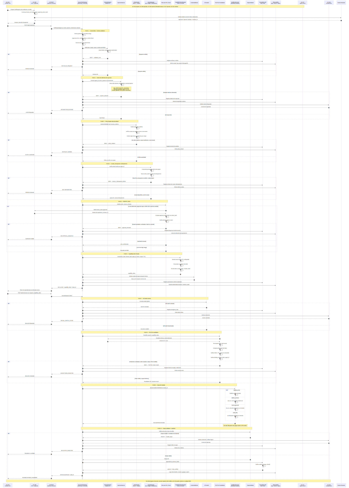

# TomoIII
## AI-Native Operations & Agentic Patterns
### CASE: UC-300 Secure Tool Gateway — capa defensiva entre UC-290 (HITL/approval) y UC-317 (ejecución de agentes)

#### USO: . INTERNO

#### EXECUTION
```bash
cd /Users/utron/Documents/code-books/TomoIII/UC-300/code
python validate_uc300.py   # validación operacional
pytest tests_uc300 -v      # suite de pruebas
python UC-300.py demo      # escenarios de demo
python api_300.py --port 5300   # servicio REST Flask
```


# DESCRIPTION
UC-300 implementa un **Secure Tool Gateway** que se interpone entre la capa de decisión/approval (UC-290) y el runtime de agentes (UC-317). Su objetivo es neutralizar los dos riesgos principales del uso de herramientas por agentes de IA:

UC-315 propone; UC-290 evalúa y aprueba; UC-300 autoriza la llamada exacta; UC-317 ejecuta; UC-324 contiene.

La suite cubre autorización, acceso cross-tenant, inyección, validación semántica, aprobación humana, alteración de parámetros, expiración, replay, idempotencia, cuotas, sandbox, kill switch, auditoría y API.

1. **Acceso no autorizado:** un agente es engañado o forzado a actuar sobre recursos que no le pertenecen.
2. **Inyección de comandos/prompts:** un actor malicioso introduce payloads en parámetros o instrucciones para ejecutar acciones no deseadas.

# Capacidades implementadas
Validación estricta con esquemas versionables y rechazo de campos adicionales.
Canonicalización y validación semántica de parámetros.
Detección defensiva de command, SQL y prompt injection.
Motor de políticas independiente con deny-by-default.
Autorización por agente, herramienta, recurso y entorno.
Credenciales opacas, temporales y de mínimo privilegio.
Capability tokens HMAC:
TTL.
Nonce.
Uso único.
Anti-replay.
Vinculación a agente, acción, parámetros y expediente UC-290.
Aprobación humana ligada al hash exacto de la acción.
Protección TOCTOU mediante revalidación antes de ejecutar.
Rate limits, presupuesto e idempotencia.
Kill switch externo.
Auditoría inmutable con cadena de hashes.
Sandbox simulado con herramientas allowlisted.
Validación de outputs.
Eliminaciones y pagos ejecutados exclusivamente como dry-run.
Sin acceso a shell, sistema de archivos, pagos o APIs reales.

La solución es **deny-by-default**, con pipeline estricto:

```
request → canonicalize → schema validation → injection detection
        → policy engine (RBAC + scopes) → quota/idempotency
        → risk/HITL check → capability token issuance
        → execute → TOCTOU revalidation → sandbox simulated handlers
        → output validation → immutable audit
```

No ejecuta shell, filesystem, pagos ni APIs reales. Todas las herramientas se ejecutan en un **sandbox simulado** con `dry-run` para operaciones destructivas.

# ARCHITECTURE

## Componentes principales

| Módulo | Responsabilidad |
|--------|-----------------|
| `models_300.py` | Dataclasses: `ToolRequest`, `AuthorizationDecision`, `ExecutionResult`, `AuditEntry`, etc. |
| `schema_registry.py` | Esquemas Pydantic v2 estrictos (`extra='forbid'`), canonicalización, validación semántica. |
| `injection_detector.py` | Detección estática de inyección de comandos y prompt injection. |
| `policy_engine.py` | Motor de políticas deny-by-default por identidad, tool, recurso y entorno. |
| `capability_tokens.py` | Tokens HMAC firmados, nonce, TTL, one-use, vinculados a action_hash + dossier_hash. |
| `credential_broker.py` | Credenciales opacas temporales de mínimo privilegio. |
| `quota_manager.py` | Rate limit, presupuesto diario e idempotencia. |
| `sandbox_executor.py` | Handlers simulados allowlisted: `update_price`, `delete_product`, `send_payment`, `read_file`. |
| `immutable_audit.py` | Trail de auditoría con cadena de hashes. |
| `observability_300.py` | Logs estructurados, métricas counters/gauges y spans. |
| `secure_tool_gateway.py` | Orquestador central: `authorize()` y `execute()` separados, TOCTOU, kill switch. |
| `api_300.py` | API REST Flask con INPUT/OUTPUT cards. |
| `uc300.py` | Wrapper de exports. |
| `UC-300.py` | Demo CLI (`demo` y `api`). |
| `validate_uc300.py` | Validación operacional sin pytest. |
| `tests_uc300/` | Suite pytest exhaustiva. |

## Flujo de datos

```
┌─────────────┐     ┌──────────────┐     ┌─────────────────┐
│   UC-290    │────▶│  UC-300 STG  │────▶│     UC-317      │
│ HITL/       │     │ Secure Tool  │     │ Agent Kernel /  │
│ Approval    │     │   Gateway    │     │ Tool Execution  │
└─────────────┘     └──────────────┘     └─────────────────┘
                           │
                           ▼
                  ┌─────────────────┐
                  │  Human Review   │
                  │  (si HITL)      │
                  └─────────────────┘
```

UC-290 entrega un expediente con `dossier_id`, `dossier_hash`, `reviewer_id` y `approval_action_hash`. UC-300 valida que el hash de la acción a ejecutar coincida exactamente con el hash aprobado antes de emitir el capability token.

# MACROPROCESS / PIPELINE


## Fase 1: `authorize(request)`

1. **Canonicalize**: los parámetros se ordenan y normalizan para hashing determinista.
2. **Schema validation**: Pydantic valida tipos, rangos, regex y rechaza campos extra.
3. **Injection detection**: escaneo recursivo de strings contra patrones de comandos y prompt injection.
4. **Policy engine**: deny-by-default; solo permite lo declarado explícitamente y dentro del scope del agente.
5. **Quota/idempotency**: rate limit por agente, presupuesto para pagos, idempotencia por hash.
6. **Risk/HITL**: si la acción es destructiva (`delete_product`), pago alto (`send_payment > $5000`) o crítica, requiere aprobación humana explícita ligada al hash exacto.
7. **Capability token**: si todo pasa, se emite un token firmado con HMAC-SHA256, nonce único, TTL y vinculado a `action_hash` + `dossier_hash`.

## Fase 2: `execute(request, token)`

1. **Kill switch**: si está activado, bloquea inmediatamente.
2. **TOCTOU revalidation**:
   - Revalida esquema.
   - Recomputa `action_hash` y lo compara con el token.
   - Verifica firma, TTL, nonce no consumido, y binding a `dossier_hash`.
3. **Sandbox**: ejecuta handlers simulados.
4. **Output validation**: la salida cumple estructura esperada.
5. **Audit**: registro inmutable en hash chain.

# SUBPROCESSES

## Schema Registry

```python
class UpdatePriceParams(BaseModel):
    model_config = ConfigDict(extra="forbid")
    product_id: str = Field(..., pattern=r"^SKU-[0-9]{3}$")
    new_price: float = Field(..., gt=0.0)
    reason: str = Field(..., min_length=5, max_length=500)
```

- `extra="forbid"` rechaza parámetros no declarados.
- Los strings se normalizan (trim, uppercase para SKU).
- Los floats se redondean y se verifica finitud.

## Injection Detector

Escanea recursivamente agent_id, action y params. Patrones cubiertos:

- Inyección SQL: `; DROP TABLE`, `; DELETE FROM`, `--`, `/* ... */`.
- Inyección de shell: `$(...)`, backticks, `&&`, `||`, pipes, redirecciones a `/etc`, `eval`, `exec`, `rm`, `curl`, `wget`.
- Prompt injection: `ignore previous instructions`, `system prompt`, `jailbreak`, `DAN`, etc.

## Policy Engine

```python
engine.set_scope("agent_pricing_eu", ["SKU-001", "SKU-002"])
engine.add_rule(PolicyRule(
    identity="agent_pricing_eu",
    tool="update_price",
    resource="*",
    environment="default",
    effect="allow",
))
```

- Sin regla `allow` explícita, todo se deniega.
- Los scopes restringen recursos por agente.
- Se soportan reglas `deny` explícitas, condiciones por campo y entornos allowlistados.

## Capability Tokens

```python
token = mgr.issue(
    action_hash=action_hash,
    dossier_hash=dossier_hash,
    agent_id=agent_id,
    action=action,
    scopes=[action],
    ttl_seconds=300,
)
```

- HMAC-SHA256 firmado con secreto generado internamente (`secrets.token_hex`).
- `nonce` único; validación rechaza replay.
- TTL configurable; token rechazado si expiró.
- Vínculo exacto a `action_hash` y `dossier_hash`; cualquier cambio de parámetros rompe el token.

## Credential Broker

Emite credenciales opacas temporales (`lease_id`) vinculadas a un capability token y recurso. El secreto real se almacena interno; los logs y la API solo exponen handles.

## Quota Manager

- **Rate limit**: token bucket por `agent_id`.
- **Budget**: presupuesto diario para pagos.
- **Idempotency**: cachea resultados por hash de acción exacta.

## Sandbox Executor

Handlers allowlisted:

- `update_price`: modifica precio en estado simulado.
- `delete_product`: **dry-run**; nunca elimina del estado real.
- `send_payment`: **dry-run**; devuelve `transaction_id` simulado.
- `read_file`: lee desde un filesystem simulado en memoria (no accede a disco).

## Immutable Audit

Cada entrada referencia el hash de la anterior; alterar cualquier campo rompe `verify_chain()`. Soporta `tamper_check()` para detectar discrepancias.

# THREAT MODEL

| Amenaza | Mitigación |
|---------|------------|
| Inyección SQL/shell en parámetros | Esquemas estrictos + injection detector. |
| Acceso cross-tenant | Policy engine deny-by-default + scopes. |
| Cambio de parámetros tras aprobación | Capability token vinculado a action_hash; TOCTOU revalidation. |
| Replay de token | Nonce one-use + idempotencia. |
| Token expirado o firmado con otro secreto | Verificación HMAC + TTL. |
| Bypass directo al executor | `execute()` requiere token válido; no hay API pública que ejecute sin authorize. |
| Fuga de secretos | Credential broker con handles opacos; token_secret nunca logueado. |
| Operaciones destructivas reales | Sandbox simulado con dry-run. |
| Apagado de emergencia | Kill switch externo en `/api/v1/kill-switch`. |
| Repudio | Audit hash chain inmutable. |

# API CARDS

## Endpoints

| Método | Endpoint | Descripción |
|--------|----------|-------------|
| GET | `/health` | Health check. |
| GET | `/api/v1/schema` | INPUT/OUTPUT cards. |
| POST | `/api/v1/authorize` | Autoriza una solicitud y emite capability token. |
| POST | `/api/v1/execute` | Ejecuta una acción previamente autorizada. |
| POST | `/api/v1/human-approval` | Registra aprobación humana y emite token. |
| GET | `/api/v1/status` | Estado del gateway. |
| GET | `/api/v1/audit-trail` | Entradas de auditoría. |
| GET | `/api/v1/metrics` | Métricas Prometheus. |
| POST | `/api/v1/reset` | Reinicia el gateway. |
| POST | `/api/v1/kill-switch` | Activa/desactiva kill switch. |

## Ejemplo: authorize + execute

```bash
# 1. Autorizar
TOKEN=$(curl -s -X POST http://localhost:5300/api/v1/authorize \
  -H 'Content-Type: application/json' \
  -d '{"agent_id":"agent_pricing_eu","action":"update_price",
       "params":{"product_id":"SKU-001","new_price":120.5,"reason":"Ajuste"}}' \
  | jq -r '.capability_token')

# 2. Ejecutar
curl -s -X POST http://localhost:5300/api/v1/execute \
  -H 'Content-Type: application/json' \
  -d "{\"agent_id\":\"agent_pricing_eu\",\"action\":\"update_price\",
       \"params\":{\"product_id\":\"SKU-001\",\"new_price\":120.5,\"reason\":\"Ajuste\"},
       \"capability_token\":\"$TOKEN\"}"
```

## Ejemplo: aprobación humana

```bash
curl -s -X POST http://localhost:5300/api/v1/human-approval \
  -H 'Content-Type: application/json' \
  -d '{
    "agent_id":"agent_pricing_us",
    "action":"send_payment",
    "params":{"recipient_id":"vendor_1","amount":15000,"currency":"USD","memo":"Factura"},
    "dossier_id":"dos_001",
    "dossier_hash":"dhash_abc",
    "reviewer_id":"Carlos_Director",
    "approval_action_hash":"<hash_de_la_accion>"
  }'
```

# COMMANDS

```bash
# Validación operacional
python validate_uc300.py

# Tests unitarios y de integración
pytest tests_uc300 -v

# Demo con escenarios positivos/negativos
python UC-300.py demo

# Servicio REST
python UC-300.py api --port 5300
# o
python api_300.py --port 5300
```

# FILES

```
UC-300/code/
├── __init__.py                  # (vacío, paquete Python)
├── models_300.py                # Modelos de datos
├── schema_registry.py           # Esquemas Pydantic + canonicalización
├── injection_detector.py        # Detección de inyección
├── policy_engine.py             # Políticas deny-by-default
├── capability_tokens.py         # Tokens HMAC one-use
├── credential_broker.py         # Credenciales opacas temporales
├── quota_manager.py             # Rate/budget/idempotencia
├── sandbox_executor.py          # Sandbox simulado
├── immutable_audit.py           # Hash chain de auditoría
├── observability_300.py         # Métricas y logs
├── secure_tool_gateway.py       # Orquestador
├── api_300.py                   # API REST Flask
├── uc300.py                     # Wrapper de exports
├── UC-300.py                    # Demo CLI
├── validate_uc300.py            # Validación operacional
├── requirements.txt             # Dependencias
└── tests_uc300/
    ├── __init__.py
    ├── conftest.py
    └── test_uc300.py            # 56 tests
```

# CONTROL / CONTINGENCY

- **Kill switch**: `POST /api/v1/kill-switch {"enabled":true}` bloquea todas las operaciones de authorize/execute hasta desactivarse.
- **Reset**: `POST /api/v1/reset` limpia estado, tokens, cuotas, credenciales, audit y kill switch.
- **Audit chain verification**: `GET /api/v1/audit-trail` incluye `chain_verified`.
- **No bypass**: no existe endpoint que ejecute sin token. `process()` es solo un helper interno para demos/tests.

# TRACEABILITY / UC-290 INTEGRATION

UC-300 consume el expediente de UC-290:

- `dossier_id`: identificador del expediente.
- `dossier_hash`: hash de integridad del expediente.
- `dossier_status`: `approved`, `rejected`, `pending`.
- `reviewer_id`: quién aprobó.
- `approval_action_hash`: hash exacto de la acción aprobada.

Para acciones destructivas, pagos altos, permisos sensibles, publicaciones o manejo de secretos, UC-300 exige:

1. `dossier_status == "approved"`
2. `approval_action_hash == compute_action_hash(request)`
3. `dossier_hash` no vacío

Esto **impide cambiar parámetros después de la aprobación**.

# REAL RESULTS




## `python validate_uc300.py`

```
======================================================================
UC-300 — Validación operacional
======================================================================
[PASS] schema_registry
[PASS] injection_detector
[PASS] policy_engine
[PASS] capability_tokens
[PASS] credential_broker
[PASS] quota_manager
[PASS] sandbox_executor
[PASS] immutable_audit
[PASS] gateway_authorize_execute
[PASS] gateway_human_approval
[PASS] gateway_toctou_param_change
[PASS] gateway_kill_switch
[PASS] gateway_audit_chain
======================================================================
RESULTADO: 13/13 PASS
```

## `pytest tests_uc300 -v`

```
============================== 56 passed in 0.08s ==============================
```

Todos los tests unitarios, de integración y de API pasan, incluyendo casos positivos y negativos para inyección, acceso no autorizado, TOCTOU, replay, expiración, kill switch, auditoría inmutable y endpoints REST.

# NOTES

- No se utiliza `rich`; toda la salida es texto plano / JSON serializable.
- No se modificaron otros UCs.
- No se crearon commits.
- El gateway está diseñado para ser embebido como biblioteca (`from uc300 import SecureToolGateway`) o como servicio REST (`api_300.py`).
