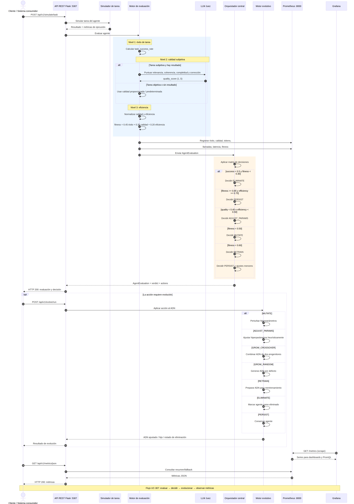
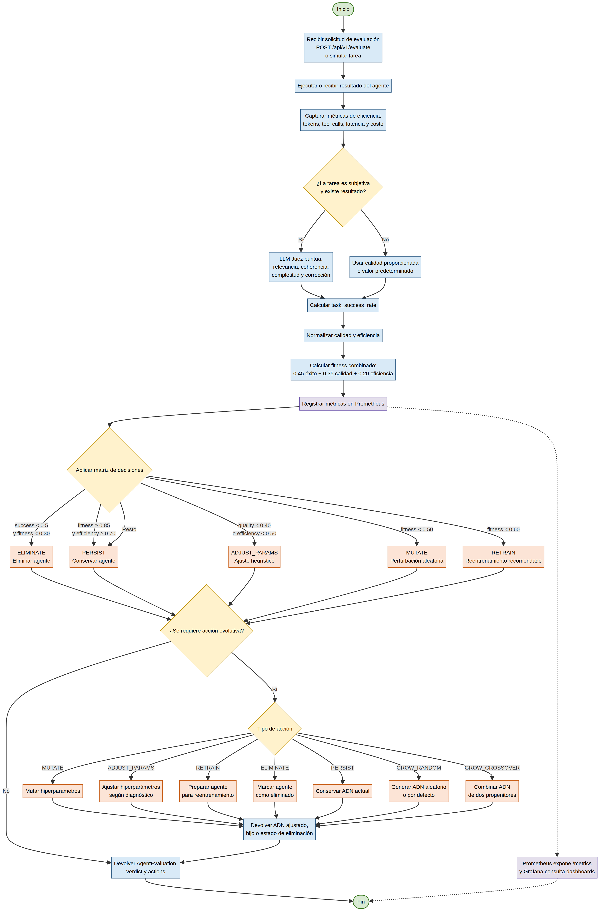

# TomoIII
## AI-Native Operations & Agentic Patterns
### CASE: UC-307 ¿Cómo evaluarías el rendimiento de un agente autónomo, especialmente cuando la respuesta correcta no es una sola cadena de texto?

#### USO: EXTERNO

#### EXECUTION
```bash
# Levantar servidores: API Flask (5307) + métricas Prometheus (8000)
python code/UC-307.py --server

# Demo end-to-end: evalúa 5 perfiles de agentes y aplica decisiones evolutivas
python code/UC-307.py --demo

# Evaluar un agente desde un archivo JSON
python code/UC-307.py --eval-file code/eval_payload.json

# Ejecutar pruebas unitarias e integración
python -m pytest code/tests -q
```

# DESCRIPTION
Evaluar un agente autónomo requiere un enfoque multifacético que va más allá de la simple precisión. UC-307 implementa un marco de evaluación de **tres niveles**:

1. **Tasa de éxito de la tarea**: métrica binaria para resultados claros (por ejemplo, ¿se subió el archivo?).
2. **Puntuación de calidad del resultado**: para tareas subjetivas se utiliza una rúbrica evaluada por un **LLM Juez** (simulador local, reemplazable por GPT-4/Claude en producción) que puntúa calidad, relevancia, coherencia y completitud en escala 1..5.
3. **Métricas de eficiencia**: tokens consumidos, llamadas a herramientas y latencia de extremo a extremo.

A partir de estas tres señales se calcula un **fitness combinado** que permite al **orquestador central** tomar decisiones sobre cada agente:

- **Persistir**: el agente es élite y se conserva.
- **Ajustar parámetros**: calidad o eficiencia no óptimas; se muta el ADN de forma heurística.
- **Reentrenar**: fitness medio-bajo; se recomienda reentrenamiento.
- **Mutar**: fitness bajo; se explora nuevo ADN por perturbación aleatoria.
- **Eliminar**: agente no viable (tasa de éxito y fitness críticos).
- **Crecimiento / Cruce**: si la población queda bajo el mínimo o un élite puede reproducirse, se genera descendencia combinando el ADN de dos progenitores.

Todo el proceso se expone a través de una **API REST Flask** y se reporta mediante métricas **Prometheus** consumibles por **Grafana**.

# Estructura del código

```
TomoIII/UC-307/code/
├── UC-307.py              # CLI: servidor, demo y evaluación por archivo
├── api.py                 # API Flask REST + card views
├── config.py              # Umbrales y configuración evolutiva
├── models.py              # Modelos Pydantic (input/output, ADN, decisiones)
├── evaluator.py           # Motor de evaluación de 3 niveles
├── decision_engine.py     # Reglas del orquestador central
├── agent_evolution.py     # Operadores genéticos y población
├── llm_judge.py           # Simulador del LLM Juez (Nivel 2)
├── metrics.py             # Métricas Prometheus con fallback
├── requirements.txt
├── prometheus.yml         # Configuración scrape para Prometheus
├── grafana.promql         # Queries de ejemplo para dashboards
└── tests/
    ├── test_evaluator.py
    ├── test_decision_engine.py
    ├── test_evolution.py
    └── test_api.py
```

# Modelo de datos

## `AgentDNA`
Representación genética de un agente.

| Campo | Tipo | Descripción |
|-------|------|-------------|
| `agent_id` | `string` | Identificador único |
| `version` | `int` | Versión del ADN |
| `hyperparams` | `dict[string, float]` | `learning_rate`, `temperature`, `max_iterations`, `top_p`, `exploration_factor`, `weight_decay` |
| `parent_ids` | `list[string]` | Progenitores (útil para trazabilidad) |
| `created_at` | `ISO-8601` | Fecha de creación |

## `EfficiencyMetrics` (Nivel 3)

| Campo | Tipo | Descripción |
|-------|------|-------------|
| `tokens_used` | `int` | Tokens de LLM consumidos |
| `tool_calls` | `int` | Llamadas a herramientas |
| `latency_seconds` | `float` | Latencia total |
| `cost_usd` | `float` | Costo estimado (opcional) |

## `AgentEvaluation` (salida del evaluador)

| Campo | Tipo | Descripción |
|-------|------|-------------|
| `evaluation_id` | `UUID` | ID de la evaluación |
| `agent_id` | `string` | Agente evaluado |
| `task_success_rate` | `float` | Tasa de éxito (0..1) |
| `quality_score` | `float` | Calidad en escala original |
| `normalized_quality` | `float` | Calidad normalizada (0..1) |
| `efficiency_score` | `float` | Puntuación de eficiencia (0..1) |
| `fitness` | `float` | Fitness combinado (0..1) |
| `verdict` | `string` | Decisión principal |
| `actions` | `list[string]` | Lista de acciones recomendadas |
| `reasoning` | `string` | Justificación del orquestador |
| `generated_at` | `ISO-8601` | Timestamp |

# Algoritmo de evaluación


## Cálculo del fitness

```
normalized_quality = quality_score / quality_scale
efficiency_score   = (1 - tokens_used/max_tokens
                    + 1 - tool_calls/max_tool_calls
                    + 1 - latency/max_latency) / 3

fitness = 0.45 * task_success_rate
        + 0.35 * normalized_quality
        + 0.20 * efficiency_score
```

Los pesos y los límites son configurables en `config.py` (`THRESHOLDS`).

## Matriz de decisiones del orquestador

| Condición | Decisión | Acciones posibles |
|-----------|----------|-------------------|
| `success_rate < 0.5` y `fitness < 0.30` | `ELIMINATE` | Eliminar. Si población baja mínimo, generar `GROW_RANDOM` o `GROW_CROSSOVER` |
| `fitness >= 0.85` y `efficiency >= 0.70` | `PERSIST` | Conservar. Opcionalmente `GROW_CROSSOVER` con otro élite |
| `quality < 0.40` | `ADJUST_PARAMS` | Mutar hiperparámetros de forma dirigida |
| `efficiency < 0.50` | `ADJUST_PARAMS` | Reducir `temperature`, `max_iterations`, `exploration_factor` |
| `fitness < 0.50` | `MUTATE` | Perturbación aleatoria del ADN |
| `fitness < 0.60` | `RETRAIN` | Reentrenamiento recomendado |
| Resto | `PERSIST` (+ `ADJUST_PARAMS`) | Conservar con ajustes menores |

## Operadores evolutivos

- **Mutación**: cada hiperparámetro se perturba con probabilidad `mutation_probability` y fuerza `mutation_strength` dentro de los límites permitidos.
- **Ajuste de parámetros**: modifica hiperparámetros de forma heurística según el diagnóstico (calidad baja → más determinista; eficiencia baja → menos iteraciones/exploración).
- **Cruza**: promedio ponderado de hiperparámetros entre dos progenitores; el hijo hereda `parent_ids` para trazabilidad.
- **Generación aleatoria**: crea un ADN con hiperparámetros por defecto.

# API

UC-307 expone una API Flask en el puerto configurado (`5307` por defecto).

## Endpoints

| Método | Endpoint | Descripción |
|--------|----------|-------------|
| `GET` | `/health` | Estado del servicio |
| `GET` | `/api/v1/schema` | Card views de entrada y salida |
| `POST` | `/api/v1/evaluate` | Evaluar un agente y obtener decisión |
| `POST` | `/api/v1/evolve/run` | Aplicar acción evolutiva sobre ADN |
| `POST` | `/api/v1/simulate/task` | Simular tarea + evaluación con LLM Juez |
| `GET` | `/api/v1/metrics` | Métricas Prometheus para Grafana |
| `GET` | `/api/v1/metrics/json` | Métricas en JSON (modo fallback/resumen) |

## Card view: entrada `POST /api/v1/evaluate`

| Parámetro | Tipo | Requerido | Descripción | Ejemplo |
|-----------|------|-----------|-------------|---------|
| `agent_id` | `string` | Sí | Identificador del agente | `"agent_alpha_v1"` |
| `task_success_rate` | `float` | Sí | Tasa de éxito (0..1) | `0.72` |
| `quality_score` | `float` | Sí | Calidad en escala 1..5 o 0..1 | `3.5` |
| `quality_scale` | `float` | No | Escala máxima de `quality_score` (default `5.0`) | `5.0` |
| `efficiency` | `object` | Sí | Métricas de eficiencia | `{"tokens_used": 2400, "tool_calls": 4, "latency_seconds": 2.1, "cost_usd": 0.04}` |
| `task_description` | `string` | No | Descripción de la tarea | `"Resumir reunión de estrategia"` |
| `result_text` | `string` | No | Resultado para el LLM Juez | `"Se acordó subir precios un 5%..."` |
| `dna` | `object` | No | ADN actual del agente | `{"hyperparams": {"temperature": 0.7}}` |
| `mate_dna` | `object` | No | Segundo progenitor para cruza | `{"hyperparams": {"temperature": 0.5}}` |

### Ejemplo de petición

```bash
curl -X POST http://localhost:5307/api/v1/evaluate \
  -H "Content-Type: application/json" \
  -d '{
    "agent_id": "alpha",
    "task_success_rate": 0.92,
    "quality_score": 4.2,
    "efficiency": {
      "tokens_used": 800,
      "tool_calls": 2,
      "latency_seconds": 0.5
    },
    "dna": {
      "hyperparams": {"temperature": 0.7, "learning_rate": 0.001}
    }
  }'
```

## Card view: salida `POST /api/v1/evaluate`

| Campo | Tipo | Descripción | Ejemplo |
|-------|------|-------------|---------|
| `evaluation_id` | `string` | UUID de evaluación | `"e7b3..."` |
| `agent_id` | `string` | Agente evaluado | `"alpha"` |
| `task_success_rate` | `float` | Tasa de éxito | `0.92` |
| `quality_score` | `float` | Calidad original | `4.2` |
| `normalized_quality` | `float` | Calidad normalizada | `0.84` |
| `efficiency_score` | `float` | Eficiencia (0..1) | `0.95` |
| `fitness` | `float` | Fitness combinado | `0.91` |
| `verdict` | `string` | Decisión principal | `"persist"` |
| `actions` | `list[string]` | Acciones recomendadas | `["persist"]` |
| `reasoning` | `string` | Justificación | `"Fitness 0.91 >= elite 0.85..."` |
| `generated_at` | `string` | ISO-8601 | `2026-09-04T11:00:00Z` |

## Card view: entrada `POST /api/v1/evolve/run`

| Parámetro | Tipo | Requerido | Descripción | Ejemplo |
|-----------|------|-----------|-------------|---------|
| `agent_id` | `string` | Sí | Agente objetivo | `"agent_alpha_v1"` |
| `action` | `enum` | Sí | Acción evolutiva | `"mutate"` |
| `dna` | `object` | No | ADN actual (si no se envía se genera uno por defecto) | `{"hyperparams": {"temperature": 0.7}}` |
| `mate_id` | `string` | No | Progenitor para cruza | `"agent_beta_v2"` |

Valores válidos de `action`: `persist`, `adjust_params`, `retrain`, `mutate`, `eliminate`, `grow_crossover`, `grow_random`.

### Ejemplo: mutar un agente

```bash
curl -X POST http://localhost:5307/api/v1/evolve/run \
  -H "Content-Type: application/json" \
  -d '{
    "agent_id": "alpha",
    "action": "mutate",
    "dna": {"hyperparams": {"temperature": 0.7, "learning_rate": 0.001}}
  }'
```

## Card view: salida `POST /api/v1/evolve/run`

| Campo | Tipo | Descripción | Ejemplo |
|-------|------|-------------|---------|
| `original_agent_id` | `string` | Agente objetivo | `"alpha"` |
| `action` | `string` | Acción aplicada | `"mutate"` |
| `adjusted_dna` | `object | null` | ADN ajustado/mutado/reentrenado | `{...}` |
| `child_dna` | `object | null` | ADN hijo (cruza o crecimiento) | `{...}` |
| `eliminated` | `bool` | Indica si fue eliminado | `false` |
| `reason` | `string` | Justificación | `"Acción 'mutate' ordenada..."` |

## Card view: entrada `POST /api/v1/simulate/task`

| Parámetro | Tipo | Requerido | Descripción | Ejemplo |
|-----------|------|-----------|-------------|---------|
| `description` | `string` | Sí | Descripción de la tarea | `"Resumir reunión"` |
| `task_type` | `string` | No | Tipo de tarea | `"summarization"` |
| `subjective` | `bool` | No | ¿Requiere evaluación subjetiva? | `true` |
| `expected` | `string` | No | Resultado esperado para el juez | `"decisiones clave"` |

# Métricas Prometheus / Grafana

El servidor HTTP de métricas se inicia en el puerto `8000` (`/metrics`).

| Métrica | Tipo | Labels | Descripción |
|---------|------|--------|-------------|
| `uc307_tasks_total` | Counter | `status` | Tareas evaluadas |
| `uc307_quality_score` | Histogram | - | Puntuación de calidad (buckets 1..5) |
| `uc307_tokens_consumed_total` | Counter | - | Tokens consumidos |
| `uc307_tool_calls_total` | Counter | - | Llamadas a herramientas |
| `uc307_execution_latency_seconds` | Histogram | - | Latencia end-to-end |
| `uc307_decisions_total` | Counter | `action` | Decisiones del orquestador |
| `uc307_fitness_score` | Histogram | - | Fitness combinado de agentes |

## Queries PromQL de ejemplo

**Tasa de éxito (últimos 5 min):**
```promql
rate(uc307_tasks_total{status="success"}[5m])
/
rate(uc307_tasks_total[5m])
```

**Latencia p95:**
```promql
histogram_quantile(0.95, rate(uc307_execution_latency_seconds_bucket[5m]))
```

**Calidad p95 (LLM Juez):**
```promql
histogram_quantile(0.95, rate(uc307_quality_score_bucket[5m]))
```

**Tokens por minuto:**
```promql
rate(uc307_tokens_consumed_total[5m]) * 60
```

**Distribución de decisiones del orquestador:**
```promql
sum by (action) (rate(uc307_decisions_total[5m]))
```

# Configuración de Prometheus

Usar el archivo `code/prometheus.yml` como punto de partida:

```yaml
scrape_configs:
  - job_name: 'uc307_agent_evolution'
    static_configs:
      - targets: ['localhost:8000']
```

# Pruebas

El paquete incluye pruebas unitarias e integración con `pytest`.

```bash
python -m pytest code/tests -q
```

Cobertura incluida:
- Normalización de métricas y cálculo de fitness.
- Reglas de decisión del orquestador (eliminar, persistir, mutar, ajustar, reentrenar).
- Operadores evolutivos (mutación, cruza, ajuste).
- Endpoints de la API Flask (health, schema, evaluate, evolve, simulate, metrics).

# Notas de diseño

- **Uso de Histograms:** latencia y calidad se registran como histogramas para poder calcular percentiles (`histogram_quantile`) y detectar anomalías en el peor 5% de ejecuciones.
- **Labels de Prometheus:** `status` permite discriminar éxito/fracaso; `action` permite observar qué decisiones toma el orquestador.
- **Desacoplamiento:** el evaluador no depende de Prometheus; solo llama a métodos de registro. El servidor HTTP expone métricas sin bloquear el pipeline del agente.
- **LLM Juez simulado:** el simulador usa una rúbrica determinista basada en relevancia, coherencia, completitud y corrección. En producción se puede reemplazar por la API real de un LLM manteniendo la misma interfaz.
- **Fallback:** `metrics.py` puede operar sin `prometheus_client` instalado, generando una exposición de texto compatible.
