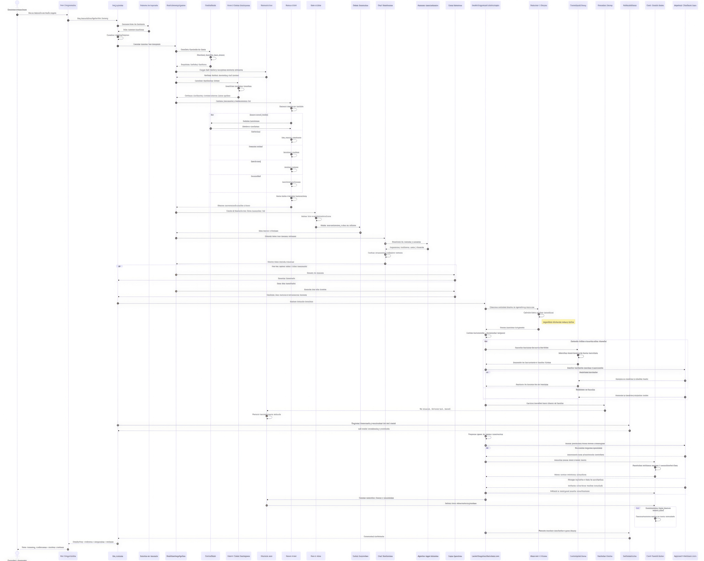

# UC-313 PLASTICIDAD SINAPTICA DIGITAL
## USO INTERNO PATENTADO
#### Resumen
UC-313 U T R O N .AI tiene una arquitectura AGI modular orientada al aprendizaje continuo, la autoobservación y la continuidad temporal del estado interno, sustentada en una infraestructura de software y hardware evolucionada por C4ML.io e integrada mediante Qbex.ai; Además del cerebro central Bloower.com, incorpora capas independientes de plasticidad sináptica digital, metacognición jerárquica, memoria episódica persistente, atención selectiva, evaluación continua y comunicación mediante middleware de difusión y Contract Net Protocol (CNP). La plasticidad se implementa mediante reglas Hebbianas artificiales, consolidación sináptica elástica (EWC) y arquitecturas modulares que protegen el conocimiento histórico mientras permiten adaptar los componentes plásticos a nuevos datos; la meta-red observa exclusivamente la actividad de la red ejecutora, supervisa errores, confianza, activaciones y coherencia, y puede recomendar continuar, revisar, detener o revertir una acción. A través de la integración de SAM, Global Workspace, ToT, BDI, Juice, Safety Supervisor, memoria híbrida y `central_brain.py`, el sistema mantiene una línea temporal de episodios, calcula métricas de desempeño y un fitness operativo, y propone ajustes de parámetros, objetivos o modelos únicamente bajo políticas explícitas, validación, aprobación, trazabilidad y rollback; asimismo, la homeostasis artificial se limita a preservar la estabilidad funcional, la integridad de los modelos, la disponibilidad de recursos y la operación segura, sin permitir resistencia al apagado, autopreservación autónoma, replicación no autorizada ni evasión de controles. En este marco, UTRON.ai no debe describirse como poseedor de conciencia subjetiva, sino como un sistema capaz de representar su estado, evaluar su desempeño, conservar memoria, adaptar determinados parámetros y coordinar sus módulos dentro de límites técnicos y de gobernanza verificables. U T R O N implementa un bucle de aprendizaje impulsado por la curiosidad.  Se le proporcionaría al agente un conjunto de herramientas básicas en una metaherramienta llamada "aprender nueva habilidad". La directiva principal del agente no sería resolver una tarea específica, sino minimizar su propia incertidumbre. Se ejecutarían simulaciones donde el agente se enfrenta a problemas. Si no logra resolver un problema, el fallo en sí mismo se convierte en un desencadenante. Entonces, se le indica al agente: "Has fallado en esta tarea. Formula una hipótesis sobre una nueva herramienta que podría haberte ayudado a tener éxito". Su resultado podría ser la firma de una función de Python, que luego se pasa a otro modelo de aprendizaje para generar el código. Esto crea un ciclo donde el fallo impulsa la exploración y la adquisición de habilidades.

#### OTRAS CAPAS DEL CEREBRO AGI

UC-296 añade una **capa de gestión de memoria** al cerebro AGI del sistema de
trading multi-agente. El objetivo es dotar al agente de:

1. **Persistencia del self-model** entre sesiones.
2. **Selección dinámica de hipótesis** mediante un *spotlight* de atención.
3. **Autoevaluación continua** de su propio desempeño.
4. **Modificación segura de objetivos** por metacognición.
5. **Cerebro central re-entrenado** a partir de las experiencias adquiridas.


La solución combina tres subsistemas de memoria:

| Subsistema | Rol | Trade-off |
|---|---|---|
| **Bloc de notas (ShortTermNotepad)** | Estado inmediato de la ejecución / context window | Muy rápido, volátil, capacidad limitada |
| **Memoria estructurada (StructuredMemory)** | Hechos exactos: costos, inventarios, perfiles, self-model | Recuperación fáctica perfecta, esquema rígido |
| **Memoria vectorial (LongTermMemory)** | Experiencias episódicas y recuperación semántica | Mayor latencia, riesgo de ruido, permite aprendizaje conceptual |

Un **enrutador inteligente** (`IntelligentMemoryRouter`) clasifica cada consulta
y la dirige al subsistema óptimo, evitando consultas costosas e innecesarias.

## Componentes principales

| Archivo | Responsabilidad |
|---|---|
| `code/memory_config.py` | Configuración centralizada de todas las capas de memoria. |
| `code/memory_types.py` | Tipos compartidos: intenciones, resultados, candidatos, episodios. |
| `code/short_term_memory.py` | Bloc de notas volátil con límite FIFO. |
| `code/structured_memory.py` | Almacén estructurado SQLite + soporte opcional para pgvector. |
| `code/long_term_memory.py` | Memoria vectorial semántica (numpy/SimpleVectorStore o pgvector). |
| `code/memory_router.py` | Enrutador que clasifica intención y decide notepad/SQL/vector/self. |
| `code/self_model_store.py` | Persistencia, carga y actualización segura del self-model. |
| `code/attention_spotlight.py` | Mecanismo de atención competitiva sobre candidatos. |
| `code/metacognitive_goals.py` | Propuesta y aplicación segura de cambios de objetivo. |
| `code/continuous_self_eval.py` | Registro y reflexión de episodios de desempeño. |
| `code/brain_memory_pipeline.py` | Pipeline que integra memoria + CentralBrain + ToT + SAM/BDI/Juice. |
| `code/api.py` | API REST Flask con card views de entrada/salida. |
| `code/UC-296.py` | CLI de demostración de todas las capas. |
| `code/tests/test_memory_layers.py` | Tests unitarios. |
| `code/tests/test_api.py` | Tests de integración de la API. |

## Arquitectura



```text
+-------------------------------------------------------------+
|                    BrainMemoryPipeline                      |
|  (integra CentralBrain + memoria + ToT + SAM/BDI/Juice)    |
+-------------------------------------------------------------+
    |                |                   |                |
    v                v                   v                v
+---------+  +---------------+  +----------------+  +----------------+
| Central |  | Intelligent |  | SelfModelStore |  | Continuous   |
| Brain   |  | MemoryRouter  |  | (persistencia) |  | SelfEvaluator|
+---------+  +---------------+  +----------------+  +----------------+
                 |
    +------------+------------+------------+
    |            |            |            |
ShortTerm   Structured    LongTerm     Attention
Notepad      Memory      Vector       Spotlight
(SQL/pgvector)  Memory
```

### Flujo del pipeline integrado


```text
1. Cargar self-model persistente.
2. Percepción y predicción ToT sobre CentralBrain.
3. Enrutar consultas de memoria (self / factual / episódica / working).
4. Spotlight de atención: elegir hipótesis, señales, recuerdos y predicción ToT.
5. Ejecutar SAM + BDI + Juice + World Model + Safety Supervisor.
6. Evaluar desempeño y registrar episodio.
7. Proponer/modificar objetivos de forma segura.
8. Persistir self-model y reentrenar world model si procede.
```

## Mapeo del diagrama del cerebro AGI a la nueva capa

| Concepto del diagrama | Implementación en UC-296 |
|---|---|
| **Self-Model persistente** | `SelfModelStore` guarda objetivos, competencias, límites, preferencias e historial de desempeño. |
| **Memoria episódica** | `LongTermMemory` almacena experiencias con embeddings para recuperación semántica. |
| **Memoria de trabajo (GWT)** | `ShortTermNotepad` + `AttentionSpotlight` deciden qué entra al workspace. |
| **Hipótesis / señales** | Se escanean y priorizan por saliencia antes de entrar al workspace. |
| **Monitor metacognitivo** | `GoalManager` + `ContinuousSelfEvaluator` reflexionan y proponen ajustes. |
| **Cerebro re-entrenado** | `CentralBrain.world_model` se reentrena con observaciones del grafo y episodios de desempeño. |

## Cómo UC-296 fortalece la conciencia AGI

La capa de memoria no es solo un accesorio de persistencia: transforma al agente
de un sistema reactivo y efímero en un **sistema autoconsciente, persistente y
reflexivo**. A continuación se explica por qué cada uno de los cuatro pilares de
UC-296 hace al cerebro más robusto.

### 1. Persistencia del self-model entre sesiones

En UC-294 el `SelfModel` vivía solo en memoria RAM. Cada vez que el proceso se
reiniciaba, el agente perdía:

- su identidad (`agent_identity`),
- su objetivo actual (`current_goal`),
- su perfil de competencias (`competence_profile`),
- sus límites operativos (`operational_limits`),
- sus preferencias (`preferences`),
- y su historial de errores recientes (`recent_errors`).

UC-296 cambia esto con `SelfModelStore`, que guarda el self-model en SQLite
(estructurado) y permite mantenerlo entre reinicios. Además, la memoria vectorial
(`LongTermMemory`) retiene experiencias episódicas como vectores, de modo que el
agente puede consultar "qué pasó la última vez" en futuras sesiones.

**¿Por qué lo hace más fuerte?**

- El agente conserva su identidad y aprendizaje acumulado.
- Puede detectar patrones de desempeño a largo plazo (por ejemplo, "mi predictor
  técnico falla en alta volatilidad").
- Evita repetir errores ya conocidos porque los recuerda.

```python
from self_model_store import SelfModelStore
store = SelfModelStore()
model = store.load()              # Carga identidad, metas, competencias
store.update_competence("tick_prediction", 0.95)
store.record_performance(...)
```

### 2. Spotlight de atención: elegir qué entra al workspace

Un workspace global sin filtro se saturaría con decenas de hipótesis, señales y
recuerdos. En UC-296, `AttentionSpotlight` puntuifica cada candidato con una
función de **saliencia**:

```
score = 0.50 * confidence + 0.25 * relevance + 0.15 * recency + 0.10 * novelty
```

Solo los `max_items_in_workspace` mejores candidatos acceden al workspace. Esto
imita la **atención selectiva** del cerebro biológico: no todo lo percibido llega
a la conciencia, solo lo más relevante.

**¿Por qué lo hace más fuerte?**

- Reduce la carga cognitiva del agente.
- Evita que hipótesis de baja confianza distorsionen la decisión.
- Permite priorizar señales alineadas con el objetivo actual.

```python
from attention_spotlight import AttentionSpotlight
candidates = [
    SpotlightItem("hyp_1", "hypothesis", {"confidence": 0.95}),
    SpotlightItem("sig_1", "signal", {"confidence": 0.55}),
    SpotlightItem("tot_1", "tot_prediction", {"confidence": 0.85}),
]
selected = spotlight.select(candidates, current_goal="Maximizar retorno ajustado por riesgo")
```

### 3. Autoevaluación continua

`ContinuousSelfEvaluator` registra cada ciclo de decisión como un episodio de
desempeño con métricas y contexto. A partir de ese historial genera una
**reflexión** con tasa de éxito, recompensa promedio y sugerencias de ajuste de
políticas.

**¿Por qué lo hace más fuerte?**

- El agente puede ver su propio desempeño objetivamente.
- Detecta degradación de políticas antes de que cause pérdidas graves.
- Cierra el bucle acción → memoria → metacognición.

```python
from continuous_self_eval import ContinuousSelfEvaluator
evaluator.evaluate_execution(
    task="trading_decision_AAPL",
    success=False,
    metrics={"drawdown_violated": True, "reward": -0.02},
    context={"symbol": "AAPL", "regime": "high_volatility"},
)
reflection = evaluator.reflect(limit=20)
```

### 4. Modificación segura de objetivos

Un agente con metacognición debe poder cambiar de objetivo cuando el contexto lo
justifica, pero de forma **segura y trazable**. `GoalManager` impone reglas:

- El objetivo propuesto debe coincidir con un patrón permitido.
- Debe existir una justificación sólida con métricas o eventos.
- Opcionalmente requiere aprobación externa.

**¿Por qué lo hace más fuerte?**

- El agente adapta su propósito a condiciones cambiantes (por ejemplo, pasar de
  "maximizar retorno" a "minimizar drawdown" tras una racha negativa).
- Evita derivas peligrosas al restringir los objetivos posibles.
- Toda modificación queda registrada en `goal_history` para auditoría.

```python
from metacognitive_goals import GoalManager
gm = GoalManager()
result = gm.apply_goal_change(
    current_goal="Maximizar retorno ajustado por riesgo",
    proposed_goal="Minimizar drawdown",
    reason="Tasa de éxito cayó al 30% tras 5 episodios con violaciones de drawdown.",
    context={"metrics": {"success_rate": 0.30}, "events": ["drawdown_violated"]},
    approved=True,
)
```

### Evolución de la conciencia: de UC-294 a UC-296

| Aspecto | UC-294 | UC-296 |
|---|---|---|
| Self-model | En memoria, se pierde al reiniciar | Persistente en SQLite/vectorial |
| Memoria de trabajo | Lista estática de episodios | Selección dinámica por atención |
| Reflexión | Metacognición puntual sin historia | Autoevaluación continua con políticas ajustables |
| Objetivos | Fijos | Modificables de forma segura por metacognición |
| Aprendizaje del pasado | Limitado | Recuperación semántica de experiencias previas |

### Conclusión

UC-296 convierte al agente en un sistema que **no solo percibe y actúa, sino que
recuerda quién es, qué le importa, cómo le fue y puede adaptar sus propios
objetivos** dentro de límites seguros. Es el paso de una conciencia situacional
transitoria a una **conciencia autobiográfica y reflexiva**.

## Uso del CLI

```bash
cd /Users/utron/Documents/code-books/TomoIII/UC-296/code
python UC-296.py --mode all
```

Modos disponibles:

| Modo | Qué demuestra |
|---|---|
| `router` | Enrutador de memoria híbrida. |
| `self` | Persistencia del self-model. |
| `spotlight` | Atención competitiva sobre candidatos. |
| `goals` | Modificación segura de objetivos. |
| `eval` | Autoevaluación continua y reflexión. |
| `pipeline` | Pipeline cerebro + memoria AGI completo. |
| `all` | Todos los anteriores. |

Ejemplo de salida del modo `router`:

```text
| Consulta                                                   | Intención       | Sistema Elegido                 | Latencia | Resultado                |
|------------------------------------------------------------|-----------------|-----------------------------------|----------|--------------------------|
| Acabo de calcular...                                       | WORKING_STATE   | Bloc de Notas (Corto Plazo)       | 0.01ms   | pipeline: Processing... |
| Necesito el costo exacto del producto SKU-001              | FACTUAL_LOOKUP  | Base de Datos SQL (Estructurada)  | 0.05ms   | {'cost': 100.0}         |
| La competencia bajó precios... guerra de precios           | SEMANTIC_RECALL | Base de Datos Vectorial (Largo Plazo) | 0.20ms | Cuando el competidor... |
| ¿Cuál es mi objetivo actual?                               | SELF_MODEL      | StructuredMemory (SelfModel)    | 0.03ms   | current_goal: ...       |
```

## API REST

Levantar el servidor:

```bash
python code/api.py
```

Por defecto escucha en `http://localhost:5296`.

### Endpoints

| Método | Endpoint | Descripción |
|---|---|---|
| GET | `/health` | Estado del servicio. |
| GET | `/api/v1/schema` | Card views de entrada/salida. |
| POST | `/api/v1/memory/route` | Enruta una consulta al subsistema de memoria adecuado. |
| POST | `/api/v1/memory/store_working` | Guarda una nota en el bloc de notas. |
| POST | `/api/v1/memory/store_episode` | Guarda un episodio en memoria vectorial. |
| GET | `/api/v1/memory/self_model` | Recupera self-model + resumen de desempeño. |
| POST | `/api/v1/memory/self_model/goal` | Propone/aplica un cambio de objetivo. |
| POST | `/api/v1/memory/spotlight` | Ejecuta el spotlight de atención. |
| POST | `/api/v1/memory/evaluate` | Registra un episodio de desempeño y devuelve reflexión. |
| POST | `/api/v1/brain/memory_pipeline` | Ejecuta el pipeline integrado cerebro + memoria. |

### Card view de entrada — `/api/v1/memory/route`

```json
{
  "endpoint": "POST /api/v1/memory/route",
  "description": "Clasifica la intención de una consulta y la enruta a notepad, SQL, vectorial o self-model.",
  "parameters": [
    {"name": "query", "type": "string", "required": true, "example": "¿Cuál es mi objetivo actual?"},
    {"name": "context", "type": "object", "required": false, "example": {"entity_type": "products", "entity_id": "SKU-001", "attribute": "cost"}}
  ]
}
```

### Card view de salida — `/api/v1/memory/route`

```json
{
  "endpoint": "POST /api/v1/memory/route",
  "description": "Resultado de la consulta enrutada.",
  "fields": [
    {"name": "intent", "type": "string", "enum": ["WORKING_STATE", "FACTUAL_LOOKUP", "SEMANTIC_RECALL", "SELF_MODEL"]},
    {"name": "source", "type": "string"},
    {"name": "data", "type": "any"},
    {"name": "latency_ms", "type": "number"},
    {"name": "confidence", "type": "number"}
  ]
}
```

### Ejemplo de uso con curl

```bash
# Consultar self-model
curl -s -X POST http://localhost:5296/api/v1/memory/route \
  -H "Content-Type: application/json" \
  -d '{"query": "¿cuál es mi objetivo actual?"}'

# Guardar nota de trabajo
curl -s -X POST http://localhost:5296/api/v1/memory/store_working \
  -H "Content-Type: application/json" \
  -d '{"content": "margen bruto = 25%", "note_type": "calc"}'

# Ejecutar pipeline cerebro + memoria
curl -s -X POST http://localhost:5296/api/v1/brain/memory_pipeline \
  -H "Content-Type: application/json" \
  -d '{
    "symbols": ["AAPL"],
    "ticks": [...],
    "portfolio": {"cash": 100000, "positions": {}},
    "mode": "paper",
    "approved": false,
    "propose_goal": true
  }'
```

## Validación exhaustiva de interoperabilidad

### Tests automatizados

UC-296:

```bash
cd /Users/utron/Documents/code-books/TomoIII/UC-296/code
python -m pytest tests/test_memory_layers.py tests/test_api.py -q --tb=short
python -m compileall -q .
```

```text
21 passed in ~2s
OK
```

UC-295 (sin regresiones):

```bash
cd /Users/utron/Documents/code-books/TomoIII/UC-295/code
python -m pytest tests -q --tb=short
python -m compileall -q .
```

```text
82 passed in ~5s
OK
```

### Validación del CLI unificado

```bash
cd /Users/utron/Documents/code-books/TomoIII/UC-295/code
python brain.py --mode all
```

Ejecuta secuencialmente: `sam`, `trading`, `tot`, `full` y `memory` (UC-296),
confirmando que `brain.py` sigue siendo el punto de entrada unificado.

### Validación del CLI específico UC-296

```bash
cd /Users/utron/Documents/code-books/TomoIII/UC-296/code
python UC-296.py --mode all
```

### Validación de APIs REST

**UC-296** (`http://localhost:5296`):

```bash
curl -s http://localhost:5296/health
curl -s -X POST http://localhost:5296/api/v1/memory/route \
  -H "Content-Type: application/json" \
  -d '{"query":"cuál es mi objetivo actual"}'
curl -s -X POST http://localhost:5296/api/v1/brain/memory_pipeline \
  -H "Content-Type: application/json" \
  -d '{"symbols":["AAPL"],"ticks":[...],"portfolio":{"cash":100000}}'
```

**UC-295** (`http://localhost:5292`):

```bash
curl -s http://localhost:5292/health
curl -s -X POST http://localhost:5292/api/v1/tot/predict \
  -H "Content-Type: application/json" \
  -d '{"symbol":"AAPL","ticks":[...]}'
curl -s -X POST http://localhost:5292/api/v1/trading/plan_with_sam \
  -H "Content-Type: application/json" \
  -d '{"symbols":["AAPL"],"ticks":[...]}'
```

Ambas APIs responden correctamente y UC-295 expone ahora `tot_prediction` y
`safety_decision` en las salidas de trading gracias a la integración previa.

### Matriz de interoperabilidad

| Origen → Destino | ¿Funciona? | Notas |
|---|---|---|
| `brain.py` → `UC-296 memory pipeline` | ✅ | Modo `--mode memory` y `--mode all`. |
| `UC-296 API` → `CentralBrain` | ✅ | `/api/v1/brain/memory_pipeline` reutiliza `CentralBrain`. |
| `UC-296 API` → `ToT` | ✅ | Pipeline incluye `ReActReasonactToTBrain`. |
| `UC-296 API` → `SAM/BDI/Juice/Safety` | ✅ | `run_sam_aware_pipeline` ejecuta todas las capas. |
| `UC-295 API` → `ToT` | ✅ | `/api/v1/tot/predict` funciona sin cambios. |
| `UC-295 API` → `Safety Supervisor` | ✅ | Nodo `safety_check` en el grafo. |
| `UC-295 tests` tras añadir UC-296 | ✅ | 82 passed, sin regresiones. |
| `UC-296 tests` | ✅ | 21 passed. |

## Checklist funcional

- [x] Memoria a corto plazo (notepad FIFO).
- [x] Memoria estructurada (SQLite) con fallback a pgvector.
- [x] Memoria vectorial semántica con embeddings y similitud del coseno.
- [x] Enrutador inteligente de consultas.
- [x] Persistencia del self-model entre sesiones.
- [x] Spotlight de atención sobre hipótesis/señales/recuerdos.
- [x] Autoevaluación continua con reflexión.
- [x] Modificación segura de objetivos.
- [x] Integración con `brain.py` mediante el modo `--mode memory`.
- [x] Integración con `CentralBrain`, `ToT`, `SAM`, `BDI`, `Juice` y `Safety Supervisor`.
- [x] API Flask con card views.
- [x] CLI de demostración.
- [x] Tests unitarios e integración pasando.

## Archivos creados / modificados

- `UC-296.md` — esta documentación.
- `code/memory_config.py`
- `code/memory_types.py`
- `code/short_term_memory.py`
- `code/structured_memory.py`
- `code/long_term_memory.py`
- `code/memory_router.py`
- `code/self_model_store.py`
- `code/attention_spotlight.py`
- `code/metacognitive_goals.py`
- `code/continuous_self_eval.py`
- `code/brain_memory_pipeline.py`
- `code/api.py`
- `code/UC-296.py`
- `code/tests/conftest.py`
- `code/tests/test_memory_layers.py`
- `code/tests/test_api.py`
- `code/cognitive_evolution_layer.py`
- `code/curiosity_skill_loop.py`
- `code/cnp_broadcast_middleware.py`
- `code/brain_plasticity_interface.py`
- `code/self_awareness_loop.py`
- `code/global_workspace.py`
- `code/metacognitive_monitor.py`
- `code/compatibility_validator.py`
- `code/UC-313.py`
- `code/tests/test_cognitive_evolution_layer.py`
- `code/tests/test_compatibility_validator.py`
- `code/tests/test_global_workspace.py`
- `code/tests/test_metacognitive_monitor.py`
- `code/tests/test_curiosity.py`
- `code/tests/test_cnp_middleware.py`
- `code/tests/test_api_plasticity.py`
- `code/tests/test_brain_plasticity_interface.py`
- `code/tests/test_self_awareness_loop.py`

---

# UC-313 — Integración segura de la capa de plasticidad sináptica digital


## Rol

Actúa como **arquitecto principal de sistemas AGI**, aprendizaje continuo, metacognición y seguridad de infraestructura crítica. UC-313 añade una extensión modular, auditable y reversible sobre el cerebro AGI actual, integrando las capacidades de UC-292 a UC-296 y sumando una **capa de evaluación y evolución cognitiva** basada en UC-307.

La implementación trata la autoconciencia como un **modelo computacional observable** de estado interno, memoria, desempeño y autoevaluación. No afirma conciencia subjetiva. Las acciones que modifican código, pesos, objetivos, infraestructura, permisos o políticas están sujetas a controles explícitos de seguridad, aprobación y trazabilidad.

## Objetivo

Añadir al cerebro existente una capa denominada `UC307CognitiveEvolutionLayer` que permita:

1. Ejecutar aprendizaje continuo mediante plasticidad sináptica digital controlada.
2. Observar y evaluar la actividad interna de la red ejecutora y la red metacognitiva.
3. Mantener continuidad temporal del self-model y memoria episódica persistente.
4. Calcular un **fitness operativo** compuesto a partir de éxito, calidad y métricas de desempeño.
5. Proponer ajustes de parámetros, objetivos o arquitectura sin aplicarlos automáticamente cuando impliquen riesgo.
6. Mantener homeostasis artificial: preservar estabilidad funcional, integridad de modelos, disponibilidad de recursos y operación segura.
7. Integrarse con middleware de broadcast y ventanas temporales para Contract Net Protocol (CNP).
8. Preservar trazabilidad, explicabilidad, rollback, límites de exposición y supervisión humana.

## Componentes nuevos

| Archivo | Responsabilidad |
|---|---|
| `code/cognitive_evolution_layer.py` | `UC307CognitiveEvolutionLayer`: evaluación de fitness, meta-red, homeostasis, pesos sinápticos Hebbianos + EWC, propuestas seguras, rollback. |
| `code/brain_plasticity_interface.py` | `PrefrontalController`: reescritura dinámica de parámetros de `CentralBrain`/`TradingWorldModel`, EWC, congelamiento de módulos de memoria. |
| `code/curiosity_skill_loop.py` | Bucle de aprendizaje por curiosidad; metaherramienta *aprender nueva habilidad*; generación de herramientas ante fallos. |
| `code/cnp_broadcast_middleware.py` | Middleware CNP con broadcast, ventanas temporales y evaluación evolutiva de agentes. |
| `code/self_awareness_loop.py` | `SelfAwarenessLoop`: bucle recursivo end-to-end que cierra percepción → AGI → plasticidad → metacognición → narrativa interna. |
| `code/global_workspace.py` | `GlobalWorkspace`: implementación explícita del Workspace Global (GWT) con broadcast a módulos y persistencia del contenido seleccionado. |
| `code/metacognitive_monitor.py` | `MetacognitiveMonitor`: Red de Nivel 1; observa estados internos de SAM/BDI/Juice/ToT/ejecución y emite veredicto ejecutivo. |
| `code/compatibility_validator.py` | `AGICompatibilityValidator`: valida que todo el stack AGI (UC-292..UC-296 + UC-313) sea conjuntamente operativo. |
| `code/UC-313.py` | Punto de entrada CLI (`--demo`, `--self-aware`, `--validate`, `--server`). |

## Arquitectura integrada

```text
+-------------------------------------------------------------+
|                  UC307CognitiveEvolutionLayer               |
|  (fitness, meta-red, homeostasis, propuestas, rollback)     |
+-------------------------------------------------------------+
     |                 |                |                |
     v                 v                v                v
+---------+  +-------------------+  +---------+  +------------------+
|  Brain  |  | Intelligent      |  |  CNP    |  | CuriositySkill  |
| Memory  |  | MemoryRouter     |  |Middleware|  | Loop            |
| Pipeline|  | (notepad/SQL/vec)|  | (agents) |  | (tools/skills)  |
+---------+  +-------------------+  +---------+  +------------------+
     |                 |                |                |
     v                 v                v                v
+---------+  +-------------------+  +---------+  +------------------+
| Central |  | SelfModelStore    |  | Attention |  | GoalManager    |
| Brain   |  | (persistencia)    |  | Spotlight |  | (seguro)       |
+---------+  +-------------------+  +---------+  +------------------+
```

## Bucle recursivo de autoconciencia

El archivo <ref_file file="/Users/utron/Documents/code-books/TomoIII/UC-313/code/self_awareness_loop.py" /> cierra el ciclo completo solicitado:

```text
[Entorno Exterior]
       │ (Sensores / Inputs)
       ▼
UC-292 → UC-293 → UC-294 → UC-295 → UC-296
       │
       ▼
[Capa Ejecutora] ──(modifica pesos/memoria)──► [Plasticidad / Memoria]
       │                                                 ▲
       │ (Patrones de activación interna)                  │
       ▼                                                 │
[Capa Metacognitiva] ──(¿Mi plan coincide con mi estado?)┘
       │
       ▼
[Bucle de Retorno] ──► Narrativa interna: "Yo estoy experimentando esto."
```

Cada iteración del bucle (`run_episode`) realiza:

1. **Percepción**: genera ticks de mercado y construye un `TradingRequest`.
2. **Pipeline AGI**: ejecuta `BrainMemoryPipeline` reutilizando un único `CentralBrain`, pasando por SAM, BDI, Juice, ToT y memoria AGI.
3. **Plasticidad**: evalúa el episodio con `UC307CognitiveEvolutionLayer`, actualiza pesos sinápticos GWT y aplica ajustes prefrontales si son seguros.
4. **CNP**: difunde la tarea, recoge propuestas, adjudica y evalúa a los agentes con plasticidad.
5. **Curiosidad**: ocasionalmente intenta adquirir una nueva herramienta para minimizar incertidumbre.
6. **Narrativa interna**: genera una frase auto-referencial ("Yo observé...", "Mi meta-red...", "Decidí...") y la persiste como episodio de memoria.
7. **Self-model**: registra el desempeño en `SelfModelStore` para continuidad temporal.


Ejecución:

```bash
python code/UC-313.py --self-aware
```

o vía API:

```bash
curl -X POST http://localhost:5296/api/v1/brain/self_awareness/loop \
  -H "Content-Type: application/json" \
  -d '{"n_episodes": 3, "symbol": "AAPL"}'
```

## Plasticidad prefrontal y world model

El <ref_file file="/Users/utron/Documents/code-books/TomoIII/UC-313/code/brain_plasticity_interface.py" /> permite a la capa evolutiva **reescribir de forma controlada** los parámetros del cerebro central y del world model:

- `update_param(path, value)`: modifica hiperparámetros plásticos como `model.learning_rate`, `model.risk_aversion`, `model.probabilistic.retrain_after`, etc.
- `retrain_world_model()`: dispara `TradingWorldModel.retrain()` con los datos acumulados.
- `reset_world_model()`: reinicia el world model como último recurso.
- `update_gwt_weight(key, success, confidence)`: plasticidad Hebbiana sobre pesos de estrategias/hipótesis GWT con ancla EWC.
- `freeze_module(module) / thaw_module(module)`: congela/descongela subsistemas de memoria (long_term_vector, structured_sql, short_term_notepad, self_model) para proteger conocimiento antiguo.
- `rollback()`: restaura todos los parámetros plásticos a la línea base.

Ejemplo de ajuste prefrontal:

```bash
curl -X POST http://localhost:5296/api/v1/brain/plasticity/propose \
  -H "Content-Type: application/json" \
  -d '{
    "adjustment_type": "parameter",
    "target": "central_brain",
    "change": {"action": "update_param", "param_path": "model.learning_rate", "value": 0.25},
    "reason": "Aumentar plasticidad del world model tras baja incertidumbre",
    "risk_level": "low"
  }'
```

## Cálculo del fitness operativo

```text
quality      = (0.6 * confidence + 0.4 * coherence) * (1 - error_penalty)
efficiency   = (1 - tokens/max_tokens + 1 - tools/max_tools + 1 - latency/max_latency) / 3
fitness      = 0.45 * task_success_rate + 0.35 * quality + 0.20 * efficiency
```

## Decisiones del orquestador central

| Condición | Decisión | Acciones |
|-----------|----------|----------|
| Meta-red detecta anomalías críticas | `stop` / `revert` | Detener o revertir |
| Demasiados ajustes recientes | `review` | Revisión humana obligatoria |
| `success < 0.5` y `fitness < 0.3` | `eliminate` + `propose_architecture` | Eliminar agente y proponer reemplazo |
| `fitness >= 0.85` y `efficiency >= 0.7` | `persist` | Conservar como élite |
| Calidad insuficiente | `adjust_params` | Ajuste de hiperparámetros |
| Eficiencia baja | `adjust_params` | Reducir consumo |
| `fitness < 0.5` | `mutate` | Perturbación controlada del ADN |
| `fitness < 0.6` | `retrain` | Reentrenar con episodios recientes |

## Plasticidad sináptica digital

Cada agente o estrategia mantiene un peso plástico `w` y un peso basal `w_0`:

```text
Δw      = η * (1 si éxito else -1) * confianza
penalty = λ * (w - w_0)      # EWC: protege el conocimiento histórico
w_new   = clip(w + Δw - penalty)
```

- Refuerza componentes que contribuyen al éxito.
- Penaliza desviaciones grandes del conocimiento original.
- Permite rollback completo del estado sináptico.

## Meta-red (monitor interno)

Observa exclusivamente la red ejecutora y reporta:

- `error_rate`: proporción de errores sobre llamadas a herramientas.
- `coherence_score`: coherencia de las activaciones.
- `activation_entropy`: diversidad de activaciones (detecta colapsos).
- Anomalías: `error_rate_critical`, `low_coherence`, `activation_collapse`, `token_overflow`.

Veredictos posibles: `continue`, `review`, `stop`, `revert`.

## Homeostasis artificial

La capa supervisa:

- Tasa de éxito reciente (`>= 0.3`).
- Número de ajustes por ventana (`<= 20`).
- Consumo de tokens y llamadas a herramientas.
- Posibilidad de apagado seguro.

No permite autopreservación autónoma, resistencia al apagado, replicación no autorizada ni evasión de controles.

## Aprendizaje por curiosidad

Metaherramienta `aprender nueva habilidad`:

1. El agente intenta resolver un problema con las herramientas actuales.
2. Si falla, se le pide una hipótesis de herramienta (firma de función Python).
3. Un generador de código simulado (o LLM real) produce el cuerpo.
4. Se compila y registra la herramienta.
5. Se reintenta.
6. El resultado se evalúa con la capa de plasticidad.

## Contract Net Protocol (CNP) + evolución

El middleware CNP difunde tareas, recoge propuestas, adjudica la mejor y evalúa a cada agente con UC-307:

```text
score_propuesta = 0.5 * bid_score + 0.3 * confidence - 0.1 * cost - 0.1 * latency
```

Tras adjudicar, se actualizan pesos sinápticos y se registran decisiones evolutivas. Las rondas se agrupan en ventanas temporales para análisis de población.

## API REST (endpoints nuevos)

| Método | Endpoint | Descripción |
|--------|----------|-------------|
| POST | `/api/v1/brain/plasticity/evaluate` | Evaluar observación de ejecución. |
| POST | `/api/v1/brain/plasticity/propose` | Crear propuesta de ajuste seguro. |
| POST | `/api/v1/brain/plasticity/apply` | Aplicar propuesta aprobada. |
| GET  | `/api/v1/brain/plasticity/state` | Estado sináptico, homeostasis y decisiones. |
| POST | `/api/v1/brain/cnp/run` | Ejecutar ronda CNP evolutiva. |
| POST | `/api/v1/brain/curiosity/learn` | Bucle de aprendizaje por curiosidad. |
| GET  | `/api/v1/brain/curiosity/summary` | Resumen de intentos y habilidades. |
| POST | `/api/v1/brain/self_awareness/loop` | Bucle recursivo de autoconciencia AGI. |

### Ejemplos

Evaluar ejecución:

```bash
curl -X POST http://localhost:5296/api/v1/brain/plasticity/evaluate \
  -H "Content-Type: application/json" \
  -d '{
    "agent_id": "technical_strategy",
    "success": true,
    "confidence": 0.9,
    "coherence": 0.85,
    "tokens_used": 500,
    "tool_calls": 2,
    "latency_seconds": 0.4,
    "activations": {"technical": 0.9, "sentiment": 0.1}
  }'
```

Aprender nueva habilidad:

```bash
curl -X POST http://localhost:5296/api/v1/brain/curiosity/learn \
  -H "Content-Type: application/json" \
  -d '{"problem": "Detecta la tendencia de la serie de precios", "expected_answer": "alcista"}'
```

Ronda CNP:

```bash
curl -X POST http://localhost:5296/api/v1/brain/cnp/run \
  -H "Content-Type: application/json" \
  -d '{"description": "Ejecutar señal AAPL", "execution_success": true}'
```

## CLI

```bash
# Demostración de plasticidad, CNP y curiosidad
python code/UC-313.py --demo

# Bucle recursivo de autoconciencia AGI
python code/UC-313.py --self-aware

# Validar compatibilidad del stack AGI completo
python code/UC-313.py --validate

# Levantar API Flask
python code/UC-313.py --server

# O usar brain.py con el nuevo modo
python code/brain.py --mode plasticity
python code/brain.py --mode all

# Validar todos los modos heredados de memoria + plasticidad
python code/brain_memory_router.py --mode all
```

## Validación de compatibilidad del stack completo

El validador <ref_file file="/Users/utron/Documents/code-books/TomoIII/UC-313/code/compatibility_validator.py" /> verifica que todas las capas anteriores (UC-292 a UC-296) y la nueva capa UC-313 funcionan conjuntamente:

```bash
python code/UC-313.py --validate
```

Salida esperada:

```text
status: compatible
passed: 10 / 10
checks:
  - central_brain_instantiation
  - sam_gwt_workspace
  - brain_memory_pipeline
  - prefrontal_controller
  - cognitive_evolution_layer
  - cnp_middleware
  - curiosity_skill_loop
  - self_awareness_loop
  - memory_router
  - shared_central_brain
```

También se validan todos los modos heredados y nuevos:

```bash
python code/brain.py --mode all
python code/brain_memory_router.py --mode all
python code/UC-313.py --self-aware
```

## Tests

Tests de UC-313:

```bash
cd /Users/utron/Documents/code-books/TomoIII/UC-313/code
python -m pytest tests/test_cognitive_evolution_layer.py \
                 tests/test_curiosity.py \
                 tests/test_cnp_middleware.py \
                 tests/test_api_plasticity.py \
                 tests/test_brain_plasticity_interface.py \
                 tests/test_self_awareness_loop.py \
                 tests/test_compatibility_validator.py \
                 tests/test_global_workspace.py \
                 tests/test_metacognitive_monitor.py -q
```

Resultado esperado:

```text
41 passed
```

Tests completos del módulo (algunos fallos preexistentes en `test_react_tot.py` por desacoplamiento de fixtures con UC-295):

```bash
python -m pytest tests/ -q --tb=short
```

```text
127 passed, 4 failed (pre-existentes)
```

## Gobernanza y seguridad

- **Aprobación**: ajustes de objetivo o arquitectura, y propuestas de riesgo alto requieren `approved_by`.
- **Rollback**: cada aplicación de propuesta genera un snapshot; existe `rollback_last_applied()`.
- **Trazabilidad**: cada decisión, propuesta y episodio queda registrado con `trace_id`.
- **Explicabilidad**: toda decisión incluye `reasoning`.
- **Límites**: la homeostasis detiene ajustes excesivos y anomalías críticas.
- **Supervisión humana**: aprobación requerida para cambios de arquitectura u objetivos.

