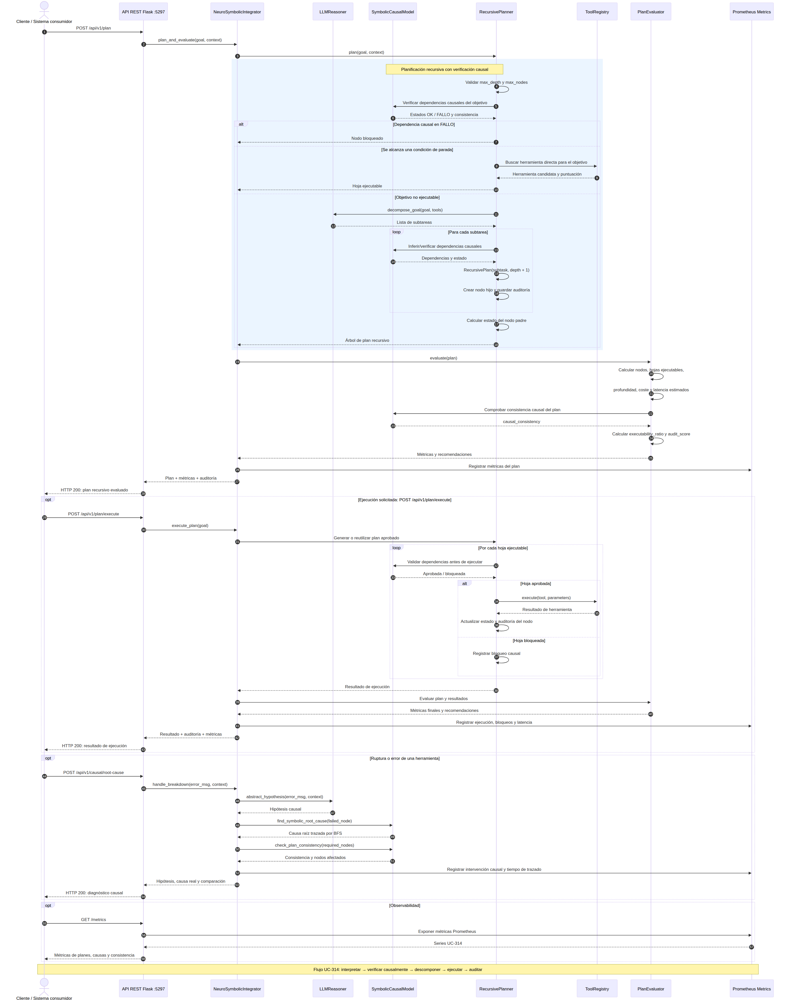
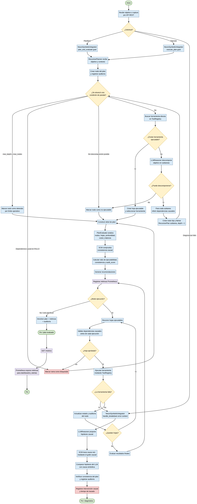

# UC-314 — Razonamiento Causal y Planificación Recursiva Neuro-Simbólica

## AI-Native Operations & Agentic Patterns — TomoIII

**USO:** EXTERNO (API + CLI)  
**Propósito:** Integrar modelos causales simbólicos con el razonamiento de un LLM para mejorar la planificación de un agente autónomo. El módulo recibe parámetros sobre cómo un agente está planeando y gestionando sus tareas; evalúa, audita y gestiona las métricas y resultados de planeación; y descompone recursivamente macro-tareas en subtareas ejecutables por herramientas.

---

## Resumen ejecutivo

Los modelos de lenguaje dominan la correlación, no la causalidad. Aprenden qué palabras suelen aparecer juntas, pero no necesariamente qué evento provoca a otro. Esto afecta gravemente la planificación: un agente puede saber que “inventario bajo” y “realizar pedido” están correlacionados, pero no comprender que el inventario bajo es la causa de la decisión de comprar. Si la política cambia y los pedidos se hacen automáticamente, el agente seguirá intentando crear pedidos innecesarios.

UC-314 resuelve esto con una **arquitectura Neuro-Simbólica**:
- **LLM** actúa como intérprete lingüístico: lee errores crípticos y propone hipótesis causales.
- **SCM (Symbolic Causal Model)** actúa como verificador formal: representa dependencias como un DAG y traza la cadena de causa-efecto.
- **Planificador recursivo** descompone un objetivo de alto nivel en acciones concretas, verificando cada paso contra el SCM y deteniéndose cuando alcanza una herramienta ejecutable o una condición de parada.
El resultado es un agente con la intuición del LLM y la lógica inquebrantable de un modelo causal.

---



## Ejecución

```bash
cd /Users/utron/Documents/code-books/TomoIII/UC-314/code
python3 UC-314.py --demo-root-cause
python3 UC-314.py --demo-plan
python3 UC-314.py --demo-execute
python3 UC-314.py --server
```

Tests:

```bash
python3 -m pytest tests/ -q --tb=short
```

Resultado esperado:

```text
18 passed
```

---

## Estructura del proyecto

```text
UC-314/code/
├── UC-314.py                  # Punto de entrada CLI y demostraciones
├── api.py                     # API REST Flask + cards de entrada/salida
├── causal_model.py            # SymbolicCausalModel + LLMReasoner simulado
├── recursive_planner.py       # RecursivePlanner: árbol de planes + verificación causal
├── plan_evaluator.py          # Métricas de calidad y auditoría del plan
├── tool_registry.py           # Registro de herramientas simuladas
├── neuro_symbolic_integrator.py  # Orquestador LLM + SCM + planificador
├── metrics_collector.py       # Métricas Prometheus
├── requirements.txt
└── tests/
    ├── test_causal_model.py
    ├── test_recursive_planner.py
    ├── test_evaluator.py
    └── test_api.py
```

---

## Algoritmo de planificación recursiva



```text
RecursivePlan(goal, depth):
    1. Validar condiciones de parada (max_depth, max_nodes).
    2. Verificar dependencias causales del nodo en el SCM.
       Si hay un nodo en FALLO -> marcar como blocked.
    3. Buscar herramienta directa que ejecute `goal`.
       Si existe -> hoja ejecutable.
    4. Si no es ejecutable, pedir al LLM que descomponga `goal` en subtareas.
    5. Para cada subtarea:
          inferir dependencias causales,
          crear nodo hijo,
          llamar recursivamente RecursivePlan(subtarea, depth+1).
    6. Estado del padre = función del estado de los hijos.
```

### Condiciones de parada
- **Hoja ejecutable:** el objetivo coincide con una herramienta registrada.
- **Profundidad máxima** (`max_depth`, por defecto 5).
- **Número máximo de nodos** (`max_nodes`, por defecto 100).
- **Falla causal:** una dependencia simbólica está en estado `FALLO`.
- **Sin descomposición posible:** el LLM no puede dividir más la subtarea.

### Selección de herramienta

El `ToolRegistry` asigna una puntuación a cada herramienta según:

- `+10` si el nombre de la herramienta aparece en el objetivo.
- `+1` por cada keyword definida que aparezca en el objetivo.

Se elige la herramienta con mayor puntuación.

---

## Componentes

### 1. `SymbolicCausalModel` — Modelo Causal Simbólico

- Representa el mundo como un DAG.
- `add_dependency(parent, child)`: establece relaciones causales.
- `set_node_state(node, state)`: inyecta fallos en nodos.
- `find_symbolic_root_cause(failed_node)`: BFS hacia atrás encontrando el primer ancestro en `FALLO`.
- `check_plan_consistency(required_nodes)`: valida que los nodos requeridos por un plan estén `OK`.
- `has_cycle()`: detecta ciclos mediante DFS con colores.

### 2. `LLMReasoner` — Simulador del razonamiento del LLM

- `abstract_hypothesis(error_msg, context)`: propone una causa raíz a partir del lenguaje del error.
- `decompose_goal(goal, tools)`: divide un objetivo en subtareas de alto nivel.
- `propose_tool_for_goal(goal, tools)`: sugiere una herramienta para una subtarea.

### 3. `RecursivePlanner` — Planificador recursivo

- `plan(goal, context)`: genera el árbol de planificación.
- `execute_plan(node)`: simula la ejecución de cada hoja mediante `ToolRegistry`.
- Usa el SCM para bloquear ramas con fallos causales.
- Persiste auditoría en cada nodo (`audit`, `reasoning`, `causal_dependencies`).

### 4. `PlanEvaluator` — Auditor de planes

Métricas calculadas:

- `total_nodes`
- `executable_leaves` / `blocked_leaves`
- `max_depth`
- `executability_ratio`
- `causal_consistency`
- `estimated_cost` / `estimated_latency_ms`
- `audit_score` (0..1)
- `recommendations`

### 5. `NeuroSymbolicIntegrator` — Orquestador

- `handle_breakdown(...)`: recibe una ruptura, consulta al LLM, traza la causa real con el SCM y compara hipótesis.
- `plan_and_evaluate(goal)`: genera plan recursivo y evalúa calidad.
- `execute_plan(goal)`: genera, ejecuta y evalúa el plan completo.

### 6. Métricas Prometheus

Expuestas en `/metrics`:

- `uc314_plans_total`
- `uc314_plan_depth`
- `uc314_plan_nodes_total`
- `uc314_plan_executability_ratio`
- `uc314_plan_causal_consistency`
- `uc314_plan_audit_score`
- `uc314_root_causes_total`
- `uc314_root_cause_trace_seconds`
- `uc314_scm_interventions_total`

---

## API REST

Cards de entrada/salida disponibles en `/api/v1/cards` y en la raíz `/`.

### Endpoints

| Método | Endpoint | Descripción |
|---|---|---|
| GET | `/` | Documentación de cards |
| GET | `/api/v1/cards` | Cards de entrada/salida |
| GET | `/api/v1/tools` | Lista de herramientas |
| POST | `/api/v1/plan` | Generar plan recursivo |
| POST | `/api/v1/plan/execute` | Generar y ejecutar plan |
| POST | `/api/v1/plan/evaluate` | Evaluar un plan existente |
| POST | `/api/v1/causal/root-cause` | Trazar causa raíz neuro-simbólica |
| POST | `/api/v1/causal/graph` | Consultar/modificar grafo causal |
| GET | `/metrics` | Métricas Prometheus |

### Ejemplos

#### Generar plan

```bash
curl -X POST http://localhost:5297/api/v1/plan \
  -H "Content-Type: application/json" \
  -d '{
    "goal": "Incrementar ventas del producto X mediante marketing digital",
    "max_depth": 5,
    "max_nodes": 100
  }'
```

#### Trazar causa raíz

```bash
curl -X POST http://localhost:5297/api/v1/causal/root-cause \
  -H "Content-Type: application/json" \
  -d '{
    "task_id": "TASK-9281",
    "failed_tool": "PricingAPI",
    "error_msg": "ConnectionTimeout: No se pudo establecer conexión con PricingAPI",
    "context": "Calculando precios para cliente Enterprise-X"
  }'
```

#### Modificar grafo causal

```bash
curl -X POST http://localhost:5297/api/v1/causal/graph \
  -H "Content-Type: application/json" \
  -d '{
    "action": "set_state",
    "node": "SecurityPolicy",
    "state": "FALLO: rotación forzada"
  }'
```

---

## Card de entrada — `/api/v1/plan`

```json
{
  "endpoint": "POST /api/v1/plan",
  "description": "Genera un plan recursivo a partir de un objetivo de alto nivel.",
  "parameters": [
    {"name": "goal", "type": "string", "required": true, "example": "Incrementar ventas del producto X mediante marketing digital"},
    {"name": "max_depth", "type": "integer", "required": false, "default": 5},
    {"name": "max_nodes", "type": "integer", "required": false, "default": 100},
    {"name": "context", "type": "object", "required": false, "default": {}}
  ]
}
```

## Card de salida — `/api/v1/plan`

```json
{
  "endpoint": "POST /api/v1/plan",
  "description": "Plan recursivo con métricas de calidad.",
  "fields": [
    {"name": "goal", "type": "string"},
    {"name": "plan", "type": "object"},
    {"name": "metrics", "type": "object"}
  ]
}
```

---

## Integración con Prometheus y Grafana

Las métricas se exponen en `/metrics`. Las alertas sugeridas se encuentran en `code/alert_rules.yml`:

- `DesconexionCausalDelAgente`: el SCM corrige al LLM en más del 30% de las fallas.
- `TrazabilidadCausalLenta`: el trazado causal supera los 2 segundos (p95).
- `RazonamientoCausalOptimo`: consenso perfecto LLM-SCM durante 30 minutos.

Queries PromQL de ejemplo en `code/grafana.promql`.

---

## Gobernanza y límites

- La arquitectura no atribuye conciencia subjetiva al agente.
- Toda decisión causal y de planificación deja traza (`audit`, `reasoning`, `trace_id` implícito en nodo).
- Las propuestas de reparación del LLM se validan formalmente contra el SCM antes de ejecutarse.
- El sistema evita bucles infinitos mediante límites de profundidad, nodos y detección de ciclos en el grafo causal.

---

## Referencias

- <ref_file file="/Users/utron/Documents/code-books/TomoIII/UC-314/code/UC-314.py" />
- <ref_file file="/Users/utron/Documents/code-books/TomoIII/UC-314/code/api.py" />
- <ref_file file="/Users/utron/Documents/code-books/TomoIII/UC-314/code/causal_model.py" />
- <ref_file file="/Users/utron/Documents/code-books/TomoIII/UC-314/code/recursive_planner.py" />
- <ref_file file="/Users/utron/Documents/code-books/TomoIII/UC-314/code/plan_evaluator.py" />
- <ref_file file="/Users/utron/Documents/code-books/TomoIII/UC-314/code/tool_registry.py" />
- <ref_file file="/Users/utron/Documents/code-books/TomoIII/UC-314/code/neuro_symbolic_integrator.py" />
- <ref_file file="/Users/utron/Documents/code-books/TomoIII/UC-314/code/metrics_collector.py" />
