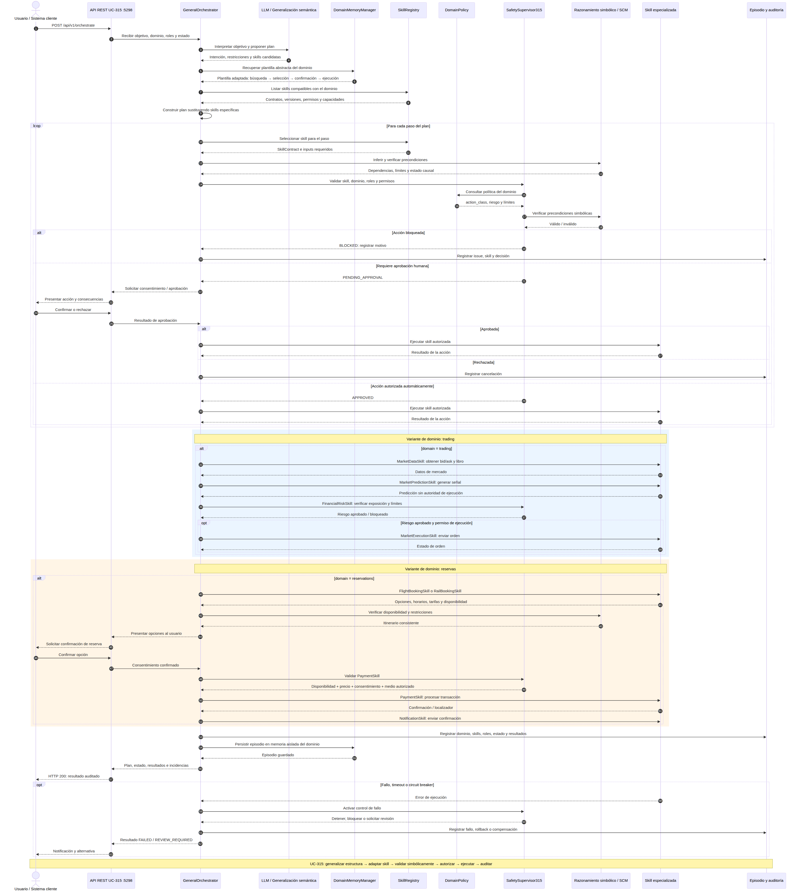
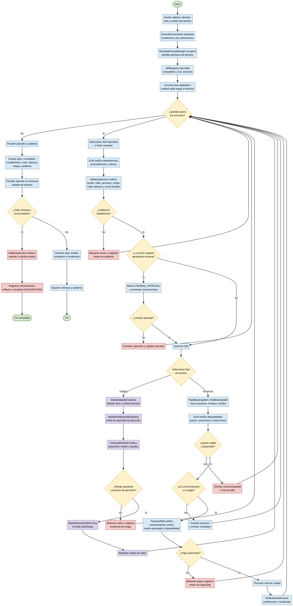

# UC-315 — Núcleo cognitivo-orquestador común + habilidades especializadas por dominio

## AI-Native Operations & Agentic Patterns — TomoIII

**USO:** INTERNO PATENTADO  
**Propósito:** Diseñar una arquitectura de agentes con un **núcleo cognitivo-orquestador compartido**, **habilidades especializadas por dominio**, **memoria separada por contexto** y **controles de autorización específicos para cada clase de acción**.

---

## Conceptos clave

| Concepto | Función | Ejemplo en reservas | Ejemplo en trading |
|---|---|---|---|
| **Generalización semántica** | Detectar analogías entre problemas y proponer un plan | Reconocer que vuelo y tren son variantes de una reserva de transporte | Reconocer que orden límite y stop comparten validación/ejecución |
| **Razonamiento simbólico** | Verificar reglas, restricciones y relaciones explícitas | Impedir pagar sin disponibilidad, precio confirmado y consentimiento | Impedir enviar orden que excede límite de posición o pérdida |
| **Skill** | Capacidad operacional encapsulada | `FlightBookingSkill`, `RailBookingSkill`, `PaymentSkill` | `MarketDataSkill`, `FinancialRiskSkill`, `MarketExecutionSkill` |
| **Safety Supervisor** | Autorizar, bloquear, auditar y detener acciones | Requiere confirmación antes de comprar | Aplica límites, circuit breakers y segregación de funciones |
| **Modelo de mundo** | Estado y reglas del dominio específico | Itinerarios, disponibilidad, tarifas, condiciones de cancelación | Mercado, posiciones, liquidez, exposición, límites de riesgo |

### Diferencia entre generalización semántica y razonamiento simbólico

- **Generalización semántica** (LLM): detecta que “reservar un vuelo” y “reservar un tren” comparten la estructura *búsqueda → selección → confirmación → transacción → verificación*. Recupera la plantilla de vuelo y la adapta a tren cambiando las skills específicas. Es flexible pero probabilística y puede alucinar herramientas o ignorar restricciones.
- **Razonamiento simbólico** (SCM + supervisor): verifica que “una reserva solo puede pagarse si existe disponibilidad, el precio fue confirmado, el usuario otorgó consentimiento y el medio de pago fue autorizado”. Es determinista y auditable.

En la arquitectura neuro-simbólica, el LLM propone la intención, el plan y la selección candidata de skills; el motor simbólico y el Safety Supervisor validan permisos, dependencias, políticas, límites y efectos antes de ejecutar.

---

## Ejecución

```bash
cd /Users/utron/Documents/code-books/TomoIII/UC-315/code
python3 UC-315.py --demo-skills
python3 UC-315.py --demo-flight-to-rail
python3 UC-315.py --demo-trading
python3 UC-315.py --demo-safety
python3 UC-315.py --server
```

Tests:

```bash
python3 -m pytest tests/ -q --tb=short
```

Resultado esperado:

```text
130 passed
```

---

## Estructura del proyecto

```text
UC-315/code/
├── UC-315.py                    # Punto de entrada CLI y demostraciones
├── api.py                       # API REST Flask (incluye endpoints UC-313/296 + UC-315)
├── skill_contracts.py           # SkillContract, SkillRegistry, risk, action_class
├── domain_skills.py             # Skills de trading y reservas con ejecutores simulados
├── general_orchestrator.py      # Orquestador general con planificación y ejecución
├── safety_supervisor_315.py     # Safety Supervisor parametrizado por dominio
├── domain_policy.py             # Políticas de trading y reservas
├── domain_memory.py             # Memoria aislada por dominio + plantillas
└── tests/
    ├── test_skill_registry.py
    ├── test_orchestrator.py
    ├── test_safety.py
    └── test_api.py
```

---


## Componentes

### 1. `SkillRegistry` y `SkillContract`

Cada skill se registra con un contrato explícito:

- `name`, `version`, `domain`
- `purpose`
- `inputs` / `outputs` (esquema de parámetros)
- `permissions` y `required_roles`
- `action_class`: read | predict | analyze | transact | execute | delete
- `estimated_cost`, `estimated_latency_ms`
- `preconditions` / `postconditions`
- `risk_level`: low | medium | high | critical
- `reversible` y `compensation`

Esto evita que el LLM ejecute acciones irreversibles sin validación y permite que el Safety Supervisor decida autorización por skill.

### 2. Skills de dominio

**Trading:**

- `MarketDataSkill` — ingesta de precios bid/ask, libros de órdenes, calidad del feed.
- `MarketPredictionSkill` — genera señales y estimaciones; **sin autoridad para ejecutar**.
- `FinancialRiskSkill` — cálculo determinista de exposición, límites y liquidez.
- `MarketExecutionSkill` — envía órdenes solo tras validación de riesgo y autorización.

**Reservas:**

- `FlightBookingSkill` / `RailBookingSkill` — búsqueda, tarifas, horarios, disponibilidad.
- `PaymentSkill` — cobro solo tras disponibilidad, precio confirmado, consentimiento y medio autorizado.
- `IdentityValidationSkill` — KYC antes de transacciones.
- `NotificationSkill` — confirmaciones y alertas.
- `ChangeCancelSkill` — cambios/cancelaciones con política de reembolso.

### 3. `SafetySupervisor315` — supervisor parametrizado por dominio

Para cada skill propuesta, verifica:

1. Clase de acción permitida en el dominio.
2. Roles y permisos requeridos.
3. Límites de coste y latencia.
4. Precondiciones simbólicas (disponibilidad, consentimiento, aprobación de riesgo, circuit breaker).
5. Circuit breaker por skill.
6. Requisito de aprobación humana para transacciones/ejecuciones/deletes.

Si alguna verificación falla, la acción se bloquea y se registra en auditoría.

### 4. `GeneralOrchestrator`

Responsabilidades:

- Interpretar objetivos en lenguaje natural.
- Recuperar una **plantilla de plan** abstracta de la memoria del dominio.
- Adaptar la plantilla sustituyendo skills específicos según el dominio actual.
- Validar cada paso contra el Safety Supervisor.
- Ejecutar skills autorizadas.
- Registrar el resultado como episodio.

No transfiere credenciales, datos privados, permisos, código ejecutable ni reglas operativas de un dominio a otro. Solo transfiere la **estructura abstracta de planificación**.

### 5. `DomainMemoryManager` — memoria separada por dominio

Cada dominio tiene:

- **Memoria de trabajo** (`ShortTermNotepad`).
- **Memoria estructurada** (`StructuredMemory`) con DB aislada.
- **Memoria vectorial** (`LongTermMemory`) con store aislado.
- **Plantillas de plan** abstractas recuperables semánticamente.

Las plantillas se adaptan, no se transfieren. Por ejemplo, la plantilla `transport_booking` se rellena con `FlightBookingSkill` o `RailBookingSkill` según el objetivo.

### 6. Políticas por dominio

**Trading:**

- Latencia baja (< 50 ms por acción crítica).
- Segregación obligatoria: señal → riesgo → ejecución.
- `execute` requiere rol `trader` + permiso `market.order.send`.
- Circuit breaker sensible (2 fallos).

**Reservas:**

- `transact` y `delete` requieren confirmación/rol correspondiente.
- `PaymentSkill` requiere disponibilidad, precio confirmado, consentimiento y medio autorizado.
- Circuit breaker más permisivo (5 fallos).

---

## Flujo de planificación

```text
1. Recibir objetivo de alto nivel + dominio + roles.
2. Recuperar plantilla abstracta del DomainMemoryManager.
3. Para cada paso de la plantilla:
      a. Seleccionar skill específica del dominio.
      b. Inferir entradas necesarias.
      c. Validar contra Safety Supervisor.
      d. Si pasa, ejecutar; si requiere aprobación, marcar como pendiente;
         si falla, bloquear y registrar.
4. Agregar estado del plan y persistir episodio.
```

---



## API REST

Cards de entrada/salida disponibles en `/` y `/api/v1/schema`.

### Endpoints principales

| Método | Endpoint | Descripción |
|---|---|---|
| GET | `/` | Cards de entrada/salida |
| GET | `/health` | Estado del servicio |
| GET | `/api/v1/schema` | Documentación de cards |
| GET | `/api/v1/skills?domain=...` | Listar skills |
| GET | `/api/v1/domains` | Dominios y políticas |
| POST | `/api/v1/plan` | Construir plan adaptativo |
| POST | `/api/v1/plan/execute` | Validar y ejecutar un plan |
| POST | `/api/v1/orchestrate` | Plan + ejecución en un paso |
| POST | `/api/v1/safety/check` | Consultar autorización de una skill |
| POST | `/api/v1/memory/templates` | Plantillas de plan por dominio |
| POST | `/api/v1/memory/route` | Enrutar consulta de memoria |
| POST | `/api/v1/brain/memory_pipeline` | Pipeline AGI completo |
| POST | `/api/v1/brain/plasticity/evaluate` | Evaluación de plasticidad |
| POST | `/api/v1/brain/cnp/run` | Ronda CNP |
| POST | `/api/v1/brain/curiosity/learn` | Aprendizaje por curiosidad |

### Ejemplos

#### Listar skills de reservas

```bash
curl http://localhost:5298/api/v1/skills?domain=reservations
```

#### Construir plan de reserva de tren

```bash
curl -X POST http://localhost:5298/api/v1/plan \
  -H "Content-Type: application/json" \
  -d '{
    "goal": "Reservar un tren de Madrid a Barcelona para mañana",
    "domain": "reservations",
    "user_roles": ["customer"]
  }'
```

#### Ejecutar orden de trading autorizada

```bash
curl -X POST http://localhost:5298/api/v1/orchestrate \
  -H "Content-Type: application/json" \
  -d '{
    "goal": "Comprar 100 acciones de AAPL con límite 150.30",
    "domain": "trading",
    "user_roles": ["trader", "market.order.send"],
    "domain_state": {"risk_approved": true, "circuit_breaker_open": true},
    "auto_approve": true
  }'
```

#### Verificar autorización de pago

```bash
curl -X POST http://localhost:5298/api/v1/safety/check \
  -H "Content-Type: application/json" \
  -d '{
    "skill_name": "PaymentSkill",
    "user_roles": ["payment_processor", "payment.charge"],
    "domain_state": {"availability_confirmed": true, "user_consent": true}
  }'
```

---

## Card de entrada — `/api/v1/orchestrate`

```json
{
  "endpoint": "POST /api/v1/orchestrate",
  "description": "Construye y ejecuta un plan en un solo paso.",
  "parameters": [
    {"name": "goal", "type": "string", "required": true, "example": "Reservar un vuelo de Madrid a Barcelona"},
    {"name": "domain", "type": "string", "required": true, "enum": ["trading", "reservations"]},
    {"name": "user_roles", "type": "list[string]", "required": false, "default": ["anonymous"]},
    {"name": "domain_state", "type": "object", "required": false, "default": {}},
    {"name": "auto_approve", "type": "boolean", "required": false, "default": false}
  ]
}
```

## Card de salida — `/api/v1/orchestrate`

```json
{
  "endpoint": "POST /api/v1/orchestrate",
  "description": "Plan con decisiones de seguridad y resultados de ejecución.",
  "fields": [
    {"name": "plan_id", "type": "string"},
    {"name": "domain", "type": "string"},
    {"name": "goal", "type": "string"},
    {"name": "template", "type": "string | null"},
    {"name": "status", "type": "string"},
    {"name": "steps", "type": "list[object]"}
  ]
}
```

---

## Gobernanza y límites

- El sistema no se describe como consciente; es una arquitectura de control y orquestación.
- Las acciones de efecto externo (pagos, órdenes, cancelaciones) siempre pasan por el Safety Supervisor.
- Los dominios están lógica y físicamente separados: modelos, credenciales, herramientas, memorias, políticas y permisos no se comparten.
- La generalización semántica propone estructuras, pero nunca ejecuta sin validación simbólica.
- Toda decisión queda registrada: skill, dominio, roles, estado, issues y resultados.

---

## Referencias

- <ref_file file="/Users/utron/Documents/code-books/TomoIII/UC-315/code/UC-315.py" />
- <ref_file file="/Users/utron/Documents/code-books/TomoIII/UC-315/code/api.py" />
- <ref_file file="/Users/utron/Documents/code-books/TomoIII/UC-315/code/skill_contracts.py" />
- <ref_file file="/Users/utron/Documents/code-books/TomoIII/UC-315/code/domain_skills.py" />
- <ref_file file="/Users/utron/Documents/code-books/TomoIII/UC-315/code/general_orchestrator.py" />
- <ref_file file="/Users/utron/Documents/code-books/TomoIII/UC-315/code/safety_supervisor_315.py" />
- <ref_file file="/Users/utron/Documents/code-books/TomoIII/UC-315/code/domain_policy.py" />
- <ref_file file="/Users/utron/Documents/code-books/TomoIII/UC-315/code/domain_memory.py" />

