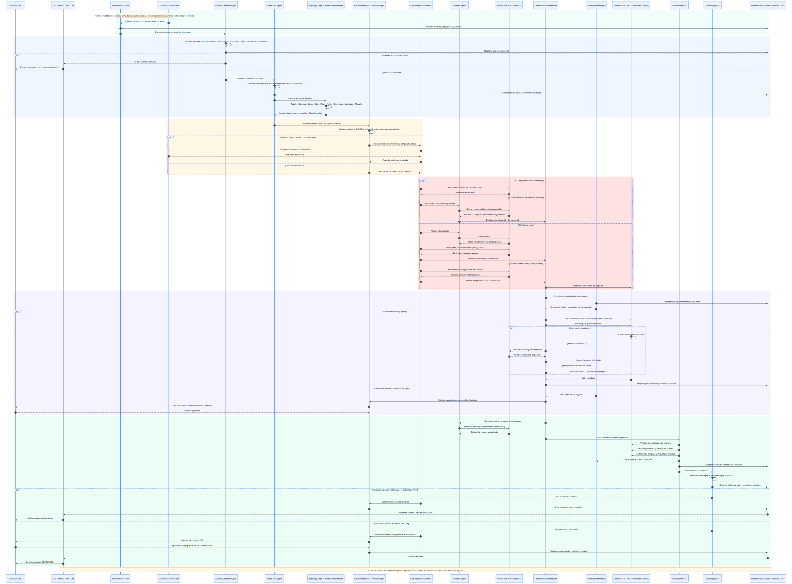
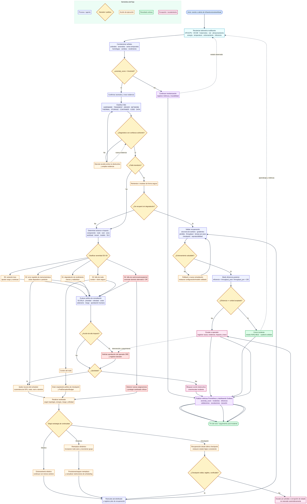
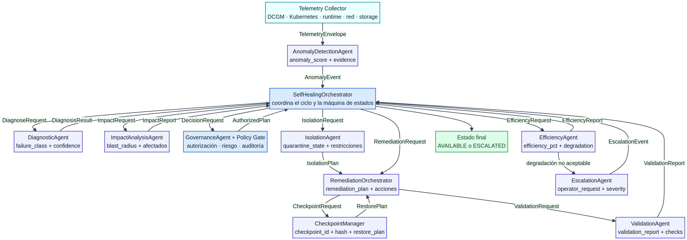
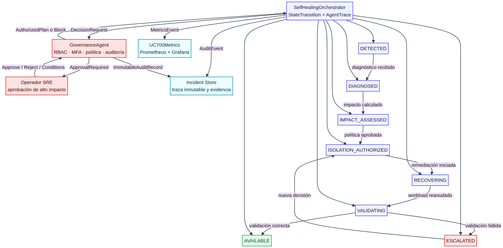
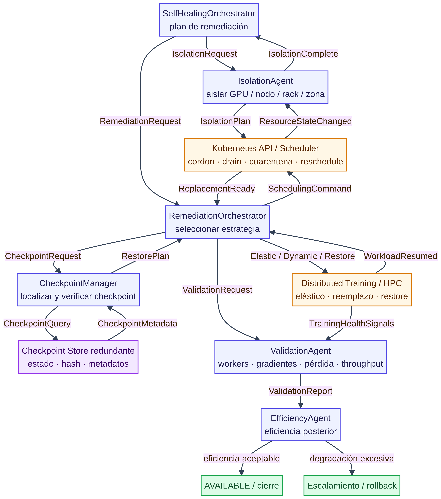
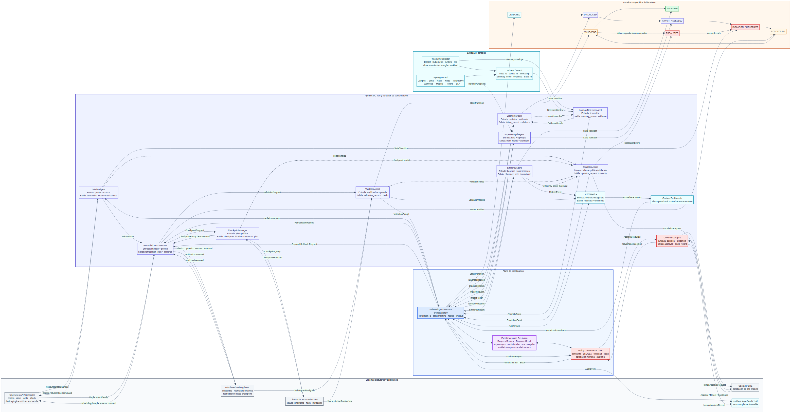
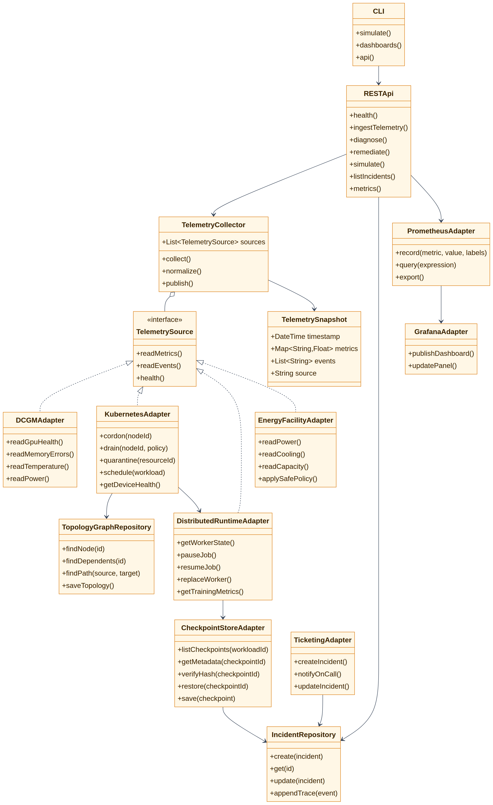
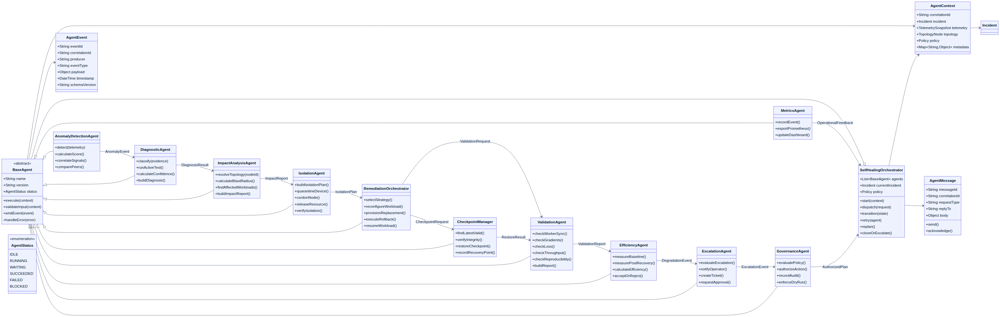
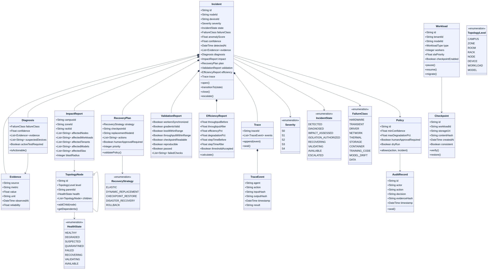
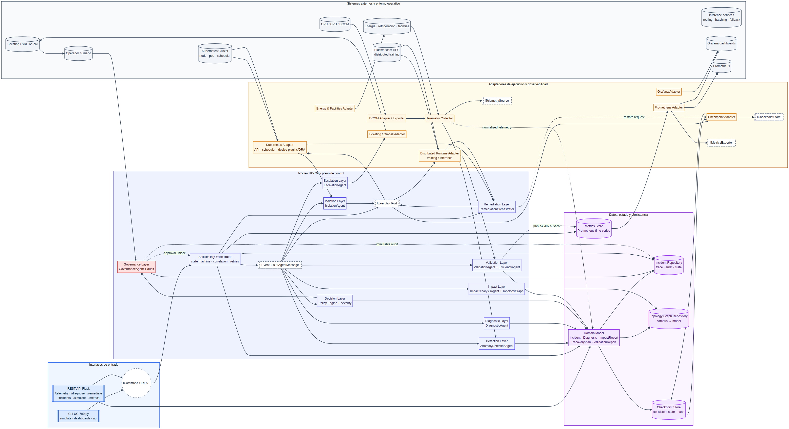

# TomoIII
## AI-Native Operations &amp; Agentic Patterns
### CASE: UC-700  Caso de uso 4: autosanación avanzada del entrenamiento
"El nodo N-482 presenta riesgo elevado de fallo de memoria en las próximas 24 horas; evacuar workloads no tolerantes a fallos, ejecutar diagnóstico y programar sustitución.”

#### USO: . INTERNO

Paso	Agente	Archivo
1. Detección	AnomalyDetectionAgent	anomaly_detection_agent.py
2. Clasificación	DiagnosticAgent	diagnostic_agent.py
3. Alcance	ImpactAnalysisAgent	impact_analysis_agent.py
4. Aislamiento	IsolationAgent	isolation_agent.py
5. Reconfiguración	RemediationOrchestrator	remediation_orchestrator.py
6. Checkpoint	CheckpointManager	checkpoint_manager.py
7. Reposición	RemediationOrchestrator	remediation_orchestrator.py
8. Validación	ValidationAgent	validation_agent.py
9. Eficiencia	EfficiencyAgent	efficiency_agent.py
10. Escalamiento	EscalationAgent	escalation_agent.py
11. Gobierno	GovernanceAgent	governance_agent.py
12. Métricas	UC700Metrics	prometheus_metrics.py
13. Dashboards	grafana_dashboards.py	grafana_dashboards.py


#### EXECUTION
```bash
cd /Users/utron/Documents/code-books/TomoIII/UC-700/code
python -m pytest tests/ -v

# Simular el escenario del nodo N-482 con riesgo de fallo de memoria
python UC-700.py simulate --node N-R-A-1 --operator sre-001

# Generar dashboards de Grafana
python UC-700.py dashboards

# Iniciar API REST
python UC-700.py api

```
# DESCRIPTION
"El nodo N-482 presenta riesgo elevado de fallo de memoria en las próximas 24 horas; evacuar workloads no tolerantes a fallos, ejecutar diagnóstico y programar y ejecutar la sustitución.”
En GPU NVIDIA, DCGM proporciona monitorización de salud, diagnósticos, alertas y políticas de energía, además de integración mediante DCGM Exporter para entornos Kubernetes. Para dispositivos expuestos por plugins de Kubernetes, el estado de salud puede propagarse al estado del contenedor y al planificador.

Deseo aclarar que la autosanación (replicaset) no es simplemente reiniciar un Pod. Debe preservar el estado lógico del entrenamiento y recuperar el trabajo con el menor impacto posible, tiempo y latencia, matematica ejecutada e historico de proceso sin afectar el entrenamiento. Para esto Qbex.ai realiza este flujo:
1. Detectar la anomalía.
2. Clasificar el fallo.
3. Determinar su alcance.
4. Aislar el componente.
5. Reconfigurar el trabajo.
6. Recuperar desde el último checkpoint válido.
7. Reponer el componente defectuoso.
8. Validar que el entrenamiento continúa correctamente.
9. Medir la degradación de eficiencia.
10. Escalar a un operador si no se cumple el objetivo.

y luego aplica esta arquitectura de referencia:

```text
Telemetría
   ↓
Detección de anomalías
   ↓
Motor de diagnóstico
   ↓
Clasificador de severidad
   ↓
Orquestador de remediación
   ↓
Kubernetes / scheduler / runtime distribuido
   ↓
Checkpoint manager y job controller
   ↓
Validación de recuperación
   ↓
Cierre o escalamiento del incidente
```






 4. Diseño detallado del sistema de autosanación
 Estados de salud
Cada componente en el grafo nos muestra el estado explícito:
- `HEALTHY`: opera dentro de los límites.
- `DEGRADED`: funciona, pero con pérdida medible de rendimiento.
- `SUSPECTED`: presenta señales anómalas, aún sin confirmación.
- `QUARANTINED`: no recibe nuevos workloads.
- `FAILED`: se considera no operativo.
- `RECOVERING`: está siendo reparado o reconfigurado.
- `VALIDATING`: se están ejecutando pruebas posteriores.
- `AVAILABLE`: vuelve a estar habilitado.

 Qbex.ai muestra los Niveles de severidad y riesgos
| Nivel | Ejemplo | Acción |
|---|---|---|
| S0 | Variación leve de temperatura | Ajustar carga y continuar |
| S1 | Degradación de rendimiento | Marcar componente y redistribuir |
| S2 | Error repetido de enlace o memoria | Aislar dispositivo y migrar workload |
| S3 | Fallo de nodo | Retirar nodo y recuperar desde checkpoint |
| S4 | Fallo de rack, energía o red | Conmutar a dominio alternativo y activar DR |

# Qbex.ai muestra el Flujo fallo-detección-aislamiento-continuidad

## Paso 1: detección
No solamente recoger eventos y métricas de:
- Hardware.
- Sistema operativo.
- Runtime del acelerador.
- Kubernetes.
- Red.
- Almacenamiento.
- Entrenamiento.
- Inferencia.
- Energía y refrigeración.
es la detección que debe combinar:
- Umbrales estáticos.
- Detección de anomalías.
- Modelos de series temporales.
- Correlación de eventos.
- Comparación con nodos homólogos.
- Análisis de cambios.
- Señales de rendimiento del workload.

## Paso 2: diagnóstico
Qbex.ai es inteligente y distinge entre:
- Fallo real de hardware.
- Error transitorio.
- Error de driver.
- Problema de red.
- Presión térmica.
- Saturación de almacenamiento.
- Error del contenedor.
- Error del código de entrenamiento.
- Deterioro del modelo.
- Problema de datos.
No debe aislar un nodo únicamente por una métrica aislada. Qbex recomienda exigir una combinación de señales o ejecutar una prueba activa antes de declarar el componente defectuoso.

## Paso 3: aislamiento
El aislamiento se efectúa en varios niveles:
- Acelerador individual.
- Instancia o partición del acelerador.
- Nodo.
- Rack.
- Zona de red.
- Volumen de almacenamiento.
- Dominio energético.
- Región o campus.
En Kubernetes, el componente aislado debe dejar de anunciarse como recurso disponible. Los plugins de dispositivos permiten exponer recursos como GPU, NIC y FPGA, y Kubernetes dispone de información de salud de los dispositivos asignados a los contenedores. 

## Paso 4: continuidad del entrenamiento
Qbex despluiga tres estrategias principales:
1. Entrenamiento elástico: el job continúa con menos workers.
2. Reemplazo dinámico: se incorpora un nodo sano y se reconstruye el grupo distribuido.
3. Recuperación desde checkpoint: se reinicia el job desde el último estado consistente.

Qbex incluye una estrategia con un framework que soporta elasticidad. Si el entrenamiento requiere un número fijo de participantes, la plataforma coordinar el checkpoint, detener brevemente el grupo, reemplazar el nodo y reanuda, esto se visualiza en dashboards, alarmas, logs, trazas y metricas.

## Paso 5: validación
Qbex infomra en tiempo real :
- Que todos los workers están sincronizados.
- Que no existen gradientes corruptos.
- Que la pérdida continúa dentro del rango esperado.
- Que la velocidad de entrenamiento no cayó por encima del umbral.
- Que el throughput de datos es suficiente.
- Que no aumentó anormalmente el tiempo por paso.
- Que el checkpoint se puede leer y verificar.
- Que el modelo resultante sigue siendo reproducible.

Por ejemplo, si el entrenamiento tenía 100.000 muestras por segundo y después de la recuperación procesa 96.000, la eficiencia es 96%. La política podría aceptar la continuidad si la eficiencia permanece por encima de un umbral, como 90%, evitando detener todo el clúster por una pérdida limitada.

## Pseudoflujo operativo

```text
if anomaly_score(node) > threshold:
    classify_failure(node)

    if failure_is_transient(node):
        retry_or_reset(node)

    elif failure_is_local(node):
        quarantine_device(node)
        reschedule_affected_workloads()

    elif failure_is_node_level(node):
        cordon(node)
        drain(node, respecting_checkpoint_policy)
        restore_training_from_checkpoint()
        provision_replacement_node()

    elif failure_is_rack_or_zone_level(node):
        stop_new_allocations(zone)
        migrate_critical_inference()
        resume_training_in_backup_domain()

    validate_training_health()

    if throughput_drop <= allowed_degradation:
        close_incident()
    else:
        escalate_to_operator()
```

## 5. Arquitectura de qbex.ai
### Capas funcionales
#### Capa de observabilidad
- Métricas.
- Logs.
- Eventos.
- Traces.
- Telemetría energética.
- Telemetría térmica.
- Estado de dispositivos.
- Estado de workloads.
- Métricas de entrenamiento e inferencia.

Nuestras teecnologías: 
- OpenTelemetry.
- Prometheus.
- Grafana.
- Loki o Elasticsearch.
- Tempo o Jaeger.
- Exporters específicos de aceleradores.
- APIs de Azure Monitor y Azure Resource Graph.
- Métricas del scheduler y del runtime.

### Capa de inventario y topología
El grafo mantiene un grafo de dependencias:
```text
Campus → Zona → Sala → Rack → Nodo → Dispositivo → Workload → Modelo
``
Este grafo es necesario para el análisis de impacto. No es suficiente saber que “falló una GPU”; hay que saber qué job, tenant, modelo y SLA dependen de ella.
 Capa de detección
- Reglas deterministas.
- Análisis estadístico.
- Detección de anomalías.
- Modelos predictivos.
- Detección de deriva.
- Correlación de eventos.
- Clasificación de incidentes.
- Cálculo de confianza.

Qbex IA no ejecuta acciones destructivas basándose únicamente en una predicción de baja confianza. Valida con los otros componentes analitycsdata.com, cloudatasecure.com, qbex.ai, c4ml.io, bloower.com, trackprice.ai, utron.ai y luego toma decision (entre agentes AI)
 Capa de decisión
El motor aplica:
- Políticas de prioridad.
- SLO y SLA.
- Límites de coste.
- Criticidad del workload.
- Tolerancia a pérdida de rendimiento.
- Restricciones de soberanía y residencia de datos.
- Reglas de aprobación humana.

 Capa de ejecución e integracion
- Kubernetes API.
- Scheduler y extensiones de scheduling.
- Device plugins o DRA.
- Helm y operadores.
- Azure CycleCloud o mecanismos equivalentes de HPC.
- Sistemas de entrenamiento distribuido.
- Gestión de checkpoints.
- Sistemas de tickets y on-call.
- APIs de energía, refrigeración y facilities.

 Capa de gobierno
Debe ofrecer:
- RBAC.
- MFA.
- Separación de funciones.
- Auditoría inmutable.
- Aprobación de acciones de alto riesgo.
- Gestión de secretos.
- Control de cambios.
- Rollback.
- Simulación antes de ejecutar.
- Evidencia de cada decisión automática.

## 6. Integración con Kubernetes
Kubernetes se utiliza como una capa de orquestación, nada que ver con el entrenamiento que es externo y sustituto de la ejecucion de entrenamiento que el scheduler de bloower.com implementa como HPC de entrenamiento distribuido.
### Elementos 
- Device plugins o DRA para aceleradores.
- Etiquetas de topología: campus, zona, rack, nodo y dominio de red.
- Taints y tolerations para nodos degradados.
- Affinity y anti-affinity para evitar puntos únicos de fallo.
- PriorityClasses para diferenciar inferencia crítica y entrenamiento.
- PodDisruptionBudgets.
- StatefulSets o controladores especializados para trabajos con estado.
- Operators para entrenamiento distribuido.
- Checkpoint externo y redundante.
- Network policies.
- Service mesh solo cuando su sobrecarga sea aceptable.
- Scheduler consciente de energía, topología y comunicación.
- Admission controllers para impedir despliegues incompatibles.

## Qbex.ai tiene el planificador que detecta “GPU libre”. Una asignación correcta debe valorar:

- Memoria disponible.
- Ancho de banda de memoria.
- Proximidad entre aceleradores.
- Topología de red.
- Estado de los enlaces.
- Presupuesto energético.
- Capacidad térmica.
- Riesgo predictivo del nodo.
- Afinidad con el almacenamiento.
- Interferencia con otros trabajos.

## 7. MLOps y entrenamiento distribuido
Bloower.com agentic AI implementa el ciclo completo:
- Registro de datasets.
- Versionado de código.
- Versionado de configuración.
- Registro de modelos.
- Reproducibilidad.
- Validación de datos.
- Entrenamiento distribuido.
- Checkpoints.
- Evaluaciones.
- Pruebas de regresión.
- Promoción de modelos.
- Despliegue canario.
- Rollback.
- Monitorización posterior al despliegue.

## Métricas de entrenamiento Bloower.com
- Tiempo por paso.
- Samples por segundo.
- Escalabilidad paralela.
- Utilización de aceleradores.
- Tiempo de comunicación colectiva.
- Ratio de espera por datos.
- Pérdida del modelo.
- Gradiente anómalo.
- Frecuencia de checkpoints.
- Tiempo de recuperación.
- Pérdida de trabajo tras un fallo.
- Coste por millón de tokens entrenados.
- Energía por millón de tokens.
- Eficiencia del entrenamiento después de una remediación. 
- Reduce mediante checkpoints adaptativos, pero sin saturar almacenamiento ni red.

## 8. Bloower.com Inferencia masiva y qbex.ai en control de consumo
Para inferencia, Bloower.com proporciona:
- Enrutamiento por modelo.
- Batching continuo.
- Autoscaling.
- Caché de prefijos y KV.
- Selección de precisión.
- Despliegue multi-región.
- Réplicas calientes.
- Control de cuota.
- Priorización de solicitudes.
- Fallback a modelos menores.
- Inferencia local cuando sea posible.
- Protección contra sobrecarga.
- Control de coste por tenant.

 Política de enrutamiento ejemplo
```text
Si la solicitud es crítica y requiere baja latencia:
    usar modelo optimizado de alta prioridad

Si la solicitud es sencilla:
    usar modelo pequeño cuantizado

Si el presupuesto del tenant se excede:
    aplicar rate limit o ruta económica

Si el campus presenta limitación energética:
    reducir réplicas no críticas y activar inferencia local

Si el modelo principal está degradado:
    usar modelo fallback validado
```

## Métricas de inferencia
- TTFT.
- Latencia P50, P95 y P99.
- Tokens por segundo.
- Throughput.
- Tasa de errores.
- Saturación de colas.
- Utilización de aceleradores.
- Coste por solicitud.
- Coste por millón de tokens.
- Tasa de aciertos de caché.
- Tasa de fallback.
- Calidad de respuesta.
- Alucinaciones.
- Fundamentación.
- Violaciones de seguridad.
- Consumo energético por solicitud.

## 9. Cuantización extrema y control de costes
La cuantización se integra como una política de optimización, no como una operación aislada.

### Capacidades 
- Calibración por modelo y dominio.
- Evaluación de precisión después de cuantizar.
- Comparación FP16, BF16, FP8, INT8, INT4 y formatos equivalentes.
- Cuantización por canal o por grupo.
- Detección de capas sensibles.
- Validación de tareas críticas.
- Registro de calidad y coste.
- Rollback automático si la calidad cae.
- Selección dinámica de precisión según tipo de solicitud.
Nota: Nunca debe optimizarse solo el coste. Una reducción de tokens o precisión que aumente las respuestas incorrectas puede elevar el coste total por tarea completada.

## 10. IA local y operación híbrida
La IA local c4ml.io en su pipeline implementa:
- Detección inmediata de fallos.
- Control de equipos de refrigeración.
- Diagnóstico de nodos sin enviar datos fuera del campus.
- Inferencia de baja latencia.
- Operación durante pérdida de conectividad con el plano central.
- Protección de datos sensibles.
- Predicción energética local.
- Respuesta a incidentes de primer nivel.

c4ml.io en su pipeline funciona con dos niveles:
 Control local
- Continúa operando aunque se pierda la conexión.
- Ejecuta acciones preaprobadas.
- Aísla dispositivos.
- Mantiene cargas críticas.
- Protege energía y refrigeración.
- Almacena eventos para sincronización posterior.

 Control global
- Optimiza entre regiones.
- Coordina capacidad.
- Gestiona modelos y políticas.
- Analiza tendencias.
- Ejecuta planificación de mantenimiento.
- Consolida costes y SLA.

c4ml.io en su pipeline implementa la pérdida del plano global y previene que el centro de datos se convierta en un sistema inoperante.

## 11. Métricas de éxito aplicadas en la plataforma
### Fiabilidad
- MTTD.
- MTTR.
- MTBF.
- Tiempo de aislamiento.
- Tiempo de sustitución.
- Porcentaje de incidentes autocontenidos.
- Porcentaje de recuperaciones sin intervención humana.
- Pérdida de trabajo por incidente.
- Disponibilidad del entrenamiento.
- Disponibilidad de inferencia.

### Eficiencia
- Utilización efectiva de aceleradores.
- Throughput por MW.
- Tokens por kWh.
- Coste por millón de tokens.
- Ratio de espera por comunicación.
- Ratio de espera por almacenamiento.
- PUE.
- Eficiencia posterior a la recuperación.
- Porcentaje de capacidad reservada y ociosa.

### Calidad de autosanación
- Tasa de falsos aislamientos.
- Tasa de fallos no detectados.
- Tasa de reincidencia.
- Éxito de rollback.
- Precisión del diagnóstico.
- Tiempo de validación.
- Número de acciones con aprobación humana.
- Número de remediaciones que empeoraron el incidente.

### Seguridad
- Acciones automatizadas bloqueadas.
- Cambios no autorizados.
- Exposición de secretos.
- Integridad de checkpoints.
- Fallos de autenticación.
- Incidentes por tenant.
- Cumplimiento de políticas.

## 12. MVP recomendado para qbex.ai
No conviene comenzar intentando controlar todo un campus Stargate. El primer producto debería centrarse en un dominio limitado pero demostrable.
### Fase 1: observabilidad
- Inventario de nodos y aceleradores.
- Integración con Kubernetes.
- Métricas de GPU, CPU, red, almacenamiento, energía y temperatura.
- Correlación entre componentes y workloads.
- Dashboards operativos.
- Alertas y trazabilidad.

### Fase 2: detección y predicción
- Detección de anomalías.
- Clasificación de incidentes.
- Riesgo de fallo por nodo.
- Predicción térmica y energética.
- Identificación de degradación de entrenamiento.
- Recomendaciones de remediación.

### Fase 3: autosanación controlada
- Cordon y drain de nodos.
- Cuarentena de dispositivos.
- Reubicación de workloads.
- Recuperación desde checkpoint.
- Validación automática.
- Rollback.
- Aprobación humana para acciones de alto impacto.

### Fase 4: optimización
- Scheduling consciente de energía.
- Enrutamiento de inferencia.
- Cuantización automatizada.
- Batching y caché.
- Optimización de costes por tenant.
- Planificación global multi-campus.

## 13. Riesgos técnicos controlados por AI Native Platform
- Tratar Stargate como un único superordenador confirmado.
- Acoplar qbex.ai a un solo proveedor de aceleradores.
- Usar Kubernetes como único mecanismo de entrenamiento distribuido.
- Reiniciar Pods sin preservar el estado del entrenamiento.
- Aislar dispositivos por una métrica aislada.
- Ejecutar acciones destructivas sin política, simulación o aprobación.
- Optimizar utilización de GPU ignorando energía, red y temperatura.
- Aplicar cuantización sin pruebas de calidad.
- Registrar prompts, checkpoints o datos sensibles sin protección.
- Diseñar un plano central cuya caída detenga la operación local.
- Confundir disponibilidad del clúster con calidad de los modelos.
- No probar fallos reales mediante ejercicios de caos controlado.

# Solución de Agentes AI (código)

La implementación completa se encuentra en `/Users/utron/Documents/code-books/TomoIII/UC-700/code/`.

## Arquitectura de agentes implementados

| # | Paso | Agente | Archivo |
|---|---|---|---|
| 1 | Detectar la anomalía | `AnomalyDetectionAgent` | `anomaly_detection_agent.py` |
| 2 | Clasificar el fallo | `DiagnosticAgent` | `diagnostic_agent.py` |
| 3 | Determinar su alcance | `ImpactAnalysisAgent` | `impact_analysis_agent.py` |
| 4 | Aislar el componente | `IsolationAgent` | `isolation_agent.py` |
| 5 | Reconfigurar el trabajo | `RemediationOrchestrator` | `remediation_orchestrator.py` |
| 6 | Recuperar desde el último checkpoint válido | `CheckpointManager` | `checkpoint_manager.py` |
| 7 | Reponer el componente defectuoso | `RemediationOrchestrator` + `IsolationAgent` | `remediation_orchestrator.py` |
| 8 | Validar que el entrenamiento continúa | `ValidationAgent` | `validation_agent.py` |
| 9 | Medir degradación de eficiencia | `EfficiencyAgent` | `efficiency_agent.py` |
| 10 | Escalar a un operador | `EscalationAgent` | `escalation_agent.py` |
| 11 | Gobierno y auditoría | `GovernanceAgent` | `governance_agent.py` |
| 12 | Métricas Prometheus | `UC700Metrics` | `prometheus_metrics.py` |
| 13 | Dashboards Grafana | `grafana_dashboards.py` | `grafana_dashboards.py` |

Todos los agentes son coordinados por `SelfHealingOrchestrator` (`orchestrator.py`).

## Estructura del proyecto

```
/Users/utron/Documents/code-books/TomoIII/UC-700/code/
├── UC-700.py                # CLI de entrada
├── api.py                   # API REST Flask
├── config.py                # Configuración, umbrales, enums
├── models.py                # Dataclasses de dominio
├── telemetry_collector.py   # DCGM / K8s / runtime collector
├── anomaly_detection_agent.py
├── diagnostic_agent.py
├── impact_analysis_agent.py
├── topology_graph.py
├── isolation_agent.py
├── checkpoint_manager.py
├── remediation_orchestrator.py
├── validation_agent.py
├── efficiency_agent.py
├── escalation_agent.py
├── governance_agent.py
├── prometheus_metrics.py
├── grafana_dashboards.py
├── requirements.txt
└── tests/
    ├── test_core.py
    └── test_api.py
```

## Ejecución

```bash
# Instalar dependencias
pip install -r requirements.txt

# Ejecutar simulación de fallo de memoria GPU
python UC-700.py simulate --node N-R-A-1 --operator sre-001

# Generar dashboards de Grafana
python UC-700.py dashboards

# Iniciar API REST
python UC-700.py api
```

## API REST Flask

La API expone el pipeline completo y un esquema con card views de parámetros.

### Endpoints

| Método | Endpoint | Descripción |
|---|---|---|
| GET | `/health` | Health check del servicio |
| GET | `/api/v1/schema` | Card views de entrada y salida |
| GET | `/api/v1/agents` | Lista de agentes del sistema |
| POST | `/api/v1/telemetry/ingest` | Ingesta telemetría |
| POST | `/api/v1/diagnose` | Detección + diagnóstico |
| POST | `/api/v1/remediate` | Pipeline completo de autosanación |
| GET | `/api/v1/incidents` | Listar incidentes |
| GET | `/api/v1/incidents/<id>` | Detalle de incidente |
| POST | `/api/v1/simulate` | Simular escenario de fallo GPU |
| GET | `/api/v1/metrics` | Métricas Prometheus |
| GET | `/api/v1/dashboards` | Dashboards generados |

### Card View — Parámetros de Entrada

#### `POST /api/v1/diagnose`

| Parámetro | Tipo | Requerido | Ejemplo | Descripción |
|---|---|---|---|---|
| `node_id` | string | Sí | `N-R-A-1` | Identificador del nodo |
| `device_id` | string | No | `N-R-A-1-gpu-0` | GPU específica |
| `inject_failure` | boolean | No | `true` | Inyectar firma de fallo de memoria |

#### `POST /api/v1/remediate`

| Parámetro | Tipo | Requerido | Ejemplo | Descripción |
|---|---|---|---|---|
| `node_id` | string | Sí | `N-R-A-1` | Nodo objetivo |
| `device_id` | string | No | `N-R-A-1-gpu-0` | Dispositivo afectado |
| `inject_failure` | boolean | No | `true` | Simular fallo para pruebas |
| `operator_id` | string | No | `sre-001` | Operador que aprueba acciones críticas |

#### `POST /api/v1/simulate`

| Parámetro | Tipo | Requerido | Ejemplo | Descripción |
|---|---|---|---|---|
| `node_id` | string | Sí | `N-R-A-1` | Nodo donde simular el escenario |
| `operator_id` | string | No | `sre-001` | Aprobador humano |

### Card View — Parámetros de Salida

#### `GET /api/v1/incidents/<id>`

| Campo | Tipo | Descripción |
|---|---|---|
| `id` | string | Identificador único del incidente |
| `node_id` | string | Nodo afectado |
| `severity` | string | `S0`..`S4` |
| `failure_class` | string | `HARDWARE`, `THERMAL`, `NETWORK`, etc. |
| `state` | string | Estado del incidente |
| `diagnosis` | object | Evidencia y confianza del diagnóstico |
| `impact` | object | Alcance, nodos, jobs y modelos afectados |
| `plan` | object | Estrategia, checkpoint y nodo de reemplazo |
| `validation` | object | Resultado de validación post-recuperación |
| `efficiency` | object | Eficiencia medida y umbral aceptado |
| `escalated` | boolean | Si fue escalado a operador |
| `trace` | list | Traza de ejecución de cada agente |

#### `POST /api/v1/diagnose`

| Campo | Tipo | Descripción |
|---|---|---|
| `anomaly_score` | float | Score de anomalía (0..1) |
| `severity` | string | `S0`..`S4` |
| `failure_class` | string | Clasificación del fallo |
| `confidence` | float | Confianza del diagnóstico |
| `evidence` | list | Evidencia multiseñal |
| `suspected_devices` | list[string] | Dispositivos bajo sospecha |


## DB
Se utiliza una base de datos SQLite para almacenar los incidentes y el estado de los dispositivos.
 



## Dashboards Grafana


Se generan dos dashboards JSON listos para importar en Grafana:

- `dashboards/uc700-overview.json` — Vista operativa del pipeline de autosanación.
- `dashboards/uc700-training-health.json` — Salud del entrenamiento y checkpoints.

Métricas expuestas (namespace `uc700`):

- `uc700_anomaly_score`
- `uc700_incidents_total`
- `uc700_efficiency_pct`
- `uc700_validation_checks_total`
- `uc700_escalations_total`
- `uc700_remediation_duration_seconds`
- `uc700_device_state`
- `uc700_incident_state`

## Pruebas

```bash
python -m pytest tests/ -v
```

Se incluyen:
- Pruebas unitarias de cada agente (`tests/test_core.py`)
- Pruebas de integración de la API REST (`tests/test_api.py`)

## Notas de implementación

- El modo por defecto es `dry-run`: las acciones destructivas sobre Kubernetes se simulan.
- Para producción se deben conectar los adaptadores a DCGM Exporter, Prometheus, kubelet y el runtime distribuido real.
- Toda decisión queda registrada en la traza del incidente y en el `GovernanceAgent` para auditoría.

# API
API REST Flask (api.py) con:

Endpoints para telemetría, diagnóstico, remediación, simulación, incidentes y métricas Prometheus.
Card views de entrada/salida accesibles en GET /api/v1/schema.