# Technical Operations — Mapa de Macro-Procesos

> **Plataforma**: QBex MagicBox (ApiRestIaC)
> **Versión**: 2026-03
> **Clasificación**: Uso interno — Confidencial

---

## Tabla de Contenidos

1. [Vista General de la Arquitectura](#1-vista-general-de-la-arquitectura)
2. [Mapa de Macro-Procesos](#2-mapa-de-macro-procesos)
3. [MP-01 — Registro de Tenant (Full Pipeline)](#mp-01--registro-de-tenant-full-pipeline)
4. [MP-02 — Aprovisionamiento de Tenant (Namespace Isolation)](#mp-02--aprovisionamiento-de-tenant-namespace-isolation)
5. [MP-03 — Replicación Multi-Cluster](#mp-03--replicación-multi-cluster)
6. [MP-04 — Zero-Trust Security Stack](#mp-04--zero-trust-security-stack)
7. [MP-05 — Telemetría / Observabilidad (OTLP Pipeline)](#mp-05--telemetría--observabilidad-otlp-pipeline)
8. [MP-06 — Data Platform (ETL Stack Completo)](#mp-06--data-platform-etl-stack-completo)
9. [MP-07 — GitOps (ArgoCD + Gitea)](#mp-07--gitops-argocd--gitea)
10. [MP-08 — Infraestructura AWS (IaC Primitives)](#mp-08--infraestructura-aws-iac-primitives)
11. [MP-09 — Build & Deploy (CI/CD)](#mp-09--build--deploy-cicd)
12. [MP-10 — Istio Ambient Service Mesh](#mp-10--istio-ambient-service-mesh)
13. [MP-11 — OpenFaaS Serverless Functions](#mp-11--openfaas-serverless-functions)
14. [MP-12 — Consulta de Estado y Acceso](#mp-12--consulta-de-estado-y-acceso)
15. [MP-13 — Security Pipeline para Modelos IA, Agentic AI y Pipelines](#mp-13--security-pipeline-para-modelos-ia-agentic-ai-y-pipelines)
16. [Matriz de Dependencias entre Macro-Procesos](#matriz-de-dependencias-entre-macro-procesos)
17. [Puntos de Control Transversales](#puntos-de-control-transversales)
18. [Riesgos Sistémicos y Puntos de Quiebre](#riesgos-sistémicos-y-puntos-de-quiebre)

---

## 1. Vista General de la Arquitectura

```
┌───────────────────────────────────────────────────────────────────┐
│                         FLASK API (app.py :5001)                  │
│  Blueprints: services_bp │ iac_bp │ etl_bp │ ecr_bp │ build_bp   │
│             repo_bp │ model_bp │ pipeline_bp │ replication_bp     │
│             telemetry_bp                                          │
├───────────────────────────────────────────────────────────────────┤
│                        SERVICE LAYER                              │
│  tenant_register_service  │  replication_service  │  telemetry    │
│  zerotrust_service        │  etl_deploy_service   │  argocd       │
│  tenant_service           │  gitea_tenant_service │  openfaas     │
│  pentaho_etl_service      │  airflow_pdi_service  │  dbt_service  │
│  spark_service            │  dba_service          │  helm_service │
│  k8s_service  │  eks_service  │  ecr_service  │  rds_service     │
│  s3_service │ sqs_service │ lambda_service │ vpc_service │ iam    │
├───────────────────────────────────────────────────────────────────┤
│                     INFRAESTRUCTURA TARGET                        │
│  EKS (qbx-eks-cluster / qbx-eks-cluster-bg)                     │
│  Istio Ambient (ztunnel + waypoint)  │  ArgoCD  │  Kyverno       │
│  Grafana Alloy │ Mimir │ Loki │ Tempo │ Prometheus │ Grafana     │
│  OpenFaaS │ Airflow │ PDI Carte │ Spark │ dbt │ MariaDB/Postgres │
│  AWS: S3, ECR, CodeBuild, AppConfig, RDS, Lambda, API GW, R53   │
└───────────────────────────────────────────────────────────────────┘
```

---

## 2. Mapa de Macro-Procesos

| ID | Macro-Proceso | Entrada Principal | Endpoint | Orquestador |
|:---|:---|:---|:---|:---|
| MP-01 | Registro de Tenant (Full) | tenant_id, repo_url | `POST /api/v1/iac/register-tenant` | `tenant_register_service.register_tenant()` |
| MP-02 | Aprovisionamiento de Tenant | tenant_id | `POST /api/v1/iac/tenant/provision` | `tenant_service.provision_tenant()` |
| MP-03 | Replicación Multi-Cluster | tenant_id, clusters | `POST /api/v1/replication/register-tenant` | `replication_service.replicate_tenant()` |
| MP-04 | Zero-Trust Security | tenant_id | `POST /api/v1/tenants/{id}/zerotrust/apply` | `zerotrust_service.apply_zerotrust_policies()` |
| MP-05 | Telemetría OTLP | tenant_id, components | `POST /api/v1/tenants/{id}/mlops/telemetry/enable` | `telemetry_service.enable_telemetry()` |
| MP-06 | Data Platform (ETL) | component configs | `POST /api/v1/etl/deploy` | `etl_deploy_service.deploy_etl_stack()` |
| MP-07 | GitOps (ArgoCD + Gitea) | tenant_id, source_repo | `POST /api/v1/iac/tenant/gitea` | `gitea_tenant_service.provision_gitea_tenant()` |
| MP-08 | Infraestructura AWS | service-specific | Multiple `/api/v1/{svc}/deploy` | Per-service (s3, sqs, vpc, lambda, rds, eks) |
| MP-09 | Build & Deploy | repo_name, branch | `POST /api/v1/build/img` + `POST /api/v1/deploy/docker-ecr` | `build_service` + `docker_deploy_service` |
| MP-10 | Istio Ambient Mesh | config | `POST /api/v1/istio-ambient/deploy` | `prereq_service` + `helm_service` |
| MP-11 | OpenFaaS Functions | function spec | `POST /api/v1/iac/openfaas/functions` | `openfaas_service` |
| MP-12 | Estado y Acceso | tenant_id | `GET /api/v1/iac/access-info-tenant` | `tenant_register_service.get_tenant_access_info()` |
| MP-13 | Security Pipeline (AI SecOps) | repo_name, model/agent spec | `POST /api/v1/security/pipeline/run` | `security_pipeline_service.run_security_pipeline()` |

---

## MP-01 — Registro de Tenant (Full Pipeline)

**Endpoint**: `POST /api/v1/iac/register-tenant`
**Orquestador**: `services/tenant_register_service.py → register_tenant()`
**Descripción**: Pipeline de 23 pasos que crea toda la infraestructura, aislamiento K8s, GitOps y servicios para un tenant nuevo.

### Sub-procesos (23 pasos)

| Paso | Sub-proceso | Entrada | Salida | Servicio Invocado |
|:---|:---|:---|:---|:---|
| 0 | Provisión K8s tenant | tenant_id, allowed_methods | Namespace, SA, RBAC, AuthzPolicy, NetworkPolicy, Waypoint, mTLS | `tenant_service.provision_tenant()` → **MP-02** |
| 0b | Provisión Gitea tenant | tenant_id, source_repo_url | Org, mirror repo, user, webhooks | `gitea_tenant_service.provision_gitea_tenant()` → **MP-07** |
| 1 | S3 Bucket | repo_name | iac-artifacts-{repo_name} bucket | `s3_service.create_bucket()` |
| 2 | ECR Repository | repo_name | ECR repo URI | `ecr_service.create_repository()` |
| 3 | CodeBuild Project | repo_url, runtime, build_command | Build project + build execution | `build_service.create_project()` |
| 3b | Upload Build Artifact | build output | S3 artifact | `s3_service.upload()` |
| 4 | AppConfig Resources | app name, environment | AppConfig app + environment + profile | `appconfig_service.create_resources()` |
| 5 | AppConfig Hosted Version | profile, content | Hosted config version | `appconfig_service.create_hosted_version()` |
| 6 | EKS IAM Role | role_name | IAM role ARN | `iam_service.create_role()` |
| 7 | EKS Cluster | cluster_name, subnets | Cluster ARN + endpoint | `eks_service.create_cluster()` |
| 8 | Kubeconfig + Namespace | cluster_name | kubeconfig, namespace ready | `k8s_service.update_kubeconfig()` |
| 9 | Secrets Manager | secret values | Secret ARN | `secrets_manager_service.create_secret()` |
| 10 | RDS Instance | db config | RDS endpoint + credentials | `rds_service.create_instance()` (condicional) |
| 11 | Gitea + MariaDB K8s | gitea config | Gitea + MariaDB pods running | `helm_service` (condicional) |
| 12 | Install ArgoCD | — | ArgoCD running in qbx-gitops-ns | `argocd_service.install()` |
| 13 | ArgoCD Core Apps | — | Istio, ingress-nginx, cert-manager apps | `argocd_service.create_app()` |
| 14 | Monitoring Stack | helm config | Grafana, Prometheus, Loki deployed | `helm_service.install_chart()` |
| 15 | Route53 Hosted Zone | domain_name | Hosted zone ID + NS records | `route53_service.create_zone()` |
| 16 | Lambda → OpenFaaS Bridge | function config | Lambda function ARN | `lambda_service.deploy()` (condicional) |
| 17 | API Gateway | domain, lambda | API Gateway endpoint | `api_gateway_service.create()` (condicional) |
| 18 | MariaDB DB + User | customer, ns | DATABASE + USER created | `kubectl exec mariadb` |
| 19 | ArgoCD AppProject | customer | Scoped AppProject | `argocd_service.create_appproject()` |
| 20 | K8s Secrets | env_vars, db creds | tenant-db-credentials, tenant-env-vars, tenant-app-secrets | `kubectl create secret` |
| 21 | ArgoCD Application | repo, path, ns | GitOps auto-deploy app | `argocd_service.create_app()` |
| 22 | Istio HTTPRoute | hostname, service | HTTP routing rule | `kubectl apply HTTPRoute` |

### Diagrama de secuencia

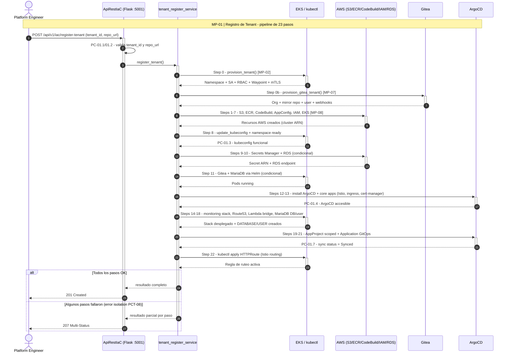

### Puntos de Control

| Punto | Tipo | Validación |
|:---|:---|:---|
| **PC-01.1** | Pre-condición | `tenant_id` sigue patrón `tenant-{customer}-{layer}-{component}` |
| **PC-01.2** | Pre-condición | `repo_url` no vacío y accesible |
| **PC-01.3** | Checkpoint | EKS cluster existe y kubeconfig funcional (Step 7-8) |
| **PC-01.4** | Checkpoint | ArgoCD accesible antes de crear apps (Step 12) |
| **PC-01.5** | Checkpoint | Gitea service ready antes de provisionar tenant Gitea (Step 0b) |
| **PC-01.6** | Post-condición | Namespace existe y tiene label `qbx/managed: true` |
| **PC-01.7** | Post-condición | ArgoCD Application sync status = Synced |

### Riesgos

| Riesgo | Probabilidad | Impacto | Mitigación |
|:---|:---|:---|:---|
| EKS cluster creation timeout (>15min) | Media | Alto — bloquea Steps 8-22 | Timeout configurable + retry + status polling |
| CodeBuild falla por dependencias faltantes | Alta | Medio — solo afecta build artifact | Logs detallados + rebuild manual |
| ArgoCD install falla por Helm conflict | Baja | Alto — bloquea GitOps completo | Idempotent install + helm upgrade --install |
| MariaDB pod no ready al crear DB | Media | Medio — Step 18 falla | Wait loop con readiness check |
| Rate limit AWS API (S3, ECR, IAM) | Baja | Bajo — retry resuelve | Exponential backoff en AWS SDK |

### Puntos de Quiebre

| Quiebre | Descripción | Efecto Cascada | Recuperación |
|:---|:---|:---|:---|
| **Q-01.1** | EKS cluster no creado (Step 7) | Steps 8-22 fallan en cadena | Re-ejecutar pipeline completo |
| **Q-01.2** | kubeconfig inválido (Step 8) | Todos los kubectl fallan | `aws eks update-kubeconfig` manual |
| **Q-01.3** | ArgoCD no disponible (Step 12) | Steps 13, 19, 21 fallan | Verificar Helm release, reinstalar |
| **Q-01.4** | Namespace collision (Step 0) | Sobreescribe tenant existente | Validación previa de existencia |

**Código de respuesta**: `201` (todo OK) / `207` (parcial — algunos pasos fallaron)

---

## MP-02 — Aprovisionamiento de Tenant (Namespace Isolation)

**Endpoint**: `POST /api/v1/iac/tenant/provision`
**Orquestador**: `services/tenant_service.py → provision_tenant()`
**Descripción**: Crea el aislamiento K8s completo para un tenant — es el sub-proceso core invocado por MP-01 Step 0.

### Sub-procesos (9 pasos)

| Paso | Sub-proceso | Entrada | Salida |
|:---|:---|:---|:---|
| 1 | Namespace con labels | ns, customer | Namespace con `istio.io/dataplane-mode: ambient`, `pod-security.kubernetes.io/enforce: restricted` |
| 2 | ServiceAccount | ns, sa_name | SA `sa-{customer}` |
| 3 | ClusterRole + Binding | rbac_name, ns, sa | RBAC scoped al namespace del tenant |
| 4 | AuthorizationPolicy (deny-all + allow-api) | ns, methods, paths | Default-deny + allow per SA/método/path |
| 5 | NetworkPolicy | ns | Isolation total de red L3/L4 |
| 6 | ResourceQuota + LimitRange | ns | Límites de CPU/memoria por namespace |
| 7 | Waypoint proxy | ns, waypoint_name | Gateway `waypoint-{customer}` (Istio Ambient L7) |
| 8 | Alloy telemetry config | ns, customer | ConfigMap para Alloy scraping de este tenant |
| 9 | PeerAuthentication mTLS STRICT | ns | mTLS forzado para todo tráfico en namespace |

### Diagrama de secuencia

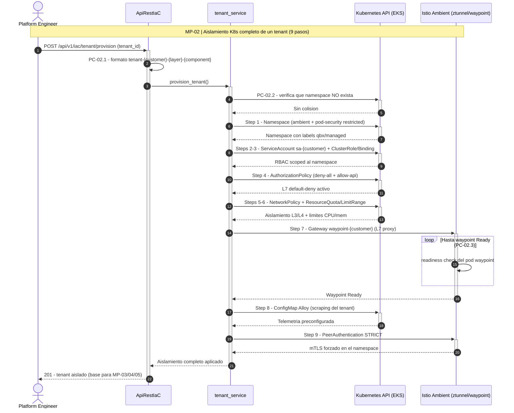

### Puntos de Control

| Punto | Validación |
|:---|:---|
| **PC-02.1** | Formato de `tenant_id` válido |
| **PC-02.2** | Namespace no existe previamente (evitar colisión) |
| **PC-02.3** | Waypoint pod en estado Ready |

### Riesgos

| Riesgo | Impacto | Mitigación |
|:---|:---|:---|
| Waypoint proxy no arranca (imagen pull error) | Tráfico L7 no se procesa | Verificar registry accesible + image pull secret |
| PeerAuthentication STRICT bloquea tráfico no-mTLS | Servicios legacy sin mTLS pierden conectividad | Validar que todo el namespace use Ambient mode |
| NetworkPolicy demasiado restrictiva | Servicios legítimos bloqueados | Labels de exclusión configurables |

### Puntos de Quiebre

| Quiebre | Efecto | Recuperación |
|:---|:---|:---|
| **Q-02.1** | Namespace creation falla (RBAC del operador) | Verificar permisos del SA de la API |
| **Q-02.2** | AuthorizationPolicy syntax inválida | Pods quedan sin acceso L7 | `kubectl delete authorizationpolicy -n {ns}` |

---

## MP-03 — Replicación Multi-Cluster

**Endpoint**: `POST /api/v1/replication/register-tenant`
**Orquestador**: `services/replication_service.py → replicate_tenant()`
**Descripción**: 16 pasos para replicar un tenant entre dos clusters EKS con Istio Ambient multi-cluster mesh.

### Sub-procesos (16 pasos)

| Paso | Sub-proceso | Entrada | Salida |
|:---|:---|:---|:---|
| 1 | Validar inputs + contexts | tenant_id, clusters | Contexts resueltos (short name → full ARN) |
| 2 | Istio Ambient install (origin) | origin_context | Istio Ambient en cluster origin (meshID: qbx-mesh, network: network1) |
| 3 | Istio Ambient install (replica) | replica_context | Istio Ambient en cluster replica (network: network2) |
| 4 | East-west gateway (origin) | origin_context | Gateway TLS passthrough :15443 |
| 5 | East-west gateway (replica) | replica_context | Gateway TLS passthrough :15443 |
| 6 | Remote secrets exchange | both contexts | Cross-cluster discovery habilitado |
| 7 | Tenant namespace (ambos) | ns | Namespace con labels ambient en ambos clusters |
| 8 | Tenant workload (replica) | deployment spec | Workload corriendo en replica |
| 9 | Waypoint proxy (origin) | ns, waypoint | L7 proxy en origin |
| 10 | Waypoint proxy (replica) | ns, waypoint | L7 proxy en replica |
| 11 | ServiceEntry (origin) | replica svc FQDNs | Origin descubre servicios del replica |
| 12 | KubernetesGateway (origin) | — | Gateway para cross-cluster routing |
| 13 | HTTPRoute cross-cluster | hostnames, backends | Traffic routing origin ↔ replica |
| 14 | mTLS PeerAuthentication | — | STRICT en ambos clusters |
| 15 | AuthorizationPolicy | — | Tenant isolation en ambos clusters |
| 16 | Verificación cross-cluster | — | Connectivity check + DNS resolution test |

### Diagrama de secuencia

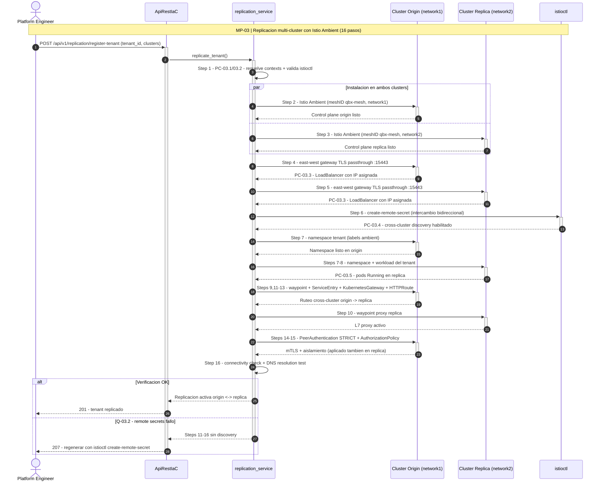

### Puntos de Control

| Punto | Validación |
|:---|:---|
| **PC-03.1** | Ambos kubectl contexts accesibles |
| **PC-03.2** | `istioctl` disponible en PATH |
| **PC-03.3** | East-west gateway LoadBalancer tiene IP/hostname asignado |
| **PC-03.4** | Remote secrets aplicados correctamente (cross-cluster endpoints resuelven) |
| **PC-03.5** | Pods en ambos clusters en Running state |

### Riesgos

| Riesgo | Probabilidad | Impacto | Mitigación |
|:---|:---|:---|:---|
| Cluster replica no accesible (context inválido) | Media | Alto | Auto-resolución de context + skip graceful |
| `istioctl` no instalado | Media | Alto — Steps 2,3,6 fallan | Detección previa + skip con warning |
| East-west gateway sin IP (cloud-provider issue) | Baja | Alto — cross-cluster roto | Timeout + retry + manual LB check |
| Conflicto de meshID entre clusters | Baja | Crítico — mTLS cross-cluster falla | Validar meshID uniforme antes de Step 6 |
| Latencia cross-cluster excesiva | Media | Medio — degradación de performance | Monitoring con Tempo traces |

### Puntos de Quiebre

| Quiebre | Efecto Cascada | Recuperación |
|:---|:---|:---|
| **Q-03.1** | Context resolution falla para ambos clusters | Pipeline completo aborta | Verificar kubeconfig manual |
| **Q-03.2** | Remote secrets exchange falla (Step 6) | Steps 11-16 sin cross-cluster discovery | Regenerar secrets: `istioctl create-remote-secret` |
| **Q-03.3** | CA root mismatch entre clusters | mTLS handshake falla, tráfico bloqueado | Reinstalar Istio con CA compartida |

**Endpoints auxiliares**:
- `GET /api/v1/replication/status?tenant_id=...` — Estado actual
- `GET /api/v1/replication/manifests?tenant_id=...` — Dry-run YAML
- `GET /api/v1/replication/script?tenant_id=...` — Bash automation script

---

## MP-04 — Zero-Trust Security Stack

**Endpoint**: `POST /api/v1/tenants/{tenant_id}/zerotrust/apply`
**Orquestador**: `services/zerotrust_service.py → apply_zerotrust_policies()`
**Descripción**: 14 pasos para aplicar la capa completa de seguridad Zero-Trust con AuthorizationPolicy, PeerAuthentication y Kyverno.

### Sub-procesos (14 pasos)

| Paso | Sub-proceso | Entrada | Salida |
|:---|:---|:---|:---|
| 1 | Validación + context resolve | tenant_id, cluster | Context resuelto, namespace derivado |
| 2 | Default-deny L7 | ns | AuthorizationPolicy vacía (deny-all por defecto) |
| 3 | Allow healthchecks | ns | AuthorizationPolicy: GET /health, /live, /ready |
| 4 | Allow waypoint L7 | ns, waypoint, methods | AuthorizationPolicy: métodos permitidos desde SA del waypoint |
| 5 | Allow admin ops | ns | AuthorizationPolicy: /admin/* solo desde ops-service SA |
| 6 | Allow Alloy observability | ns | AuthorizationPolicy: /metrics, /v1/traces desde alloy SA |
| 7 | PeerAuthentication STRICT | ns | mTLS forzado |
| 8 | Kyverno: require-tenant-labels | ns | Labels qbx/tenant y qbx/managed obligatorios |
| 9 | Kyverno: restrict-privilege-escalation | ns | Bloquea privileged, hostNetwork, hostPID, hostIPC |
| 10 | Kyverno: require-resource-limits | ns | CPU y memory limits obligatorios |
| 11 | Kyverno: restrict-image-registries | ns | Solo ECR, Docker Hub, GHCR, Grafana, Quay |
| 12 | Kyverno: auto-inject-otel-env | ns | Mutate: inyecta OTEL_EXPORTER_OTLP_ENDPOINT en pods |
| 13 | Cross-tenant rules | cross_tenant_rules (opcional) | AuthorizationPolicy inter-namespace |
| 14 | Verificación | ns | Lista de policies aplicadas + status |

### Diagrama de secuencia

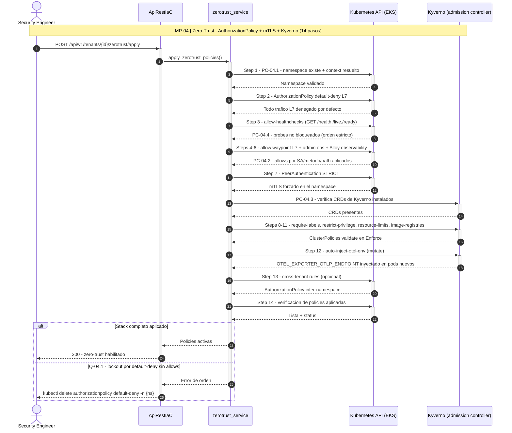

### Puntos de Control

| Punto | Validación |
|:---|:---|
| **PC-04.1** | Namespace existe antes de aplicar policies |
| **PC-04.2** | Waypoint proxy running antes de crear allow-waypoint-l7 |
| **PC-04.3** | Kyverno CRDs instalados en el cluster |
| **PC-04.4** | Default-deny no bloquea healthchecks (Step 3 después de Step 2) |

### Riesgos

| Riesgo | Impacto | Mitigación |
|:---|:---|:---|
| Default-deny aplicado sin allow-healthchecks | Liveness probes fallan → pods restart loop | Orden estricto: deny → allow-health → allow-waypoint |
| Kyverno no instalado | ClusterPolicies rechazadas (404 CRD not found) | Pre-check CRD existence |
| AuthorizationPolicy regex inválido en paths | Tráfico legítimo bloqueado | Validación de paths antes de apply |
| auto-inject-otel-env conflicta con vars existentes | Env vars sobreescritas | Kyverno patchStrategicMerge preserva existentes |

### Puntos de Quiebre

| Quiebre | Efecto | Recuperación |
|:---|:---|:---|
| **Q-04.1** | Default-deny sin allow → lockout total | `kubectl delete authorizationpolicy default-deny -n {ns}` |
| **Q-04.2** | Kyverno Enforce bloquea deploys legítimos | Cambiar a Audit mode: `validationFailureAction: Audit` |

**Dry-run**: `GET /api/v1/tenants/{id}/zerotrust/manifests` — exporta YAML sin aplicar.

---

## MP-05 — Telemetría / Observabilidad (OTLP Pipeline)

**Endpoint**: `POST /api/v1/tenants/{tenant_id}/mlops/telemetry/enable`
**Orquestador**: `services/telemetry_service.py → enable_telemetry()`
**Descripción**: 10 pasos para desplegar Grafana Alloy como OpenTelemetry Collector con pipeline completo a Mimir, Loki y Tempo.

### Sub-procesos (10 pasos)

| Paso | Sub-proceso | Entrada | Salida |
|:---|:---|:---|:---|
| 1 | Validación + context resolve | tenant_id, clusters, settings | Parámetros validados, context resuelto |
| 2 | Alloy ConfigMap | sampling, scrape_interval, log_level | ConfigMap con Alloy River config (OTLP receiver → exporters) |
| 3 | Alloy ServiceAccount + RBAC | — | SA `alloy`, ClusterRole, ClusterRoleBinding |
| 4 | Alloy Deployment | image, ports | Deployment `alloy` con ports 12345 (HTTP), 12346 (gRPC) |
| 5 | Alloy Service | — | Service exposing OTLP endpoints |
| 6 | Alloy AuthorizationPolicy | — | Permite ingress OTLP desde tenant namespace hacia Alloy |
| 7 | Tenant AuthorizationPolicy | ns | Permite Alloy scrapear /metrics del tenant |
| 8 | Tenant healthcheck policy | ns | Permite GET /health, /live, /ready en tenant ns |
| 9 | Alloy restart (rollout) | — | Rolling restart para cargar nuevo ConfigMap |
| 10 | Verificación | — | Alloy pod running + config loaded |

### Flujo de Datos (Data Flow)

```
  ┌─────────────┐       OTLP/HTTP :12345        ┌──────────────┐
  │ Tenant Pods  │ ────────────────────────────> │ Grafana Alloy │
  │ (ETL/ML apps)│       OTLP/gRPC :12346        │ (Collector)   │
  └─────────────┘                                └──────┬───────┘
                                                        │
                              ┌──────────────────┬──────┴──────────┐
                              ▼                  ▼                  ▼
                        ┌──────────┐      ┌──────────┐      ┌──────────┐
                        │  Mimir   │      │   Loki   │      │  Tempo   │
                        │ (Metrics)│      │  (Logs)  │      │ (Traces) │
                        └────┬─────┘      └────┬─────┘      └────┬─────┘
                             └─────────────────┼──────────────────┘
                                               ▼
                                        ┌──────────────┐
                                        │   Grafana    │
                                        │ (Dashboards) │
                                        └──────────────┘
```

### Diagrama de secuencia

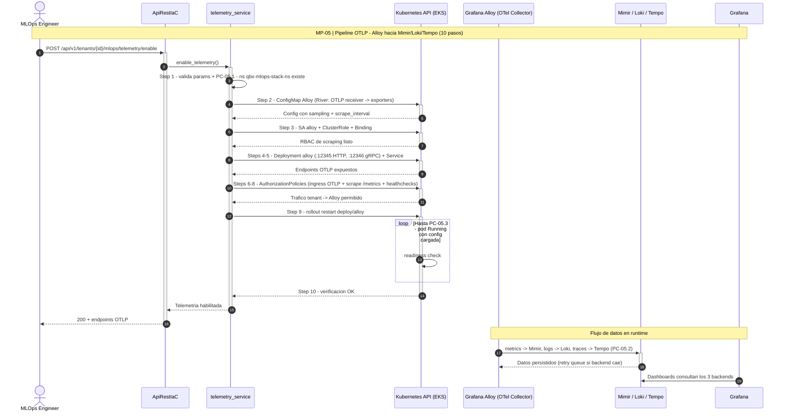

### Puntos de Control

| Punto | Validación |
|:---|:---|
| **PC-05.1** | Namespace `qbx-mlops-stack-ns` existe |
| **PC-05.2** | Mimir, Loki, Tempo endpoints accesibles |
| **PC-05.3** | Alloy pod en Running state después de rollout |
| **PC-05.4** | OTLP receiver acepta datos: `curl -X POST alloy:12345/v1/traces` |

### Riesgos

| Riesgo | Impacto | Mitigación |
|:---|:---|:---|
| Alloy ConfigMap syntax error (River config) | Alloy CrashLoopBackOff | Validar config con `alloy fmt` antes de apply |
| Mimir/Loki/Tempo no disponibles | Datos de telemetría perdidos | Alloy buffers + retry queue |
| Sampling 5% pierde traces importantes | Debugging difícil | Override por tenant con sampling_fraction ajustable |
| Alloy pod OOMKilled por alto volumen | Pipeline de telemetría caída | Resource limits + HPA |

### Puntos de Quiebre

| Quiebre | Efecto | Recuperación |
|:---|:---|:---|
| **Q-05.1** | Alloy deployment no arranca | Cero telemetría para todos los tenants | `kubectl logs -n qbx-mlops-stack-ns deploy/alloy` |
| **Q-05.2** | AuthorizationPolicy bloquea OTLP ingress | Pods no pueden enviar métricas | Verificar allow-alloy policy |
| **Q-05.3** | Loki gateway caído | Logs perdidos (no persisten) | Alloy retries, verificar Loki Helm release |

**Dry-run**: `GET /api/v1/tenants/{id}/mlops/telemetry/manifests`

---

## MP-06 — Data Platform (ETL Stack Completo)

**Endpoint**: `POST /api/v1/etl/deploy`
**Orquestador**: `services/etl_deploy_service.py → deploy_etl_stack()`
**Descripción**: Despliega hasta 5 componentes de data platform en orden de dependencia.

### Sub-procesos (5 componentes)

| Paso | Componente | Entrada | Salida | Servicio |
|:---|:---|:---|:---|:---|
| 1 | DBA Operations | db_type, db_host, backup_schedule | Backup CronJob, health-check, restore templates, PVC | `dba_service.provision_dba_tools()` |
| 2 | Pentaho ETL | namespace, db_config, transformations | Serverless CronJobs, template files, ConfigMaps | `pentaho_etl_service.provision_pentaho_etl()` |
| 3 | Airflow + PDI Carte | namespace, git_repo, db_config | Airflow scheduler/webserver + PDI Carte worker | `airflow_pdi_service.provision_airflow_pdi()` |
| 4 | dbt Core | namespace, profiles, models | dbt CronJobs, profiles.yml ConfigMap | `dbt_service.provision_dbt_core()` |
| 5 | Apache Spark | namespace, spark_config | Spark operator, SA, RBAC, History Server | `spark_service.provision_spark()` |

### Sub-endpoints Individuales

| Componente | Provision | Execute | Status |
|:---|:---|:---|:---|
| DBA | `POST /etl/dba/provision` | `POST /etl/dba/backup`, `POST /etl/dba/restore`, `POST /etl/dba/migration` | `GET /etl/dba/jobs`, `GET /etl/dba/health` |
| Pentaho | `POST /etl/pentaho-etl/provision` | `POST /etl/pentaho-etl/job` | `GET /etl/pentaho-etl/jobs`, `GET /etl/pentaho-etl/cronjobs` |
| Airflow+PDI | `POST /etl/airflow-pdi/provision` | `POST /etl/airflow-pdi/trigger`, `POST /etl/airflow-pdi/carte/job` | `GET /etl/airflow-pdi/status`, `GET /etl/airflow-pdi/carte/status` |
| dbt | `POST /etl/dbt/provision` | `POST /etl/dbt/run` | `GET /etl/dbt/jobs`, `GET /etl/dbt/cronjobs` |
| Spark | `POST /etl/spark/provision` | `POST /etl/spark/submit` | `GET /etl/spark/jobs`, `GET /etl/spark/applications` |

### Diagrama de secuencia

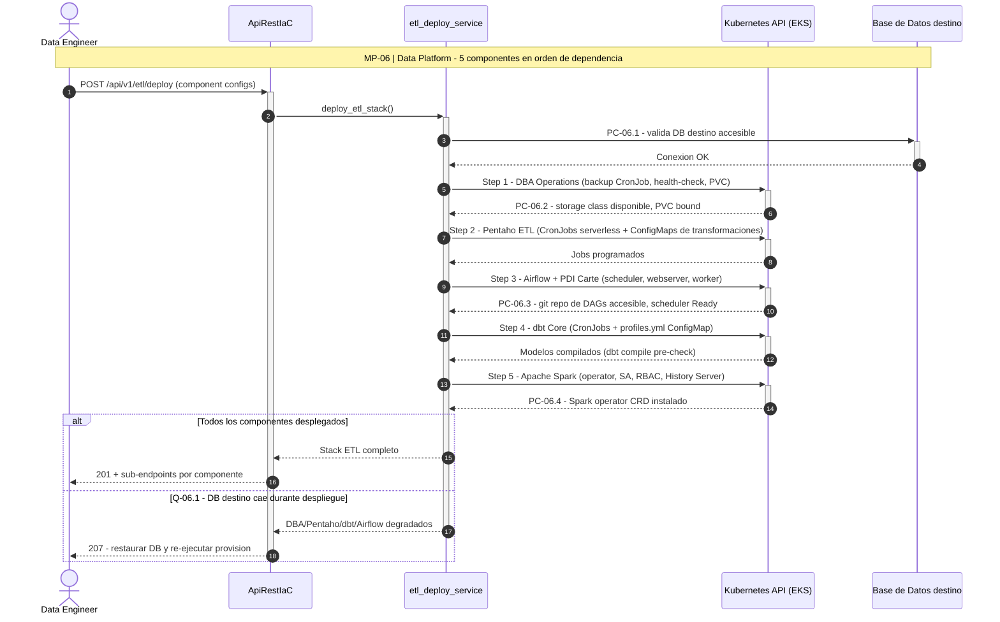

### Puntos de Control

| Punto | Validación |
|:---|:---|
| **PC-06.1** | Base de datos destino accesible (para DBA, Pentaho, dbt) |
| **PC-06.2** | PVC storage class disponible (para DBA backups) |
| **PC-06.3** | Git repo accesible (para Airflow DAGs, dbt models) |
| **PC-06.4** | Spark operator CRD instalado (para Spark applications) |

### Riesgos

| Riesgo | Impacto | Mitigación |
|:---|:---|:---|
| PVC storage lleno (backups) | Backups fallan, data loss risk | Retention policy + monitoring de PVC usage |
| Pentaho CronJob OOMKilled | ETL job no completa | Resource limits ajustables por job |
| Airflow scheduler down | DAGs no se ejecutan | readinessProbe + restart policy |
| dbt model compilation error | Transformaciones no corren | `dbt compile` pre-check |
| Spark driver OOMKilled | Job falla, requiere re-submit | Spark memory tuning + dynamic allocation |

### Puntos de Quiebre

| Quiebre | Efecto | Recuperación |
|:---|:---|:---|
| **Q-06.1** | Base de datos destino caída | DBA, Pentaho, dbt, Airflow — todos fallan | Restaurar DB, verificar health-check |
| **Q-06.2** | Airflow metadata DB corrupta | Scheduler pierde estado de DAGs | Restore metadata DB + `airflow db reset` |

---

## MP-07 — GitOps (ArgoCD + Gitea)

**Endpoint (Gitea)**: `POST /api/v1/iac/tenant/gitea`
**Orquestador**: `services/gitea_tenant_service.py → provision_gitea_tenant()`
**Descripción**: Provisión multi-tenant de Gitea — organizaciones, repos mirror, usuarios y webhooks.

### Sub-procesos

| Paso | Sub-proceso | Entrada | Salida |
|:---|:---|:---|:---|
| 1 | Crear organización | customer, layer | Org `tenant-{customer}-{layer}` en Gitea |
| 2 | Crear usuario | customer | Usuario `user-{customer}` con team membership |
| 3 | Mirror repository | source_repo_url | Repo mirror `{component}` en la org |
| 4 | Configurar webhooks | repo, callback_url | Webhooks para push events |
| 5 | Almacenar credenciales K8s | user, token, ns | Secret `gitea-creds-{component}` en namespace del tenant |
| 6 | Registrar repo en ArgoCD | repo_url | ArgoCD repository credential |

### Diagrama de secuencia

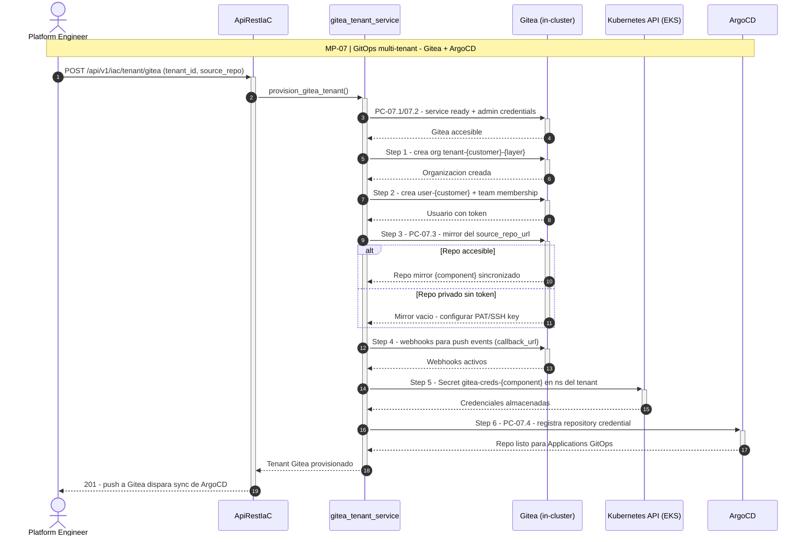

### Puntos de Control

| Punto | Validación |
|:---|:---|
| **PC-07.1** | Gitea service accesible (port-forward o internal URL) |
| **PC-07.2** | Admin credentials disponibles |
| **PC-07.3** | Source repo URL accesible para mirror |
| **PC-07.4** | ArgoCD accesible para registrar repo |

### Riesgos y Quiebres

| Riesgo/Quiebre | Impacto | Mitigación/Recuperación |
|:---|:---|:---|
| Gitea pod no ready | Todo el pipeline Gitea falla | Wait loop con readiness check |
| Mirror falla (repo privado sin token) | Repo vacío en Gitea | Configurar PAT/SSH key |
| ArgoCD repo registration falla | GitOps no funciona | Registrar manualmente vía ArgoCD CLI |

---

## MP-08 — Infraestructura AWS (IaC Primitives)

**Endpoints**: Múltiples `POST /api/v1/{service}/deploy`
**Descripción**: Operaciones atómicas de infraestructura AWS, cada una independiente.

### Sub-procesos

| Endpoint | Servicio | Entrada | Salida |
|:---|:---|:---|:---|
| `POST /api/v1/vpc/deploy` | `vpc_service` | cidr | VPC ID |
| `POST /api/v1/subnets/deploy` | `services_bp` | vpc_id, cidrs | Subnet IDs |
| `POST /api/v1/sg/deploy` | `services_bp` | vpc_id, rules | Security Group ID |
| `POST /api/v1/igw/deploy` | `services_bp` | vpc_id | Internet Gateway ID |
| `POST /api/v1/routetable/deploy` | `services_bp` | vpc_id, routes | Route Table ID |
| `POST /api/v1/acl/deploy` | `services_bp` | vpc_id, rules | Network ACL ID |
| `POST /api/v1/s3/deploy` | `s3_service` | bucket_name | S3 bucket ARN |
| `POST /api/v1/sqs/deploy` | `sqs_service` | queue_name | SQS queue URL |
| `POST /api/v1/secrets/deploy` | `secrets_service` | name, value | Secret ARN |
| `POST /api/v1/lambda/deploy` | `lambda_service` | name, config | Lambda function ARN |
| `POST /api/v1/rds/deploy` | `rds_service` | engine, instance_class, credentials | RDS endpoint |
| `POST /api/v1/eks/deploy` | `eks_service` | cluster_name, subnets | EKS cluster ARN |

### Diagrama de secuencia

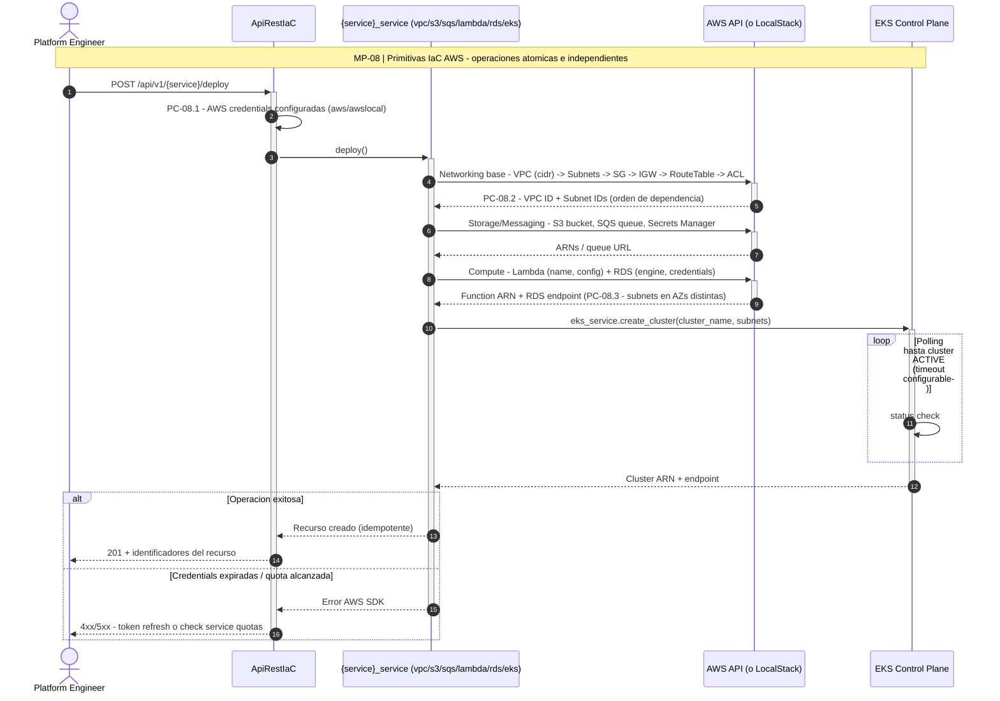

### Puntos de Control

| Punto | Validación |
|:---|:---|
| **PC-08.1** | AWS credentials configuradas (awslocal o AWS CLI) |
| **PC-08.2** | VPC existe antes de crear subnets/SG/IGW |
| **PC-08.3** | Subnets existen antes de crear RDS/EKS |

### Riesgos y Quiebres

| Riesgo | Impacto | Mitigación |
|:---|:---|:---|
| AWS credentials expired | Todas las operaciones AWS fallan | Token refresh + error messaging |
| VPC CIDR conflict | VPC creation fails | Validar CIDR no overlap |
| RDS availability zone mismatch | RDS no arranca | Validar subnets en AZs diferentes |
| EKS cluster limit alcanzado | No se puede crear cluster | Check service quotas |

---

## MP-09 — Build & Deploy (CI/CD)

**Endpoints**: `POST /api/v1/build/img` + `POST /api/v1/deploy/docker-ecr`
**Servicios**: `build_service`, `docker_deploy_service`

### Sub-procesos

| Paso | Sub-proceso | Entrada | Salida |
|:---|:---|:---|:---|
| 1 | Validación de inputs | repo_name, branch | Repo y CodeBuild project verificados (PC-09.1/09.2) |
| 2 | Build image | repo_name, branch | CodeBuild execution → Docker image |
| 3 | Status polling asíncrono | build_id | Estado del build (IN_PROGRESS/SUCCEEDED/FAILED) |
| 4 | Tag de imagen | commit_sha, pr_number | Tag inmutable `{repo}:{sha}` (+ tag por PR) |
| 5 | Push to ECR | repo_name, commit_sha, pr_number | Image pushed to ECR registry |
| 6 | Deploy to K8s | image URI, deployment spec | Updated K8s deployment (`kubectl set image` / apply) |
| 7 | Rollout verification | deployment, ns | `kubectl rollout status` OK; rollback automático si falla |

### Diagrama de secuencia

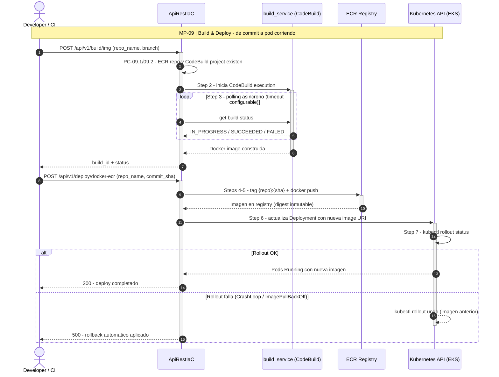

### Puntos de Control y Riesgos

| Punto/Riesgo | Validación/Mitigación |
|:---|:---|
| **PC-09.1** | ECR repo existe antes de push |
| **PC-09.2** | CodeBuild project existe antes de build |
| Riesgo: Build timeout | Configurable timeout + async status polling |
| Riesgo: Image too large (>10GB) | Layer optimization + multi-stage Dockerfile |
| Quiebre: ECR registry inaccessible | Todos los deploys bloqueados → verificar IAM + networking |

---

## MP-10 — Istio Ambient Service Mesh

**Endpoint**: `POST /api/v1/istio-ambient/deploy`
**Servicio**: `prereq_service` + `helm_service`
**Descripción**: Despliega stack complementario de Istio Ambient — Gateway API CRDs, Argo Rollouts, Argo Workflows, Kiali, ServiceMonitors, Waypoint proxies.

### Sub-procesos

| Paso | Sub-proceso | Salida |
|:---|:---|:---|
| 0 | Pre-checks (prereq_service) | Helm + kubectl disponibles, cluster accesible (PCT-03/04) |
| 1 | Gateway API CRDs | CRDs para KubernetesGateway + HTTPRoute |
| 2 | Istio base + istiod + ztunnel (profile ambient) | Control plane + L4 dataplane node-level |
| 3 | Argo Rollouts | Blue-green / canary deployment controller |
| 4 | Argo Workflows | DAG-based workflow engine |
| 5 | Kiali | Service mesh observability dashboard |
| 6 | ServiceMonitors | Prometheus scraping targets |
| 7 | Waypoint proxies | Per-namespace L7 proxies |
| 8 | Verificación del mesh | istiod Ready + ztunnel DaemonSet en todos los nodos |

### Diagrama de secuencia

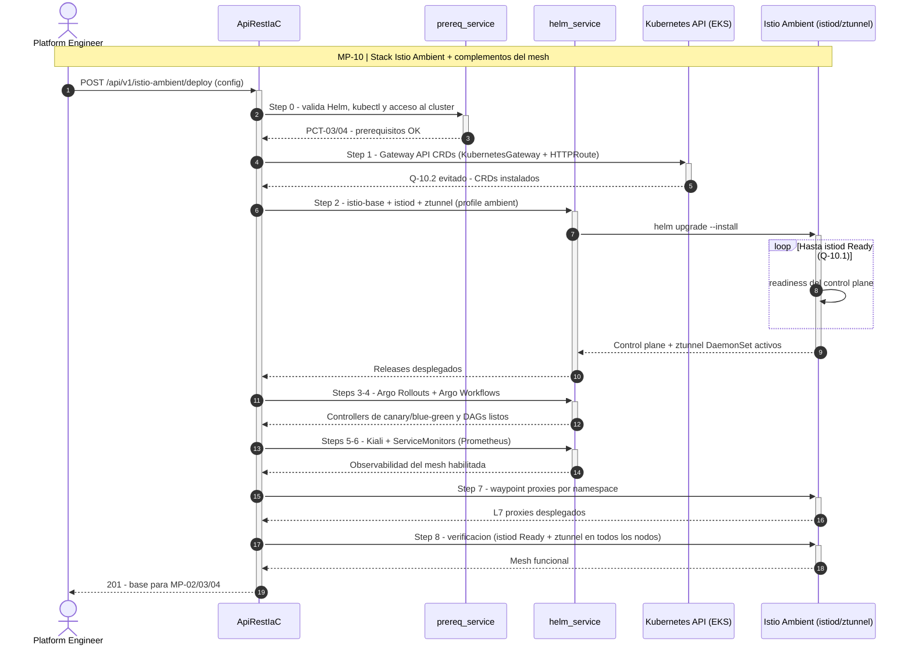

### Puntos de Quiebre

| Quiebre | Efecto | Recuperación |
|:---|:---|:---|
| **Q-10.1** | Istio istiod no arranca | Ambient mesh no funcional, ztunnel sin control plane | Verificar Helm release istio/istiod |
| **Q-10.2** | Gateway API CRDs no instalados | KubernetesGateway y HTTPRoute no se pueden crear | `kubectl apply -f gateway-api-crds.yaml` |

---

## MP-11 — OpenFaaS Serverless Functions

**Endpoints**: `POST/GET/DELETE /api/v1/iac/openfaas/functions`
**Servicio**: `openfaas_service`

### Sub-procesos

| Operación | Entrada | Salida |
|:---|:---|:---|
| List functions | — | Array de functions con status |
| Deploy function | name, image, env_vars, limits | Function deployed to OpenFaaS |
| Update function | name, image | Rolling update de la function |
| Delete function | function_name | Function removed |
| Invoke function | function_name, body | Sync invocation result |
| Scale function | function_name, replicas | min/max replicas ajustadas (warm-up) |

### Diagrama de secuencia

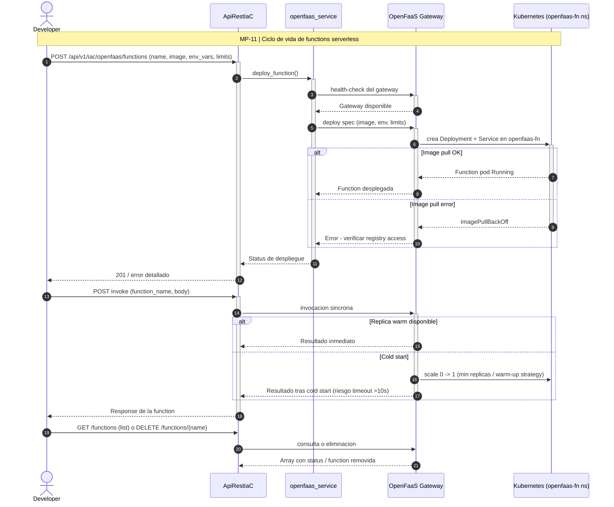

### Riesgos

| Riesgo | Impacto | Mitigación |
|:---|:---|:---|
| OpenFaaS gateway down | Todas las functions inaccesibles | Health-check + restart |
| Function cold start > 10s | Timeout en invocaciones | Warm-up strategy + min replicas |
| Image pull error | Function no deploya | Verificar registry access |

---

## MP-12 — Consulta de Estado y Acceso

**Endpoint**: `GET /api/v1/iac/access-info-tenant?tenant={tenant_id}`
**Orquestador**: `tenant_register_service.get_tenant_access_info()`
**Descripción**: Consolida toda la información de acceso, estado y configuración de un tenant.

### Secciones del Output

| Sección | Contenido |
|:---|:---|
| `services` | Lista completa de servicios con port-forward commands, credentials, URLs |
| `tenant_provisioning` | K8s isolation status, namespace resources (deploys, pods, svcs, secrets, configmaps) |
| `zero_trust` | AuthorizationPolicies, PeerAuthentication, Kyverno policies, waypoints, verify commands |
| `telemetry` | Alloy pods, OTLP endpoints, backends (Mimir/Loki/Tempo), env vars, data flow, Grafana URLs |
| `mesh_pod_access` | Per-pod waypoint label, app label, phase, ztunnel config commands |
| `gitea_tenant_repos` | Org, repos, clone URLs, K8s secrets |
| `mariadb_tenant_database` | DB name, user, host, tables, connection strings |
| `argocd` | AppProject, Applications, sync status |
| `istio_routing` | HTTPRoutes, hostname, waypoint |
| `openfaas` | Tenant-related functions |
| `data_platform` | ETL API endpoints, cron schedule |
| `external_connection_summary` | Port-forward script completo |

### Sub-procesos

| Paso | Sub-proceso | Fuente consultada |
|:---|:---|:---|
| 1 | Validación de tenant_id (PCT-02) | — |
| 2 | Inventario de servicios + credenciales | K8s Services + Secrets |
| 3 | Estado de aislamiento (MP-02) | Namespace, deploys, pods, svcs, configmaps |
| 4 | Estado zero-trust (MP-04) | AuthorizationPolicies, PeerAuthentication, Kyverno |
| 5 | Estado telemetría (MP-05) | Alloy pods, OTLP endpoints, backends LGTM |
| 6 | Estado GitOps (MP-07) | Gitea orgs/repos + ArgoCD AppProject/Applications |
| 7 | Estado datos | MariaDB DBs/users + data platform endpoints |
| 8 | Consolidación | JSON único + port-forward script |

### Diagrama de secuencia

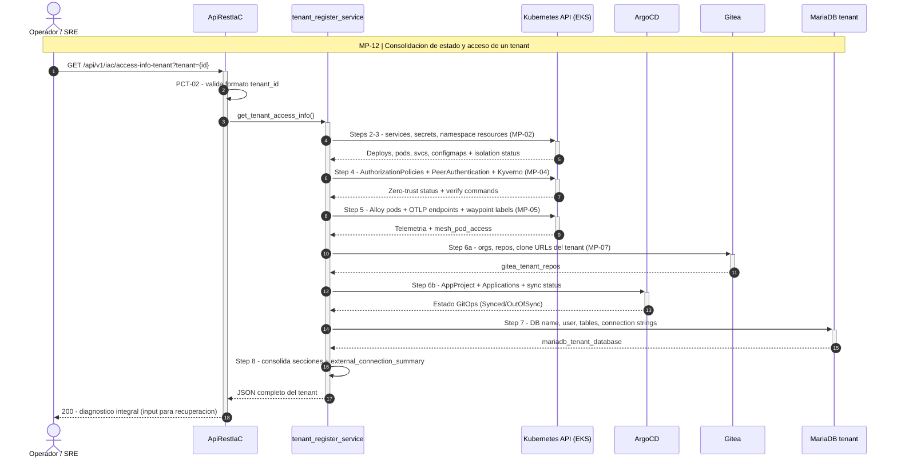

---

## MP-13 — Security Pipeline para Modelos IA, Agentic AI y Pipelines

**Endpoint**: `POST /api/v1/security/pipeline/run`
**Orquestador**: `services/security_pipeline_service.py → run_security_pipeline()`
**Descripción**: Pipeline de 8 etapas de pruebas de ciberseguridad para modelos de IA, agentic AI, agentes y pipelines — desde unit tests con SCA/SBOM hasta observabilidad de seguridad en el Grafana Stack. Integra las herramientas de seguridad identificadas en los 204 casos de uso de los módulos (AD, Bloo, C4MLio, QBex, CDS, TP).

### Sub-procesos (8 etapas)

| Etapa | Sub-proceso | Herramientas | Salida |
|:---|:---|:---|:---|
| 1 | **Build Unit Test** | Maven + JUnit (Java), Moq (C#), pytest (Python), Jest (JS); mutación con Stryker | Suite verde + mutation score |
| 1.1 | SCA — Inventario SBOM | CycloneDX/SPDX desde `package.json`, `requirements.txt`, `pom.xml` | SBOM completo del artefacto |
| 1.2 | Evaluación CVE/NVD | Consulta NVD + scoring CVSS por dependencia | Lista priorizada de CVEs |
| 1.3 | Compliance de licencias | Detección GPL/copyleft y licencias incompatibles | Reporte de licencias |
| 2 | **Code Coverage** | JaCoCo (instrumentación bytecode), % code execution, fallos runtime; Backstage SBOM-CVE, CycloneDX graph (Neo4j), SPDX compliance; umbral de vulnerabilidades, OWASP Dependency-Check, Checkmarx | Cobertura ≥ umbral + grafo de dependencias |
| 3 | **SAST/DAST** | SAST: SonarQube (policy vulnerability), Semgrep, Bandit (Python); DAST: Burp Suite (web/API), Acunetix (web); orquestado en Jenkins. **AI-specific**: garak (LLM vuln scan), promptfoo (prompt injection), CleverHans + Adversarial Robustness Toolbox (evasión adversarial) | Hallazgos SAST/DAST + reporte AI red-team |
| 4 | **Quality Gates** | Checkpoint metrics, policy code Sonar Way, Kyverno (K8s), Prowler (cloud), Semgrep CI, OPA | Gate PASS/FAIL bloqueante |
| 5 | **Build Image** | Harbor (registry + artifact security), firma Cosign/Sigstore | Imagen firmada en Harbor |
| 6 | **Scan Image** | Trivy (SCA de imagen), Snyk (GitLab), OWASP Dependency-Check, Anchore, Grype, Dagda (malware), Clair — análisis por capa (OS layer + dependency layer) | Imagen aprobada sin CVEs críticos |
| 7 | **Smoke Test** | Pipeline security test vía ArgoCD (staging): AuthorizationPolicies, mTLS, guardrails activos | Deploy candidato validado |
| 8 | **Deploy + Observabilidad** | Grafana Stack (Mimir/Loki/Tempo), Prometheus, alertas de seguridad, dashboards de postura | Producción monitoreada (MP-05) |

### Herramientas de seguridad provenientes de los 204 casos de uso

Clasificación de las herramientas citadas en los UC de los módulos y su etapa en este pipeline:

| Categoría | Herramientas (menciones en UCs) | Etapa del pipeline |
|:---|:---|:---|
| **AI/LLM Security** | Guardrails/NeMo Guardrails (39), garak (3), promptfoo (11), DeepEval (4), prompt injection testing (8) | 3 (DAST de IA), 7 (smoke con guardrails) |
| **Adversarial ML** | CleverHans (4), Adversarial Robustness Toolbox (1) | 3 (red-team de modelos) |
| **PII / Privacidad** | Presidio (27) — detección/anonimización de PII en datasets y prompts | 1.1 (datos del SBOM), 3, 8 (monit. fugas) |
| **Secrets & Supply Chain** | Vault (13), Secrets Manager (4), KMS (14), TruffleHog (1), Dependabot (1), safetensors (1) | 1.1–1.2 (SCA), 5 (firma de artefactos) |
| **Policy-as-Code** | OPA (17), Kyverno (3), Checkov (1), Prowler (UC + este layer) | 4 (quality gates) |
| **Escaneo de imágenes** | Trivy (8), Grype (1), Harbor (2) | 5–6 (build + scan image) |
| **Firma / Integridad** | Cosign (7), Sigstore (4), SBOM (7) | 5 (build image firmada) |
| **SAST código** | Bandit (6), SonarQube/Sonar (UC + estándar), Semgrep | 3–4 |
| **Runtime K8s (heredado MP-02/04)** | RBAC (106), mTLS (32), NetworkPolicy (3) | 7–8 (smoke + runtime) |

### Diagrama de secuencia

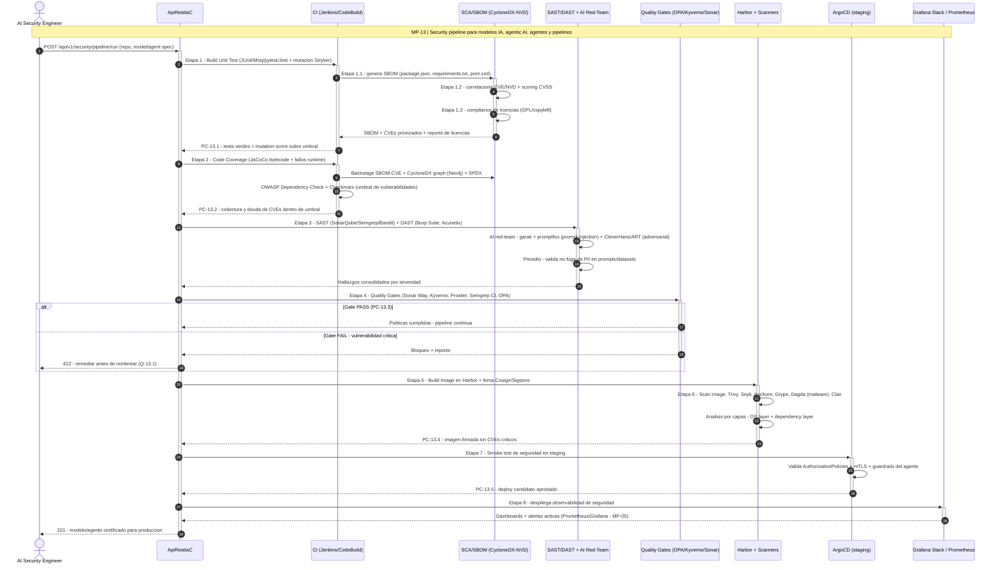

### Puntos de Control

| Punto | Validación |
|:---|:---|
| **PC-13.1** | Unit tests verdes + mutation score ≥ umbral (Stryker) |
| **PC-13.2** | Cobertura JaCoCo ≥ umbral + CVEs críticos = 0 en SBOM |
| **PC-13.3** | Quality gate PASS en todas las políticas (OPA/Kyverno/Sonar Way/Prowler) |
| **PC-13.4** | Imagen firmada (Cosign) y sin CVEs críticos en ningún scanner |
| **PC-13.5** | Smoke test en staging con zero-trust activo (MP-04) |

### Riesgos

| Riesgo | Impacto | Mitigación |
|:---|:---|:---|
| Prompt injection no detectado en agentic AI | Agente comprometido en producción | garak + promptfoo en Etapa 3 + guardrails en runtime |
| CVE crítico publicado post-deploy | Imagen vulnerable en producción | Re-scan continuo de Harbor (Trivy scheduled) + alertas Etapa 8 |
| Falsos positivos saturan el gate | Pipeline bloqueado sin causa real | Umbrales por severidad CVSS + excepciones auditadas |
| Modelo envenenado (supply chain) | Predicciones manipuladas | SBOM de modelo + safetensors + firma Cosign del artefacto |
| PII en datasets de entrenamiento | Incumplimiento regulatorio | Presidio en Etapa 3 + monitoreo de fugas en Etapa 8 |

### Puntos de Quiebre

| Quiebre | Efecto | Recuperación |
|:---|:---|:---|
| **Q-13.1** | Quality gate FAIL por vulnerabilidad crítica | Pipeline bloqueado en Etapa 4 | Remediar CVE/hallazgo + re-ejecutar desde Etapa 1 |
| **Q-13.2** | Harbor registry inaccesible | Etapas 5-7 bloqueadas | Verificar Harbor + fallback a ECR con scan Trivy |
| **Q-13.3** | Scanner desactualizado (DB de CVEs vieja) | Falsa sensación de seguridad | Update automático de DBs (Trivy/Grype/Clair) pre-scan |

---

## Matriz de Dependencias entre Macro-Procesos

```
MP-01 (Register Tenant)
  ├── invoca → MP-02 (Provision Tenant)       [Step 0]
  ├── invoca → MP-07 (GitOps/Gitea)           [Step 0b]
  ├── invoca → MP-08 (AWS Infra)              [Steps 1-7, 9-10, 15-17]
  ├── invoca → MP-09 (Build & Deploy)         [Step 3]
  └── invoca → MP-10 (Istio Mesh)             [Steps 12-13]

MP-02 (Provision Tenant)
  └── prerequisito de → MP-03, MP-04, MP-05

MP-03 (Replicación)
  ├── requiere → MP-02 (namespace debe existir)
  └── requiere → MP-10 (Istio Ambient instalado)

MP-04 (Zero-Trust)
  ├── requiere → MP-02 (namespace + waypoint deben existir)
  └── complementa → MP-05 (policies de Alloy)

MP-05 (Telemetría)
  ├── requiere → MP-02 (namespace debe existir)
  ├── requiere → MP-10 (Istio para AuthzPolicy)
  └── produce datos para → MP-12 (Estado)

MP-06 (Data Platform)
  └── independiente (opera en namespaces propios)

MP-12 (Estado)
  └── lee datos de → MP-02, MP-04, MP-05, MP-07

MP-13 (Security Pipeline)
  ├── requiere → MP-09 (Build & Deploy como base CI/CD)
  ├── requiere → MP-07 (ArgoCD para smoke test en staging)
  ├── valida políticas de → MP-04 (Kyverno/zero-trust)
  └── publica señales en → MP-05 (observabilidad de seguridad)
```

### Orden recomendado de ejecución para un tenant nuevo

```
1. MP-01 (Register Tenant)         ← incluye MP-02, MP-07, MP-08, MP-09
   ó
   MP-02 (solo Provision)          ← si infraestructura AWS ya existe
2. MP-04 (Zero-Trust)              ← seguridad L7 + Kyverno
3. MP-05 (Telemetría)              ← observabilidad OTLP
4. MP-03 (Replicación)             ← si se requiere multi-cluster
5. MP-06 (Data Platform)           ← si el tenant necesita ETL/ML pipelines
6. MP-12 (Verificación)            ← consulta estado final
```

---

## Puntos de Control Transversales

| ID | Punto de Control | Aplica a | Descripción |
|:---|:---|:---|:---|
| **PCT-01** | Token de autorización | Todos | Middleware `verify_token()` en `app.py` valida Bearer token |
| **PCT-02** | Formato de tenant_id | MP-01, 02, 03, 04, 05, 12 | Regex `tenant-{customer}-{layer}-{component}` |
| **PCT-03** | kubectl accesible | MP-01, 02, 03, 04, 05, 06 | `command_service.run_command()` verifica exit code |
| **PCT-04** | Helm instalado | MP-01, 06, 10 | `prereq_service` valida al startup |
| **PCT-05** | AWS credentials | MP-01, 08, 09 | `awslocal` o `aws` CLI configurado |
| **PCT-06** | Idempotencia | Todos los apply | `kubectl apply --server-side` permite re-ejecución segura |
| **PCT-07** | Logging estructurado | Todos | `current_app.logger` con niveles DEBUG/INFO/ERROR |
| **PCT-08** | Error isolation | MP-01, 03, 04, 05, 06 | Cada paso en try/except independiente, no bloquea siguiente |

---

## Riesgos Sistémicos y Puntos de Quiebre

### Riesgos de Nivel Plataforma

| ID | Riesgo | Probabilidad | Impacto | Macro-Procesos Afectados | Mitigación |
|:---|:---|:---|:---|:---|:---|
| **RS-01** | Pérdida de conectividad al cluster EKS | Media | Crítico — todos los kubectl fallan | MP-01 a MP-06, MP-10 | Multi-context fallback + health-check periódico |
| **RS-02** | API Flask crashea o reinicia | Baja | Alto — todas las operaciones en curso se pierden | Todos | Gunicorn workers + restart policy + state persistence |
| **RS-03** | Disk full en nodo de la API | Baja | Alto — tempfiles no se pueden crear | MP-03, 04, 05 (usan tempfile) | Monitoring disk usage + tmpdir cleanup |
| **RS-04** | Istio control plane (istiod) down | Baja | Crítico — mesh sin control plane, waypoints no se provisionan | MP-02, 03, 04, 10 | HA deployment de istiod + monitoring |
| **RS-05** | ArgoCD server down | Baja | Alto — GitOps deployment pipeline roto | MP-01, 07 | HA ArgoCD + health monitoring |
| **RS-06** | DNS resolution failure intra-cluster | Baja | Crítico — servicios no se descubren entre sí | Todos | CoreDNS monitoring + redundancy |
| **RS-07** | Certificate expiration (mTLS CA) | Media | Crítico — todo mTLS cross-cluster falla | MP-02, 03 | Cert rotation automation + alertas 30d antes de expiración |
| **RS-08** | Kyverno webhook failure | Baja | Alto — todas las mutaciones/validaciones dejan de funcionar | MP-04 | Kyverno HA mode + failurePolicy: Ignore como fallback |

### Puntos de Quiebre Críticos (Single Points of Failure)

| ID | Componente | Criticidad | Efecto si Falla | Redundancia Actual |
|:---|:---|:---|:---|:---|
| **SPOF-01** | Flask API (app.py :5001) | Crítica | Ninguna operación posible | Ninguna (single instance) |
| **SPOF-02** | EKS API Server | Crítica | kubectl no funciona | AWS-managed HA |
| **SPOF-03** | istiod (Istio control plane) | Alta | Waypoints no se configuran | Deployable como HA |
| **SPOF-04** | etcd (K8s state) | Crítica | Pérdida de estado del cluster | AWS-managed (EKS) |
| **SPOF-05** | Grafana Alloy (single replica) | Media | Telemetría interrumpida | Escalable a múltiples replicas |
| **SPOF-06** | MariaDB en tenant ns | Alta | Gitea y apps sin DB | Backup CronJob (DBA tools) |

### Estrategias de Recuperación

| Escenario | Procedimiento |
|:---|:---|
| **Cluster EKS inaccesible** | 1. Verificar VPN/networking → 2. `aws eks update-kubeconfig` → 3. Re-ejecutar operaciones fallidas |
| **Tenant en estado inconsistente** | 1. `GET /access-info-tenant` para diagnóstico → 2. Re-ejecutar MP-02 (idempotente) → 3. Re-ejecutar MP-04 |
| **Telemetría no funciona** | 1. Verificar Alloy pods → 2. Verificar ConfigMap → 3. `kubectl rollout restart deploy/alloy` → 4. Re-ejecutar MP-05 |
| **Cross-cluster roto** | 1. Verificar remote secrets → 2. Verificar east-west gateway IPs → 3. Re-ejecutar MP-03 Steps 4-6 |
| **Zero-Trust lockout** | 1. `kubectl delete authorizationpolicy default-deny -n {ns}` → 2. Re-aplicar policies en orden correcto |
| **Data platform component down** | 1. `GET /etl/{component}/status` → 2. Verificar pods → 3. Re-ejecutar provision |

---

## Notas Operativas

### Variables de Entorno Críticas

| Variable | Uso | Macro-Proceso |
|:---|:---|:---|
| `BEARER_TOKEN` | Autenticación API | Todos |
| `AWS_DEFAULT_REGION` | Región AWS | MP-08, MP-09 |
| `LOCALSTACK_ENDPOINT` | LocalStack URL (dev) | MP-08 |
| `OTEL_EXPORTER_OTLP_ENDPOINT` | Alloy OTLP endpoint | MP-05 |
| `OTEL_EXPORTER_OTLP_PROTOCOL` | http/protobuf | MP-05 |

### Convenciones de Naming

| Recurso | Patrón | Ejemplo |
|:---|:---|:---|
| Tenant ID | `tenant-{customer}-{layer}-{component}` | `tenant-codificando-bknd-node` |
| Namespace | `tenant-{customer}` | `tenant-codificando` |
| ServiceAccount | `sa-{customer}` | `sa-codificando` |
| Waypoint | `waypoint-{customer}` | `waypoint-codificando` |
| Gitea Org | `tenant-{customer}-{layer}` | `tenant-codificando-bknd` |
| MariaDB DB | `tenant_{customer}` | `tenant_codificando` |
| ArgoCD AppProject | `{customer}` | `codificando` |
| Kyverno Policy | `{policy-name}-tenant-{customer}` | `require-tenant-labels-tenant-codificando` |

---

> **Última actualización**: 2026-07-02 — Se añaden diagramas de secuencia MP-01–MP-12, sub-procesos ampliados (MP-09 a MP-12) y nuevo MP-13 Security Pipeline (AI SecOps)
> **Autor**: QBex Platform Engineering
